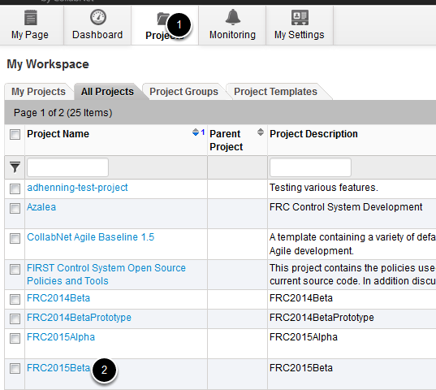

.. include:: <isonum.txt>

Accessing the Beta Project
==========================

.. note:: Only accepted Beta Test teams will have access to the Beta project.

The members identified by your team to communicate with *FIRST*\ |reg| technical staff will have access to the Beta Test project on the `<https://usfirst.collab.net>`__ site.

Signing In
----------

.. image:: images/accessing-the-beta-project/login.png

Open your web browser and browse to `<https://usfirst.collab.net>`__. Near the top left corner of the page enter the username and password provided in the Beta test email you received, then click "Log In".

Opening the Beta Project
------------------------

Your user account should already be added to the Beta Project. To view the project:

1. Click the Projects tab on the top navigation ribbon.
2. Then click on ``FRC20**Beta`` in the projects list (image of 2015 as an example).

The Project Homepage
--------------------

.. image:: images/accessing-the-beta-project/project-home.png

The project homepage contains some statistics and Project News. Throughout the beta, the Project News section may be updated with the latest information from the *FIRST* technical staff. The top ribbon contains tabs allowing you to navigate to the different sections of the project:

1. Trackers - The Trackers tab is where the bug tracker for the project is located.
2. File Releases - The File Releases tab will host any files you will need to download as part of the Beta test process such as NI FRC Game Tools files.
3. Documents - the Documents tab will contain any documents to be distributed to Beta teams. Much of the documentation for the Beta test will be located on the FRC\ |reg| Docs site but there may still be documents posted here as well.
4. Discussions - The Discussions tab contains a forum which will allow teams to post questions or discussions about the Beta test, software or documentation. Task reports will also be posted here.
