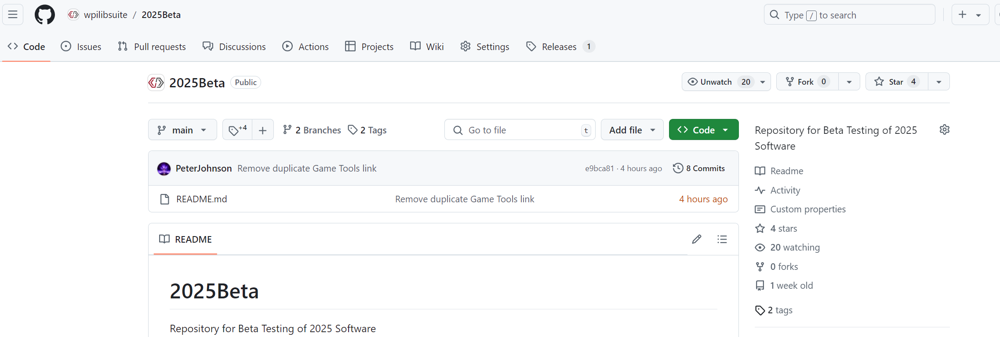

.. include:: <isonum.txt>

Accessing the Beta Project
==========================

.. note:: Only accepted Beta Test teams will have access to the Beta project.

The members identified by your team to communicate with *FIRST*\ |reg| technical staff will have access to the Beta Test project on the `<https://github.com/wpilibsuite/BetaTest>`__ site.

Signing In
----------

.. image:: images/accessing-the-beta-project/login.png
   :alt: Logging in to the GitHub site.

Open your web browser and browse to `<https://github.com/wpilibsuite/BetaTest>`__. Near the top right corner of the page, click "Sign In" (if the Sign-In box does not automatically appear), enter your username and password and click  "Sign In". If you have two-factor authenticatio enabled you may need to complete an action on your mobile device to verify your log in attempt.

Using this direct link, the Beta Test project should open as soon as you log in.

The Project Homepage
--------------------

The project homepage contains a ReadMe file. Throughout the beta, the ReadMe section may be updated with the latest information from the *FIRST* technical staff. The top ribbon contains tabs allowing you to navigate to the different sections of the project:

2. Code - The Code tab will take you to the ReadMe with Beta announcements as well as allow you to access file releases using the "Releases" section on the right hand side of the screen.
1. Issues - The Issues tab is where the bug tracker for the project is located.
4. Discussions - The Discussions tab contains a forum which will allow teams to post questions or discussions about the Beta test, software or documentation. Task reports will also be posted here.
3. Wiki - the Wiki tab will contain any documents to be distributed to Beta teams. We do not currently expect to use this but if there is any documentation that we want to restrict to Beta Teams only it will be posted here.
