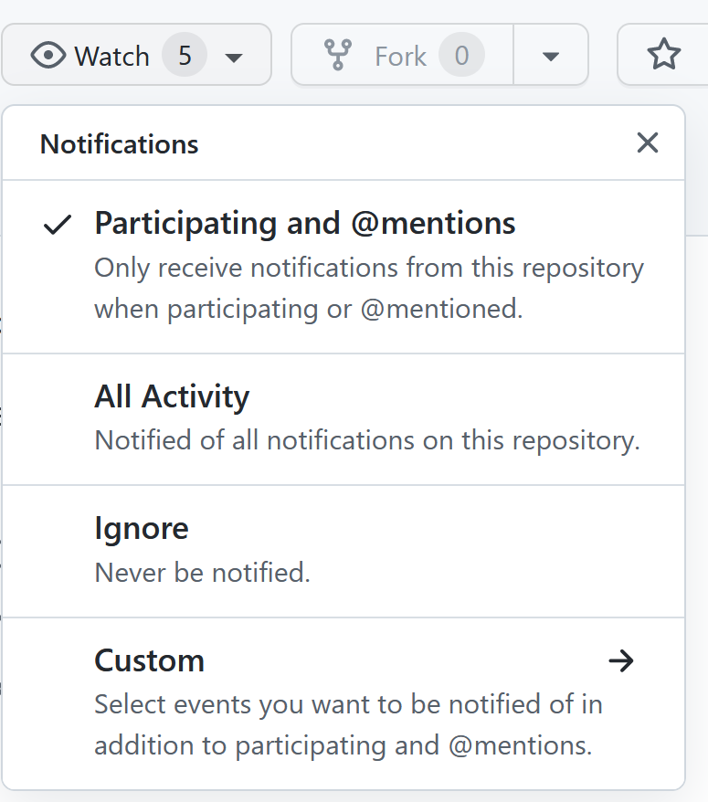
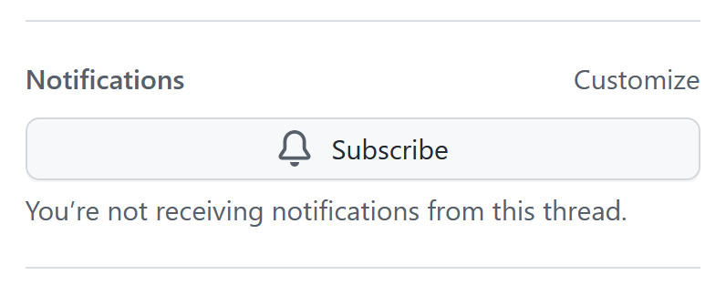

Monitoring Via Email Notifications
==================================

Configuring GitHub Notifications
--------------------------------
Your overall Github notification preferences can be set at `<https://github.com/settings/notifications>`__

Configuring Repository Settings
-------------------------------

In addition to your overall GitHub settings, you need to configure the desired settings for the repository. From any page in the project, click the "Watch" button in the grey secondary NavBar to show your repository Watch settings. Due to the expected traffic volume of the Beta project, "Participating and Mentions" is the recommended setting. This will provide notifications for Discussions or Issues you post in or are tagged in by another user.

Watching an Issue or Discussion
--------------------------------

To subscribe to an individual Issue or Discussion which you have not yet participated in, locate the "Notifications" section on the right hand side of the screen and click "Subscribe".
