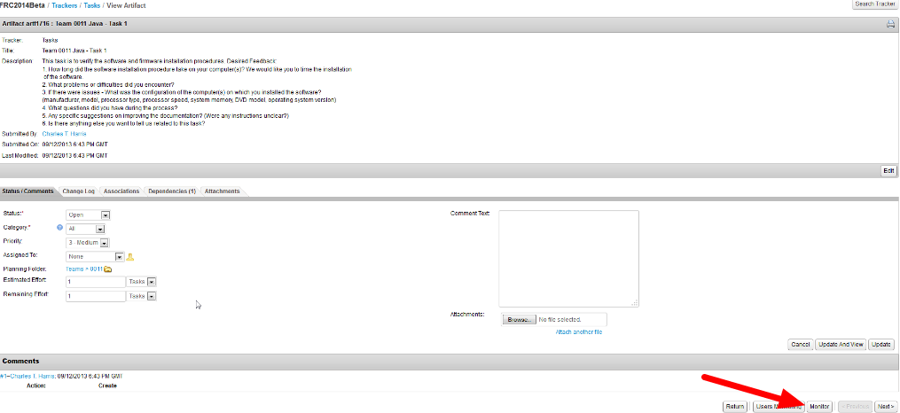
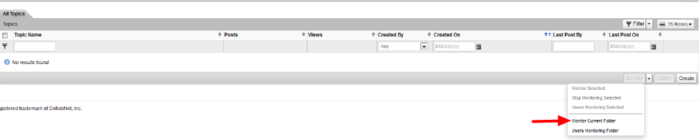
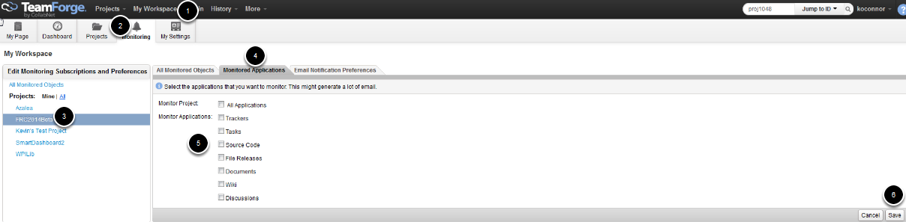
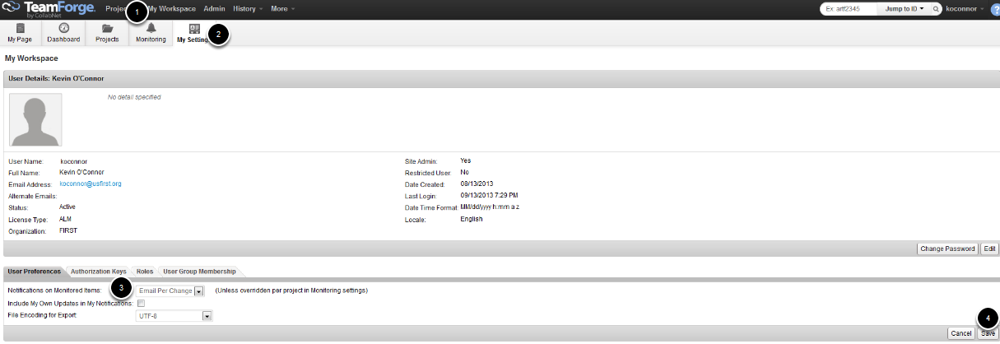

Monitoring Via Email Notifications
==================================

.. note::
   You may wish to monitor specific items or even whole sections of the Beta project via email. TeamForge has a large degree of flexibility in setting up e-mail monitoring.

Monitoring Individual Items
---------------------------

You can choose to monitor a number of different individual items (forum threads, tracker artifacts, file releases, etc.) via e-mail. Items that can be subscribed to will have a Monitor button located at the bottom of the screen. Clicking this button will subscribe you to the item and notify you of changes via e-mail. To unsubscribe, click the Stop Monitoring button (which will replace the Monitor button when you are subscribed).

Monitoring Folders
------------------

"Folders" (discussion sections, trackers, etc.) can also be monitored via e-mail. To monitor a folder click the dropdown arrow next to the Monitor button and select Monitor Current Folder.

Monitoring Project Sections
---------------------------

It is also possible to set up for entire sections of the site. To set up this monitoring:

1. Click My Workspace
2. Click on the Monitoring Tab
3. Select the project from the list on the left
4. Click on the Monitored Applications tab
5. Check the box for any section you wish to subscribe to
6. Click Save

Monitoring Settings
-------------------

You can set your overall notification settings to e-mail you per change or to send you a daily digest email with all changes. To do this:

1. Click My Workspace
2. Click My Settings
3. Select the desired setting
4. Click Save

Per Section Notification Settings
---------------------------------

.. image:: images/monitoring-via-email-notifications/monitoring-section-settings.png
   :alt: Each section has a dropdown on how it should be treated.

You can also customize notifications on a per section basis. To do this:

1. Click My Workspace
2. Click Monitoring
3. Click on the FRC20**Beta project on the left side
4. Select the Email Notification Preferences tab
5. Change the settings for any section of the project you wish to have override your base settings.
6. Click Save
