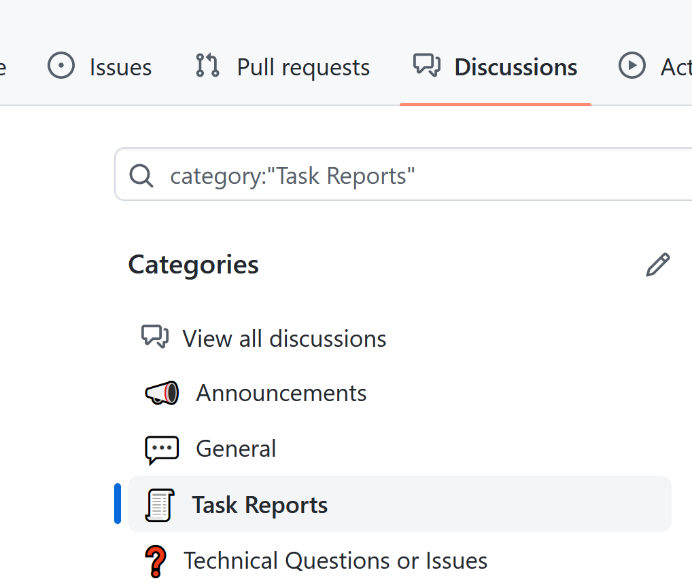
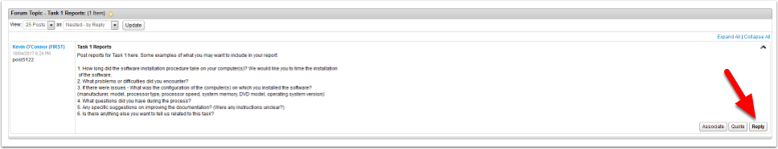

Reporting Progress
==================

.. warning:: In order to help us track team participation, please post your team number at the top of your task report.

Accessing the Task Report Section
---------------------------------

To access the Task Reports section on Teamforge, click on the Discussions tab, then click on the Task Reports section.

The Task Reports Section
------------------------

In the Task Reports section, create a single discussion topic titled `Team XXXX Task Reports` for your team and post reports for all tasks into that thread.

Progress Reporting
------------------

Each task will have suggested feedback listed in the :ref:`task documents <docs/beta/tasks/beta-task-overview:Beta Task Overview>`.

.. note:: We strongly prefer reports be done as text posts as opposed to attachments.
