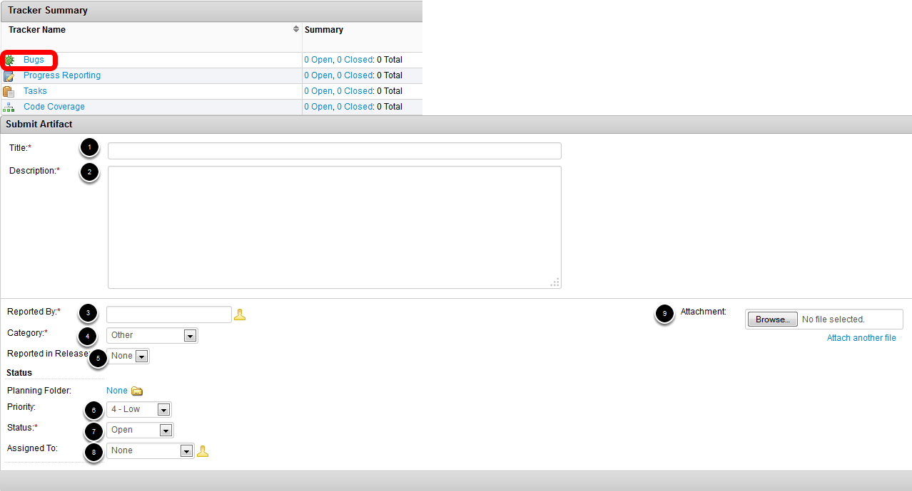

.. include:: <isonum.txt>

Trackers - Reporting Bugs
=========================

.. warning:: While we will certainly accept and respond to bugs in either location, we would prefer bugs for WPILib C++/Java components (libraries, VS Code, Shuffleboard, etc.) be submitted to the appropriate `GitHub repositories <https://github.com/wpilibsuite>`__.

Teamforge Bug Tracker
---------------------

The bug tracker is used for reporting bugs you discover in WPILib or other FRC\ |reg| software. If you are not sure if particular behavior is a bug or not, err on the side of reporting the bug (or at least posting in the Discussion section).

On the Trackers tab, click on Bugs to reach the Bug Tracker. To Submit a new bug, click Submit New Artifact.  The fields of the artifact are:

- Title - Give your bug a meaningful title which describes the issue
- Description - Describe the bug including observed behavior, expected behavior and steps to reproduce
- Reported By - Enter your TeamForge user name or click the silhouette to open the selector where you can select your username.
- Category - Select the appropriate affected software from the dropdown list (LabVIEW WPILib, Java WPILib, Driver Station, etc.)
- Reported in Release - Select which version of the file you were using, if available.
- Priority - If desired you may estimate a priority based on bug severity. Leaving at the default priority does not mean the bug will not be addressed. -All new bugs are analyzed by the Control System team and assigned an appropriate priority.
- Status - When reporting a new bug this should be left as Open.
- Assigned To - When reporting a bug this should be left blank. The Control System team uses this field to indicate who is working on a given artifact.
- Attachment - Attach any additional file that may be appropriate, examples of appropriate files would be a patch for the bug, code to reproduce the bug (single file or zip) or an image of the bug (if appropriate/necessary).

GitHub Issues
-------------

.. image:: images/trackers-reporting-bugs/github-issues.png
   :alt: The Github issues tab for the different projects in wpilibsuite.

For bugs in WPILib C++/Java/Java dashboards/etc., please locate the appropriate repository from the `WPILibSuite GitHub <https://github.com/wpilibsuite>`__ organization and report the bug there. To Report a bug, click the **Issues** tab and select **New issue**.

Fill out a title and description of the bug, then click **Submit new issue**.
