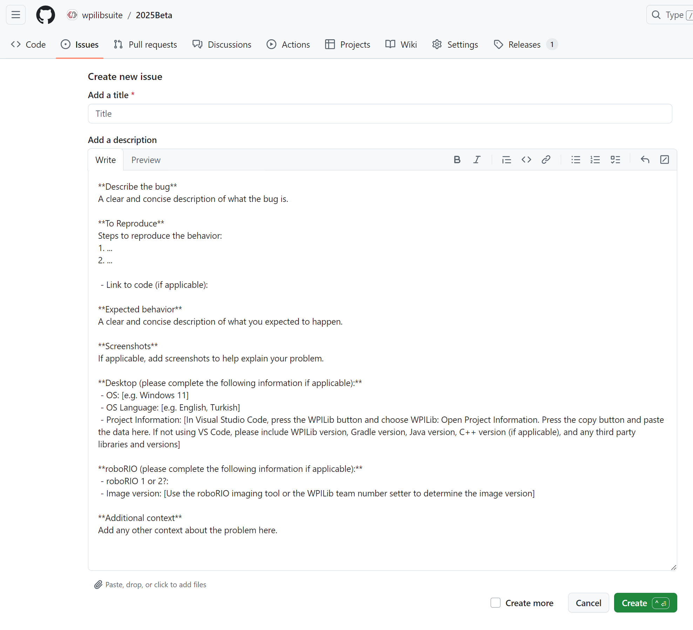

.. include:: <isonum.txt>

Issues - Reporting Bugs
=========================

.. warning:: While we will certainly accept and respond to all bugs posted in this project, we would prefer bugs for WPILib C++/Java components (libraries, VS Code, Shuffleboard, etc.) be submitted to the appropriate `GitHub repositories <https://github.com/wpilibsuite>`__. Issues that belong in one of those projects will be moved from the Beta Project to the appropriate repository.

GitHub Issue Tracker
---------------------

To Report a bug, click the **Issues** tab and select **New issue**. A template should appear that will help prompt for useful items to report along with your issue. When done, click **Submit new issue**.
