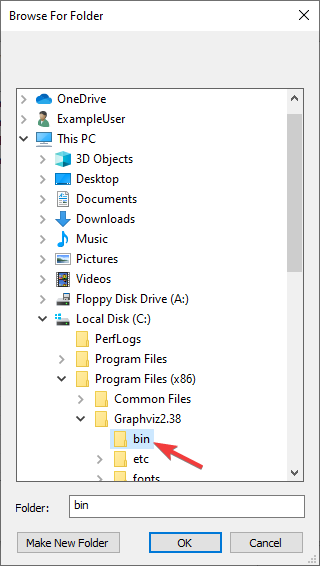

Build Instructions
==================

This document contains information on how to build the HTML, PDF, and EPUB versions of the frc-docs site. frc-docs uses Sphinx as the documentation generator. This document also assumes you have basic knowledge of `Git <https://git-scm.com/>`__ and console commands.

Prerequisites
-------------

Ensure that `Git <https://git-scm.com/>`__ is installed and that the frc-docs repository is cloned by using ``git clone https://github.com/wpilibsuite/frc-docs.git``.

Windows
^^^^^^^

.. note:: The majority of MikTeX packages are not required for building HTML, additional packages may be required for building PDF and EPUB.

- `Python 3.6 or greater <https://www.python.org/downloads/>`__
- `MiKTeX <https://miktex.org/download>`__
- `GraphViz <https://graphviz.gitlab.io/_pages/Download/Download_windows.html>`__
- `Perl <http://strawberryperl.com/>`__

Ensure that Python is in your Path by selecting the **Add Python to PATH** toggle when installing Python.

.. image:: images/build-instructions-1.png

Ensure that the GraphViz ``bin`` folder is correctly linked in your `Path <https://stackoverflow.com/a/44272417>`__. By default, this folder is located at ``C:\Program Files (x86)\Graphviz2.38\bin``.

Install the missing MikTex packages by running the following command from Powershell: ``mpm --verbose --require=@miktex-packages.txt``

Linux (Ubuntu)
^^^^^^^^^^^^^^

- `sudo apt-get update`
- `sudo apt-get install python3`
- `python3 -m pip install --upgrade pip setuptools wheel`
- `python3 -m pip install -r source/requirements.txt`
- `sudo apt-get install -y texlive-latex-recommended texlive-fonts-recommended texlive-latex-extra latexmk texlive-lang-greek texlive-luatex texlive-xetex texlive-fonts-extra dvipng`
- `sudo apt-get install -qy --force-yes graphviz`

Building
--------

Open up a Powershell Window or terminal and navigate to the frc-docs directory that was cloned.

.. image:: images/build-instructions-3.png

Building HTML
^^^^^^^^^^^^^

Type the command ``.\make html`` to generate HTML content. The content is located in the ``build/html`` directory at the root of the repository.

Building PDF
------------

Type the command ``.\make latexpdf`` to generate PDF content. The PDF is located in the ``build/latex`` directory at the root of the repository.

Building EPUB
-------------

Type the command ``.\make epub`` to generate EPUB content. The EPUB is located in the ``build/epub`` directory at the root of the repository.
