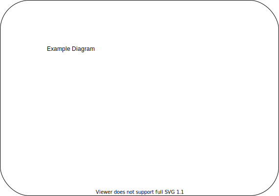

Draw.io Saving Instructions
===========================

This is a explanation of how to save diagrams made in ``draw.io`` (Otherwise known as ``diagrams.net``) as a ``.svg`` file that contains metadata to still be editable in ``draw.io``.

