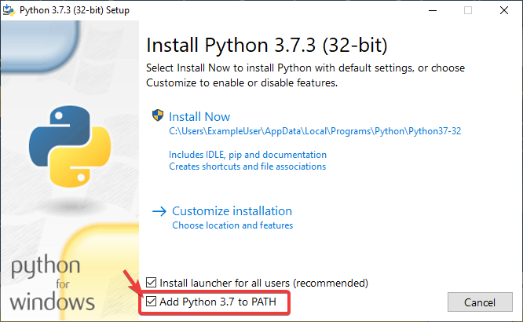

Build Instructions
==================

This document contains information on how to build the HTML, PDF, and EPUB versions of the frc-docs site. frc-docs uses Sphinx as the documentation generator. This document also assumes you have basic knowledge of `Git <https://git-scm.com/>`__ and console commands.

Prerequisites
-------------

Ensure that `Git <https://git-scm.com/>`__ is installed and that the frc-docs repository is cloned by using ``git clone https://github.com/wpilibsuite/frc-docs.git``.

Windows
^^^^^^^

.. note:: MikTeX and ``rsvg-convert`` are not required for building HTML, they are only required for Windows PDF builds.

- `Python 3.9 <https://www.python.org/downloads/>`__
- `MiKTeX <https://miktex.org/download>`__ (Only needed for PDF builds)
- `Perl <https://strawberryperl.com/>`__
- `rsvg-convert <https://community.chocolatey.org/packages/rsvg-convert>`__

Ensure that Python is in your Path by selecting the **Add Python to PATH** toggle when installing Python.

Once Python is installed, open up Powershell. Then navigate to the frc-docs directory. Run the following command: ``pip install -r source/requirements.txt``

Install the missing MikTex packages by navigating to the frc-docs directory, then running the following command from Powershell: ``mpm --verbose --require=@miktex-packages.txt``

Linux (Ubuntu)
^^^^^^^^^^^^^^

.. code-block:: console

    $ sudo apt update
    $ sudo apt install python3 python3-pip
    $ python3 -m pip install -U pip setuptools wheel
    $ python3 -m pip install -r source/requirements.txt
    $ sudo apt install -y texlive-latex-recommended texlive-fonts-recommended texlive-latex-extra latexmk texlive-lang-greek texlive-luatex texlive-xetex texlive-fonts-extra dvipng librsvg2-bin

Building
--------

Open up a Powershell Window or terminal and navigate to the frc-docs directory that was cloned.

.. code-block:: console

    PS > cd "%USERPROFILE%\Documents"
    PS C:\Users\Example\Documents> git clone https://github.com/wpilibsuite/frc-docs.git
    Cloning into 'frc-docs'...
    remote: Enumerating objects: 217, done.
    remote: Counting objects: 100% (217/217), done.
    remote: Compressing objects: 100% (196/196), done.
    remote: Total 2587 (delta 50), reused 68 (delta 21), pack-reused 2370
    Receiving objects: 100% (2587/2587), 42.68MiB | 20.32 MiB/s, done.
    Receiving deltas: 100% (1138/1138), done/
    PS C:\Users\Example\Documents> cd frc-docs
    PS C:\Users\Example\Documents\frc-docs>

Lint Check
^^^^^^^^^^

.. note:: Lint Check will not check line endings on Windows due to a bug with line endings. See `this issue <https://bugs.launchpad.net/doc8/+bug/1756704>`__ for more information.

It's encouraged to check any changes you make with the linter. This **will** fail the buildbot if it does not pass. To check, run ``.\make lint``

Link Check
^^^^^^^^^^

The link checker makes sure that all links in the documentation resolve. This **will** fail the buildbot if it does not pass. To check, run ``.\make linkcheck``

Image Size Check
^^^^^^^^^^^^^^^^

Please run ``.\make sizecheck`` to verify that all images are below 500KB. This check **will** fail CI if it fails. Exclusions are allowed on a case by case basis and are added to the ``IMAGE_SIZE_EXCLUSIONS`` list in the configuration file.

Redirect Check
^^^^^^^^^^^^^^

Files that have been moved or renamed must have their new location (or replaced with 404) in the ``redirects.txt`` file in ``source``.

The redirect writer will automatically add renamed/moved files to the redirects file. Run ``.\make rediraffewritediff``.

.. note:: if a file is both moved and substantially changed, the redirect writer will not add it to the ``redirects.txt`` file, and the ``redirects.txt`` file will need to be manually updated.

The redirect checker makes sure that there are valid redirects for all files. This **will** fail the buildbot if it does not pass. To check, run ``.\make rediraffecheckdiff`` to verify all files are redirected. Additionally, an HTML build may need to be ran to ensure that all files redirect properly.

Building HTML
^^^^^^^^^^^^^

Type the command ``.\make html`` to generate HTML content. The content is located in the ``build/html`` directory at the root of the repository.

Building PDF
------------

.. warning:: Please note that PDF build on Windows may result in distorted images for SVG content. This is due to a lack of librsvg2-bin support on Windows.

Type the command ``.\make latexpdf`` to generate PDF content. The PDF is located in the ``build/latex`` directory at the root of the repository.

Building EPUB
-------------

Type the command ``.\make epub`` to generate EPUB content. The EPUB is located in the ``build/epub`` directory at the root of the repository.

Adding Python Third-Party libraries
-----------------------------------

.. important:: After modifying frc-docs dependencies in any way, ``requirements.txt`` must be regenerated by running ``poetry export -f requirements.txt --output source/requirements.txt --without-hashes`` from the root of the repo.

frc-docs uses `Poetry <https://python-poetry.org/>`__ to manage its dependencies to make sure builds are reproducible.

.. note:: Poetry is **not** required to build and contribute to frc-docs content. It is *only* used for dependency management.

Installing Poetry
^^^^^^^^^^^^^^^^^

Ensure that Poetry is installed. Run the following command: ``pip install poetry``.

Adding a Dependency
^^^^^^^^^^^^^^^^^^^

Add the dependency to the ``[tool.poetry.dependencies]`` section of ``pyproject.toml``. Make sure to specify an exact version. Then, run the following command: ``poetry lock --no-update``.

Updating a Top-Level Dependency
^^^^^^^^^^^^^^^^^^^^^^^^^^^^^^^

Update the dependency's version in the ``[tool.poetry.dependencies]`` section of ``pyproject.toml``. Then, run the following command: ``poetry lock --no-update``.

Updating Hidden Dependencies
^^^^^^^^^^^^^^^^^^^^^^^^^^^^

Run the following command: ``poetry lock``.
