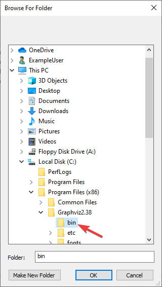

Build Instructions
==================

This document contains information on how to build the HTML, PDF, and EPUB versions of the frc-docs site. frc-docs uses Sphinx as the documentation generator. This document also assumes you have basic knowledge of `Git <https://git-scm.com/>`__ and console commands.

Prerequisites
-------------

Ensure that `Git <https://git-scm.com/>`__ is installed and that the frc-docs repository is cloned by using ``git clone https://github.com/wpilibsuite/frc-docs.git``.

Windows
^^^^^^^

.. note:: The majority of MikTeX packages are not required for building HTML, additional packages may be required for building PDF and EPUB.

- `Python 3.6 or greater <https://www.python.org/downloads/>`__
- `MiKTeX <https://miktex.org/download>`__
- `GraphViz <https://graphviz.gitlab.io/_pages/Download/Download_windows.html>`__
- `Perl <http://strawberryperl.com/>`__

Ensure that Python is in your Path by selecting the **Add Python to PATH** toggle when installing Python.

.. image:: images/build-instructions-1.png

Once Python is installed, open up Powershell. Then navigate to the frc-docs directory. Run the following command: ``pip install -r source/requirements.txt``

Ensure that the GraphViz ``bin`` folder is correctly linked in your `Path <https://stackoverflow.com/questions/44272416/how-to-add-a-folder-to-path-environment-variable-in-windows-10-with-screensho/44272417#44272417>`__. By default, this folder is located at ``C:\Program Files (x86)\Graphviz2.38\bin``.

Install the missing MikTex packages by navigating to the frc-docs directory, then running the following command from Powershell: ``mpm --verbose --require=@miktex-packages.txt``

Linux (Ubuntu)
^^^^^^^^^^^^^^

.. code-block:: console

    $ sudo apt update
    $ sudo apt install python3 python3-pip
    $ python3 -m pip install -U pip setuptools wheel
    $ python3 -m pip install -r source/requirements.txt
    $ sudo apt install -y texlive-latex-recommended texlive-fonts-recommended texlive-latex-extra latexmk texlive-lang-greek texlive-luatex texlive-xetex texlive-fonts-extra dvipng graphviz librsvg2-bin

Building
--------

Open up a Powershell Window or terminal and navigate to the frc-docs directory that was cloned.

.. code-block:: console

    PS > cd "%USERPROFILE%\Documents"
    PS C:\Users\Example\Documents> git clone https://github.com/wpilibsuite/frc-docs.git
    Cloning into 'frc-docs'...
    remote: Enumerating objects: 217, done.
    remote: Counting ojbects: 100% (217/217), done.
    remote: Compressing objects: 100% (196/196), done.
    remote: Total 2587 (delta 50), reused 68 (delta 21), pack-reused 2370
    Receiving objects: 100% (2587/2587), 42.68MiB | 20.32 MiB/s, done.
    Receiving deltas: 100% (1138/1138), done/
    PS C:\Users\Example\Documents> cd frc-docs
    PS C:\Users\Example\Documents\frc-docs>

Lint Check
^^^^^^^^^^

.. note:: Lint Check will not check line endings on Windows due to a bug with line endings. See `this issue <https://bugs.launchpad.net/doc8/+bug/1756704>`__ for more information.

It's encouraged to check any changes you make with the linter. This **will** fail the buildbot if it does not pass. To check, run ``.\make lint``

Link Check
^^^^^^^^^^

The link checker makes sure that all links in the documentation resolve. This **will** fail the buildbot if it does not pass. To check, run ``.\make linkcheck``

Translate Check
^^^^^^^^^^^^^^^

To ensure translations are updated concurrently, you must update the transifex configuration file. This can be done by running the ``.\make translate`` command. This **must** be done to to pass the buildbot.

Building HTML
^^^^^^^^^^^^^

Type the command ``.\make html`` to generate HTML content. The content is located in the ``build/html`` directory at the root of the repository.

Building PDF
------------

.. warning:: Please note that PDF build on Windows may result in distorted images for SVG content. This is due to a lack of librsvg2-bin support on Windows.

Type the command ``.\make latexpdf`` to generate PDF content. The PDF is located in the ``build/latex`` directory at the root of the repository.

Building EPUB
-------------

Type the command ``.\make epub`` to generate EPUB content. The EPUB is located in the ``build/epub`` directory at the root of the repository.
