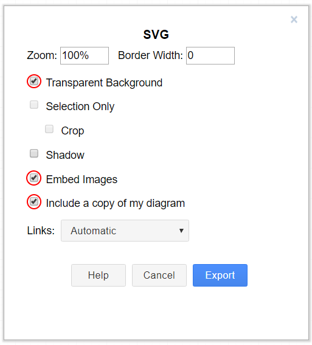

Draw.io Saving Instructions
===========================

.. warning:: Make sure you don't modify any file that is in a ``diagrams`` folder, or ends in ``.drawio.svg`` in any program other than draw.io; otherwise you might risk breaking the metadata of the file, making it uneditable.

Draw.io (also known as `diagrams.net <https://app.diagrams.net/>`__) are supported when saved as ``svg`` files, with embedded XML metadata for the draw.io source file (normally stored as ``.drawio``).
This allows these images to both act as source files for the diagrams that can be edited in the future, and be rendered as normal ``svg`` files.

There are a few methods to save a diagram with the embedded metadata, but using the export menu is preferred because it allows us to embed any images in the diagram; otherwise they might not render properly on the docs.

This method is applicable to both draw.io desktop and the web version at `diagrams.net <https://app.diagrams.net/>`__.

To export go to ``File - Export as - SVG...``. Make sure ``Include a copy of my diagram`` is enabled to embed the diagram metadata, and that ``Embed Images`` is enabled so image files in the diagram are embedded so they render in the docs. Additionally, mark the ``Transparent Background`` option to make sure the background is displayed correctly.

The export menu should look something like this:

Then just click ``Export`` then select where you would like to save the file and save it.

.. note:: When saving, make sure you follow the style-guide at :ref:`docs/contributing/frc-docs/style-guide:Draw.io Files`
