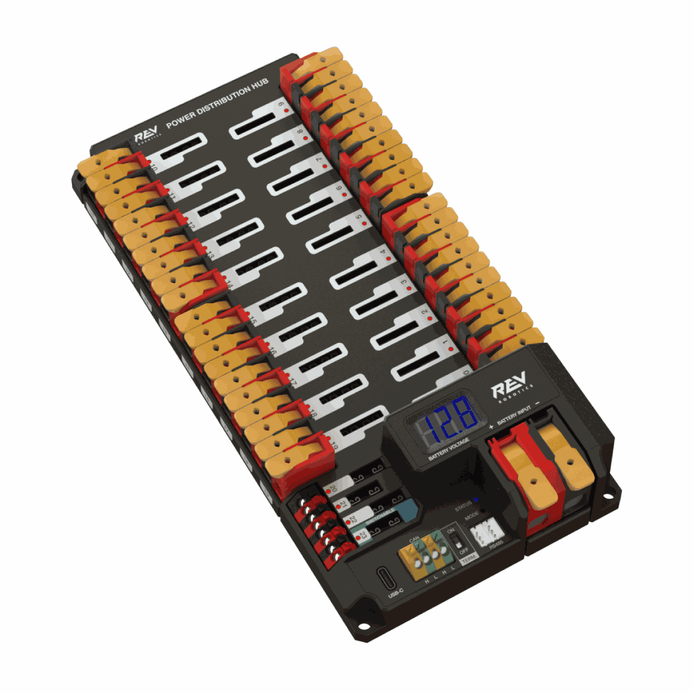
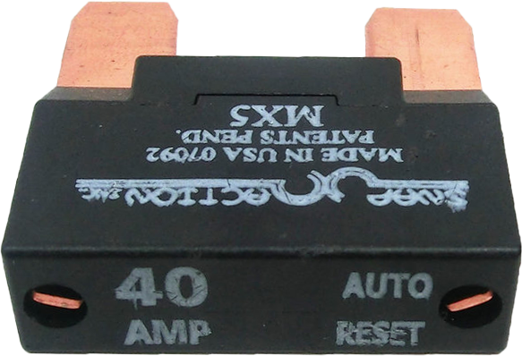
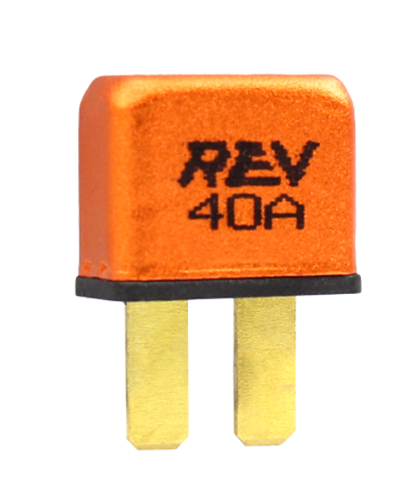
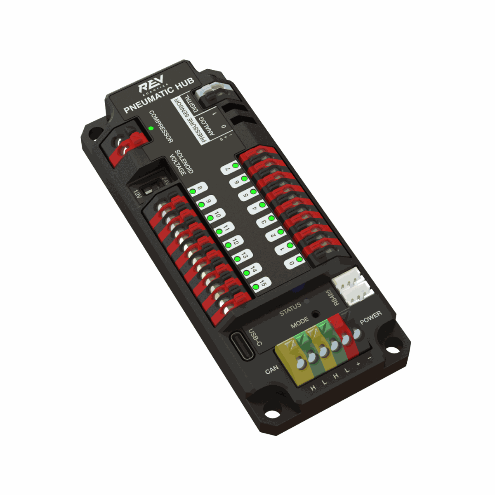
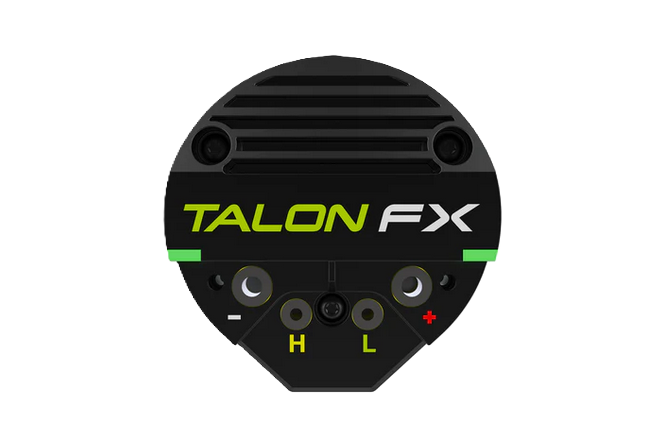
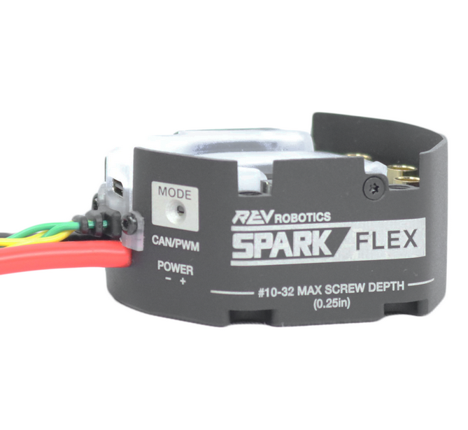

.. include:: <isonum.txt>

# Hardware Component Overview

The goal of this document is to provide a brief overview of the hardware components that make up the FRC\ |reg| Control System. Each component will contain a brief description of the component function and a link to more documentation.

.. note:: For wiring instructions/diagrams, please see the :doc:`Wiring the FRC Control System </docs/zero-to-robot/step-1/intro-to-frc-robot-wiring>` document.

## Overview of Control System

.. tab-set::
    .. tab-item:: Basic
        :sync: basic

        .. figure:: images/frc-control-system-layout-basic.svg
         :alt: Layout of the core components of the control system and introductory information for them.
         :width: 600

        Diagram courtesy of FRC\ |reg| Team 3161 and Stefen Acepcion.

    .. tab-item:: REV
        :sync: rev

        .. figure:: images/frc-control-system-layout-rev.svg
         :alt: Layout of all popular components of the control system including REV Control System Components
         :width: 600

        Diagram courtesy of FRC\ |reg| Team 3161 and Stefen Acepcion.

    .. tab-item:: CTRE
        :sync: ctre

        .. figure:: images/frc-control-system-layout.svg
         :alt: Layout of all popular components of the control system including CTRE Control System Components
         :width: 600

        Diagram courtesy of FRC\ |reg| Team 3161 and Stefen Acepcion.

## NI roboRIO

The :ref:`NI-roboRIO <docs/software/roborio-info/roborio-introduction:roboRIO Introduction>` is the main robot controller used for FRC. The roboRIO serves as the "brain" for the robot running team-generated code that commands all of the other hardware.

## CTRE Power Distribution Panel

.. image:: images/control-system-hardware/power-distribution-panel.png
  :alt: CTRE Power Distribution Panel
  :width: 500

The :ref:`CTRE Power Distribution Panel <docs/software/can-devices/power-distribution-module:Power Distribution Module>` (PDP) is designed to distribute power from a 12VDC battery to various robot components through auto-resetting circuit breakers and a small number of special function fused connections. The PDP provides 8 output pairs rated for 40A continuous current and 8 pairs rated for 30A continuous current. The PDP provides dedicated 12V connectors for the roboRIO, as well as connectors for the Voltage Regulator Module and Pneumatics Control Module. It also includes a CAN interface for logging current, temperature, and battery voltage. For more detailed information, see the [PDP User Manual](https://ctre.download/files/user-manual/PDP%20User's%20Guide.pdf).

## CTRE Power Distribution Panel 2.0

The [CTRE Power Distribution Panel 2.0](https://store.ctr-electronics.com/products/pdp-2) (PDP 2.0) is designed to distribute power from a 12VDC battery to various robot components. The PDP 2.0 features 24 40A channels and can accoommodate ATO breakers. The PDP 2.0 is designed to maximize efficiency.

.. note:: The PDP 2.0 does not have buit in current logging and current logs will not be available in the :doc:`Driver Station Log Viewer </docs/software/driverstation/driver-station-log-viewer>`

## REV Power Distribution Hub

The [REV Power Distribution Hub](https://docs.revrobotics.com/ion-control-system/pdh/overview) (PDH) is designed to distribute power from a 12VDC battery to various robot components.  The PDH features 20 high-current (40A max) channels, 3 low-current (15A max), and 1 switchable low-current channel. The Power Distribution Hub features toolless latching WAGO terminals, an LED voltage display, and the ability to connect over CAN or USB-C to the REV Hardware Client for real-time telemetry.

## AndyMark Power Distribution Board

.. image:: images/control-system-hardware/andymark-ampd.jpg
  :alt: AndyMark Power Distribution Board
  :width: 500

The [AndyMark Power Distribution Board](https://andymark.com/am-5754) (AMPD) is designed to distribute power from a 12VDC battery to various robot components. The AMPD features 24 fully insulated 40A ports that work with ATO/ATC breakers. With toolless lever connectors and 22.5 degree angled outputs for clean wiring, the AMPD is designed to simplify robot wiring.

.. note:: The AMPD does not have buit in current logging and current logs will not be available in the :doc:`Driver Station Log Viewer </docs/software/driverstation/driver-station-log-viewer>`

## CTRE Voltage Regulator Module

.. image:: images/control-system-hardware/voltage-regulator-module.png
  :alt: CTRE Voltage Regulator Module
  :width: 500

The CTRE Voltage Regulator Module (VRM) is an independent module that is powered by 12 volts. The device is wired to a dedicated connector on the PDP. The module has multiple regulated 12V and 5V outputs. The purpose of the VRM is to provide regulated power for the custom circuits, and IP vision cameras. For more information, see the [VRM User Manual](https://ctre.download/files/user-manual/VRM%20User's%20Guide.pdf).

## Vivid-Hosting VH-109 Radio

The [Vivid-Hosting VH-109 radio](https://frc-radio.vivid-hosting.net/) is designed specifically for FRC.  It uses Wi-Fi 6E to avoid the common congestion problems that plague 2.4 GHz Wi-Fi networks.  The ruggedized design allows for unfiltered power input coming directly from a power distribution device.  It also has 4 Ethernet ports reducing the need for an additional network switch.

## 120A Circuit Breaker

.. image:: images/control-system-hardware/circuit-breaker.png
  :alt: 120A Circuit Breaker
  :width: 500

The 120A Main Circuit Breaker serves two roles on the robot: the main robot power switch and a protection device for downstream robot wiring and components. The 120A circuit breaker is wired to the positive terminals of the robot battery and Power Distribution boards. For more information, please see the [Cooper Bussmann 18X Series Datasheet (PN: 185120F)](https://www.mouser.com/datasheet/2/87/BUS_Tns_DS_18X_CIRCUITBREAKER-515519.pdf)

## Snap Action Circuit Breakers

The Snap Action circuit breakers, [MX5 series](https://www.snapaction.net/assets/img/MX5-Spec-Sheet-Revision-2023.pdf) and [VB3 Series](https://www.snapaction.net/assets/img/VB3-Spec-Sheet-Revision-2023.pdf), are used with the Power Distribution Panel to limit current to branch circuits. The ratings on these circuit breakers are for continuous current, temporary peak values can be considerably higher.

## Rev ATO Circuit Breakers

The [Rev ATO Circuit Breakers](https://www.revrobotics.com/content/docs/REV-11-1860-1863-DS.pdf) are used with the Power Distribution Panel, Power Distribution Hub, and Power Distribution Panel 2.0 to limit current to branch circuits. They come in [40A, 30A, 20A, and 10A](https://www.revrobotics.com/auto-resetting-breakers/) variants. The ratings on these circuit breakers are for continuous current, temporary peak values can be considerably higher.

## CTRE Power Distribution Panel Breakers

.. image:: images/control-system-hardware/ctre-pdp-breaker.png
  :alt: CTRE Power Distribution Panel Breakers
  :width: 500

The [CTRE Power Distribution Panel Breakers](https://store.ctr-electronics.com/products/auto-resetting-ato-breakers) are auto-reset circuit breakers designed for use with CTRE Power Distribution Panels. They come in 40A, 30A, 20A, and 10A variants. These custom ATO-sized breakers automatically reset after tripping, providing consistent performance even after hundreds of trips.

## Robot Battery

.. image:: images/control-system-hardware/robot-battery.png
  :alt: Robot Battery
  :width: 500

The power supply for an FRC robot is a single 12V 18Ah Sealed Lead Acid (SLA) battery, capable of meeting the high current demands of an FRC robot. For more information, see the :ref:`Robot Battery page. <docs/hardware/hardware-basics/robot-battery:Robot Battery Basics>`

.. note:: Multiple battery part numbers may be legal, consult the [FRC Manual](https://www.firstinspires.org/resources/library/frc/season-materials?view=calendar) for a complete list.

## Robot Signal Light

.. tab-set::

   .. tab-item:: Allen-Bradley

      .. figure:: images/control-system-hardware/rsl-allenbradley.jpg
         :alt: Orange Robot Signal Light (Allen-Bradley)
         :width: 500

         Allen-Bradley 855PB-B12ME522

   .. tab-item:: AndyMark

      .. figure:: images/control-system-hardware/rsl-andymark.png
         :alt: Orange Robot Signal Light (AndyMark)
         :width: 500

         AndyMark am-3583

The Robot Signal Light (RSL) is required to be either Allen-Bradley 855PB-B12ME522 or AndyMark am-3583.  It is directly controlled by the roboRIO and will flash when enabled and stay solid while disabled.

## CTRE Pneumatics Control Module

.. image:: images/control-system-hardware/pneumatics-control-module.png
  :alt: CTRE Pneumatics Control Module
  :width: 500

The :ref:`CTRE Pneumatics Control Module <docs/software/can-devices/pneumatics-control-module:Pneumatics Control Module>` (PCM) contains all of the inputs and outputs required to operate 12V or 24V pneumatic solenoids and the on board compressor. The PCM contains an input for the pressure sensor and will control the compressor automatically when the robot is enabled and a solenoid has been created in the code. For more information see the [PCM User Manual](https://ctre.download/files/user-manual/PCM%20User's%20Guide.pdf).

## REV Pneumatic Hub

The [REV Pneumatic Hub](https://docs.revrobotics.com/ion-control-system/ph/overview) is a standalone module that is capable of switching both 12V and 24V pneumatic solenoid valves. The Pneumatic Hub features 16 solenoid channels which allow for up to 16 single-acting solenoids, 8 double-acting solenoids, or a combination of the two types. The user selectable output voltage is fully regulated, allowing even 12V solenoids to stay active when the robot battery drops as low as 4.75V.

Digital and analog pressure sensor ports are built into the device, increasing the flexibility and feedback functionality of the pneumatic system. The USB-C connection on the Hub works with the REV Hardware Client, allowing users to test pneumatic systems without a need for an additional robot controller.

## Motor Controllers

There are a variety of different :ref:`motor controllers <docs/software/hardware-apis/index:Hardware APIs>` which work with the FRC Control System and are approved for use. These devices are used to provide variable voltage control of the brushed and brushless DC motors used in FRC. They are listed here in order of [usage](https://community.firstinspires.org/control-system-beta-testing-and-usage-reporting) placement is estimated for devices where data is unavailable.

.. note:: 3rd Party CAN control is not supported from WPILib. See this section on :ref:`docs/software/can-devices/third-party-devices:Third-Party CAN Devices` for more information.

### SPARK MAX Motor Controller

The [SPARK MAX Motor Controller](https://www.revrobotics.com/rev-11-2158/) is an advanced brushed and brushless DC motor controller from REV Robotics. When using CAN bus or USB control, the SPARK MAX uses input from limit switches, encoders, and other sensors, including the integrated encoder of the REV NEO Brushless Motor, to perform advanced control modes. The SPARK MAX can be controlled over PWM, CAN, or USB (for configuration/testing only). For more information, see the [SPARK MAX Documentation](https://docs.revrobotics.com/brushless/spark-max/overview).

### TalonFX Motor Controller

The TalonFX Motor Controller is a brushless motor controller from Cross The Road Electronics which is integrated into the Falcon 500, Kraken X60, and Kraken X44 brushless motors.  It features an integrated encoder and all of the smart features of the Talon SRX and more! For more information see the [TalonFX Hardware Reference](https://v6.docs.ctr-electronics.com/en/stable/docs/hardware-reference/talonfx/).

### Victor SPX

The [Victor SPX Motor Controller](https://store.ctr-electronics.com/victor-spx/) is a CAN or PWM controlled motor controller from Cross The Road Electronics/VEX Robotics. The device is connectorized to allow easy connection to the roboRIO PWM connectors or a CAN bus. The case is sealed to prevent debris from entering the controller. For more information, see the [Victor SPX User Guide](https://ctre.download/files/user-manual/Victor%20SPX%20User's%20Guide.pdf).

### Talon SRX

.. image:: images/control-system-hardware/talonsrx-motor-controller.png
  :alt: Talon SRX
  :width: 500

The [Talon SRX Motor Controller](https://store.ctr-electronics.com/talon-srx/) is a "smart motor controller" from Cross The Road Electronics/VEX Robotics. The Talon SRX can be controlled over the CAN bus or :term:`PWM` interface. When using the CAN bus control, this device can take inputs from limit switches and potentiometers, encoders, or similar sensors in order to perform advanced control. For more information see the [Talon SRX User's Guide](https://ctre.download/files/user-manual/Talon%20SRX%20User's%20Guide.pdf).

### SPARK Motor Controller

.. warning:: While this motor controller is still legal for FRC use, the manufacturer has discontinued this product.

The [SPARK Motor Controller](https://www.revrobotics.com/content/docs/REV-11-1200-UM.pdf) from REV Robotics is an inexpensive brushed DC motor controller. The SPARK is controlled using the PWM interface. Limit switches may be wired directly to the SPARK to limit motor travel in one or both directions.

### Victor SP

.. image:: images/control-system-hardware/victor-sp-motor-controller.png
  :alt: Victor SP
  :width: 500

.. warning:: While this motor controller is still legal for FRC use, the manufacturer has discontinued this product.

The [Victor SP Motor Controller](https://web.archive.org/web/20220926211100/https://store.ctr-electronics.com/content/user-manual/Victor-SP-Quick-Start-Guide.pdf) is a PWM motor controller from Cross The Road Electronics/VEX Robotics. The Victor SP has an electrically isolated metal housing for heat dissipation, making the use of the fan optional. The case is sealed to prevent debris from entering the controller. The controller is approximately half the size of previous models.

### SPARK Flex Motor Controller

The [SPARK Flex Motor Controller](https://www.revrobotics.com/rev-11-2159/) is a smart brushed and brushless DC motor controller from Rev Robotics. It is designed for semi-permanent docking to NEO Vortex brushless motors, but can be used with other brushed and brushless motors through the use of an adapter dock. When using CAN bus or USB control, the SPARK Flex uses input from limit switches, encoders, and other sensors, including the integrated encoder of NEO Vortex, Neo 1.0/1.1 and NEO 550 brushless motors, to perform advanced control modes. The SPARK Flex can be controlled over PWM, CAN, or USB (for configuration/testing only). For more information, see the [SPARK Flex Documentation](https://docs.revrobotics.com/brushless/spark-flex/overview).

### Talon Motor Controller

.. warning:: While this motor controller is still legal for FRC use, the manufacturer has discontinued this product.

The [Talon Motor Controller](https://files.andymark.com/Talon_User_Manual_1_3.pdf) from Cross the Road Electronics is a PWM controlled brushed DC motor controller with passive cooling.

### Venom Motor Controller

.. image:: images/control-system-hardware/venom.jpg
  :alt: Venom Motor Controller
  :width: 500

The [Venom Motor Controller](https://www.playingwithfusion.com/productview.php?pdid=99) from Playing With Fusion is integrated into a motor based on the original :term:`CIM`.  Speed, current, temperature, and position are all measured onboard, enabling advanced control modes without complicated sensing and wiring schemes.

### Thrifty Nova Motor Controller

.. image:: images/control-system-hardware/nova.png
  :alt: Thrifty Nova Motor Controller
  :width: 400

The [Thrifty Nova Motor Controller](https://www.thethriftybot.com/products/thrifty-nova) is a brushless DC motor controller from The Thrifty Bot with CAN and USB connectivity. It can receive sensor inputs from NEO and NEO 550 brushless motors as well as other sensors with the use of expansion boards. For more information, see the [Thrifty Nova Documentation](https://www.thethriftybot.com/products/thrifty-nova).

### Talon FXS Motor Controller

The [Talon FXS Motor Controller](https://store.ctr-electronics.com/products/talon-fxs) is a smart brushed and brushless DC motor controller from Cross The Road Electronics.

### Koors 40 Brushed DC Motor Controller

The [Koors 40 Brushed DC Motor Controller](https://www.andymark.com/products/koors-40-brushed-dc-motor-controller) is an inexpensive PWM brushed DC motor controller from AndyMark with features such as Ground Loss Protection for PWM, Thermal, and Overcurrent Protection, and Reverse Polarity Protection.

## Spike H-Bridge Relay

.. image:: images/control-system-hardware/spike-relay.png
  :alt: Spike H-Bridge Relay
  :width: 300

.. warning:: While this relay is still legal for FRC use, the manufacturer has discontinued this product.

The Spike H-Bridge Relay from VEX Robotics is a device used for controlling power to motors or other custom robot electronics. When connected to a motor, the Spike provides On/Off control in both the forward and reverse directions. The Spike outputs are independently controlled so it can also be used to provide power to up to 2 custom electronic circuits. The Spike H-Bridge Relay should be connected to a relay output of the roboRIO and powered from the Power Distribution Panel. For more information, see the [Spike User’s Guide](https://content.vexrobotics.com/docs/spike-blue-guide-sep05.pdf).

## Servo Hub

.. image:: images/control-system-hardware/servo-hub.png
  :alt: Servo Hub
  :width: 400

The [Servo Hub](https://www.revrobotics.com/rev-11-1855/) from Rev Robotics can control up to 6 servos. It can output a maximum of 15A across all channels and. The Servo Hub supports USB, RS485 and CAN control.

## Servo Power Module

.. image:: images/control-system-hardware/servo-power-module.png
  :alt: Servo Power Module
  :width: 300

The Servo Power Module from Rev Robotics is capable of expanding the power available to servos beyond what the roboRIO integrated power supply is capable of. The Servo Power Module provides up to 90W of 6V power across 6 channels. All control signals are passed through directly from the roboRIO. For more information, see the [Servo Power Module webpage](https://www.revrobotics.com/rev-11-1144/).

## Microsoft Lifecam HD3000

.. image:: images/control-system-hardware/microsoft-lifecam.png
  :alt: Microsoft Lifecam HD3000
  :width: 300

The Microsoft Lifecam HD3000 is a USB webcam that can be plugged directly into the roboRIO. The camera is capable of capturing up to 1280x720 video at 30 FPS. For more information about the camera, see the [Microsoft product page](https://www.microsoft.com/en/accessories/business/lifecam-hd-3000-for-business). For more information about using the camera with the roboRIO, see the :ref:`Vision Processing <docs/software/vision-processing/index:Vision Processing>` section of this documentation.

## Image Credits

Image of roboRIO courtesy of National Instruments. Images of Talon SRX, Victor SP, Victor SPX, and Spike H-Bridge Relay courtesy of VEX Robotics, Inc. Image of SPARK MAX, SPARK Flex, Servo Hub, ATO Breakers, Power Distribution Hub, and Pneumatic Hub courtesy of REV Robotics. Images of TalonFX, TalonFXS, Power Distribution Panel 2.0, and Power Distribution Panel Breakers courtesy of Cross The Road Electronics, LLC. Image of Thrifty Nova courtesy of The Thrifty Bot. Lifecam, PDP, PCM, SPARK, and VRM photos courtesy of *FIRST*\ |reg|. Image of the VH-109 radio courtesy of Vivid-Hosting. All other photos courtesy of AndyMark Inc.
