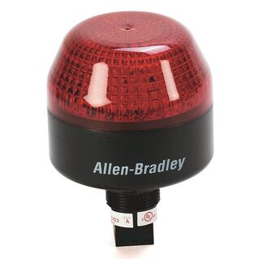
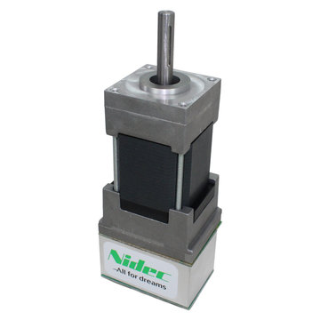

.. include:: <isonum.txt>

Hardware Component Overview
===========================

The goal of this document is to provide a brief overview of the hardware components that make up the FRC\ |reg| Control System. Each component will contain a brief description of the component function and a link to more documentation.

.. note:: For complete wiring instructions/diagrams, please see the :doc:`Wiring the FRC Control System </docs/zero-to-robot/step-1/how-to-wire-a-robot>` document.

Overview of Control System
--------------------------

.. tabs::

   .. group-tab:: REV

      .. figure:: images/frc-control-system-layout-rev.svg
         :alt: Layout of all popular components of the control system including REV Control System Components
         :width: 500

      Diagram courtesy of FRC\ |reg| Team 3161 and Stefen Acepcion.

   .. group-tab:: CTRE

      .. figure:: images/frc-control-system-layout.svg
        :alt: Layout of all of the core components of the control system and how they are connected.
        :width: 500

      Diagram courtesy of FRC\ |reg| Team 3161 and Stefen Acepcion.

NI roboRIO
----------

.. image:: images/control-system-hardware/roborio.png
  :alt: NI roboRIO
  :width: 500

The :ref:`NI-roboRIO <docs/software/roborio-info/roborio-introduction:roboRIO Introduction>` is the main robot controller used for FRC. The roboRIO serves as the "brain" for the robot running team-generated code that commands all of the other hardware.

CTRE Power Distribution Panel
-----------------------------

The :ref:`CTRE Power Distribution Panel <docs/software/can-devices/power-distribution-module:Power Distribution Module>` (PDP) is designed to distribute power from a 12VDC battery to various robot components through auto-resetting circuit breakers and a small number of special function fused connections. The PDP provides 8 output pairs rated for 40A continuous current and 8 pairs rated for 30A continuous current. The PDP provides dedicated 12V connectors for the roboRIO, as well as connectors for the Voltage Regulator Module and Pneumatics Control Module. It also includes a CAN interface for logging current, temperature, and battery voltage. For more detailed information, see the `PDP User Manual <https://store.ctr-electronics.com/content/user-manual/PDP%20User%27s%20Guide.pdf>`__.

REV Power Distribution Hub
--------------------------

.. image:: images/control-system-hardware/power-distribution-hub.png
  :alt: REV Power Distribution Hub
  :width: 500

The `REV Power Distribution Hub <https://docs.revrobotics.com/rev-11-1850/>`__ (PDH) is designed to distribute power from a 12VDC battery to various robot components.  The PDH features 20 high-current (40A max) channels, 3 low-current (15A max), and 1 switchable low-current channel. The Power Distribution Hub features toolless latching WAGO terminals, an LED voltage display, and the ability to connect over CAN or USB-C to the REV Hardware Client for real-time telemetry.

CTRE Voltage Regulator Module
-----------------------------

The CTRE Voltage Regulator Module (VRM) is an independent module that is powered by 12 volts. The device is wired to a dedicated connector on the PDP. The module has multiple regulated 12V and 5V outputs. The purpose of the VRM is to provide regulated power for the robot radio, custom circuits, and IP vision cameras. For more information, see the `VRM User Manual <https://store.ctr-electronics.com/content/user-manual/VRM%20User%27s%20Guide.pdf>`__.

REV Radio Power Module
----------------------

.. image:: images/control-system-hardware/radio-power-module.png
  :alt: REV Radio Power Module
  :width: 500

The `REV Radio Power Module <https://docs.revrobotics.com/rev-11-1856/>`__ is designed to keep one of the most critical system components, the OpenMesh WiFi radio, powered in the toughest moments of the competition. The Radio Power Module eliminates the need for powering the radio through a traditional barrel power jack. Utilizing 18V Passive POE with two socketed RJ45 connectors, the Radio Power Module passes signal between the radio and roboRIO while providing power directly to the radio. After connecting the radio and roboRIO, easily add power to the Radio Power Module by wiring it to the low-current channels on the Power Distribution Hub utilizing the color coded push button WAGO terminals.

OpenMesh OM5P-AN or OM5P-AC Radio
---------------------------------

Either the OpenMesh OM5P-AN or `OpenMesh OM5P-AC <https://www.andymark.com/products/open-mesh-om5p-ac-dual-band-1-17-gbps-access-point-radio>`__ wireless radio is used as the robot radio to provide wireless communication functionality to the robot. The device can be configured as an Access Point for direct connection of a laptop for use at home. It can also be configured as a bridge for use on the field. The robot radio should be powered by one of the 12V/2A outputs on the VRM and connected to the roboRIO controller over Ethernet. For more information, see :ref:`Programming your Radio <docs/zero-to-robot/step-3/radio-programming:Programming your Radio>`.

The OM5P-AN `is no longer available for purchase <https://www.firstinspires.org/robotics/frc/blog/radio-silence>`__. The OM5P-AC is slightly heavier, has more cooling grates, and has a rough surface texture compared to the OM5P-AN.

120A Circuit Breaker
--------------------

The 120A Main Circuit Breaker serves two roles on the robot: the main robot power switch and a protection device for downstream robot wiring and components. The 120A circuit breaker is wired to the positive terminals of the robot battery and Power Distribution boards. For more information, please see the `Cooper Bussmann 18X Series Datasheet (PN: 185120F) <https://www.mouser.com/datasheet/2/87/BUS_Tns_DS_18X_CIRCUITBREAKER-515519.pdf>`__

Snap Action Circuit Breakers
----------------------------

.. image:: images/control-system-hardware/snap-action-circuit-breaker.png
  :alt: Snap Action Circuit Breakers to be inserted in the PDP.
  :width: 500

The Snap Action circuit breakers, `MX5 series <http://www.snapaction.net/pdf/MX5%20Spec%20Sheet.pdf>`__ and `VB3 Series <http://www.snapaction.net/pdf/vb3.pdf>`__, are used with the Power Distribution Panel to limit current to branch circuits. The ratings on these circuit breakers are for continuous current, temporary peak values can be considerably higher.

Robot Battery
-------------

.. image:: images/control-system-hardware/robot-battery.png
  :alt: Robot Battery
  :width: 500

The power supply for an FRC robot is a single 12V 18Ah Sealed Lead Acid (SLA) battery, capable of meeting the high current demands of an FRC robot. For more information, see the :ref:`Robot Battery page. <docs/hardware/hardware-basics/robot-battery:Robot Battery Basics>`

.. note:: Multiple battery part numbers may be legal, consult the `FRC Manual <https://www.firstinspires.org/resource-library/frc/competition-manual-qa-system>`__ for a complete list.

Robot Signal Light
------------------

The Robot Signal Light (RSL) is required to be the Allen-Bradley 855PB-B12ME522.  It is directly controlled by the roboRIO and will flash when enabled and stay solid while disabled.

CTRE Pneumatics Control Module
------------------------------

The :ref:`CTRE Pneumatics Control Module <docs/software/can-devices/pneumatics-control-module:Pneumatics Control Module>` (PCM) contains all of the inputs and outputs required to operate 12V or 24V pneumatic solenoids and the on board compressor. The PCM contains an input for the pressure sensor and will control the compressor automatically when the robot is enabled and a solenoid has been created in the code. For more information see the `PCM User Manual <https://store.ctr-electronics.com/content/user-manual/PCM%20User%27s%20Guide.pdf>`__.

REV Pneumatic Hub
-----------------

.. image:: images/control-system-hardware/pneumatic-hub.png
  :alt: REV Pneumatic Hub
  :width: 500

The `REV Pneumatic Hub <https://docs.revrobotics.com/rev-11-1852/>`__ is a standalone module that is capable of switching both 12V and 24V pneumatic solenoid valves. The Pneumatic Hub features 16 solenoid channels which allow for up to 16 single-acting solenoids, 8 double-acting solenoids, or a combination of the two types. The user selectable output voltage is fully regulated, allowing even 12V solenoids to stay active when the robot battery drops as low as 4.75V.

Digital and analog pressure sensor ports are built into the device, increasing the flexibility and feedback functionality of the pneumatic system. The USB-C connection on the Hub works with the REV Hardware Client, allowing users to test pneumatic systems without a need for an additional robot controller.

Motor Controllers
-----------------

There are a variety of different :ref:`motor controllers <docs/software/hardware-apis/index:Hardware APIs>` which work with the FRC Control System and are approved for use. These devices are used to provide variable voltage control of the brushed and brushless DC motors used in FRC. They are listed here in order of `usage <https://www.firstinspires.org/robotics/frc/blog/2021-beta-testing-usage-report>`__.

.. note:: 3rd Party CAN control is not supported from WPILib. See this section on :ref:`docs/software/can-devices/third-party-devices:Third-Party CAN Devices` for more information.

Talon SRX
^^^^^^^^^

The `Talon SRX Motor Controller <https://store.ctr-electronics.com/talon-srx/>`__ is a "smart motor controller" from Cross The Road Electronics/VEX Robotics. The Talon SRX can be controlled over the CAN bus or PWM interface. When using the CAN bus control, this device can take inputs from limit switches and potentiometers, encoders, or similar sensors in order to perform advanced control. For more information see the `Talon SRX User's Guide <https://store.ctr-electronics.com/content/user-manual/Talon%20SRX%20User's%20Guide.pdf>`__.

Victor SPX
^^^^^^^^^^

.. image:: images/control-system-hardware/victor-spx-motor-controller.png
  :alt: Victor SPX
  :width: 500

The `Victor SPX Motor Controller <https://store.ctr-electronics.com/victor-spx/>`__ is a CAN or PWM controlled motor controller from Cross The Road Electronics/VEX Robotics. The device is connectorized to allow easy connection to the roboRIO PWM connectors or a CAN bus. The case is sealed to prevent debris from entering the controller. For more information, see the `Victor SPX User Guide <https://store.ctr-electronics.com/content/user-manual/Victor%20SPX%20User's%20Guide.pdf>`__.

SPARK MAX Motor Controller
^^^^^^^^^^^^^^^^^^^^^^^^^^

.. image:: images/control-system-hardware/spark-max-motor-controller.png
  :alt: SPARK MAX Motor Controller
  :width: 400

The `SPARK MAX Motor Controller <https://www.revrobotics.com/rev-11-2158/>`__ is an advanced brushed and brushless DC motor controller from REV Robotics. When using CAN bus or USB control, the SPARK MAX uses input from limit switches, encoders, and other sensors, including the integrated encoder of the REV NEO Brushless Motor, to perform advanced control modes. The SPARK MAX can be controlled over PWM, CAN or USB (for configuration/testing only). For more information, see the `SPARK MAX User's Manual <https://docs.revrobotics.com/sparkmax/>`__.

TalonFX Motor Controller
^^^^^^^^^^^^^^^^^^^^^^^^

.. image:: images/control-system-hardware/talonfx.png
  :alt: TalonFX Motor Controller
  :width: 500

The `TalonFX Motor Controller <https://store.ctr-electronics.com/falcon-500-powered-by-talon-fx/>`__  is integrated into the Falcon 500 brushless motor.  It features an integrated encoder and all of the smart features of the Talon SRX and more!  For more information see the `Falcon 500 User Guide <https://store.ctr-electronics.com/content/user-manual/Falcon%20500%20User%20Guide.pdf>`__.

SPARK Motor Controller
^^^^^^^^^^^^^^^^^^^^^^

.. image:: images/control-system-hardware/spark-motor-controller.png
  :alt: SPARK Motor Controller
  :width: 400

.. warning:: While this motor controller is still legal for FRC use, the manufacturer has discontinued this product.

The `SPARK Motor Controller <https://www.revrobotics.com/rev-11-1200/>`__ from REV Robotics is an inexpensive brushed DC motor controller. The SPARK is controlled using the PWM interface. Limit switches may be wired directly to the SPARK to limit motor travel in one or both directions. For more information, see the `SPARK User's Manaul <https://www.revrobotics.com/content/docs/REV-11-1200-UM.pdf>`__.

Victor SP
^^^^^^^^^

.. warning:: While this motor controller is still legal for FRC use, the manufacturer has discontinued this product.

The `Victor SP Motor Controller <https://store.ctr-electronics.com/content/user-manual/Victor-SP-Quick-Start-Guide.pdf>`__ is a PWM motor controller from Cross The Road Electronics/VEX Robotics. The Victor SP has an electrically isolated metal housing for heat dissipation, making the use of the fan optional. The case is sealed to prevent debris from entering the controller. The controller is approximately half the size of previous models.

Talon Motor Controller
^^^^^^^^^^^^^^^^^^^^^^

.. image:: images/control-system-hardware/talon-motor-controller.png
  :alt: Talon Motor Controller

.. warning:: While this motor controller is still legal for FRC use, the manufacturer has discontinued this product.

The `Talon Motor Controller <https://files.andymark.com/Talon_User_Manual_1_3.pdf>`__ from Cross the Road Electronics is a PWM controlled brushed DC motor controller with passive cooling.

Victor 888 Motor Controller / Victor 884 Motor Controller
^^^^^^^^^^^^^^^^^^^^^^^^^^^^^^^^^^^^^^^^^^^^^^^^^^^^^^^^^

.. warning:: While this motor controller is still legal for FRC use, the manufacturer has discontinued this product.

The `Victor 884 <https://content.vexrobotics.com/docs/ifi-v884-users-manual-9-25-06.pdf>`__ and `Victor 888 <https://content.vexrobotics.com/docs/217-2769-Victor888UserManual.pdf>`__ motor controllers from VEX Robotics are variable speed PWM motor controllers for use in FRC. The Victor 888 replaces the Victor 884, which is also usable in FRC.

Jaguar Motor Controller
^^^^^^^^^^^^^^^^^^^^^^^

.. warning:: While this motor controller is still legal for FRC use, the manufacturer has discontinued this product.

The `Jaguar Motor Controller <https://www.ti.com/lit/an/spma033a/spma033a.pdf?ts=1607574399581>`__ from VEX Robotics (formerly made by Luminary Micro and Texas Instruments) is a variable speed motor controller for use in FRC. For FRC, the Jaguar may only be controlled using the PWM interface.

DMC-60 and DMC-60C Motor Controller
^^^^^^^^^^^^^^^^^^^^^^^^^^^^^^^^^^^

.. warning:: While this motor controller is still legal for FRC use, the manufacturer has discontinued this product.

The DMC-60 is a PWM motor controller from Digilent. The DMC-60 features integrated thermal sensing and protection including current-foldback to prevent overheating and damage, and four multi-color LEDs to indicate speed, direction, and status for easier debugging. For more information, see the `DMC-60 reference manual <https://reference.digilentinc.com/_media/dmc-60/dmc60_rm.pdf>`__

The DMC-60C adds CAN smart controller capabilities to the DMC-60 controller. Due to the manufacturer discontinuing this product, the DMC-60C is only usable with PWM. For more information see the `DMC-60C Product Page <https://reference.digilentinc.com/dmc-60c/start/>`__

Venom Motor Controller
^^^^^^^^^^^^^^^^^^^^^^

The `Venom Motor Controller <https://www.playingwithfusion.com/productview.php?pdid=99>`__ from Playing With Fusion is integrated into a motor based on the original CIM.  Speed, current, temperature, and position are all measured onboard, enabling advanced control modes without complicated sensing and wiring schemes.

Nidec Dynamo BLDC Motor with Controller
^^^^^^^^^^^^^^^^^^^^^^^^^^^^^^^^^^^^^^^

The `Nidec Dynamo BLDC Motor with Controller <https://www.andymark.com/products/dynamo-brushless-motor-controller>`__ is the first brushless motor and controller legal in FRC.  This motor's controller is integrated into the back of the motor.  The `motor data sheet <https://andymark-weblinc.netdna-ssl.com/media/W1siZiIsIjIwMTkvMDUvMDkvMDkvNTEvNDQvZjQwYjliZDctYzdkOC00MWFlLWIzZmYtZTQyNTJhYjRkNmIyL2FtLTM3NDAgTmlkZWMgRHluYW1vIERNMzAxMi0xMDYzLUIgU3BlYy5wZGYiXV0/am-3740%20Nidec%20Dynamo%20DM3012-1063-B%20Spec.pdf?sha=eb03d3f578fe782e>`__ provides more device specifics.

SD540B and SD540C Motor Controllers
^^^^^^^^^^^^^^^^^^^^^^^^^^^^^^^^^^^

The SD540B and SD540C Motor Controllers from Mindsensors are controlled using PWM. CAN control is no longer available for the SD540C due to lack of manufacturer support. Limit switches may be wired directly to the SD540 to limit motor travel in one or both directions.  For more information see the `Mindsensors FRC page <http://www.mindsensors.com/68-frc>`__

Spike H-Bridge Relay
--------------------

.. image:: images/control-system-hardware/spike-relay.png
  :alt: Spike H-Bridge Relay
  :width: 300

.. warning:: While this relay is still legal for FRC use, the manufacturer has discontinued this product.

The Spike H-Bridge Relay from VEX Robotics is a device used for controlling power to motors or other custom robot electronics. When connected to a motor, the Spike provides On/Off control in both the forward and reverse directions. The Spike outputs are independently controlled so it can also be used to provide power to up to 2 custom electronic circuits. The Spike H-Bridge Relay should be connected to a relay output of the roboRIO and powered from the Power Distribution Panel. For more information, see the `Spike User’s Guide <https://content.vexrobotics.com/docs/spike-blue-guide-sep05.pdf>`__.

Servo Power Module
------------------

The Servo Power Module from Rev Robotics is capable of expanding the power available to servos beyond what the roboRIO integrated power supply is capable of. The Servo Power Module provides up to 90W of 6V power across 6 channels. All control signals are passed through directly from the roboRIO. For more information, see the `Servo Power Module webpage <https://www.revrobotics.com/rev-11-1144/>`__.

Microsoft Lifecam HD3000
------------------------

The Microsoft Lifecam HD3000 is a USB webcam that can be plugged directly into the roboRIO. The camera is capable of capturing up to 1280x720 video at 30 FPS. For more information about the camera, see the `Microsoft product page <https://www.microsoft.com/en/accessories/business/lifecam-hd-3000-for-business>`__. For more information about using the camera with the roboRIO, see the :ref:`Vision Processing <docs/software/vision-processing/index:Vision Processing>` section of this documentation.

Image Credits
-------------

Image of roboRIO courtesy of National Instruments. Image of DMC-60 courtesy of Digilent. Image of SD540 courtesy of Mindsensors. Images of Jaguar Motor Controller, Talon SRX, Talon FX, Victor 888, Victor SP, Victor SPX, and Spike H-Bridge Relay courtesy of VEX Robotics, Inc. Image of SPARK MAX, Power Distribution Hub, Radio Power Module, and Pneumatic Hub courtesy of REV Robotics. Lifecam, PDP, PCM, SPARK, and VRM photos courtesy of *FIRST*\ |reg|. All other photos courtesy of AndyMark Inc.
