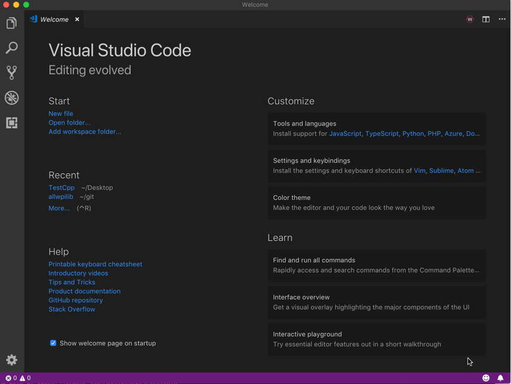
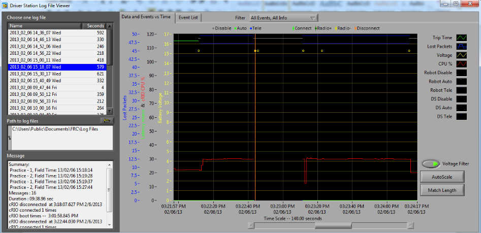

.. include:: <isonum.txt>

Software Component Overview
===========================

The FRC\ |reg| software consists of a wide variety of mandatory and optional components. These elements are designed to assist you in the design, development, and debugging of your robot code as well as assist with control robot operation and to provide feedback when troubleshooting. For each software component this document will provide a brief overview of its purpose, a link to the package download, if appropriate, and a link to further documentation where available.

Operating System Compatibility
------------------------------

The primary supported OS for FRC components is Windows. All required FRC software components have been tested on Windows 10. NI Tools do not support Windows 7 or 8.1.

Many of the tools for C++/Java programming are also supported and tested on macOS and Linux. Teams programming in C++/Java should be able to develop using these systems, using a Windows system for the Windows-only operations such as the Driver Station, Radio Configuration Utility, and roboRIO Imaging Tool.

.. important:: The minimum supported macOS version is Mojave (10.14.x).

LabVIEW FRC (Windows Only)
--------------------------

.. image:: /docs/zero-to-robot/step-4/images/creating-benchtop-test-labview/creating-a-project.png
   :alt: LabVIEW FRC Getting Started screen.

LabVIEW FRC, based on a recent version of LabVIEW Professional, is one of the three officially supported languages for programming an FRC robot. LabVIEW is a graphical, dataflow-driven language. LabVIEW programs consist of a collection of icons, called VIs, wired together with wires which pass data between the VIs. The LabVIEW FRC installer is distributed on a DVD found in the Kickoff Kit of Parts and is also available for download.  A guide to getting started with the LabVIEW FRC software, including installation instructions can be found :ref:`here <docs/zero-to-robot/step-2/labview-setup:Installing LabVIEW for FRC (LabVIEW only)>`.

Visual Studio Code
------------------

Visual Studio Code is the supported development environment for C++ and Java (the other two supported languages). Both are object-oriented text based programming languages. A guide to getting started with C++ or Java for FRC, including the installation and configuration of Visual Studio Code can be found :ref:`here <docs/zero-to-robot/step-2/wpilib-setup:WPILib Installation Guide>`.

FRC Driver Station Powered by NI LabVIEW (Windows Only)
-------------------------------------------------------

This is the only software allowed to be used for the purpose of controlling the state of the robot during competition. This software sends data to your robot from a variety of input devices. It also contains a number of tools used to help troubleshoot robot issues.  More information about the FRC Driver Station Powered by NI LabVIEW can be found :ref:`here <docs/software/driverstation/driver-station:FRC Driver Station Powered by NI LabVIEW>`.

Dashboard Options
-----------------

LabVIEW Dashboard (Windows Only)
^^^^^^^^^^^^^^^^^^^^^^^^^^^^^^^^

The LabVIEW Dashboard is automatically launched by the FRC Driver Station by default. The purpose of the Dashboard is to provide feedback about the operation of the robot using tabbed display with a variety of built in features.  More information about the FRC Default Dashboard software can be found :ref:`here <docs/software/dashboards/labview-dashboard/driver-station-labview-dashboard:FRC LabVIEW Dashboard>`.

SmartDashboard
^^^^^^^^^^^^^^

SmartDashboard allows you to view your robot data by automatically creating customizable indicators specifically for each piece of data sent from your robot.  Additional documentation on SmartDashboard can be found :ref:`here <docs/software/dashboards/smartdashboard/index:SmartDashboard>`.

Shuffleboard
^^^^^^^^^^^^

Shuffleboard has the same features as SmartDashboard. It also improves on the setup and visualization of your data with new features and a modern design at the cost of being less resource efficient.  Additional documentation on Shuffleboard can be found :ref:`here <docs/software/dashboards/shuffleboard/index:Shuffleboard>`.

Glass
^^^^^

:ref:`Glass <docs/software/dashboards/glass/index:Glass>` is a Dashboard focused on being a programmer's tool for debugging.  The primary advantages are the field view, pose visualization and advanced signal plotting tools.

LiveWindow
----------

LiveWindow is a feature of SmartDashboard and Shuffleboard, designed for use with the Test Mode of the Driver Station. LiveWindow allows the user to see feedback from sensors on the robot and control actuators independent of the written user code. More information about LiveWindow can be found :ref:`here <docs/software/dashboards/smartdashboard/test-mode-and-live-window/index:SmartDashboard: Test Mode and Live Window>`.

FRC roboRIO Imaging Tool (Windows Only)
---------------------------------------

.. image:: /docs/zero-to-robot/step-3/images/imaging-your-roborio/roborio-imaging-tool.png
   :alt: roboRIO Imaging Tool after it has found a connected roboRIO.

This tool is used to format and setup a roboRIO for use in FRC. Installation instructions can be found :ref:`here <docs/zero-to-robot/step-2/frc-game-tools:Installing the FRC Game Tools>`. Additional instructions on imaging your roboRIO using this tool can be found :doc:`here </docs/zero-to-robot/step-3/imaging-your-roborio>`.

FRC Radio Configuration Utility (Windows Only)
----------------------------------------------

.. image:: images/control-system-software/frc-radio-configuration-utility.png
   :alt: Initial screen of the FRC Radio Configuration Utility.

The FRC Radio Configuration Utility is a tool used to configure the standard radio for practice use at home. This tool sets the appropriate network settings to mimic the experience of the FRC playing field. The FRC Radio Configuration Utility is installed by a standalone installer that can be found :ref:`here <docs/zero-to-robot/step-3/radio-programming:Programming your Radio>`.

FRC Driver Station Log Viewer (Windows Only)
--------------------------------------------

The FRC Driver Station Log Viewer is used to view logs created by the FRC Driver Station. These logs contain a variety of information important for understanding what happened during a practice session or FRC match. More information about the FRC Driver Station Log Viewer and understanding the logs can be found :ref:`here <docs/software/driverstation/driver-station-log-viewer:Driver Station Log File Viewer>`

RobotBuilder
------------

RobotBuilder is a tool designed to aid in setup and structuring of a Command Based robot project for C++ or Java. RobotBuilder allows you to enter in the various components of your robot subsystems and operator interface and define what your commands are in a graphical tree structure.  RobotBuilder will then generate structural template code to get you started.  More information about RobotBuilder can be found :ref:`here <docs/software/wpilib-tools/robotbuilder/index:RobotBuilder>`. More information about the Command Based programming architecture can be found :ref:`here <docs/software/commandbased/index:Command-Based Programming>`.

Robot Simulation
----------------

Robot Simulation offers a way for Java and C++ teams to verify their actual robot code is working in a simulated environment.  This simulation can be launched directly from VS Code and includes a 2D field that users can visualize their robot's movement on.  For more information see the :ref:`Robot Simulation section <docs/software/wpilib-tools/robot-simulation/introduction:Introduction to Robot Simulation>`.

FRC LabVIEW Robot Simulator (Windows Only)
------------------------------------------

The FRC Robot Simulator is a component of the LabVIEW programming environment that allows you to operate a predefined robot in a simulated environment to test code and/or Driver Station functions.  Information on using the FRC Robot Simulator can be found `here <https://forums.ni.com/t5/FIRST-Robotics-Competition/LabVIEW-Tutorial-10-Robot-Simulation/ta-p/3739702?profile.language=en>`__ or by opening the Robot Simulation Readme.html file in the LabVIEW Project Explorer.

PathWeaver
----------

.. image:: images/control-system-software/pathweaver.png
   :alt: PathWeaver UI with a project for FRC Deep Space plotting a trajectory to the back of the rocket.

PathWeaver allows teams to quickly generate and configure paths for advanced autonomous routines.  These paths have smooth curves allowing the team to quickly navigate their robot between points on the field.  For more information see the :ref:`PathWeaver section <docs/software/pathplanning/pathweaver/introduction:Introduction to PathWeaver>`.

System Identification
----------------------

.. image:: /docs/software/pathplanning/system-identification/images/analysis-type.png
   :alt: System Identification new project screen.

This tool helps teams automatically calculate constants that can be used to describe the physical properties of your robot for use in features like robot simulation, trajectory following, and PID control.  For more information see the :ref:`System Identification section <docs/software/pathplanning/system-identification/introduction:Introduction to System Identification>`.

OutlineViewer
-------------

OutlineViewer is a utility used to view, modify and add to all of the contents of the NetworkTables for debugging purposes. LabVIEW teams can use the Variables tab of the LabVIEW Dashboard to accomplish this functionality.  For more information see the :ref:`Outline Viewer section <docs/software/wpilib-tools/outlineviewer/index:OutlineViewer>`.
