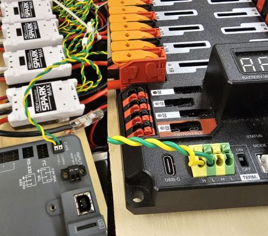

.. include:: <isonum.txt>

# Introduction to FRC Robot Wiring

.. note::

   This document details the wiring of a basic electronics board for the Kitbot using components provided in recent Kit of Parts. For a more general reference to wiring which includes other components, see :ref:`docs/zero-to-robot/step-1/basic-robot-wiring:Introduction to FRC Robot Wiring`

## Overview

.. figure:: /docs/controls-overviews/images/frc-control-system-layout-rev.svg
  :alt: Detailed diagram of all of the components and how they are connected.
  :width: 600

Diagram courtesy of FRC\ |reg| Team 3161 and Stefen Acepcion.

## Gather Materials

Locate the following control system components and tools

- Kit Materials:

  - Power Distribution Hub (:term:`PDH`)
  - roboRIO
  - Vivid Hosting VH-109 radio (may be already installed on Kitbot)
  - Robot Signal Light (:term:`RSL`) (may be already installed on Kitbot)
  - 5x SPARK MAX
  - 120A Circuit breaker
  - 4x 40A Circuit breaker
  - 1x 30A Circuit breaker
  - 6 AWG (16 :math:`mm^2`) Red wire
  - 18 AWG (1 :math:`mm^2`) Red/Black wire
  - (Optional) REV PoE Injector cable or similar
  - 12 Wago 221 inline splicing connector with lever
  - 2x Anderson SB50 battery connectors
  - 6 AWG (16 :math:`mm^2`) Terminal lugs
  - 12V Battery
  - Red/Black Electrical tape
  - Dual Lock material or fasteners
  - Zip ties
  - 1/2" or 3/4" (12-19 mm) plywood

- Tools Required:

  - Very small flat head screwdriver (eyeglass repair size)
  - Wire cutters, wire stripper (6, 10, 18, 22 AWGs), and terminal crimper (6AWG terminal) or vice
  - 7/16" (11 mm may work if imperial is unavailable) box end wrench or nut driver
  - Additional 7/16" wrench/nut driver or Philips head screw driver
  - Scissors
  - Drill with 1/4" (6mm) bit

## Create the Base for the Control System

The instructions below heavily rely on the wiring pre-attached to components. The layout provided is designed around using a pair of matching 19.75 in x 6.5 in. (500mm x 165mm) boards which mount to the top of the inner rails of the AM14U chassis. Teams are welcome to modify this design and layout but note that additional connectors and wire may be required.

## Layout the Core Control System Components

Lay out the components on the board. An example layout is shown in the image above. If you are wiring the boards before installing on the Kitbot, note that the boards should be spaced approximately 4 in. apart (~100mm). The radio and RSL will be mounted directly to the Kitbot superstructure. The instructions below recommend wiring the SPARK MAX controllers before securing components to the board. This will insure that the pre-attached wiring reaches each component as needed, but will make securing the components a little trickier.

.. tip:: The layout and subsequent images show 6 Spark MAX controllers. The Kitbot design only utilizes 5 controllers, you can wire the extra controller to facilitate future additions or omit it.

## Motor Controller Power

Requires: Wire Stripper

Connect each motor controller's input power (red/black side with no white) to the PDHs high current output channels.

.. collapse:: Details

  1. Strip approximately 1/2 in. (~12mm) of insulation off the red and black power input wires for one SPARK MAX. While the SPARK MAX wire is 12 AWG, because it is high strand count, the 10 AWG size on your wire strippers may work better.
  #. Lift both levers on the PDH for one high current channel until they latch open (the red and black terminals for one channel are indicated by the white label across them below and behind the terminals).
  #. Carefully insert the stripped wire all the way into the terminals and press the latches back down to secure the wires.
  #. Repeat for each controller. You likely want to skip some channels to account for the width of the controllers.

  .. tip:: If the wire end has become a bit messy and is hard to insert cleanly, a small twist (~ 1/2 a turn) may help. Do not heavily twist the wire, this prevents the terminal inside the PDH from making solid contact with the wire.

## Fasten Components

Requires: Recloseable fastener, scissors, drill with bit

Cable ties plus reclosable fastener make a great pair for securing robot electronics. The cable ties help hold the components down while the recloseable fastener helps hold them in place. The instructions below describe securing your electronics with this method, though you may choose to use hardware (nuts and bolts) to secure components instead.

.. collapse:: Details

  1. Secure each item down with recloseable fastener. One easy way to do this is to secure the two sides of the fastener together, peel one backing, secure the fastener(s) to the component, then peel the other backing and carefully press the component into place on the board. To ensure you have enough fastener for both electronics and the protective panels, some recommended lengths are provided below:

     - SPARK MAX: 2x 1 in. pieces each
     - roboRIO: 4x 1 in. pieces
     - PDH: 3x 2 in. pieces (or 4x 1 in.)
     - 120A Breaker: 2x 2 in. pieces

  2. Mark hole locations for drilling ziptie holes

     - SPARK MAX: 2x holes centered between each SPARK MAX (1 aligned with each ziptie notch) plus 2x just outside each outer controller. 2 cable ties will pass through each hole.
     - PDH: 1 hole directly underneath each device mounting hole (4x total), 1 holes just outside the device footprint near each mounting hole (4x total)
     - roboRIO: 1 hole directly underneath each ziptie notch (4x total), 1 hole just outside the device footprint near each mounting hole (4x total)
     - 120A breaker: 1 hole directly underneath each device mounting hole (2x total), 1 hole just outside the device footprint near each mounting hole (2x total)

  3. Remove components and drill holes. Using a "rocking" or "peeling" motion can often help remove components from recloseable fastener without removing the fastener adhesive.
  #. Place the components back down on the boards. You may wish to wait to actually secure components with cable ties until wiring is complete. Some cable ties may be able to double as wire management.

## CAN Bus connections - SPARK MAXes

Requires: SPARK MAX CAN Cables and Cable retention clips (found in SPARK MAX boxes)

The SPARK MAX controllers and PDH will communicate with the roboRIO over CAN. Connect the SPARK MAX CAN cables in a chain, skipping the 2nd controller and coming back to it, as shown by the red arrows.

.. collapse:: Details

  1. Starting with the roboRIO, insert a SPARK MAX CAN Cable into the first and **third** SPARK MAX. In order for the included wires to reach, we'll skip the second SPARK MAX for now.
  #. Take either end of the cable from the 1st SPARK MAX and connect to the matching cable from the 3rd SPARK MAX.
  #. Secure the connection by placing a Cable retention clip over the joined connectors.
  #. Insert a CAN Cable into the 4th SPARK MAX. Using the remaining end from the 3rd SPARK MAX, connect to the 4th SPARK MAX and secure with a retention clip.
  #. Continue down the line until the 5th (6th if wiring the extra controller) SPARK MAX is connected to the chain.
  #. Insert a CAN Cable into the 2nd SPARK MAX. Connect the last SPARK MAX in the chain to the 2nd SPARK MAX and secure with a clip.
  #. You should now have a chain that connects all the SPARK MAX controllers together with a free end connected to each of the 2 SPARK MAXes closest to the roboRIO.
  #. You may want to use cable ties to organize the extra CAN wire before moving on.

## CAN Bus connections - PDH and roboRIO

Requires: Wire cutters, wire stripper (22 AWG)

Connect one free end of the CAN bus chain to the PDH and the other to the roboRIO.

.. collapse:: Details

  1. Locate the free end of the CAN cable connected to the SPARK MAX closest to the roboRIO. Cut off the connector and strip 5/16 in. (~8 mm) of both the yellow and green wire.
  #. Insert each wire into the corresponding terminal on the roboRIO by holding down the white button with a fingernail or screw driver while inserting the wire. Give the wire a sharp tug to ensure it has been inserted properly.
  #. Locate the remaining free end of the CAN chain (attached to the 2nd SPARK MAX from the roboRIO). Cut off the connector and strip 3/8 in. (~9 mm) of both the yellow and green wire.
  #. Insert each wire into either matching colored terminal of the PDH by either depressing the button or opening the latch (depending on PDH version).
  #. Ensure the PDH CAN termination switch (labeled "TERM" and located next to the CAN terminals) is set to ON. If not, adjust with a small screw driver.

## Attach Robot Side Battery Connector

Requires: Battery Connector, 1x 6 AWG (16 :math:`mm^2`) terminal lugs, 7/16" (11 mm) Box end

Attach the red wire from the battery connector to the main breaker using a terminal lug and attach the black side to the power input of the PDH.

.. collapse:: Details

  1. Attach terminal lug to positive (red) wire of battery connector. Strip .75" off the black wire.
  #. Lift the lever above the black main power input terminal on the PDH until it clicks into place. Insert the wire. Pull the lever down to secure the wire.
  #. Using a 7/16" (11 mm) box end wrench, remove the nut on the "Batt" side of the main breaker and secure the positive terminal of the battery connector

## Wire Breaker to Power Distribution

Requires: 6 AWG (16 :math:`mm^2`) red wire, 1x 6 AWG (16 :math:`mm^2`) terminal lugs, 7/16" (11 mm) wrench

Connect 6AWG wire between the second terminal of the 120A circuit breaker and the red power input of the PDH

.. collapse:: Details

  1. Secure one terminal lug to the end of the 6 AWG (16 :math:`mm^2`) red wire.
  #. Using the 7/16" (11 mm) wrench, remove the nut from the "AUX" side of the 120A main breaker and place the terminal over the stud.
  #. Loosely secure the nut (you may wish to remove it shortly to cut and strip the other end of the wire). Measure out the length of wire required to reach the positive terminal of the PDH.
  #. Cut and strip the other end of the red wire.
  #. Using the 7/16" (11 mm) wrench, secure the wire to the "AUX" side of the 120A main breaker.
  #. Lift the lever on the positive (red) input terminal of the PDH, insert the wire, then close the terminal.

## Insulate power connections

Requires: Electrical tape

Using electrical tape, insulate the two connections to the 120A breaker.

## roboRIO Power

Requires: 10A mini fuse, Wire stripper, very small flat screwdriver, 18 AWG (1 :math:`mm^2`) Red and Black

Using 18AWG wire, connect a non-switchable fused channel of the PDH (20-22) with a 10A fuse to the power connector of the roboRIO

.. collapse:: Details

  1. Insert the 10A fuse into the PDH in one of the non-switchable fused channels (20-22).
  #. Strip ~5/16" (~8 mm) on both the red and black 18 AWG (1 :math:`mm^2`) wire and connect to the corresponding terminals on the PDH channel where the fuse was installed
  #. Measure the required length to reach the power input on the roboRIO. Take care to leave enough length to route the wires around any other components such as the battery and to allow for any strain relief or cable management.
  #. Cut and strip the wire.
  #. Using a very small flat screwdriver connect the wires to the power input connector of the roboRIO (red to V, black to C). Also make sure that the power connector is screwed down securely to the roboRIO.

## Pause

If you are preparing the wiring outside the robot, pause at this point. The remaining wiring must be completed after the boards are installed on the robot.

## Radio Power

Requires: Wire stripper, small flat screwdriver (optional), 18 AWG (1 :math:`mm^2`) red and black wire:

Using 18AWG wire, connect a non-switchable fused channel (20-22) with a 10A fuse to the power input of the VH-109 radio.

.. collapse:: Details

  1. Insert the 10A fuse into the PDH in one of the non-switchable fused channels (20-22).
  #. Strip ~5/16" (~8 mm) on the end of the red and black 18 AWG (1 :math:`mm^2`) wire and connect the wire to the corresponding terminals on the PDH.
  #. Measure the length required to reach the power input terminals on the VH-109 radio. Take care to leave enough length to route the wires along the robot (not just dangling in the air) and to allow for any strain relief or cable management.
  #. Cut and strip ~5/16" (~8 mm) from the end of the wire.
  #. Use a finger or small screw driver to hold down the button on each VH-109 power input terminal while inserting the corresponding wire.

## Ethernet Cables

Requires: 1x Ethernet cable, (Optional) 1x REV PoE injector or similar

Connect an Ethernet cable from the RJ45 (Ethernet) socket of the roboRIO to the socket of the REV PoE injector. Either remove or individually insulate the red and black power wires of the injector (the injector is not long enough to reach the PDH with the KitBot wiring layout). Connect the plug end of the REV PoE injector into the port on the VH-109 labeled RIO.

.. collapse:: Alternative

    .. image:: images/how-to-wire-a-simple-robot/radio-ethernet-kitbot-alt.jpg
        :alt: Picture of the KitBot showing radio ethernet cable plugged into VH-109 AUX port.

    Connect an Ethernet cable from the RJ45 (Ethernet) socket of the roboRIO to the port on the VH-109 radio labeled AUX2. The corresponding DIP switch on the radio must be in the off (default) position.

## Robot Signal Light

.. image:: images/how-to-wire-a-simple-robot/rsl.jpg
  :alt: Robot Signal Light (rsl) wiring from roboRIO to RSL

Requires: Wire stripper, 2 pin cable with Molex jacket from Molex box, Robot Signal Light, 18 AWG (1 :math:`mm^2`) red wire, very small flat screwdriver

Using the 2 Pin Molex cable, connect the roboRIO RSL port to 2 terminals of the RSL (black wire in the middle) and using 18AWG red wire, jumper the outside two ports together.

.. collapse:: Details

  1. Using a small flat screwdriver, ensure the terminals of the RSL wiring connector are open.
  #. Take the loose end of the 2 pin cable (or cut off one connector if both ends have connectors) and Insert the black wire into the center, "N" terminal and tighten the terminal.
  #. Strip the 18 AWG (1 :math:`mm^2`) red wire and insert into the "La" terminal and tighten the terminal.
  #. Cut and strip the other end of the 18 AWG (1 :math:`mm^2`) wire to insert into the "Lb" terminal
  #. Insert the red wire from the two pin cable into the "Lb" terminal with the 18 AWG (1 :math:`mm^2`) red wire and tighten the terminal.
  #. Connect the two-pin connector to the RSL port on the roboRIO. The black wire should be closest to the outside of the roboRIO.

## Circuit Breakers

Requires: 6x 40A circuit breakers

Insert 40-amp Circuit Breakers into the positions on the PDH corresponding with the Wago connectors the motor controllers are connected to. Note that the white graphic indicates which breakers are associated with which terminal pairs.

## Motor Power

Requires: Wire stripper, 12x Wago 221 terminals, 12AWG wire

For each motor, use the Wago 221 terminals to connect the output of the motor controller to the motor. Note that for the roller motor, an additional intermediate connection is recommended in order to have the necessary length to route the wire safely along robot elements.

.. collapse:: Details

  1. Using the print on the side of the 221 connector (upper left image) as a guide, strip 11mm from the end of one wire.
  #. Lift the orange lever fo the 221 connector until it latches up, then insert the wire fully into the terminal. Flip the lever back down.
  #. Using the inspection window on the bottom of the connector, check that the wire is fully inserted by verifying the wire is visible beyond the metal funnel of the terminal.
  #. Repeat this process to connect each drivetrain CIM motor to a motor controller output, red-to-red, black-to-black.
  #. For the roller motor, it is recommend to use 12AWG wire as an extension. Attach 12AWG wire to the motor wires, then run the wire along robot components until you reach the motor contoller. Cut and strip the 12AWG extension wire and secure to the motor controller output.

## STOP

.. danger:: Before plugging in the battery, make sure all connections have been made with the proper polarity. Ideally have someone that did not wire the robot check to make sure all connections are correct.

- Start with the battery and verify that the red wire is connected to the positive terminal
- Check that the red wire passes through the main breaker and to the + terminal of the PDP and that the black wire travels directly to the - terminal.
- For each motor controller, verify that the red wire goes from the red PDP terminal to the V+ terminal on the motor controller (not M+!!!!)
- For each non-motor controller device, verify that the red wire runs from a red terminal on the PD and connects to a red terminal or terminal labeled + or V on the component.

.. tip:: It is also recommended to put the robot on blocks so the wheels are off the ground before proceeding. This will prevent any unexpected movement from becoming dangerous.

## Manage Wires

Requires: Zip ties

.. tip:: Now may be a good time to add a few zip ties to manage some of the wires before proceeding. This will help keep the robot wiring neat and protected. Secure wires to robot components to make them less likely to be caught and pulled by other robots, or when performing robot maintenance. Make sure wires are not pulled too tight (don't put any strain on connection points) and that they do not have enough slack to reach moving components (such as drivetrain belts) while the robot is operating.

## Connect Battery

Connect the battery to the robot side of the Anderson connector. Power on the robot by moving the lever on the top of the 120A main breaker into the ridge on the top of the housing.

If stuff blinks, you probably did it right. If you hear any clicking, or see any smoke, power the system off immediately, clicking is likely the sound of circuit breakers tripping.

Before moving on, if using SPARK MAX controllers, there is one more configuration step to complete. The SPARK MAX motor controllers are configured to control a brushless motor by default. You can verify this by checking that the light on the controller is blinking either cyan or magenta (indicating brushless brake or brushless coast respectively). To change to brushed mode, press and hold the mode button for 3-4 seconds until the status LED changes color. The LED should change to either blue or yellow, indicating that the controller is in brushed mode (brake or coast respectively). To change the brake or coast mode, which controls how quickly the motor slows down when a neutral signal is applied, press the mode button briefly.

.. tip:: For more information on the SPARK MAX motor controllers, including how to test your motors/controllers without writing any code by using the REV Hardware Client, see the [SPARK MAX Quickstart guide](https://docs.revrobotics.com/brushless/spark-max/gs).

From here, you should continue on to install software and configure your radio and roboRIO, then load up the provided KitBot code.

