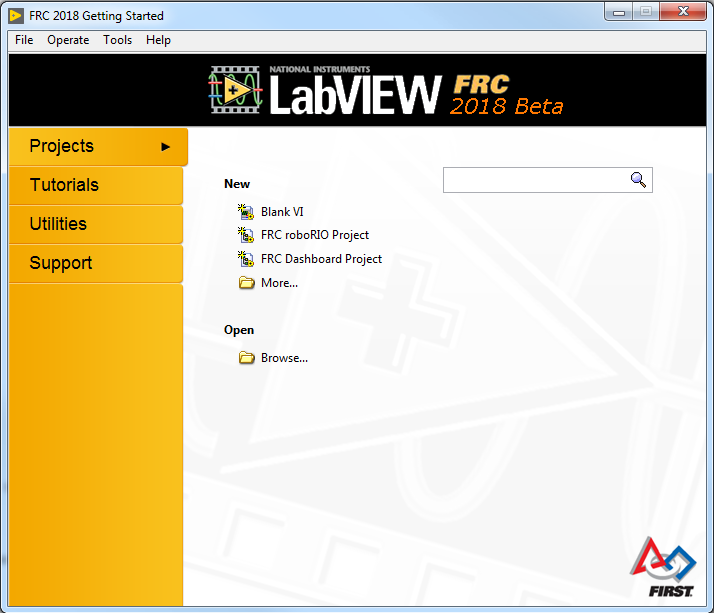
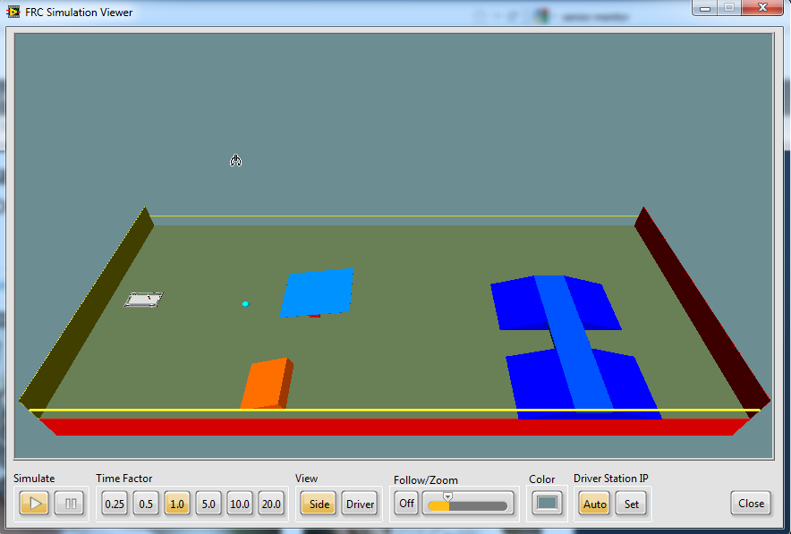
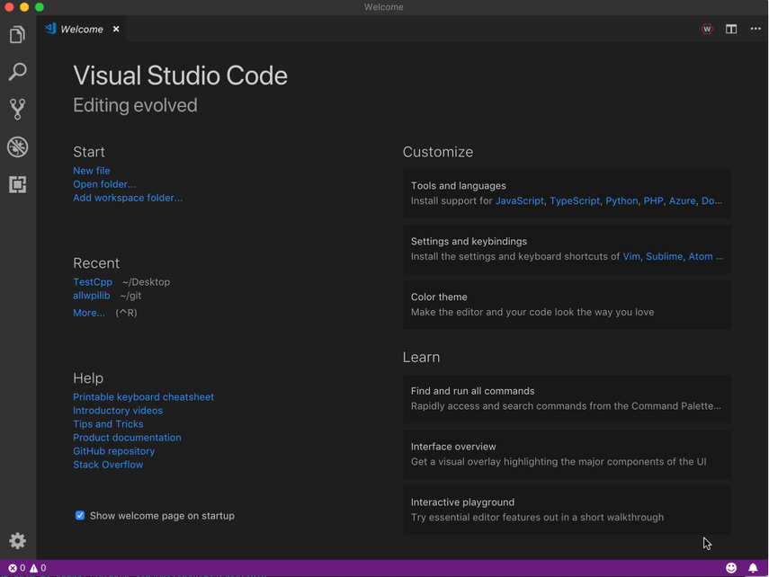
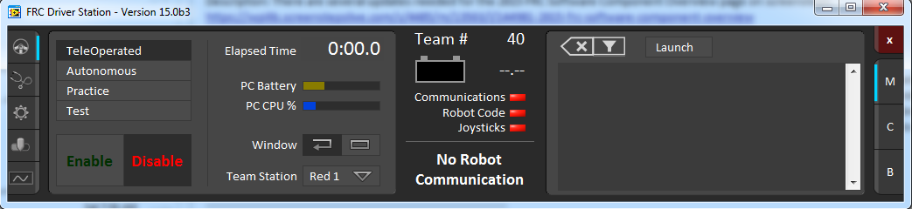
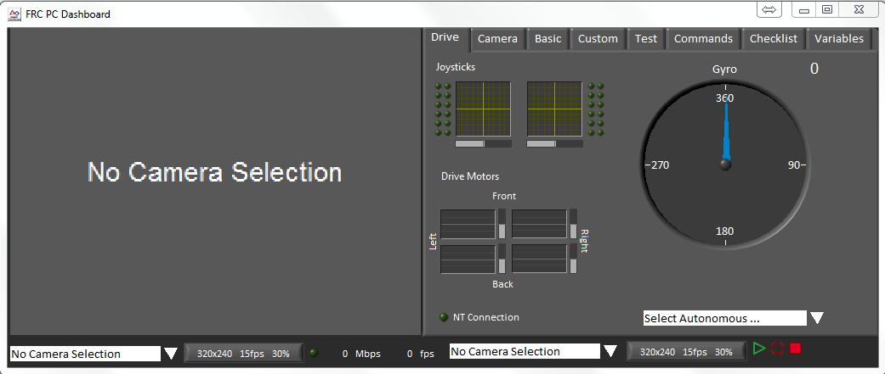
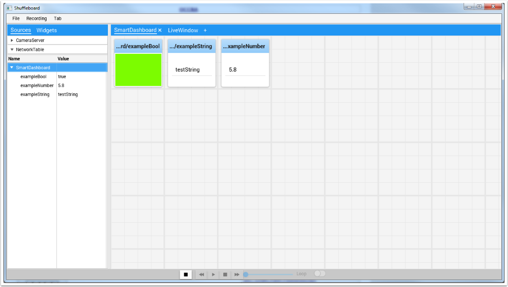
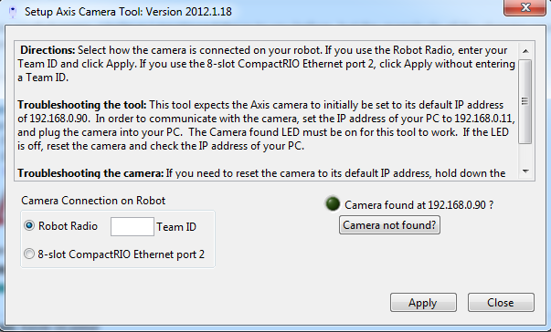
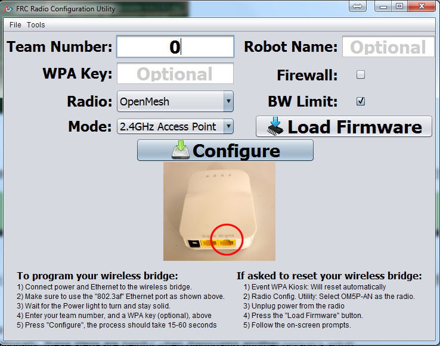

FRC Software Component Overview
===============================

The FRC control system consists of a wide variety of mandatory and optional software components. These elements are designed to assist you in the design, development, and debugging of your robot code as well as assist with control robot operation and to provide feedback when troubleshooting. For each software component this document will provide a brief overview of its purpose, a link to the package download, if appropriate, and a link to further documentation where available.

Operating System Compatibility
------------------------------

The primary supported OS for FRC components is Windows. All required FRC software components have been tested on Windows 7, 8, and 10. Windows XP is not supported.

Having said that, many of the tools for C++/Java programming are also supported and tested on macOS and Linux. Teams programming in C++/Java should be able to develop using these systems, using a Windows system for the Windows-only operations such as Driver Station, radio programming, and roboRIO imaging.

LabVIEW FRC (Windows Only)
--------------------------

LabVIEW FRC, based on National Instruments’ LabVIEW 2019, is the development environment for LabVIEW, one of the three officially supported languages for programming an FRC robot. LabVIEW is a graphical, dataflow-driven language. LabVIEW programs consist of a collection of icons, called VIs, wired together with wires which pass data between the VIs. The LabVIEW FRC installer is distributed on a DVD found in the Kickoff Kit of Parts and is also available for download (see installation instructions page linked below). Instructions for installing the FRC libraries (package also includes Driver Station and Utilities) can be found :ref:`here <docs/getting-started/getting-started-frc-control-system/frc-game-tools:Installing the FRC Game Tools>`. A guide to getting started with the LabVIEW FRC software, including installation instructions can be found :ref:`here <docs/getting-started/getting-started-frc-control-system/labview-setup:Installing LabVIEW for FRC (LabVIEW only)>`.

FRC Robot Simulator (Windows Only)
^^^^^^^^^^^^^^^^^^^^^^^^^^^^^^^^^^

The FRC Robot Simulator is a component of the LabVIEW programming environment that allows you to operate a predefined robot in a simulated environment to test code and/or Driver Station functions. It utilizes a LabVIEW code project as the robot code and communicates with the FRC Driver Station for robot control and the FRC Default Dashboard for robot feedback. The FRC Robot Simulator is installed with the LabVIEW FRC package. Information on using the FRC Robot Simulator can be found by opening the Robot Simulation Readme.html file in the LabVIEW Project Explorer.

Visual Studio Code
------------------

Visual Studio Code is the supported development environment for C++ and Java, two of the three supported languages used for programming an FRC robot. Both are object-oriented text based programming languages. A program in C++ (for FRC) consists of a number of header (.h) and implementation (.cpp) files where as a program in Java consists of .java files contained in one or more packages. A guide to getting started with C++ for FRC, including the installation and configuration of Visual Studio Code can be found :doc:`here <offline-installation-preparations>`.

FRC Driver Station Powered by NI LabVIEW (Windows Only)
-------------------------------------------------------

The FRC Driver Station Powered by NI LabVIEW is the only software allowed to be used for the purpose of controlling the state of the robot during competition. This software contains the code necessary to send data to your robot from a variety of input devices such as joysticks, gamepads, and customizable IO boards. It also contains a number of tools used to help troubleshoot robot issues such as status indicators and log file creation. Instructions for installing the FRC Driver Station Powered by NI LabVIEW (included in the FRC Game Tools can be found :ref:`here <docs/getting-started/getting-started-frc-control-system/frc-game-tools:Installing the FRC Game Tools>`. More information about the FRC Driver Station Powered by NI LabVIEW can be found :ref:`here <docs/software/driverstation/driver-station:FRC Driver Station Powered by NI LabVIEW>`.

FRC LabVIEW Dashboard (Windows Only)
------------------------------------

.. todo:: port article, see https://github.com/wpilibsuite/frc-docs/issues/118

The FRC LabVIEW Dashboard is the default dashboard program installed with, and automatically launched by, the FRC Driver Station. The purpose of the Dashboard is to provide feedback about the operation of the robot. The FRC Default Dashboard serves as a an example of the types of feedback teams may want from their robot. It includes a tabbed display that can switch between viewing an image from a camera on the robot or a display of NetworkTables variables, a display of information regarding the joysticks and drive motors, an indicator of the robot IP and battery voltage, and a second tabbed display that can switch between examples of custom indicators and controls, a test tab for use with the Driver Station Test Mode and a Checklist tab that teams can use to enter a custom checklist to complete before each match. The FRC Default Dashboard is included in the FRC Game Tools. Installation instructions can be found :ref:`here <docs/getting-started/getting-started-frc-control-system/frc-game-tools:Installing the FRC Game Tools>`. More information about the FRC Default Dashboard software can be found here.

SmartDashboard
--------------

.. image:: images/control-system-software/smartdashboard.png

SmartDashboard is an alternate dashboard application written in Java. SmartDashboard automatically creates a widget for each variable sent from the Robot sent using the SmartDashboard class or VIs. These widgets can be configured to a number of preset display types, or users can create custom extensions in Java. Vision extensions are available for the SmartDashboard which allow it to display images from the Axis camera on the robot. SmartDashboard is included in the C++ and Java language updates (enabled by clicking the C++ or Java buttons respectively on the Setup tab of the Driver Station). Additional documentation on SmartDashboard can be found :ref:`here <docs/software/wpilib-tools/smartdashboard/index:SmartDashboard>`.

LiveWindow
^^^^^^^^^^

.. image:: images/control-system-software/livewindow-smartdashboard.png

LiveWindow is a mode of SmartDashboard , designed for use with the Test Mode of the Driver Station. LiveWindow allows the user to see feedback from sensors on the robot and control actuators independent of the written user code. More information about LiveWindow can be found :ref:`here <docs/software/wpilib-tools/smartdashboard/test-mode-and-live-window/index:SmartDashboard: Test Mode and Live Window>`.

Shuffleboard
------------

Shuffleboard is an alternative dashboard application written in Java. It takes many of the concepts from SmartDashboard such as automatic adding of widgets and adds new features including better layout control and record/playback functionality. Shuffleboard contains all of the basic widget types found in the SmartDashboard as well as a number of new ones intended to make visualizing specific robot components even easier. It has full integration with WPILib’s “cscore” for displaying, recording, and playing back camera streams. Shuffleboard is included in the C++ and Java language updates (enabled by selecting Shuffleboard from the dashboard type on the Setup tab of the Driver Station or by launching it from the WPILib start tool menu in Visual Studio Code). Additional documentation on Shuffleboard can be found :ref:`here <docs/software/wpilib-tools/shuffleboard/index:Shuffleboard>`.

FRC roboRIO Imaging Tool (Windows Only)
---------------------------------------

.. image:: images/imaging-your-roborio/roborio-imaging-tool.png

The FRC roboRIO Imaging Tool is a software tool used to format and setup an roboRIO-FRC device for use in FRC. The tool detects any roboRIO device on the network, reports the current MAC, name, IP and Image version. The tool allows the user to configure the team number, set options including Console Out and whether an applications runs on Startup, and install the latest software image on the device. The FRC roboRIO Imaging Tool is installed as part of the FRC Game Tools. Installation instructions can be found :ref:`here <docs/getting-started/getting-started-frc-control-system/frc-game-tools:Installing the FRC Game Tools>`. Additional instructions on imaging your roboRIO using this tool can be found :doc:`here <imaging-your-roborio>`.

Setup Axis Camera (Windows Only)
--------------------------------

The Setup Axis Camera utility is a LabVIEW program used to configure an Axis 206, M1011 or M1013 camera for use on the robot. The tool takes a factory reset camera connected directly to the computer and configures the IP, username and password, anonymous access, and default framerate and compression (for use with the SmartDashboard or other access methods). The Setup Axis Camera tool is installed as part of the FRC Game Tools. Installation instructions can be found :ref:`here <docs/getting-started/getting-started-frc-control-system/frc-game-tools:Installing the FRC Game Tools>`. Instructions for using the tool to configure the camera are located :ref:`here <docs/software/vision-processing/introduction/configuring-an-axis-camera:Configuring an Axis Camera>`.

FRC Driver Station Log Viewer (Windows Only)
--------------------------------------------

.. image:: images/control-system-software/frc-log-viewer.png

The FRC Driver Station Log Viewer is a LabVIEW program used to view logs created by the FRC Driver Station. These logs contain information such as battery voltage, trip time, CPU% and robot mode, as well as events such as joystick removal. The FRC Driver Station Log Viewer is included in the FRC Game Tools. Installation instructions can be found :ref:`here <docs/getting-started/getting-started-frc-control-system/frc-game-tools:Installing the FRC Game Tools>`. More information about the FRC Driver Station Log Viewer and understanding the logs can be found :ref:`here <docs/software/driverstation/driver-station-log-viewer:Driver Station Log File Viewer>`

RobotBuilder
------------

.. image:: images/control-system-software/robot-builder.png

RobotBuilder is a tool designed to aid in setup and structuring of a Command Based robot project for C++ or Java. RobotBuilder allows you to enter in the various components of your robot subsystems and operator interface and define what your commands are in a graphical tree structure. RobotBuilder will then verify that you have no port allocation conflicts and can generate a wiring table indicating what is connected to each port as well as C++ or Java code. The code created generates the appropriate files, constructs the appropriate objects and adds LiveWindow code for each sensor and actuator, but does not write any of the actual Subsystem or Command methods. The user must write the appropriate code for these methods for the robot to function. More information about RobotBuilder can be found :ref:`here <docs/software/wpilib-tools/robotbuilder/index:RobotBuilder>`. More information about the Command Based programming architecture can be found :ref:`here <docs/software/commandbased/index:Command-Based Programming>`.

OutlineViewer
-------------

.. image:: images/control-system-software/outline-viewer.png

OutlineViewer is a utility used to view, modify and add to the contents of the NetworkTables for debugging purposes. It displays all key value pairs currently in the NetworkTables and can be used to modify the value of existing keys or add new keys to the table. OutlineViewer is included in the C++ and Java language updates (found in ``\tools\wpilib``. Teams may need to install the Java Runtime Environment to use the OutlineViewer on computers not set up for Java programming.

To connect to your robot, open OutlineViewer and set the “Server Location” to be your team number. After you click start, OutlineViewer will connect.

LabVIEW teams can use the Variables tab of the LabVIEW Dashboard to accomplish this functionality.

FRC Radio Configuration Utility (Windows Only)
----------------------------------------------

The FRC Radio Configuration Utility is a tool used to configure the the OpenMesh OM5P-AN or OM5P-AC radio for practice use at home. This tool sets the appropriate IP, and network settings for proper network connection, as well as the QOS settings required to mimic the bandwidth limiting and packet prioritization experience on the FRC playing field. The FRC Radio Configuration Utility is installed by a standalone installer, instructions on installing and using the FRC Radio Configuration Utility to configure your radio can be found :ref:`here <docs/getting-started/getting-started-frc-control-system/radio-programming:Programming your Radio>`.
