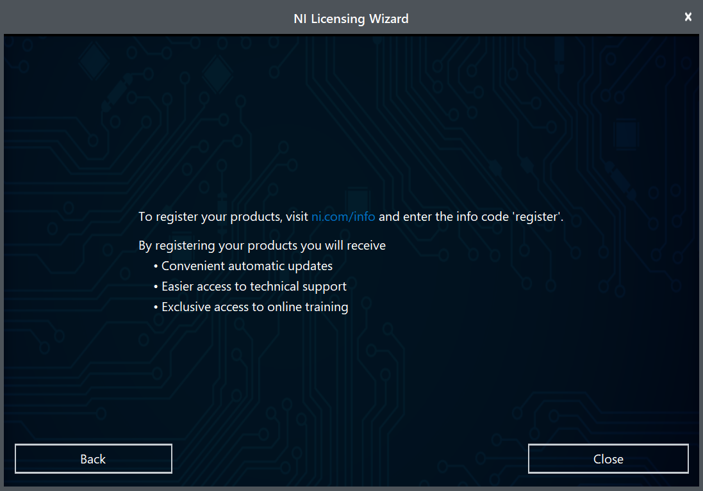

.. include:: <isonum.txt>

Installing the FRC Game Tools
=============================

The FRC Game Tools contains the following software components:
LabVIEW Update, FRC Driver Station, and FRC Utilities. The
LabVIEW runtime components required for the Driver Station and
Utilities are included in this package. **No components from the
LabVIEW Software for FRC package are required for running either the Driver
Station or Utilities.**

.. note:: The Driver Station will only work on Windows 7, Windows 8,\
 Windows 8.1, and Windows 10. It will not work on Windows XP.

Uninstall Old Versions (Recommended)
------------------------------------

.. Warning:: LabVIEW teams have already completed this step, do not repeat it.

.. Note:: It is only necessary to uninstall previous versions when installing a new year's tools. For example, uninstall the 2019 tools before installing the 2020 tools. It is not necessary to uninstall before upgrading to a new update of the 2020 game tools.

Before installing the new version of the FRC Game Tools it is recommended to remove any old versions. The new version will likely co-exist with the old version (note that the DS will overwrite old versions), but all testing has been done with FRC 2020 only.  Then click Start >> Add or Remove Programs. Locate the entry labeled "National Instruments Software", and select Uninstall.

.. image:: images/labview/uninstall_old_control_panel.png

Select Components to Uninstall
^^^^^^^^^^^^^^^^^^^^^^^^^^^^^^

In the dialog box that appears, select all entries. The easiest way to do this is to de-select the "Products Only" check-box and select the check-box to the left of "Name". Click Remove. Wait for the uninstaller to complete and reboot if prompted.

.. image:: images/labview/uninstall_select_components.png

Downloading the Update
----------------------

Download the update from
https://www.ni.com/en-us/support/downloads/drivers/download.frc-game-tools.html

.. image:: images/labview/offline-installer.png

If you wish to install on other machines offline, do not click the Download button, click **Individual Offline Installers** and then click Download, to download the full installer.

.NET Framework 4.6.2
--------------------

The Game Tools installer may prompt that .NET Framework 4.6.2 needs to be
updated or installed. Follow prompts on-screen to complete the
installation, including rebooting if requested. Then resume the
installation of the FRC Game Tools, restarting the installer if
necessary.

Welcome
-------

Starting Install
^^^^^^^^^^^^^^^^

.. tabs::
  .. tab:: Online Installer

     Run the downloaded exe file to start the install process. Click “Yes” if a Windows Security prompt

  .. tab:: Offline Installer (Windows 10)

     Right click on the downloaded iso file and select mount. Run install.exe from the mounted iso. Click “Yes” if a Windows Security prompt

     .. image:: images/labview/mount-iso.png

     .. note:: other installed programs may associate with iso files and the mount option may not appear. If that software does not give the option to mount or extract the iso file, then follow the directions in the "Offline Installer (Windows 7, 8, & 8.1)" tab.

  .. tab:: Offline Installer (Windows 7, 8, & 8.1)

     Install 7-Zip (download `here <https://www.7-zip.org>`__). As of the writing of this document, the current released version is 19.00 (2019-02-21).
     Right click on the downloaded iso file and select Extract to.

     .. image:: images/labview/extract-iso.png

     Run install.exe from the extracted folder. Click “Yes” if a Windows Security prompt Click “Yes” if a Windows Security prompt appears.

NI Package Manager License
--------------------------

.. image:: images/labview/ni-package-license.png

If you see this screen, click "Next"

Disable Windows Fast Startup
----------------------------

.. image:: images/labview/labview_fast_startup.png

If you see this screen, click "Next"

NI Package Manager Review
-------------------------

.. image:: images/labview/labview_package_manager_review.png

If you see this screen, click "Next"

NI Package Manager Installation
-------------------------------

.. image:: images/labview/ni-package-install.png

Installation progress of the NI Package Manager will be tracked in this window

Product List
------------

Additional Software
-------------------

|Additional Software|

If you see this screen, click "Next"

License Agreements
------------------

|License Agreements|

Select “I accept…” then click “Next”

License Agreements Page 2
-------------------------

|License Agreements Page 2|

If you see this screen, select “I accept…” then click “Next”

Review Summary
----------------

.. figure:: images/update-suite/review-summary.png
   :alt: Review Summary

Click Next

Detail Progress
---------------

.. figure:: images/update-suite/detail-progress.png
   :alt: Detail Progress

   Detail Progress

Installation Summary
--------------------

|Installation Summary|

click Close

NI Activation Wizard
--------------------

|NI Activation Wizard|

Log into your ni.com account. If you don’t have
an account, select ‘Create account’ to create a free account.

NI Activation Wizard (2)
------------------------

|NI Activation Wizard 2|

Enter the serial number. Click “Activate”. Note: If this is the first time
activating this year's software on this account, you will see the message
shown above about a valid license not being found. You can ignore this.

NI Activation Wizard (3)
------------------------

|NI Activation Wizard 3|

If your products activate successfully, an
“Activation Successful” message will appear. If the serial number was
incorrect, it will give you a text box and you can re-enter the number
and select “Try Again”. If everything activated successfully, click
“Next”.

NI Activation Wizard (4)
------------------------

|NI Activation Wizard 4|

Click “Close”.

NI Update Service
-----------------

.. image:: images/labview/ni_update_enable.png

You will be prompted whether to enable the NI update service. You can choose to not enable the update service.

Reboot to Complete Installation
-------------------------------

.. image:: images/labview/labview_restart.png

If prompted, Select "Reboot Now" after closing any open programs.

.. |Additional Software| image:: images/update-suite/additional-software.png
.. |Product List| image:: images/update-suite/product-list.png
.. |Product Information| image:: images/update-suite/product-information.png
.. |License Agreements| image:: images/update-suite/license-agreements.png
.. |License Agreements Page 2| image:: images/labview/labview_license_2.png
.. |Installation Summary| image:: images/update-suite/installation-summary.png
.. |NI Activation Wizard| image:: images/update-suite/ni-activation-wizard.png
.. |NI Activation Wizard 2| image:: images/update-suite/ni-activation-wizard-2.png
.. |NI Activation Wizard 3| image:: images/update-suite/ni-activation-wizard-3.png

