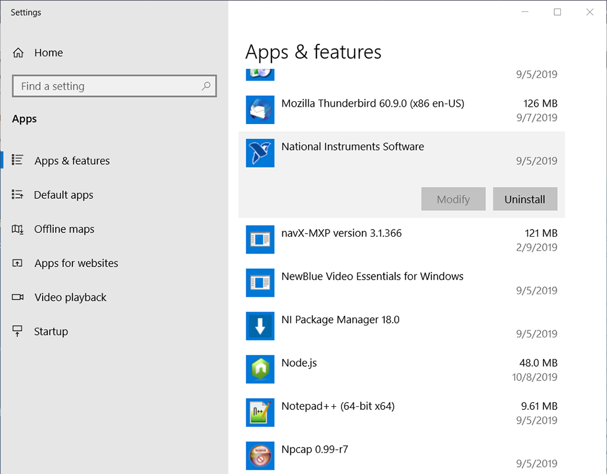
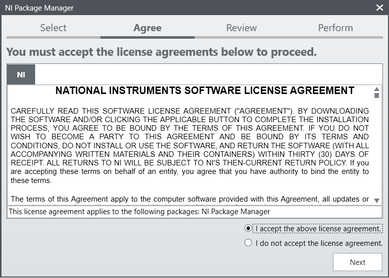
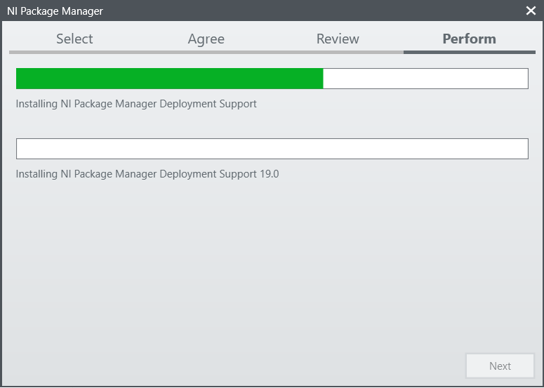
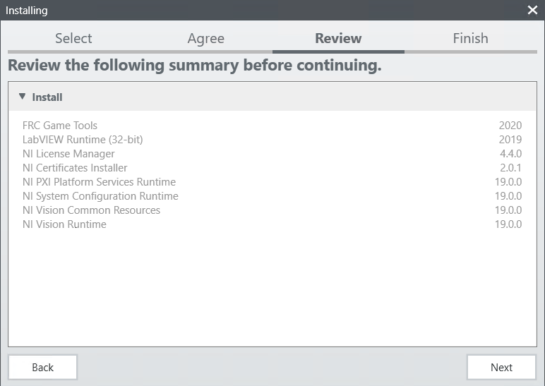
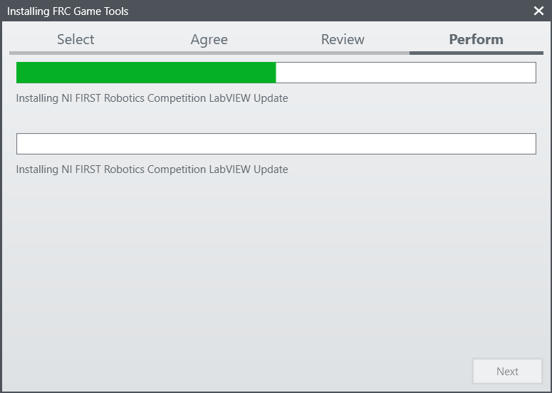
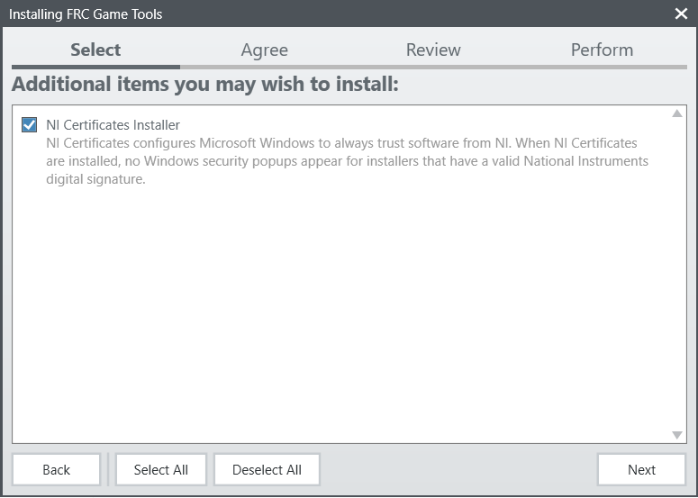
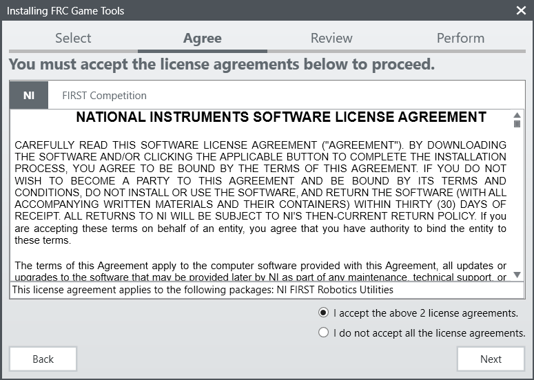
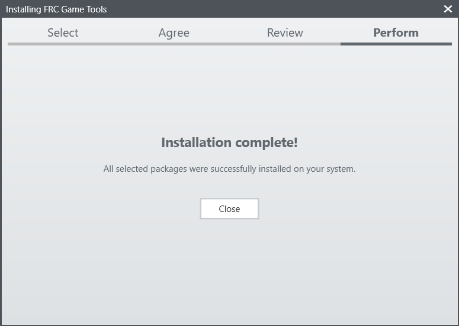
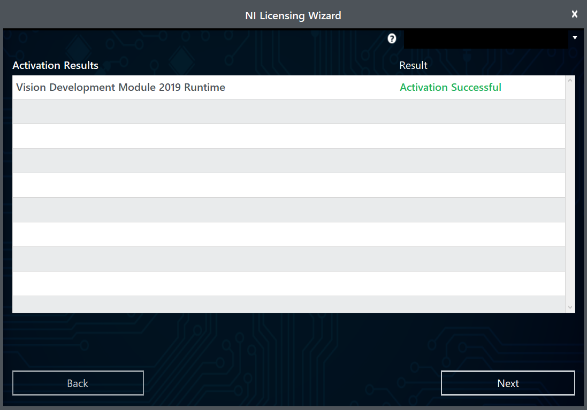

.. include:: <isonum.txt>

Installing the FRC Update Suite
===============================

The FRC Update Suite contains the following software components:
LabVIEW Update, FRC Driver Station, and FRC Utilities. If an FRC
LabVIEW installation is found, the LabVIEW Update will be installed
or updated, otherwise this step will be skipped. The FRC Driver
Station and FRC Utilities will always be installed or updated. The
LabVIEW runtime components required for the driver station and
utilities is included in this package. **No components from the
LabVIEW Merged Suite are required for running either the Driver
Station or Utilities.**

.. note:: The Driver Station will only work on Windows 7, Windows 8,\
 Windows 8.1, and Windows 10. It will not work on Windows XP.

Uninstall Old Versions (Recommended)
------------------------------------

**LabVIEW teams have already completed this step, do not repeat it.** Before installing the new version of the NI Update it is recommended to remove any old versions. The new version will likely co-exist with the old version, but all testing has been done with FRC 2020 only.  Then click Start >> Add or Remove Programs. Locate the entry labeled "National Instruments Software", and select Uninstall.

Select Components to Uninstall
^^^^^^^^^^^^^^^^^^^^^^^^^^^^^^

In the dialog box that appears, select all entries. The easiest way to do this is to de-select the "Products Only" check-box and select the check-box to the left of "Name". Click Remove. Wait for the uninstaller to complete and reboot if prompted.

.. image:: images/labview/uninstall_select_components.png

Downloading the Update
----------------------

Download the update from
https://www.ni.com/download/first-robotics-software-2017/7904/en/

.. note:: Note: This download will require the decryption key from the Kickoff broadcast.

.. note:: Beta teams will download the update from teamforge.

.NET Framework 4.6.2
--------------------

The Update installer may prompt that .NET Framework 4.6.2 needs to be
updated or installed. Follow prompts on-screen to complete the
installation, including rebooting if requested. Then resume the
installation of the NI FRC Update, restarting the installer if
necessary.

Welcome
-------

Right click on the downloaded zip file and select Extract All.
If you downloaded the encrypted zip file, you will be prompted for the
encryption key which will be released at Kickoff. Open the extracted
folder and any subfolders until you reach the folder containing “install”
(may say “install.exe” on some machines). Double click on the setup icon
to launch the installer. Click “Yes” if a Windows Security prompt
appears.

Ni Package Manager License
--------------------------

If you see this screen, click "Next"

Disable Windows Fast Startup
----------------------------

.. image:: images/labview/labview_fast_startup.png

If you see this screen, click "Next"

NI Package Manager Review
-------------------------

.. image:: images/labview/labview_package_manager_review.png

If you see this screen, click "Next"

NI Package Manager Installation
-------------------------------

Installation progress of the NI Package Manager will be tracked in this window

Product List
------------

|Product List|

Click “Next”. There is no need to de-select “LabVIEW
Update” for C++ or Java teams, if you do not have the base LabVIEW
installation (because you are not programming in LabVIEW) this
installation will be skipped automatically.

Additional Software
-------------------

|Additional Software|

If you see this screen, click "Next"

License Agreements
------------------

|License Agreements|

Select “I accept…” then click “Next”

License Agreements Page 2
-------------------------

|License Agreements Page 2|

Select “I accept…” then click “Next”

Review Summary
----------------

Click Next

Detail Progress
---------------

   Detail Progress

Installation Summary
--------------------

|Installation Summary|

click Close

NI Activation Wizard
--------------------

|NI Activation Wizard|

Log into your ni.com account. If you don’t have
an account, select ‘Create account’ to create a free account.

NI Activation Wizard (2)
------------------------

|NI Activation Wizard 2|

Enter the serial number. Click “Activate”. Note: If this is the first time
activating the 2019 software on this account, you will see the message
shown above about a valid license not being found. You can ignore this.

NI Activation Wizard (3)
------------------------

|NI Activation Wizard 3|

If your products activate successfully, an
“Activation Successful” message will appear. If the serial number was
incorrect, it will give you a text box and you can re-enter the number
and select “Try Again”. If everything activated successfully, click
“Next”.

NI Activation Wizard (4)
------------------------

|NI Activation Wizard 4|

Click “Close”.

NI Update Service
-----------------

.. image:: images/labview/ni_update_enable.png

You will be prompted whether to enable the NI update service. You can choose to not enable the update service.

.. warning:: It is not recommended to install these updates unless directed by FRC through our usual communication channels (FRC Blog, Team Updates or E-mail Blasts).

.. |Product List| image:: images/update-suite/product-list.png
.. |Product Information| image:: images/update-suite/product-information.png

.. |License Agreements Page 2| image:: images/update-suite/license-agreements-2.png

.. |NI Activation Wizard| image:: images/update-suite/ni-activation-wizard.png
.. |NI Activation Wizard 2| image:: images/update-suite/ni-activation-wizard-2.png

.. |NI Activation Wizard 4| image:: images/update-suite/ni-activation-wizard-4.png
