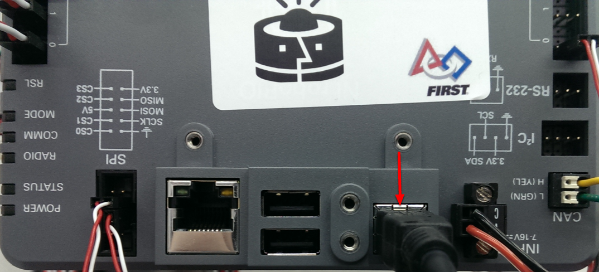
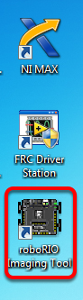
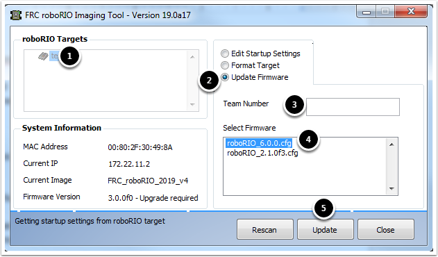
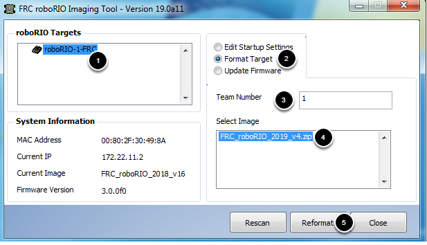
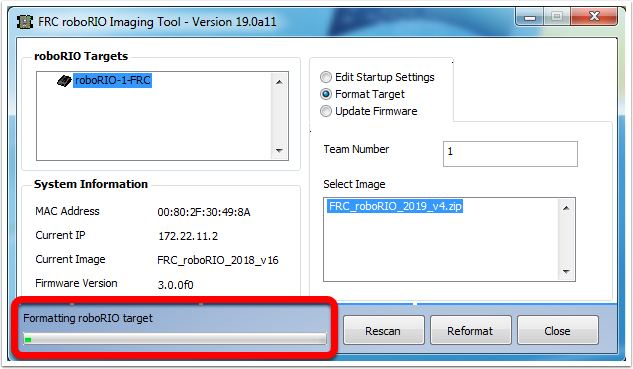
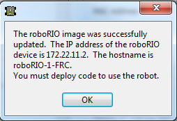

Imaging your roboRIO
====================

.. warning:: Before imaging your roboRIO, you must have completed installation of the :doc:`FRC Game Tools<frc-game-tools>`. You also must have the roboRIO power properly wired to the Power Distribution Panel. Make sure the power wires to the roboRIO are secure and that the connector is secure firmly to the roboRIO (4 total screws to check).

Configuring the roboRIO
^^^^^^^^^^^^^^^^^^^^^^^

The roboRIO Imaging Tool will be used to image your roboRIO with the latest
software.

USB Connection
~~~~~~~~~~~~~~

Connect a USB cable from the roboRIO USB Device port to the PC. This requires a USB Type A male (standard PC end) to Type B male cable (square with 2 cut corners), most commonly found as a printer USB cable.

.. note:: The roboRIO should only be imaged via the USB connection. It is not recommended to attempt imaging using the Ethernet connection.

Driver Installation
~~~~~~~~~~~~~~~~~~~

The device driver should install automatically. If you see a "New Device" pop-up in the bottom right of the screen, wait for the driver install to complete before continuing.

Launching the Imaging Tool
^^^^^^^^^^^^^^^^^^^^^^^^^^

The roboRIO imaging tool and latest image are installed with the NI FRC Game Tools. Launch the imaging tool by double clicking on the shortcut on the Desktop. If you have difficulties imaging your roboRIO, you may need to try right-clicking on the icon and selecting Run as Administrator instead.

.. note:: The roboRIO imaging tool is also located at ``C:\Program Files (x86)\National Instruments\LabVIEW YYYY\project\roboRIO Tool`` where YYYY is the current year - 1. If it's 2020, the directory would be ``LabVIEW 2019``.

roboRIO Imaging Tool
^^^^^^^^^^^^^^^^^^^^

.. image:: images/imaging-your-roborio/roborio-imaging-tool.png

After launching, the roboRIO Imaging Tool will scan for available roboRIOs and indicate any found in the top left box. The bottom left box will show information and settings for the roboRIO currently selected. The right hand pane contains controls for modifying the roboRIO settings:

- **Edit Startup Settings** - This option is used when you want to configure the startup settings of the roboRIO (the settings in the right pane), without imaging the roboRIO.
- **Format Target** - This option is used when you want to load a new image on the roboRIO (or reflash the existing image). This is the most common option.
- **Update Firmware** - This option is used to update the roboRIO firmware. For this season, the imaging tool will require roboRIO firmware to be version 5.0 or greater.

Updating Firmware
~~~~~~~~~~~~~~~~~

roboRIO firmware must be at least v5.0 to work with the 2019 image. If your roboRIO is at least version 5.0 (as shown in the bottom left of the imaging tool) you do not need to update.

To update roboRIO firmware:

1. Make sure your roboRIO is selected in the top left pane.
2. Select Update Firmware in the top right pane
3. Enter a team number in the Team Number box
4. Select the latest firmware file in the bottom right
5. Click the **Update** button

Imaging the roboRIO
^^^^^^^^^^^^^^^^^^^

1. Make sure the roboRIO is selected in the top left pane
2. Select Format Target in the right pane
3. Enter your team number in the box
4. Select the latest image version in the box.
5. Click Reformat to begin the imaging process.

Imaging Progress
^^^^^^^^^^^^^^^^

The imaging process will take approximately 3-10 minutes. A progress bar in the bottom left of the window will indicate progress.

Imaging Complete
^^^^^^^^^^^^^^^^

When the imaging completes you should see the dialog above. Click Ok, then click the Close button at the bottom right to close the imaging tool. Reboot the roboRIO using the Reset button to have the new team number take effect.

.. note:: The default CAN webdash functionality has been removed from the image (CAN devices will still work from robot code). You will need to use the tools provided by individual vendors to service their CAN devices.

Troubleshooting
^^^^^^^^^^^^^^^

If you are unable to image your roboRIO, troubleshooting steps include:

- Try running the roboRIO Imaging Tool as Administrator by right-clicking on the Desktop icon to launch it.
- Try accessing the roboRIO webpage with a web-browser at ``http://172.22.11.2/`` and/or verify that the NI network adapter appears in your list of Network Adapters in the Control Panel. If not, try re-installing the NI FRC Game Tools or try a different PC.
- Make sure your firewall is turned off.
- Try a different PC
- Some teams have experienced an issue where imaging fails if the device name of the computer you're using has a dash (``-``) in it. Try renaming the computer (or using a different PC).
- Try booting the roboRIO into Safe Mode by pressing and holding the reset button for at least 5 seconds.
