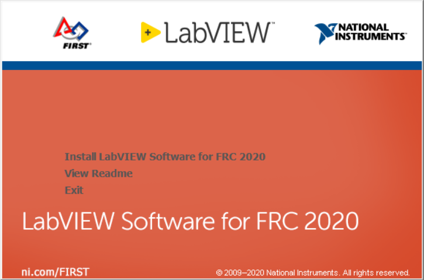
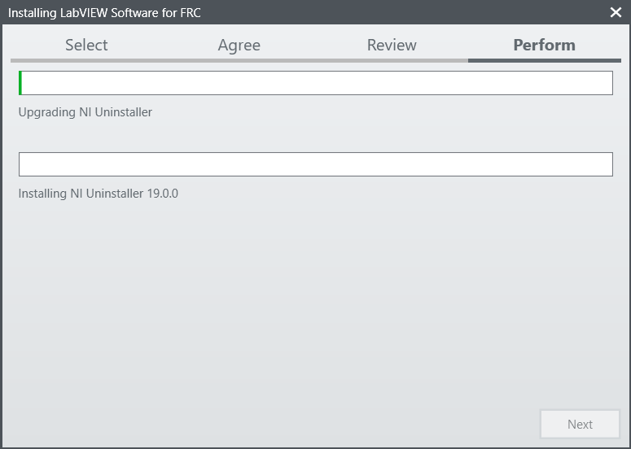

Installing LabVIEW for FRC (LabVIEW only)
=========================================

.. image:: images/labview/ni_logo.png

.. note:: This installation is for teams programming in LabVIEW or using NI Vision Assistant only. C++ and Java teams not using these features do not need to install from the DVD and should proceed to :doc:`Installing the FRC Update Suite </docs/getting-started/getting-started-frc-control-system/frc-update-suite>`.

Download and installation times will vary widely with computer and internet connection specifications, however note that this process involves a large file download and installation and will likely take at least an hour to complete.

Uninstall Old Versions (recommended)
------------------------------------

.. note:: NOTE: If you wish to keep programming cRIOs you will need to maintain an install of LabVIEW for FRC 2014. The LabVIEW for FRC 2014 license has been extended. While these versions should be able to co-exist on a single computer, this is not a configuration that has been extensively tested.

Before installing the new version of LabVIEW it is recommended to remove any old versions. The new version will likely co-exist with the old version, but all testing has been done with FRC 2019 only. Make sure to back up any team code located in the "User\\LabVIEW Data" directory before un-installing. Then click Start >> Control Panel >> Uninstall a Program. Locate the entry labeled "National Instruments Software", right-click on it and select Uninstall/Change.

.. image:: images/labview/uninstall_old_control_panel.png

Select components to uninstall
^^^^^^^^^^^^^^^^^^^^^^^^^^^^^^

In the left pane of the dialog box that appears, select all entries. The easiest way to do this is to click the top entry to highlight it, then scroll down to the bottom entry, press and hold shift and click on the last entry then release shift. Click Remove. Wait for the uninstaller to complete and reboot if prompted.

.. image:: images/labview/uninstall_select_components.png

Getting LabVIEW installer
-------------------------

Either locate and insert the LabVIEW USB Drive or download the LabVIEW 2019 installer from https://www.ni.com/download/labview-for-frc-18.0/7841/en/

If downloaded, right click on the downloaded file (NI_FRC2019.zip) and select Extract All.

.. note:: This is a large download (~5GB). It is recommended to use a fast internet connection and to use the NI Downloader to allow the download to resume if interrupted.

Installing LabVIEW
------------------

National Instruments LabVIEW requires a license. Each season’s license is active until January 31st of the following year (e.g. the license for the 2019 season expires on January 31, 2020)

Teams are permitted to install the software on as many team computers as needed, subject to the restrictions and license terms that accompany the applicable software, and provided that only team members or mentors use the software, and solely for FRC. Rights to use LabVIEW are governed solely by the terms of the license agreements that are shown during the installation of the applicable software.

Welcome
^^^^^^^

Double click on ``autorun.exe`` to launch the installer. If prompted to allow changes click Yes. To install LabVIEW to program your FRC robot, click the top option Install Everything for LabVIEW Development. To install only NI Vision Assistant for use with C++ or Java, click Install Only NI Vision Development Module. If prompted with any Windows security warnings, click Allow or Yes.

Warnings
^^^^^^^^

.. image:: images/labview/labview_warnings.png

Click "Next"

Product List
^^^^^^^^^^^^
.. image:: images/labview/labview_product_list.png

Click "Next"

Product Information
^^^^^^^^^^^^^^^^^^^

.. image:: images/labview/labview_product_info.png

Un-check the box, then click "Next". (Note: you may not see the warning shown in the top portion of the window in this picture).

User Information
^^^^^^^^^^^^^^^^

.. image:: images/labview/labview_user_info.png

Enter name, organization, and the serial number from the ReadMe in the File Releases on Teamforge. Click "Next". If you cannot find your serial number, please reach out to National Instruments at www.ni.com/frc/needhelp.

Destination Directory
^^^^^^^^^^^^^^^^^^^^^

.. image:: images/labview/labview_install_dir.png

Click "Next"

License agreements
^^^^^^^^^^^^^^^^^^

.. image:: images/labview/labview_license_1.png

Check "I accept..." then Click "Next"

.. image:: images/labview/labview_license_2.png

Check "I accept..." then Click "Next"

Driver Software installation
^^^^^^^^^^^^^^^^^^^^^^^^^^^^

.. image:: images/labview/labview_drivers.png

If you see this screen, Click "Next"

Disable Windows Fast Startup
^^^^^^^^^^^^^^^^^^^^^^^^^^^^

.. image:: images/labview/labview_fast_startup.png

If you see this screen, click "Next"

Start Installation
^^^^^^^^^^^^^^^^^^

.. image:: images/labview/labview_start_install.png

Click "Next"

Overall Progress
^^^^^^^^^^^^^^^^

Overall installation progress will be tracked in this window

Individual Product Progress
^^^^^^^^^^^^^^^^^^^^^^^^^^^

.. image:: images/labview/labview_ind_product_progress.png

Each product installed will also create an individual progress window like the one shown above.

Post-Install Information
^^^^^^^^^^^^^^^^^^^^^^^^

.. image:: images/labview/labview_wrapup_info.png

Click "Next"

Installation Summary
^^^^^^^^^^^^^^^^^^^^

.. image:: images/labview/labview_install_summary.png

If internet access is available and you are ready to activate, click "Next"; otherwise uncheck the "Run License Manager..." and click "Next".

NI Activation Wizard
^^^^^^^^^^^^^^^^^^^^

.. image:: images/labview/ni_activation_login.png

Log into your ni.com account. If you don't have an account, select 'Create account' to create a free account.

The serial number you entered at the "User Information" screen should appear in all of the text boxes, if it doesn't, enter it now. Click "Activate".

.. note:: If this is the first time activating the 2019 software on this account, you will see the message shown above about a valid license not being found. You can ignore this.

.. image:: images/labview/ni_activation_success.png

If your products activate successfully, an “Activation Successful” message will appear. If the serial number was incorrect, it will give you a text box and you can re-enter the number and select “Try Again”. If everything activated successfully, click “Next”.

.. image:: images/labview/ni_activation_finish.png

Click "Close".

Restart
^^^^^^^

.. image:: images/labview/labview_restart.png

Select "Yes"

NI Update Service
-----------------

.. image:: images/labview/ni_update.png

On occasion you may see alerts from the NI Update Service about patches to LabVIEW.

.. warning:: It is not recommended to install these updates unless directed by FRC through our usual communication channels (Frank's Blog, Team Updates or E-mail Blasts).
