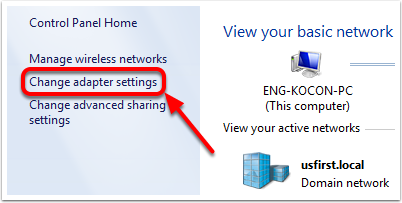

Programming your Radio
======================

This guide will show you how to use the FRC Radio Configuration Utility software to configure your robot's wireless bridge for use outside of FRC events.

Before you begin using the software:

1. Disable WiFi connections on your computer, as it may prevent the configuration utility from properly communicating with the bridge
2. Make sure no devices are connected to your computer via ethernet, other than the wireless bridge.

.. warning:: The OM5P-AN and AC use the same power plug as the D-Link DAP1522, however they are 12V radios. Wire the radio to the 12V 2A terminals on the VRM (center-pin positive).

Pre-Requisites
--------------

The FRC Radio Configuration Utility requires the Java Runtime Engine (JRE). If you do not have Java installed, you can download the JRE from here: https://www.java.com/en/download/

The FRC Radio Configuration Utility requires Administrator privileges to configure the network settings on your machine. The program should request the necessary privileges automatically (may require a password if run from a non-Administrator account), but if you are having trouble, try running it from an Administrator account.

Application Notes
-----------------

By default, the Radio Configuration Utility will program the radio to enforce the 4Mbps bandwidth limit on traffic exiting the radio over the wireless interface. In the home configuration (AP mode) this is a total, not a per client limit. This means that streaming video to multiple clients is not recommended.

The Utility has been tested on Windows 7, 8 and 10. It may work on other operating systems, but has not been tested.

Programmed Configuration
^^^^^^^^^^^^^^^^^^^^^^^^

.. image:: /docs/hardware/hardware-basics/images/status-lights/radioLight.png

The Radio Configuration Utility programs a number of configuration settings into the radio when run. These settings apply to the radio in all modes (including at events). These include:

- Set a static IP of 10.TE.AM.1
- Set an alternate IP on the wired side of 192.168.1.1 for future programming
- Bridge the wired ports so they may be used interchangeably
- The LED configuration noted in the graphic above.
- 4Mb/s bandwidth limit on the outbound side of the wireless interface (may be disabled for home use)
- QoS rules for internal packet prioritization (affects internal buffer and which packets to discard if bandwidth limit is reached). These rules are:

  - Robot Control and Status (UDP 1110, 1115, 1150)
  - Robot TCP & Network Tables (TCP 1735, 1740)
  - Bulk (All other traffic). (disabled if BW limit is disabled)

- DHCP server enabled. Serves out:

  - 10.TE.AM.11 - 10.TE.AM.111 on the wired side
  - 10.TE.AM.130 - 10.TE.AM.230 on the wireless side
  - Subnet mask of 255.255.255.0
  - Broadcast address 10.TE.AM.255

- DNS server enabled. DNS server IP and domain suffix (.lan) are served as part of the DHCP.

At home only:

- SSID may have a "Robot Name" appended to the team number to distinguish multiple networks.
- Firewall option may be enabled to mimic the field firewall rules (open ports may be found in the Game Manual)

.. warning:: It is not possible to modify the configuration manually

Download the software
Download the latest FRC Radio Configuration Utility Installer from the following links:

`FRC Radio Configuration 20.0.0 <https://firstfrc.blob.core.windows.net/frc2020/Radio/FRC_Radio_Configuration_20_0_0.zip>`_

`FRC Radio Configuration 20.0.0 Israel Version <https://firstfrc.blob.core.windows.net/frc2020/Radio/FRC_Radio_Configuration_20_0_0_IL.zip>`_

.. note:: The _IL version is for Israel teams and contains a version of the OM5PAC firmware with restricted channels for use in Israel.

.. warning:: Version 19.1.1 corrects an issue with applying the Bandwidth Limit present in version 19.1.0. Teams should install the new version, then re-program their radio (there is no need to re-flash the firmware).

Install the software
--------------------

.. image:: images/radio-programming/radio-installer.png

Double click on FRC_Radio_Configuration_VERSION.exe to launch the installer. Follow the prompts to complete the installation.

Part of the installation prompts will include installing Npcap if it is not already present. The Npcap installer contains a number of checkboxes to configure the install. You should leave the options as the defaults.

Launch the software
-------------------

.. image:: images/radio-programming/radio-launch.png

Use the Start menu or desktop shortcut to launch the program.

Note: If you need to locate the program it is installed to C:\Program Files (x86)\FRC Radio Configuration Utility. For 32-bit machines the path is C:\Program Files\FRC Radio Configuration Utility\

Allow the program to make changes, if prompted
----------------------------------------------

.. image:: images/radio-programming/allow-changes.png

If the your computer is running Windows Vista or Windows 7, a prompt may appear about allowing the configuration utility to make changes to the computer. Click "Yes" if the prompt appears.

Select the network interface
----------------------------

.. image:: images/radio-programming/select-network-connection.png

Use the pop-up window to select the which ethernet interface the configuration utility will use to communicate with the wireless bridge. On Windows machines, ethernet interfaces are typically named "Local Area Connection". The configuration utility can not program a bridge over a wireless connection.

1. If no ethernet interfaces are listed, click "Refresh" to re-scan for available interfaces
2. Select the interface you want to use from the drop-down list
3. Click "OK"

Open Mesh Firmware Note
-----------------------

For the FRC Radio Configuration Utility to program the OM5P-AN and OM5P-AC radio, the radio must be running an FRC specific build of the OpenWRT firmware. OM5P-AC radios in the 2019 KoP should not need an update.

If you do not need to update or re-load the firmware, skip the next step.

.. warning:: Note: Radios used in 2019 **do not** need to be updated before configuring, the 2020 tool uses the same 2019 firmware.

Loading FRC Firmware to OpenMesh radio
--------------------------------------

.. image:: images/radio-programming/openmesh-firmware.png

If you need to load the FRC firmware (or reset the radio), you can do so using the FRC Radio Configuration Utility.

1. Follow the instructions above to install the software, launch the program and select the Ethernet interface.
2. Make sure the OpenMesh radio is selected in the Radio dropdown.
3. Make sure the radio is connected to the PC via Ethernet.
4. Unplug the power from the radio. (If using a PoE cable, this will also be unplugging the Ethernet to the PC, this is fine)
5. Press the Load Firmware button
6. When prompted, plug in the radio power. The software should detect the radio, load the firmware and prompt you when complete.

.. warning:: If you see an error about NPF name, try disabling all adapters other than the one being used to program the radio. If only one adapter is found, the tool should attempt to use that one. See the steps in "`Troubleshooting: Disabling Network Adapters`_" for more info.

    Teams may also see this error with foreign language Operating Systems. If you experience issues loading firmware or programming on a foreign language OS, try using an English OS, such as on the KOP provided PC or setting the Locale setting to "en_us" as described on `this page <https://www.java.com/en/download/help/locale.xml>`_.

Select a bridge model and operating mode
----------------------------------------

.. image:: images/radio-programming/select-bridge-model-mode.png

1. Select which radio you are configuring using the drop-down list.
2. Select which operating mode you want to configure. For most cases, the default selection of 2.4GHz Access Point will be sufficient. If your computers support it, the 5GHz AP mode is recommended, as 5GHz is less congested in many environments.

Select Options
--------------

.. image:: images/radio-programming/select-options.png

The default values of the options have been selected to match the use case of most teams, however, you may wish to customize these options to your specific scenario:

1. Robot Name: This is a string that gets appended to the SSID used by the radio. This allows you to have multiple networks with the same team number and still be able to distinguish them.
2. Firewall: If this box is checked, the radio firewall will be configured to attempt to mimic the port blocking behavior of the firewall present on the FRC field. For a list of open ports, please see the FRC Game Manual.
3. BW Limit: If this box is checked, the radio enforces a 4MB/s bandwidth limit like it does when programmed at events. Note that in AP mode, this is a total limit, not per client, so streaming video to multiple clients simultaneously may cause undesired behavior.

.. note:: Firewall and BW Limit only apply to the OpenMesh radios. These options have no effect on D-Link radios.

.. warning:: The "Firewall" option configures the radio to emulate the field firewall. This means that you will not be able to deploy code wirelessly with this option enabled.

Prepare and start the configuration process
-------------------------------------------

Follow the on-screen instructions for preparing your wireless bridge, entering the settings the bridge will be configured with, and starting the configuration process. These on-screen instructions update to match the bridge model and operating mode chosen.

Configuration Progress
----------------------

Throughout the configuration process, the window will indicate:

1. The step currently being executed
2. The overall progress of the configuration process
3. All steps executed so far

Configuration completed
-----------------------

Once the configuration is complete:

1. Press "OK" on the dialog window
2. Press "OK" on the main window to return to the settings screen

Configuration errors
--------------------

If an error occurs during the configuration process, follow the instructions in the error message to correct the problem.

Troubleshooting: Disabling Network Adapters
-------------------------------------------

If you get an error message about "NPF adapter" when attempting to load firmware, you need to disable all other adapters. This is not always the same as turning the adapters off with a physical button or putting the PC into airplane mode. The following steps provide more detail on how to disable adapters.

Open the Control Panel by going to Start->Control Panel

Choose the Network and Internet category.

Click Network and Sharing Center

On the left pane, click Change Adapter Settings

For each adapter other than the one connected to the radio, right click on the adapter and select Disable from the menu.
