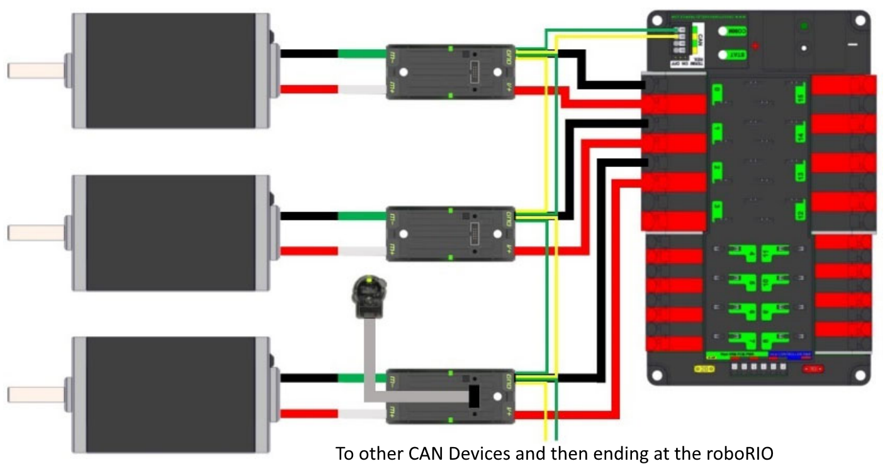

CAN Wiring Basics
=================

CAN is a two wire network that is designed to facilitate communication between multiple devices on your robot. It is recommended that CAN on your robot follow a "daisy-chain" topology. This means that the CAN wiring should usually start at your roboRIO and go into and out of each device successively until finally ending at the PDP.

Standard Wiring
---------------

CAN is generally wired with yellow and green wire with yellow acting as the CAN-High and green as the CAN-Low signals.  Many devices show this yellow and green color scheme to indicate how the wires should be plugged in.

CAN wiring from the roboRIO to the PCM.

.. image:: /docs/zero-to-robot/step-1/images/how-to-wire-a-robot/pcm-can.jpg

CAN wiring from the PCM to the PDP.

.. image:: /docs/zero-to-robot/step-1/images/how-to-wire-a-robot/pdp-can.jpg

Termination
-----------

It is recommended that the wiring starts at the roboRIO and ends at the PDP because the CAN network is required to be terminated by 120 :math:`\Omega` resistors and these are built into these two devices.  The PDP ships with the CAN bus terminating resistor jumper in the "ON" position. It is recommended to leave the jumper in this position and place any additional CAN nodes between the roboRIO and the PDP (leaving the PDP as the end of the bus). If you wish to place the PDP in the middle of the bus (utilizing both pairs of PDP CAN terminals) move the jumper to the "OFF" position and place your own 120 :math:`\Omega` terminating resistor at the end of your CAN bus chain.
