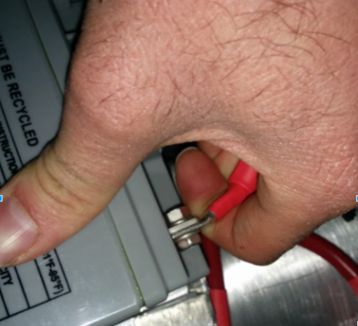
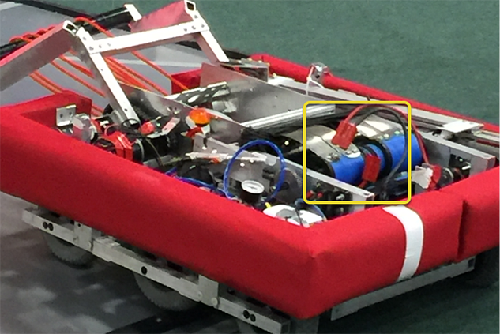
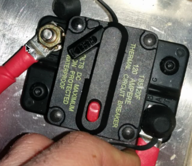
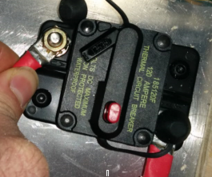
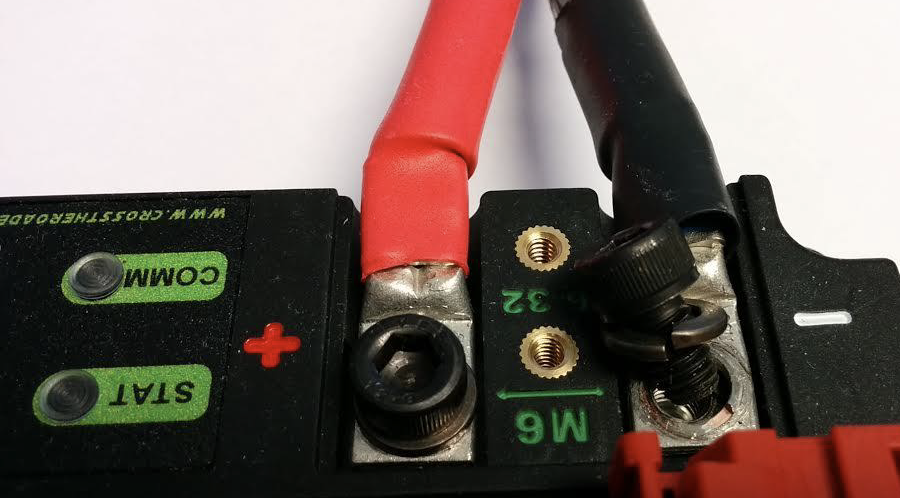
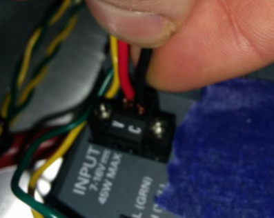
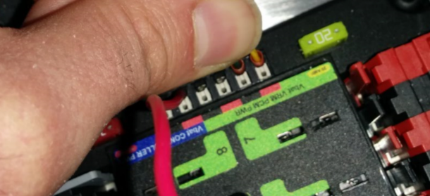
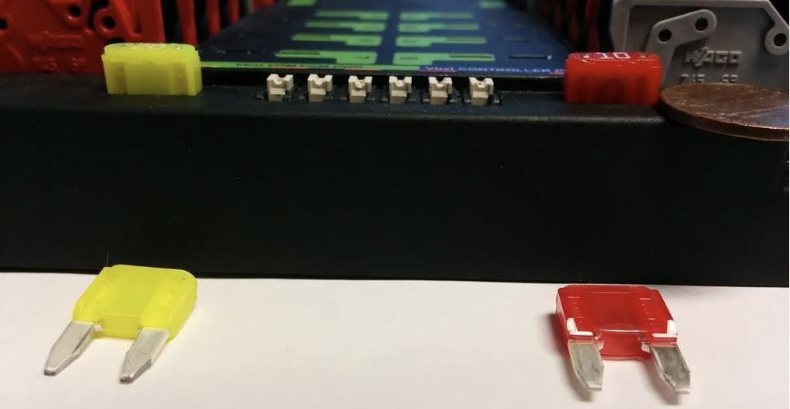
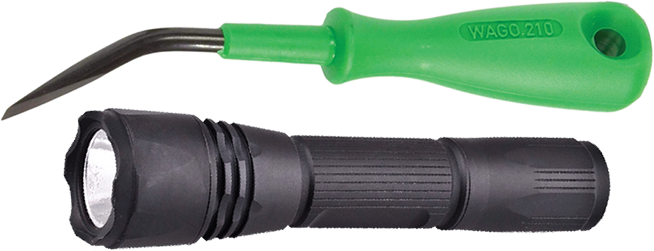

.. include:: <isonum.txt>

Robot Preemptive Troubleshooting
================================

.. note::

    In *FIRST*\ |reg| Robotics Competition, robots take a lot of stress while driving around the field. It is important to make sure that connections are tight, parts are bolted securely in place and that everything is mounted so that a robot bouncing around the field does not break.

Check Battery Connections
-------------------------

The tape that should be covering the battery connection in these examples has been removed to illustrate what is going on. On your robots, the connections should be covered.

Wiggle battery harness connector. Often these are loose because the screws loosen, or sometimes the crimp is not completely closed.  You will only catch the really bad ones though because often the electrical tape stiffens the connection to a point where it feels stiff. Using a voltmeter or Battery Beak will help with this.

Apply considerable force onto the battery cable at 90 degrees to try to move the direction of the cable leaving the battery, if successful the connection was not tight enough to begin with and it should be redone.  This :ref:`article <docs/hardware/hardware-basics/robot-battery:Robot Battery Basics>` has more detailed battery information.

Securing the Battery to the Robot
---------------------------------

In almost every event we see at least one robot where a not properly secured battery connector (the large Anderson) comes apart and disconnects power from the robot. This has happened in championship matches on the Einstein and everywhere else. Its an easy to ensure that this doesn't happen to you by securing the two connectors by wrapping a tie wrap around the connection. 10 or 12 tie wraps for the piece of mind during an event is not a high price to pay to guarantee that you will not have the problem of this robot from an actual event after a bumpy ride over a defense. Also, secure your battery to the chassis with hook and loop tape or another method, especially in games with rough defense, obstacles or climbing.

Securing the Battery Connector & Main Power Leads
-------------------------------------------------

A loose robot-side battery connector (the large Anderson SB) can allow the main power leads to be tugged when the battery is replaced. If the main power leads are loose, that "tug" can get all the way back to the crimp lugs attached to the 120 Amp Circuit Breaker or Power Distribution Panel (PDP), bend the lug, and over time cause the lug end to break from fatigue. Putting a couple tie wraps attaching the main power leads to the chassis and bolting down the robot-side battery connector can prevent this, as well as make it easier to connect the battery.

Main Breaker (120 Amp Circuit Breaker)
---------------------------------------

.. note:: Ensure nuts are tightened firmly and the breaker is attached to a rigid element.

Apply a strong twisting force to try to rotate the crimped lug.  If the lug rotates then the nut is not tight enough.  After tightening the nut, retest by once again trying to rotate the lug.

The original nut has a star locking feature, which can wear out over time: these may require checking every few matches, especially if your robot-side battery connector is not attached to the chassis.

The nut is normally a relatively uncommon 1/4-28 thread: ensure this is correct if the nut is replaced.

Because the metal stud is just molded into the case, every once in awhile you may break off the stud. Don't stress, just replace the assembly.

When subjected to multiple competition seasons, the Main Breaker is susceptible to fatigue damage from vibration and use, and can start opening under impact. Each time the thermal fuse function is triggered, it can become progressively easier to trip. Many veteran teams start each season with a fresh main breaker, and carry spares.

Power Distribution Panel (PDP)
------------------------------

Make sure that split washers were placed under the PDP screws, but it is not easy to visually confirm, and sometimes you can’t.  You can check by removing the case.
Also if you squeeze the red and black wires together, sometimes you can catch the really lose connections.

Tug Testing
-----------

The Weidmuller contacts for power, compressor output, roboRIO power connector, and radio power are important to verify by tugging on the connections as shown.  Make sure that none of the connections pull out.

Look for possible or impending shorts with Weidmuller connections that are close to each other, and have too-long wire-lead lengths (wires that are stripped extra long).

Spade connectors can also fail due to improper crimps, so tug-test those as well.

Blade Fuses
-----------

Be sure to place the 20A fuse (yellow) on the left and the 10A fuse (red) on the right.

.. warning:: Take care to ensure fuses are fully seated into the fuse holders. The fuses should descend at least as far as the figure below (different brand fuses have different lead lengths). It should be nearly impossible to remove the fuse with bare hands (without the use of pliers). If this is not properly done, the robot/radio may exhibit intermittent connectivity issues.

If you can remove the blade fuses by hand then they are not in completely. Make sure that they are completely seated in the PDP so that they don't pop out during robot operation.

roboRIO swarf
-------------

Swarf is fine chips or filings of stone, metal, or other material produced by a machining operation. Often modifications must be made to a robot while the control system parts are in place. The circuit board for the roboRIO is conformally coated, but that doesn't absolutely guarantee that metal chips won't short out traces or components inside the case. In this case, you must exercise care in making sure that none of the chips end up in the roboRIO or any of the other components. In particular, the exposed 3 pin headers are a place where chips can enter the case. A quick sweep through each of the four sides with a flashlight is usually sufficient to find the really bad areas of infiltration.

Radio Barrel Jack
-----------------

Make sure the correct barrel jack is used, not one that is too small and falls out for no reason.  This isn’t common, but ask an FTA and every once in awhile a team will use some random barrel jack that is not sized correctly, and it falls out in a match on first contact.

Ethernet Cable
--------------

If the RIO to radio ethernet cable is missing the clip that locks the connector in, get another cable.  This is a common problem that will happen several times in every competition. Make sure that your cables are secure. The clip often breaks off, especially when pulling it through a tight path, it snags on something then breaks.

Loose Cables
------------

Cables must be tightened down, particularly the radio power and ethernet cable.  The radio power cables don’t have a lot of friction force and will fall out (even if it is the correct barrel) if the weight of the cable-slack is allowed to swing freely.

Ethernet cable is also pretty heavy, if it’s allowed to swing freely, the plastic clip may not be enough to hold the ethernet pin connectors in circuit.

Reproducing Problems in the Pit
-------------------------------

Beyond the normal shaking of cables whilst the robot is powered and tethered, it is suggested that one side of the robot be picked up and dropped. Driving on the field, especially against defenders, will often be very violent, and this helps makes sure nothing falls out. It is better for the robot to fail in the pits rather than in the middle of a match.

When doing this test it’s important to be ethernet tethered and not USB tethered, otherwise you are not testing all of the critical paths.

Check Firmware and Versions
---------------------------

Robot inspectors do this, but you should do it as well, it helps robot inspectors out and they appreciate it.  And it guarantees that you are running with the most recent, bug fixed code. You wouldn't want to lose a match because of an out of date piece of control system software on your robot.

Driver Station Checks
---------------------

We often see problems with the Drivers Station. You should:

- ALWAYS bring the laptop power cable to the field, it doesn’t matter how good the battery is, you are allowed to plug in at the field.
- Check the power and sleep settings, turn off sleep and hibernate, screen savers, etc.
- Turn off power management for USB devices (dev manager)
- Turn off power management for ethernet ports (dev manager)
- Turn off windows defender
- Turn off firewall
- Close all apps except for DS/Dashboard when out on the field.
- Verify that there is nothing unnecessary running in the application tray in the start menu (bottom right side)

Handy Tools
-----------

There never seems to be enough light inside robots, at least not enough to scrutinize the critical connection points, so consider using a handheld LED flashlight to inspect the connections on your robot. They're available from home depot or any hardware/automotive store.

A WAGO tool is nice tool for redoing Weidmuller connections with stranded wires.  Often I’ll do one to show the team, and then have them do the rest using the WAGO tool to press down the white-plunger while they insert the stranded wire.  The angle of the WAGO tool makes this particularly helpful.
