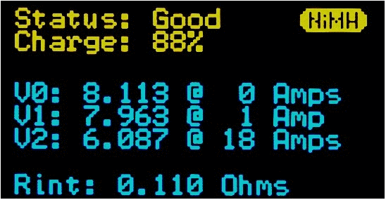

.. include:: <isonum.txt>

Robot Battery
=============

The power supply for an FRC\ |reg| robot is a single 12V 18Ah battery. The batteries used for FRC are sealed lead acid batteries capable of meeting the high current demands of an FRC robot.

Battery Connections
^^^^^^^^^^^^^^^^^^^

Great care should be taken when handling batteries.  **DO NOT CARRY A BATTERY BY THE CABLES**.  The battery will not be able to provide the same amount of current if the :ref:`connectors are loose <docs/hardware/hardware-basics/preemptive-troubleshooting:Check Battery Connections>`.

.. image:: images/robot-battery/heatshrink.png
   :alt: One terminal of an FRC battery fully covered in heatshrink.

It is a good idea to secure the battery with either a star washer or a nord lock washer as this will ensure the connection does not move.  This connection must also be wrapped, while some use electrical tape heatshrink that fits over the entire connection is recommended.

Battery Longevity
^^^^^^^^^^^^^^^^^

This battery is rated for about 1200 charge/recharge cycles, but for the high currents FRC subjects it to that lifespan is reduced to about 400 cycles.  These cycles are intended to be relatively limited discharge and deep cycling the battery (running it all the way down) can damage it.

Batteries last the longest if they are kept fully charged when not it use.  Take care however to not leave them on a trickle charger for an extended period of time.

Dropping a battery may compromise its structural integrity and can lead to a bulge or crack in the battery case.  These batteries should be safely disposed of as soon as possible.

Battery Load Tester
^^^^^^^^^^^^^^^^^^^

A battery load tester can be used as a quick way to determine the readiness of a battery.  It may provide information like: open-load voltage, voltage under load, internal resistance, and state of charge.  These metrics can be used to quickly confirm that a battery is ready for a match and even possibly help to identify some long term problems with the battery.

While these batteries are called 12 volt batteries a fully charged battery should read around 13 volts.  Ideal internal resistance should be around 0.015 Ohms.  If a battery gets higher than 0.02 Ohms it is a good idea to consider not using that battery for competition matches.

Battery Analyzer
^^^^^^^^^^^^^^^^

.. image:: images/robot-battery/cba-graph.jpg
   :alt: Graph from a common battery analyzer plotting volts and AmpHrs for many different batteries.

A battery analyzer is used to give a detailed inspection of battery performance.  It will provide graphs of battery performance over time.  This test takes significant time (roughly two hours) so it is less suited to testing during competition.  It is recommended to run this test on each battery every year to monitor and track its performance.  This will determine how it should be used: matches, practice, testing, or disposed of.

Battery Best Practices
^^^^^^^^^^^^^^^^^^^^^^

Teams should purchase several new batteries each year to help keep their batteries fresh.  Elimination matches can require many batteries and because of the quick turn around time batteries may not have enough time to recharge.

It is a good idea to permanently identify each battery with at least: team number, year, and a unique identifier.  Teams may also want to use something removeable (stickers, labeling machine etc.) to identify what that battery should be used for based on its performance data.

.. image:: images/robot-battery/battery-flag.jpg
   :alt: A battery flag is just a small piece of plastic that fits in the battery connector.

Using battery flags (a piece of plastic placed in the battery connector) is a common way to indicate that a battery has been charged.

Only use a charged battery that has been verfied using methods above for competition matches.  If you are in a situation where you have run out of charged batteries, please ask a veteran team for help!  Nobody wants to see a robot dead on the field (:ref:`brownout <docs/software/roborio-info/roborio-brownouts:roboRIO Brownout and Understanding Current Draw>`) due to a bad or uncharged battery.
