.. include:: <isonum.txt>

Robot Battery Basics
====================

The power supply for an FRC\ |reg| robot is a single 12V 18Ah SLA (Sealed Lead Acid) non-spillable battery, capable of briefly supplying over 180A and arcing over 500A when fully charged. The Robot Battery assembly includes the :term:`COTS` battery, lead cables with contacts, and Anderson SB connector. Teams are encouraged to have multiple Robot Batteries.

COTS Battery
------------

The Robot Rules in the Game Manual specify a COTS non-spillable sealed lead acid battery meeting specific criteria, and gives examples of legal part numbers from a variety of vendors.

Battery Safety & Handling
-------------------------

A healthy battery is **always** "On" and the terminals are **always** energized. If the polarities short together - for example, a wrench or aerosol can falls and bridges the gap between two bare terminals - all the stored energy will be released in a dangerous arc. This risk drives a wide range of best practices, such as covering terminals in storage, only uncovering and working on one terminal or polarity at a time, keeping SB contacts fully inserted in connectors, etc.

**Do *NOT* carry a battery assembly by the cables**, and always avoid pulling by them. Pulling on batteries by the cables will begin to damage the lugs, tabs, and the internal connection of the tab. Over time, fatigue damage can add up until the entire tab tears out of the housing! Even if it isn't clearly broken, internal fatigue damage can increase the battery internal resistance, prematurely wearing out the battery. The battery will not be able to provide the same amount of current with increased internal resistance or if the :ref:`connectors are loose <docs/hardware/hardware-basics/preemptive-troubleshooting:Check Battery Connections>`.

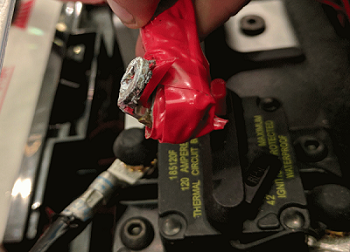

Dropping the batteries can bend the internal plates and cause performance issues, create bulges, or even crack the battery case open. While most FRC batteries use Absorbent Glass Mat [AGM] or Gel technology for safety and performance, when a cell is punctured it may still leak a small amount of battery acid. This is one of the reasons FIRST recommends teams have a battery spill kit available.

Finally, certain older battery chargers without "maintenance mode" features can *overcharge* the battery, resulting in boiling off some of the battery acid.

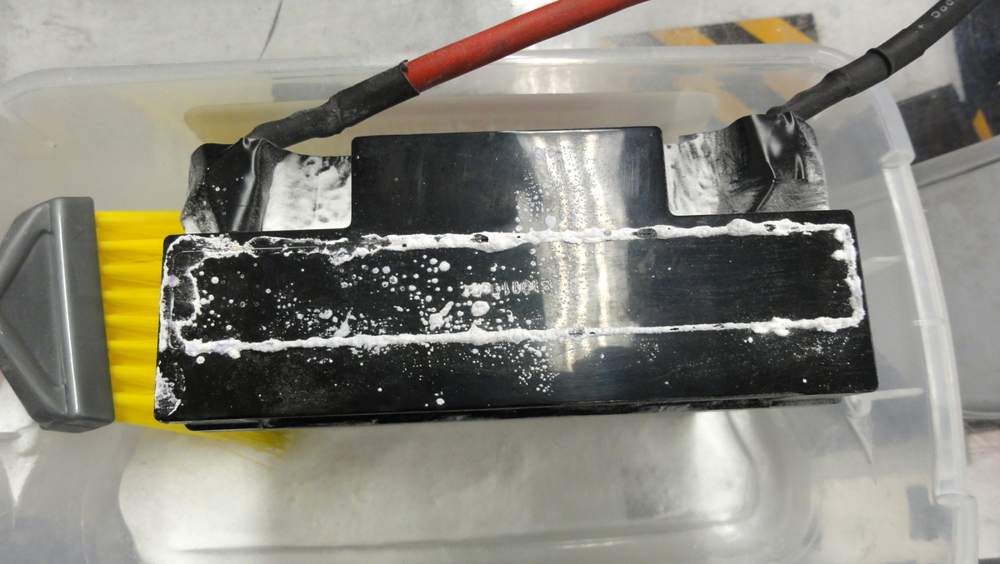

Damaged batteries should be safely disposed of as soon as possible. All retailers that sell large SLA batteries, like car batteries, should be able to dispose of it for you. They may charge a small fee, or provide a small "core charge refund", depending on your state law.

.. danger:: **DO NOT** attempt to "repair" damaged or non-functional batteries.

Battery Construction & Tools
-----------------------------

Battery Leads
^^^^^^^^^^^^^

Battery leads must be copper, minimum size (cross section) 6 AWG (16mm2, 7 SWG) and maximum length 12", color coded for polarity, with an Anderson SB connector. Standard 6AWG copper leads with Pink/Red SB50 battery leads often come in the Kit of Parts and are sold by FRC vendors.

Lead Cables
~~~~~~~~~~~

Tinned, annealed, or coated copper is allowed. Do not use CCA (copper clad aluminum), aluminum, or other non-copper base metal. The conductor metal is normally printed on the outside of the insulation with the other cable ratings.

Wire size 6AWG is sufficient for almost all robots and fits standard SB50 contacts. A small number of teams adopt larger wire sizes for marginal performance benefits.

Higher strand count wire (sometimes sold as "Flex" or "welding wire") has a smaller bend radius, which makes it easier to route, and a higher fatigue limit. There is no strand count requirement, but 84/25 (84 strand "flex" hookup wire) and 259/30 (259 strand "welding wire") will both be *much* easier to work with than 19/0.0372 (19 strand hookup wire).

The insulation must be color-coded per the Game Manual: as of 2021, the +12Vdc wire must be red, white, brown, yellow, or black w/stripe and the ground wire (return wire) must be black or blue. There is no explicit insulation temperature rating requirement, but any blackened or damaged insulation means the wire needs to be replaced: off hand, 105C is plenty and lower will work for almost all robots. There is no insulation voltage rating requirement, lower is better for thinner insulation.

SB Connector
~~~~~~~~~~~~~

The Anderson SB Connector may be the standard Pink/Red SB50, or another Anderson SB connector. Teams are *STRONGLY* recommended to use the Pink/Red SB50 for interoperability: the other colors and sizes of housings will not intermate, and you will be unable to borrow batteries or chargers.

Follow manufacturer's instructions to crimp contacts and assemble the leads into Anderson SB connectors. A small flathead screwdriver can help to insert the contacts (push on the contact, not on the wire insulation), or it can help to disengage the internal latch if the contact is in the wrong slot or upside down.

Battery Lugs
^^^^^^^^^^^^^

Compression lugs ("crimp lugs") for #10 bolt (or M5) battery tabs (~0.2" or ~5mm hole diameter) are available online and through electrical supply houses, sold by the accepted wire sizes in AWG (or mm2) and post diameter ("bolt size", "hole diameter"). Higher end vendors will also distinguish between Standard (~19) and Flex (>80) strand counts in their lug catalogs. Some vendors also offer right angle lugs, in addition to more common straight styles. Follow manufacturer's instructions to crimp the lugs.

Screw terminal lugs are legal, but not recommended. If using screw terminal lugs, use the correct tip size screwdriver to tighten the terminal. Check the terminal tightness frequently because they may loosen over time.

Battery Lead Lug To Post Connection
^^^^^^^^^^^^^^^^^^^^^^^^^^^^^^^^^^^

A #10 or M5 nut & bolt connect the battery lead lug to the battery tab.

.. warning:: The lug and tab must directly contact, copper to copper: do not put a washer of any kind separating them.

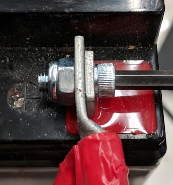

Some batteries come with tab bolts in the package: they may be used, or replaced with stronger alloy steel bolts. It is a good idea to add a functional lock washer, such as a #10 star washer or a nordlock washer system, in addition to a nylon locking ("nylock") nut. Only use one style of lock washer in each connection. Even if the manufacturer provides split ring lock washers in the package, you are not required to use them.

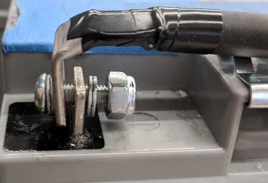

These connections must be very tight for reliability. Any movement of the lug while in operation may interrupt robot power, resulting in robot reboots and field disconnections lasting 30 seconds or more.

This connection must also be completely covered for electrical safety; electrical tape will work, but heatshrink that fits over the entire connection is recommended. High shrink ratios (minimum 3:1, recommend 4:1) will make it easier to apply the heatshrink. Adhesive lined heat shrink is allowed. Be sure *all* the copper is covered! Heat shrink must be "touched up" with electrical tape if some copper shows.

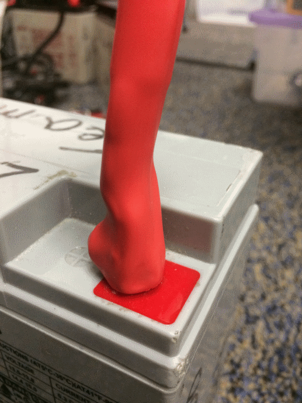

Battery Chargers
^^^^^^^^^^^^^^^^^^^

There are many good COTS "smart" battery chargers designed for 12V SLA batteries, rated for 6A or less per battery, with 'maintenance mode' features. Chargers rated over 6A are not allowed in FRC pits.

Chargers used at competition are required to use Anderson SB connectors. Attaching a COTS SB connector battery lead to the charger leads using appropriately sized wire nuts or screw terminals is fast and simple (be sure to cover any exposed copper with heat shrink or electrical tape). SB Connector Contacts are also available for smaller wire sizes, if the team has crimping capability.

.. warning:: After attaching the SB, double check the charger polarities with a multimeter before plugging in the first battery.

Some FRC vendors sell chargers with red SB50 connectors pre-attached.

Battery Evaluation Tools
^^^^^^^^^^^^^^^^^^^^^^^^^

**Battery Charger**

If your battery charger has Maintenance Mode indicator, such as a GREEN LED, you can use that indicator to tell you whether you are READY. Some chargers will cycle between "CHARGING" and "READY" periodically. This is a "maintenance" behavior, sometimes associated with the battery cooling off and being able to accept more charge.

**Driver Station Display and Log**

When the robot is plugged in and connected to the driver station laptop, the battery voltage is displayed on the NI Driver Station software.

After you finish a driving session, you can :ref:`review the battery voltage in the Log Viewer. <docs/software/driverstation/driver-station-log-viewer:Using the Graph Display>`

Hand-held **Voltmeter** or **Multimeter**

A voltage reading from probes on the SB connector of a disconnected battery will give you a snapshot of what the Voc (Voltage open circuit, or "float voltage") is in the "Unloaded" state. In general the Voc is not a recommended method for understanding battery health: the open circuit voltage is not as useful as the combination of internal resistance and voltages at specific loads provided by a Load Tester (or Battery Analyzer).

**Load Tester**

A battery load tester can be used as a quick way to determine the detailed readiness of a battery. It may provide information like: open-load voltage, voltage under load, internal resistance, and state of charge. These metrics can be used to quickly confirm that a battery is ready for a match and even help to identify some long term problems with the battery.

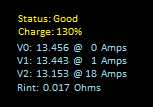

Ideal internal resistance should be less than 0.015 Ohms. The manufacturer specification for most batteries is 0.011 Ohms. If a battery gets higher than 0.020 Ohms it is a good idea to consider not using that battery for competition matches.

If a battery shows significantly lower voltages at the higher test current loads, it may not be done charging, or it may need to be retired.

Understanding Battery Voltages
------------------------------

A "12V battery" is anything but 12.0V.

Fully charged, a battery can be anywhere from 12.7 to 13.5 volts open circuit (Voc). Open circuit voltage is measured with *nothing* connected.

Once a load (like a robot) is connected, and any amount of current is flowing, the battery voltage will drop. So if you check a battery with a Voltmeter, and it reads 13.2, and then connect it to your robot and power on, it will read lower, maybe 12.9 on the Driver Station display. Those numbers will vary with every battery and specific robot, see Characterization below. Once your robot starts running, it will pull more current, and the voltage will drop further.

Batteries reading 12.5V on an idle robot should be swapped and charged before a match. Always swap the batteries before the robot starts reaching brownout safety thresholds (dwelling at low voltages on the Driver Station display), as frequently entering low voltage ranges risks permanent battery damage; this behavior can happen at a variety of Voc states depending on battery health, battery manufacturer, and robot design. The battery State of Charge should be kept over 50% for battery longevity.

Battery voltage and current also depends on temperature: cool batteries are happy batteries.

Battery Characterization
^^^^^^^^^^^^^^^^^^^^^^^^^

A battery analyzer can be used to give a detailed inspection and comparison of battery performance.

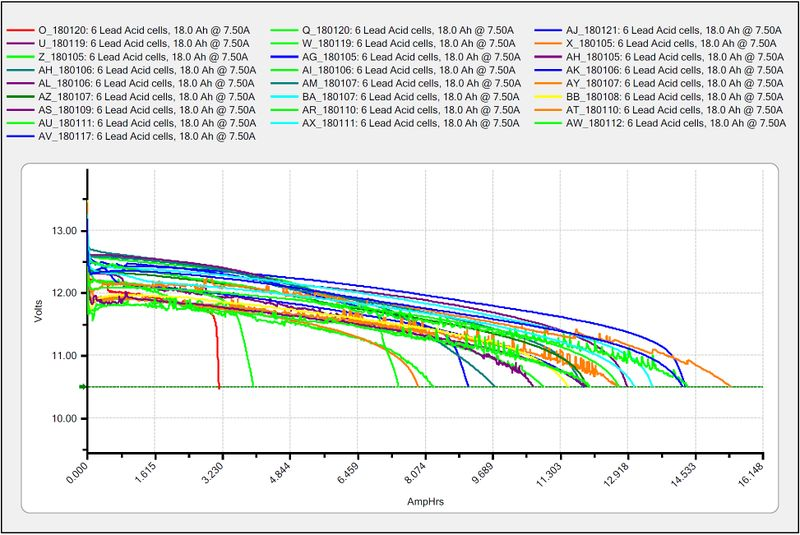

It will provide graphs of battery performance over time. This test takes significant time (roughly two hours) so it is less suited to testing during competition. It is recommended to run this test on each battery every year to monitor and track its performance. This will determine how it should be used: matches, practice, testing, or disposed of.

At the standard 7.5 amps test load, competition batteries should have at least a 11.5 amp hour rating. Anything less than that should only be used for practice or other less demanding use cases.

Battery Longevity
^^^^^^^^^^^^^^^^^^^

A battery is rated for about 1200 normal charge/recharge cycles. The high currents required for an FRC match reduce that lifespan to about 400 cycles. These cycles are intended to be relatively low discharge, from around 13.5 down to 12 or 12.5 volts. Deep cycling the battery (running it all the way down) will damage it.

Batteries last the longest if they are kept fully charged when not in use, either by charging regularly or by use of a maintenance charger. Batteries drop roughly 0.1V every month of non-use.

Batteries need to be kept away from both extreme heat and cold. This generally means storing the batteries in a climate controlled area: a classroom closet is usually fine, a parking lot shipping container is more risky.

Battery Best Practices
----------------------

- Only use a charged battery for competition matches. If you are in a situation where you have run out of charged batteries, please ask a veteran team for help! Nobody wants to see a robot dead on the field (:ref:`brownout <docs/software/roborio-info/roborio-brownouts:roboRIO Brownout and Understanding Current Draw>`) due to a bad or uncharged battery.

- Teams are strongly recommended to use properly rated tools and stringent quality control practices for crimping processes (ask local veteran teams or a commercial electrician for help), or use vendor-made Battery Leads.

- Wait for batteries to cool after the match before recharging: the case should not be warm to the touch, fifteen minutes is usually plenty.

- Teams should consider purchasing several new batteries each year to help keep their batteries fresh. Elimination matches can require many batteries and there may not be enough time to recharge.

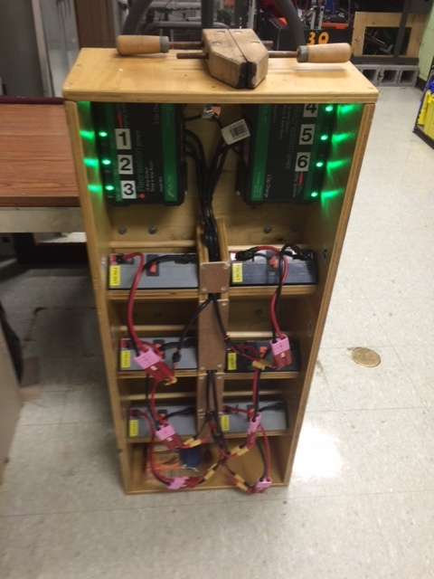

- A multi bank battery charger allows you to charge more than one battery at a time. Many teams build a robot cart for their batteries and chargers allowing for easy transport and storage.

- It is a good idea to permanently identify each battery with at least: team number, year, and a unique identifier.

- Teams may also want to use something removeable (stickers, labeling machine etc.) to identify what that battery should be used for based on its performance data and when the last analyzer test was run.

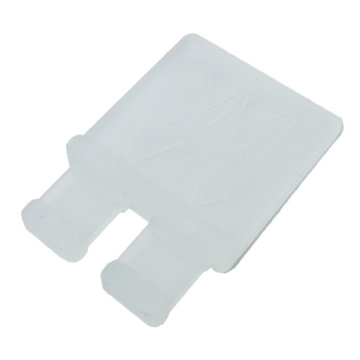

- Using battery flags (a piece of plastic placed in the battery connector) is a common way to indicate that a battery has been charged. Battery flags can also be easily 3D printed.

- Handles for SB50 contacts can be purchased or 3D printed to help avoid pulling on the leads while connecting or disconnecting batteries. Do not use these handles to carry the weight of the battery.

- Some teams sew battery carrying straps from old seatbelts or other flat nylon that fit around the battery to help prevent carrying by leads.

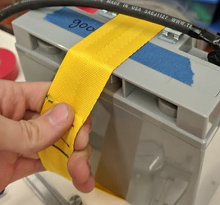

- Cable tie edge clips can be used with 90 degree crimp lugs to strain relieve battery leads.

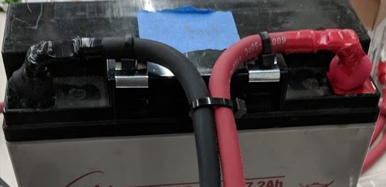
