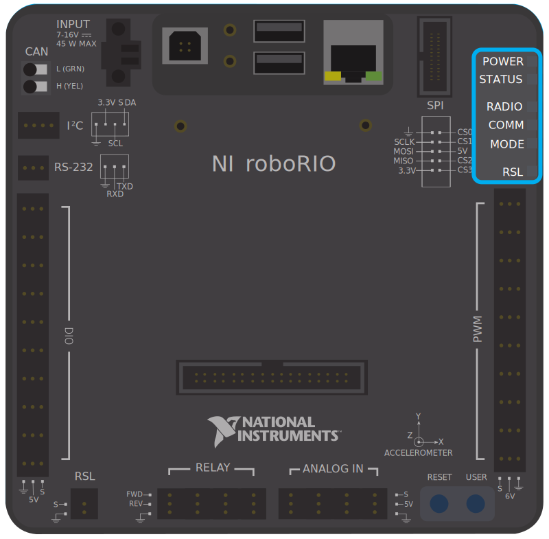
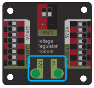

Status Light Quick Reference
============================

Many of the components of the FRC Control System have indicator lights that can be used to quickly diagnose problems with your robot. This guide shows each of the hardware components and describes the meaning of the indicators. Photos and information from Innovation FIRST and Cross the Road Electronics.

Robot Signal Light (RSL)
------------------------

.. image:: images/status-lights/rsl.svg

- Solid ON - Robot On and Disabled
- Blinking - Robot On and Enabled
- Off - Robot Off, roboRIO not powered or RSL not wired properly.

roboRIO
-------

roboRIO Power
^^^^^^^^^^^^^

- Green - Power is good
- Amber - Brownout protection tripped, outputs disabled
- Red - Power fault, check user rails for short circuit

roboRIO Status
^^^^^^^^^^^^^^

- On while the controller is booting, then should turn off
- 2 blinks - Software error, reimage roboRIO
- 3 blinks - Safe Mode, restart roboRIO, reimage if not resolved
- 4 blinks - Software crashed twice without rebooting, reboot roboRIO, reimage if not resolved
- Constant flash or stays solid on - Unrecoverable error

roboRIO Radio
^^^^^^^^^^^^^

- Not currently implemented

roboRIO Comm
^^^^^^^^^^^^

- Off - No Communication
- Red Solid - Communication with DS, but no user code
- Red Blinking - E-stop
- Green Solid - Good communication with DS

roboRIO Mode
^^^^^^^^^^^^

- Off - Outputs disabled (robot in Disabled, brown-out, etc.)
- Amber/Orange - Autonomous Enabled
- Green - Teleop Enabled
- Red - Test Enabled

roboRIO RSL
^^^^^^^^^^^

- `See here <#robot-signal-light-rsl>`_

OpenMesh Radio
--------------

.. image:: images/status-lights/openmesh-radio-status-lights.png

+----------+---------------+------------------------------+
| Power    | Blue          | On or Powering up            |
|          +---------------+------------------------------+
|          | Blue Blinking | Powering Up                  |
+----------+---------------+------------------------------+
| Eth Link | Blue          | Link up                      |
|          +---------------+------------------------------+
|          | Blue Blinking | Traffic Present              |
+----------+---------------+------------------------------+
| WiFi     | Off           | Bridge mode,                 |
|          |               | Unlinked or non-FRC firmware |
|          +---------------+------------------------------+
|          | Red           | AP, Unlinked                 |
|          +---------------+------------------------------+
|          | Yellow/Orange | AP, Linked                   |
|          +---------------+------------------------------+
|          | Green         | Bridge mode, Linked          |
+----------+---------------+------------------------------+

Radio Power
^^^^^^^^^^^

- Blue - On or Powering Up
- Blue Blinking - Powering Up

Radio Eth Link
^^^^^^^^^^^^^^

- Blue - Link Up
- Blue Blinking - Link Up + Traffic Present

Radio WiFi
^^^^^^^^^^

- Off - Bridge Mode Unlinked or Non-FRC Firmware
- Red - AP Mode Unlinked
- Yellow/Orange - AP Mode Linked
- Green - Bridge Mode Linked

Power Distribution Panel
------------------------

.. image:: images/status-lights/pdp-status-lights.svg

+---------------------+---------------------------+
| LED Blink/Color     | Description               |
+=====================+===========================+
| Fast Green Blink    | Robot is enabled          |
+---------------------+---------------------------+
| Slow Green Blink    | Robot is disabled         |
+---------------------+---------------------------+
| Slow Orange Blink   | Robot is disabled.        |
|                     | Sticky Fault present.     |
+---------------------+---------------------------+
| Slow Red Blink      | No CAN Comm.              |
+---------------------+---------------------------+
| (COMM LED only)     | Device is in boot-loader. |
| Green/Orange Blink) | Field-upgrade necessary.  |
+---------------------+---------------------------+
| Both LEDs off       | Device is NOT powered.    |
+---------------------+---------------------------+

Voltage Regulator Module
------------------------

The status LEDs on the VRM indicate the state of the two power supplies. If the supply is functioning properly the LED should be lit bright green. If the LED is not lit or is dim, the output may be shorted or drawing too much current.

Pneumatics Control Module (PCM)
-------------------------------

.. image:: images/status-lights/pcm-status-lights.svg

PCM LED Faults Table
^^^^^^^^^^^^^^^^^^^^

+--------+---------------+-------------------------------+------------------+
| LED    | Strobe        | Slow                          | Long             |
+========+===============+===============================+==================+
| Green  | No Fault      | Sticky Fault                  | NA               |
|        | Robot Enabled |                               |                  |
+--------+---------------+-------------------------------+------------------+
| Orange | NA            | Sticky Fault                  | NA               |
+--------+---------------+-------------------------------+------------------+
| Red    | NA            | No CAN Comm or Solenoid Fault | Compressor Fault |
|        |               | (Blinks Solenoid Index)       |                  |
+--------+---------------+-------------------------------+------------------+

* If a PCM LED is showing more than one color, see the PCM LED special states table below.

PCM LED Special States Table
^^^^^^^^^^^^^^^^^^^^^^^^^^^^

+--------------+-----------------------------+
| LED          | Problems                    |
+==============+=============================+
| Red/Orange   | Damaged Hardware            |
+--------------+-----------------------------+
| Green/Orange | In Bootloader               |
+--------------+-----------------------------+
| No LED       | No Power/Incorrect Polarity |
+--------------+-----------------------------+

PCM Comp
^^^^^^^^

This is the Compressor LED. This LED is green when the compressor output is active (compressor is currently on) and off when the compressor output is not active.

PCM Status
^^^^^^^^^^

The status LED indicates device status as indicated by the two tables above. For more information on resolving PCM faults see the PCM User Manual.

.. note:: Note that the No CAN Comm fault will not occur only if the device cannot see communicate with any other device, if the PCM and PDP can communicate with each other, but not the roboRIO you will NOT see a No Can Comm fault.

PCM Solenoid Channel LEDs
^^^^^^^^^^^^^^^^^^^^^^^^^

These LEDs are lit red if the Solenoid channel is enabled and not lit if it is disabled.

Digilent DMC-60
---------------

The DMC60C contains four RGB (Red, Green, and Blue) LEDs and one Brake/Coast CAL LED. The four RGB LEDs are located in the corners and are used to indicate status during normal operation, as well as when a fault occurs. The Brake/Coast CAL LED is located in the center of the triangle, which is located at the center of the housing, and is used to indicate the current Brake/Coast setting. When the center LED is off, the device is operating in coast mode. When the center LED is illuminated, the device is operating in brake mode. The Brake/Coast mode can be toggled by pressing down on the center of the triangle, and then releasing the button.

At power-on, the RGB LEDs illuminate Blue, continually getting brighter. This lasts for approximately five seconds. During this time, the motor controller will not respond to an input signal, nor will the output drivers be enabled. After the initial power-on has completed, the device begins normal operation and what gets displayed on the RGB LEDs is a function of the input signal being applied, as well as the current fault state. Assuming that no faults have occurred, the RGB LEDs function as follows:

+----------------------------+---------------------------------------------------------------------------------------------------------------+
| PWM Signal Applied         | LED State                                                                                                     |
+============================+===============================================================================================================+
| No Input Signal or         | Alternate between top (LED1 and LED2) and bottom (LED3 and LED4) LEDs being illuminated Red and Off.          |
| Invalid Input Pulse Width  |                                                                                                               |
+----------------------------+---------------------------------------------------------------------------------------------------------------+
| Neutral Input Pulse Width  | All 4 LEDs illuminated Orange.                                                                                |
+----------------------------+---------------------------------------------------------------------------------------------------------------+
|                            | LEDs blink Green in a clockwise circular pattern (LED1 → LED2 → LED3 → LED4 → LED1).                          |
| Positive Input Pulse Width | The LED update rate is proportional to the duty cycle of the output and increases with increased duty cycle.  |
|                            | At 100% duty cycle, all 4 LEDs are illuminated Green.                                                         |
+----------------------------+---------------------------------------------------------------------------------------------------------------+
|                            | LEDs blink Red in a counter-clockwise circular pattern (LED1 → LED4 → LED3 → LED2 → LED1).                    |
| Negative Input Pulse Width | The LED update rate is proportional to the duty cycle of the output and increases with increased duty cycle.  |
|                            | At 100% duty cycle, all 4 LEDs are illuminated Red.                                                           |
+----------------------------+---------------------------------------------------------------------------------------------------------------+

+-------------------------------------------------------------------------------------------+--------------------------------------------------------------------------------------------------------------------------------------------------------------------+
| CAN Bus Control State                                                                     | LED State                                                                                                                                                          |
+===========================================================================================+====================================================================================================================================================================+
| No Input Signal or CAN bus error detected                                                 | Alternate between top (LED1 and LED2) and bottom (LED3 and LED4) LEDs being illuminated Red and Off.                                                               |
+-------------------------------------------------------------------------------------------+--------------------------------------------------------------------------------------------------------------------------------------------------------------------+
| No CAN Control Frame received within the last 100ms or                                    | Alternate between top (LED1 and LED2) and bottom (LED3 and LED4) LEDs being illuminated Orange and Off.                                                            |
| the last control frame specified modeNoDrive (Output Disabled)                            |                                                                                                                                                                    |
+-------------------------------------------------------------------------------------------+--------------------------------------------------------------------------------------------------------------------------------------------------------------------+
| Valid CAN Control Frame received within the last 100ms.                                   | All 4 LEDs illuminated solid Orange.                                                                                                                               |
| The specified control mode resulted in a Neutral Duty Cycle being applied to Motor Output |                                                                                                                                                                    |
+-------------------------------------------------------------------------------------------+--------------------------------------------------------------------------------------------------------------------------------------------------------------------+
| Valid CAN Control Frame received within the last 100ms.                                   | LEDs blink Green in a clockwise circular pattern (LED1 → LED2 → LED3 → LED4 → LED1).                                                                               |
| The specified control mode resulted in a Positive Duty Cycle being Motor Output           | The LED update rate is proportional to the duty cycle of the output and increases with increased duty cycle. At 100% duty cycle, all 4 LEDs are illuminated Green. |
+-------------------------------------------------------------------------------------------+--------------------------------------------------------------------------------------------------------------------------------------------------------------------+
| Valid CAN Control Frame received within the last 100ms.                                   | LEDs blink Red in a counter-clockwise circular pattern (LED1 → LED4 → LED3 → LED2 → LED1).                                                                         |
| The specified control mode resulted in a Negative Duty Cycle being Motor Output           | The LED update rate is proportional to the duty cycle of the output and increases with increased duty cycle. At 100% duty cycle, all 4 LEDs are illuminated Red.   |
+-------------------------------------------------------------------------------------------+--------------------------------------------------------------------------------------------------------------------------------------------------------------------+

Fault Color Indicators
^^^^^^^^^^^^^^^^^^^^^^

When a fault condition is detected, the output duty cycle is reduced to 0% and a fault is signaled. The output then remains disabled for 3 seconds. During this time the onboard LEDs (LED1-4) are used to indicate the fault condition. The fault condition is indicated by toggling between the top (LED1 and LED2) and bottom (LED3 and LED4) LEDs being illuminated Red and off. The color of the bottom LEDs depends on which faults are presently active. The table below describes how the color of the bottom LEDs maps to the presently active faults.

+-------------+------------------+---------------+
| Color       | Over Temperature | Under Voltage |
+=============+==================+===============+
| Green       | On               | Off           |
+-------------+------------------+---------------+
| Blue        | Off              | On            |
+-------------+------------------+---------------+
| Cyan / Aqua | On               | On            |
+-------------+------------------+---------------+

Break/Coast Mode
^^^^^^^^^^^^^^^^

When the center LED is off the device is operating in coast mode. When the center LED is illuminated the device is operating in brake mode. The Brake/Coast mode can be toggled by pressing down on the center of the triangle and then releasing the button.

Jaguar speed controllers
------------------------

+------------------------------+------------------------------------------------+
| LED State                    | Module Status                                  |
+==============================+================================================+
| Normal Operating Conditions                                                   |
+------------------------------+------------------------------------------------+
| Solid Yellow                 | Neutral (speed set to 0)                       |
+------------------------------+------------------------------------------------+
| Fast Flashing Green          | Forward                                        |
+------------------------------+------------------------------------------------+
| Fast Flashing Red            | Reverse                                        |
+------------------------------+------------------------------------------------+
| Solid Green                  | Full-speed forward                             |
+------------------------------+------------------------------------------------+
| Solid Red                    | Full-speed reverse                             |
+------------------------------+------------------------------------------------+
| Fault Conditions                                                              |
+------------------------------+------------------------------------------------+
| Slow Flashing Yellow         | Loss of servo or Network link                  |
+------------------------------+------------------------------------------------+
| Fast Flashing Yellow         | Invalid CAN ID                                 |
+------------------------------+------------------------------------------------+
| Slow Flashing Red            | Voltage, Temperature, or                       |
|                              | Limit Switch fault condition                   |
+------------------------------+------------------------------------------------+
| Slow Flashing Red and Yellow | Current fault condition                        |
+------------------------------+------------------------------------------------+
| Calibration or CAN Conditions                                                 |
+------------------------------+------------------------------------------------+
| Flashing Red and Green       | Calibration mode active                        |
+------------------------------+------------------------------------------------+
| Flashing Red and Yellow      | Calibration mode failure                       |
+------------------------------+------------------------------------------------+
| Flashing Green and Yellow    | Calibration mode success                       |
+------------------------------+------------------------------------------------+
| Slow Flashing Green          | CAN ID assignment mode                         |
+------------------------------+------------------------------------------------+
| Fast Flashing Yellow         | Current CAN ID (count flashes to determine ID) |
+------------------------------+------------------------------------------------+
| Flashing Yellow              | CAN ID invalid (that is, Set to 0)             |
|                              | awaiting valid ID assignment                   |
+------------------------------+------------------------------------------------+

Mindsensors SD540B (PWM)
------------------------

Power LED: This LED will turn Red when Power is supplied.

Motor LED: This LED turns Red in Forward direction and Green in Reverse direction.

PWM Signal LED: This LED turns Red when no valid PWM signal is detected, and turns Green when valid PWM signal is detected.

Mindsensors SD540C (CAN Bus)
----------------------------

Power LED: This LED will turn Red when Power is supplied.

Motor LED: This LED turns Red in Forward direction and Green in Reverse direction.

Status LED: This LED blinks quickly when no CAN devices are connected. It turns off if it is connected to the roboRIO and the driver station is open.

REV Robotics Servo Power Module
-------------------------------

.. image:: images/status-lights/rev-robotics-servo-power-module.png

Status LEDs
^^^^^^^^^^^

Each channel has a corresponding status LED that will
indicate the sensed state of the connected PWM signal.
The table below describes each state’s corresponding
LED pattern.

+-----------------------+----------------+
| State                 | Pattern        |
+=======================+================+
| No Signal             | Blinking Amber |
+-----------------------+----------------+
| Left/Reverse Signal   | Solid Red      |
+-----------------------+----------------+
| Center/Neutral Signal | Solid Amber    |
+-----------------------+----------------+
| Right/Forward Signal  | Solid Green    |
+-----------------------+----------------+

- 6V Power LED off, dim or flickering with power applied = Over-current shutdown

REV Robotics SPARK
------------------

.. image:: images/status-lights/sparkLight.png

Talon speed controllers
-----------------------

.. image:: images/status-lights/talonsr-status-light.png

The LED is used to indicate the direction and percentage of throttle and state of calibration. The LED may be one of three colors; red, orange or green. A solid green LED indicates positive output voltage equal to the input voltage of the Talon. A solid Red LED indicates an output voltage that is equal to the input voltage multiplied by -1(input voltage = 12 volts, output equals -12 volts). The LED will blink it’s corresponding color for any throttle less than 100% (red indicates negative polarity, green indicates positive). The rate at which the led blinks is proportional to the percent throttle. The faster the LED blinks the closer the output is to 100% in either polarity.

The LED will blink orange any time the Talon is in the disabled state. This will happen if the PWM input signal is lost, or in FRC, when the robot is disabled. If the Talon is in the enabled state and the throttle is within the 4% dead band, the LED will remain solid orange.

Flashing Red/Green indicate ready for calibration. Several green flashes indicates successful calibration, and red several times indicates unsuccessful calibration.

Victor speed controllers
------------------------

LED Indicator Status:
^^^^^^^^^^^^^^^^^^^^^

- Green - full forward
- Orange - neutral / brake
- Red - full reverse
- Flashing orange - no PWM signal
- Flashing red/green - calibration mode
- Flashing green - successful calibration
- Flashing red - unsuccessful calibration

Victor-SP speed controllers
---------------------------

Brake/Coast/Cal Button/LED - Red if the controller is in brake mode, off if the controller is in coast mode

Status
^^^^^^

The Status LEDs are used to indicate the direction and percentage of throttle and state of calibration. The LEDs may be one of three colors; red, orange or green. Solid green LEDs indicate positive output voltage equal to the input voltage of the Victor-SP. Solid Red LEDs indicate an output voltage that is equal to the input voltage multiplied by -1(input voltage = 12 volts, output equals -12 volts). The LEDs will blink in the corresponding color for any throttle less than 100% (red indicates negative polarity, green indicates positive). The rate at which the LEDs blink is proportional to the percent throttle. The faster the LEDs blink the closer the output is to 100% in either polarity.

The LEDs will blink orange any time the Victor-SP is in the disabled state. This will happen if the PWM input signal is lost, or in FRC, when the robot is disabled. If the Victor-SP is in the enabled state and the throttle is within the 4% dead band, the LED will remain solid orange.

Flashing Red/Green indicate ready for calibration. Several green flashes indicates successful calibration, and red several times indicates unsuccessful calibration.

Victor888 Speed Controller
--------------------------

.. image:: images/status-lights/victor888-status-light.svg

- Green = Full Forward
- Orange = Neutral/Brake
- Red = Full Reverse
- Flashing Orange = no PWM

Talon SRX speed controller
--------------------------

.. image:: images/status-lights/talon-srx-status-lights.png

+-------------------------------------------------+
| Blink Codes During Calibration                  |
+========================+========================+
| Status LEDs Blink Code | Talon SRX State        |
+------------------------+------------------------+
| Flashing Red/Green     | Calibration Mode       |
+------------------------+------------------------+
| Blinking Green         | Successful Calibration |
+------------------------+------------------------+
| Blinking Red           | Failed Calibration     |
+------------------------+------------------------+

+--------------------------------------------------------------------------------------------+
| Blink Codes During Normal Operation                                                        |
+==============================+================+============================================+
| LEDs                         | Colors         | Talon SRX State                            |
+------------------------------+----------------+--------------------------------------------+
| Both                         | Blinking Green | Forward throttle is applied.               |
|                              |                | Blink rate is proportional to Duty Cycle.  |
+------------------------------+----------------+--------------------------------------------+
| Both                         | Blinking Red   | Reverse throttle is applied.               |
|                              |                | Blink rate is proportional to Duty Cycle.  |
+------------------------------+----------------+--------------------------------------------+
| None                         | None           | No power is being applied to Talon SRX     |
+------------------------------+----------------+--------------------------------------------+
| LEDs Alternate               | Off/Orange     | CAN bus detected, robot disabled           |
+------------------------------+----------------+--------------------------------------------+
| LEDs Alternate               | Off/Slow Red   | CAN bus/PWM is not detected                |
+------------------------------+----------------+--------------------------------------------+
| LEDs Alternate               | Off/Fast Red   | Fault Detected                             |
+------------------------------+----------------+--------------------------------------------+
| LEDs Alternate               | Red/Orange     | Damanged Hardware                          |
+------------------------------+----------------+--------------------------------------------+
| LEDs Strobe towards (M-)     | Off/Red        | Forward Limit Switch or Forward Soft Limit |
+------------------------------+----------------+--------------------------------------------+
| LEDs Strobe towards (M+)     | Off/Red        | Reverse Limit Switch or Reverse Soft Limit |
+------------------------------+----------------+--------------------------------------------+
| LED1 Only (closest to M+/V+) | Green/Orange   | In Boot-loader                             |
+------------------------------+----------------+--------------------------------------------+

+----------------------------------------+
| B/C CAL Blink Codes                    |
+======================+=================+
| B/C CAL Button Color | Talon SRX State |
+----------------------+-----------------+
| Solid Red            | Brake Mode      |
+----------------------+-----------------+
| Off                  | Coast Mode      |
+----------------------+-----------------+

Spike relay configured as a motor, light, or solenoid switch
------------------------------------------------------------

.. image:: images/status-lights/spikeRelay1Light.png

+---------------------------------+-------------+-----------+-------------------------------------+
| Inputs                          | Outputs     |           |                                     |
+-----------------+---------------+------+------+ Indicator | Motor Function                      |
| Forward (White) | Reverse (Red) | M+   | M-   |           |                                     |
+-----------------+---------------+------+------+-----------+-------------------------------------+
| Off             | Off           | GND  | GND  | Orange    | Off/Brake Condition (default)       |
+-----------------+---------------+------+------+-----------+-------------------------------------+
| On              | Off           | +12v | GND  | Green     | Motor rotates in one direction      |
+-----------------+---------------+------+------+-----------+-------------------------------------+
| Off             | On            | GND  | +12v | Red       | Motor rotates in opposite direction |
+-----------------+---------------+------+------+-----------+-------------------------------------+
| On              | On            | +12v | +12v | Off       | Off/Brake Condition                 |
+-----------------+---------------+------+------+-----------+-------------------------------------+

.. note:: 'Brake Condition' refers to the dynamic stopping of the motor due to the shorting of the motor inputs. This condition is not optional when going to an off state.

Spike relay configured as for one or two solenoids
--------------------------------------------------

.. image:: images/status-lights/spikeRelay2Light.png

+---------------------------------+-------------+-----------+--------------------------------+
| Inputs                          | Outputs     |           |                                |
+-----------------+---------------+------+------+ Indicator | Motor Function                 |
| Forward (White) | Reverse (Red) | M+   | M-   |           |                                |
+-----------------+---------------+------+------+-----------+--------------------------------+
| Off             | Off           | GND  | GND  | Orange    | Both Solenoids Off (default)   |
+-----------------+---------------+------+------+-----------+--------------------------------+
| On              | Off           | +12v | GND  | Green     | Solenoid connected to M+ is ON |
+-----------------+---------------+------+------+-----------+--------------------------------+
| Off             | On            | GND  | +12v | Red       | Solenoid connected to M- is ON |
+-----------------+---------------+------+------+-----------+--------------------------------+
| On              | On            | +12v | +12v | Off       | Both Solenoids ON              |
+-----------------+---------------+------+------+-----------+--------------------------------+
