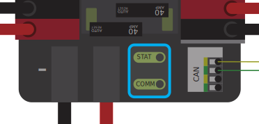

.. include:: <isonum.txt>

Status Light Quick Reference
============================

Many of the components of the FRC\ |reg| Control System have indicator lights that can be used to quickly diagnose problems with your robot. This guide shows each of the hardware components and describes the meaning of the indicators. Photos and information from Innovation FIRST and Cross the Road Electronics.

Robot Signal Light (RSL)
------------------------

.. image:: images/status-lights/rsl.svg
  :alt: Robot Signal Light with wiring.
  :width: 400

+----------+----------------------------------------------------------+
| Solid ON | Robot On and Disabled                                    |
+----------+----------------------------------------------------------+
| Blinking | Robot On and Enabled                                     |
+----------+----------------------------------------------------------+
| Off      | Robot Off, roboRIO not powered or RSL not wired properly |
+----------+----------------------------------------------------------+

roboRIO
-------

.. image:: images/status-lights/roborio-status-lights.svg
  :alt: roboRIO status lights highlighted.
  :width: 400

+------------+----------------+-----------------------------------------------------------------------------------+
| **Power**  | Green          | Power is good                                                                     |
|            +----------------+-----------------------------------------------------------------------------------+
|            | Amber          | Brownout protection tripped, outputs disabled                                     |
|            +----------------+-----------------------------------------------------------------------------------+
|            | Red            | Power fault, check user rails for short circuit                                   |
+------------+----------------+-----------------------------------------------------------------------------------+
| **Status** | On while the controller is booting, then should turn off                                           |
|            +----------------+-----------------------------------------------------------------------------------+
|            | 2 blinks       | Software error, reimage roboRIO                                                   |
|            +----------------+-----------------------------------------------------------------------------------+
|            | 3 blinks       | Safe Mode, restart roboRIO, reimage if not resolved                               |
|            +----------------+-----------------------------------------------------------------------------------+
|            | 4 blinks       | Software crashed twice without rebooting, reboot roboRIO, reimage if not resolved |
|            +----------------+---------------------------+-------------------------------------------------------+
|            | Constant flash or stays solid on           | Unrecoverable error                                   |
+------------+--------------------------------------------+-------------------------------------------------------+
| **Radio**  | Not currently implemented                                                                          |
+------------+----------------+-----------------------------------------------------------------------------------+
| **Comm**   | Off            | No Communication                                                                  |
|            +----------------+-----------------------------------------------------------------------------------+
|            | Red Solid      | Communication with DS, but no user code running                                   |
|            +----------------+-----------------------------------------------------------------------------------+
|            | Red Blinking   | E-stop triggered                                                                  |
|            +----------------+-----------------------------------------------------------------------------------+
|            | Green Solid    | Good communications with DS                                                       |
+------------+----------------+-----------------------------------------------------------------------------------+
| **Mode**   | Off            | Outputs disabled (robot in Disabled, brown-out, etc.)                             |
|            +----------------+-----------------------------------------------------------------------------------+
|            | Orange         | Autonomous Enabled                                                                |
|            +----------------+-----------------------------------------------------------------------------------+
|            | Green          | Teleop Enabled                                                                    |
|            +----------------+-----------------------------------------------------------------------------------+
|            | Red            | Test Enabled                                                                      |
+------------+----------------+-----------------------------------------------------------------------------------+
| **RSL**    | `See above <#robot-signal-light-rsl>`_                                                             |
+------------+----------------------------------------------------------------------------------------------------+

OpenMesh Radio
--------------

.. image:: images/status-lights/openmesh-radio-status-lights.png
  :alt: Radio with the Wifi, Eth Link (2), and Power ports labeled.
  :width: 600

+----------+---------------+------------------------------+
| Power    | Blue          | On or Powering up            |
|          +---------------+------------------------------+
|          | Blue Blinking | Powering Up                  |
+----------+---------------+------------------------------+
| Eth Link | Blue          | Link up                      |
|          +---------------+------------------------------+
|          | Blue Blinking | Traffic Present              |
+----------+---------------+------------------------------+
| WiFi     | Off           | Bridge mode,                 |
|          |               | Unlinked or non-FRC firmware |
|          +---------------+------------------------------+
|          | Red           | AP, Unlinked                 |
|          +---------------+------------------------------+
|          | Yellow/Orange | AP, Linked                   |
|          +---------------+------------------------------+
|          | Green         | Bridge mode, Linked          |
+----------+---------------+------------------------------+

Power Distribution Panel
------------------------

PDP Status/Comm LEDs
^^^^^^^^^^^^^^^^^^^^

+--------+--------------------------+---------------------------+
| LED    | Strobe                   | Slow                      |
+========+==========================+===========================+
| Green  | No Fault - Robot Enabled | No Fault - Robot Disabled |
+--------+--------------------------+---------------------------+
| Orange | NA                       | Sticky Fault              |
+--------+--------------------------+---------------------------+
| Red    | NA                       | No CAN Comm               |
+--------+--------------------------+---------------------------+

.. tip:: If a PDP LED is showing more than one color, see the PDP LED special states table below. For more information on resolving PDP faults see the PDP User Manual.

.. note:: Note that the No CAN Comm fault will occur if the PDP cannot communicate with the roboRIO via CAN Bus.

PDP Special States
^^^^^^^^^^^^^^^^^^

+--------------+------------------------------+
| LED Colors   | Problem                      |
+==============+==============================+
| Red/Orange   | Damaged Hardware             |
+--------------+------------------------------+
| Green/Orange | In Bootloader                |
+--------------+------------------------------+
| No LED       | No Power/ Incorrect Polarity |
+--------------+------------------------------+

Power Distribution Hub
----------------------

.. note:: These led patterns only apply to firmware version 21.1.7 and later

PDH Status LED
--------------

+-------------------------+--------------------------------------------------------+
| LED Color               | Status                                                 |
+-------------------------+--------------------------------------------------------+
| Blue Solid              | Device on but no communication established             |
+-------------------------+--------------------------------------------------------+
| Green Solid             | Main Communication with roboRIO established            |
+-------------------------+--------------------------------------------------------+
| Magenta Blinking        | Keep Alive Timeout                                     |
+-------------------------+--------------------------------------------------------+
| Solid Cyan              | Secondary Heartbeat (Connected to REV Hardware Client) |
+-------------------------+--------------------------------------------------------+
| Orange/Blue Blinking    | Low Battery                                            |
+-------------------------+--------------------------------------------------------+
| Orange/Yellow Blinking  | CAN Fault                                              |
+-------------------------+--------------------------------------------------------+
| Orange/Cyan Blinking    | Hardware Fault                                         |
+-------------------------+--------------------------------------------------------+
| Orange/Red Blinking     | Fail Safe                                              |
+-------------------------+--------------------------------------------------------+
| Orange/Magenta Blinking | Device Over Current                                    |
+-------------------------+--------------------------------------------------------+

Channel LEDs
^^^^^^^^^^^^

+--------------+----------------------------------------------------------------------------------------------------------+
| LED Color    | Status                                                                                                   |
+--------------+----------------------------------------------------------------------------------------------------------+
| Off          | Channel has voltage and is operating as expected                                                         |
+--------------+----------------------------------------------------------------------------------------------------------+
| Red Solid    | Channel has NO voltage and there is an active fault. Check for tripped or missing circuit breaker / fuse |
+--------------+----------------------------------------------------------------------------------------------------------+
| Red Blinking | Sticky fault on the channel. Check for tripped circuit breaker / fuse.                                   |
+--------------+----------------------------------------------------------------------------------------------------------+

Voltage Regulator Module
------------------------

.. image:: images/status-lights/vrm-status-lights.svg
  :alt: Highlights the position of the 12V and 5V status lights.
  :width: 400

The status LEDs on the VRM indicate the state of the two power supplies. If the supply is functioning properly the LED should be lit bright green. If the LED is not lit or is dim, the output may be shorted or drawing too much current.

Pneumatics Control Module (PCM)
-------------------------------

.. image:: images/status-lights/pcm-status-lights.svg
  :alt: Highlights both the "Status" and "Comp" lights in the middle and the individual channel lights on the sides.
  :width: 400

PCM Status LED
^^^^^^^^^^^^^^

+--------+---------------+-------------------------------+------------------+
| LED    | Strobe        | Slow                          | Long             |
+========+===============+===============================+==================+
| Green  | No Fault      | Sticky Fault                  | NA               |
|        | Robot Enabled |                               |                  |
+--------+---------------+-------------------------------+------------------+
| Orange | NA            | Sticky Fault                  | NA               |
+--------+---------------+-------------------------------+------------------+
| Red    | NA            | No CAN Comm or Solenoid Fault | Compressor Fault |
|        |               | (Blinks Solenoid Index)       |                  |
+--------+---------------+-------------------------------+------------------+

.. tip:: If a PCM LED is showing more than one color, see the PCM LED special states table below. For more information on resolving PCM faults see the PCM User Manual.

.. note:: Note that the No CAN Comm fault will not occur only if the device cannot communicate with any other device, if the PCM and PDP can communicate with each other, but not the roboRIO.

PCM LED Special States Table
^^^^^^^^^^^^^^^^^^^^^^^^^^^^

+--------------+-----------------------------+
| LED          | Problems                    |
+==============+=============================+
| Red/Orange   | Damaged Hardware            |
+--------------+-----------------------------+
| Green/Orange | In Bootloader               |
+--------------+-----------------------------+
| No LED       | No Power/Incorrect Polarity |
+--------------+-----------------------------+

PCM Comp LED
^^^^^^^^^^^^

This is the Compressor LED. This LED is green when the compressor output is active (compressor is currently on) and off when the compressor output is not active.

PCM Solenoid Channel LEDs
^^^^^^^^^^^^^^^^^^^^^^^^^

These LEDs are lit red if the Solenoid channel is enabled and not lit if it is disabled.

Pneumatic Hub
-------------

.. image:: images/status-lights/pneumatic-hub.png
  :alt: REV Pneumatic Hub with Status LED, Compressor LED, and Solenoid LEDs highlighted
  :width: 400

.. note:: These led patterns only apply to firmware version 21.1.7 and later

PH Status LED
^^^^^^^^^^^^^

+-------------------------+--------------------------------------------------+
| LED Color               | Status                                           |
+=========================+==================================================+
| Blue Solid              | Device on but no communication established       |
+-------------------------+--------------------------------------------------+
| Green Solid             | Main Communication established                   |
+-------------------------+--------------------------------------------------+
| Magenta Blinking        | Keep Alive Timeout                               |
+-------------------------+--------------------------------------------------+
| Solid Cyan              | Secondary Heartbeat (connected to REV HW Client) |
+-------------------------+--------------------------------------------------+
| Orange/Blue Blinking    | Hardware Fault                                   |
+-------------------------+--------------------------------------------------+
| Orange/Yellow Blinking  | CAN Fault                                        |
+-------------------------+--------------------------------------------------+
| Orange/Red Blinking     | Fail Safe                                        |
+-------------------------+--------------------------------------------------+
| Orange/Magenta Blinking | Device Over Current                              |
+-------------------------+--------------------------------------------------+
| Orange/Green Blinking   | Orange/Green Blinking                            |
+-------------------------+--------------------------------------------------+

Compressor LED
^^^^^^^^^^^^^^

+-------------+----------------+
| LED Color   | Status         |
+=============+================+
| Green Solid | Compressor On  |
+-------------+----------------+
| Black Solid | Compressor Off |
+-------------+----------------+

Solenoid LEDs
^^^^^^^^^^^^^

+-------------+--------------+
| LED Color   | Status       |
+=============+==============+
| Green Solid | Solenoid On  |
+-------------+--------------+
| Black Solid | Solenoid Off |
+-------------+--------------+

Talon SRX & Victor SPX & Talon FX Motor Controllers
---------------------------------------------------

.. image:: images/status-lights/talon-srx-status-lights.png
  :alt: Status LEDs on either side of the center of the Talon SRX.
  :width: 600

Status LEDs During Normal Operation
^^^^^^^^^^^^^^^^^^^^^^^^^^^^^^^^^^^

+------------------------------+----------------+--------------------------------------------+
| LEDs                         | Colors         | Talon SRX State                            |
+==============================+================+============================================+
| Both                         | Blinking Green | Forward throttle is applied.               |
|                              |                | Blink rate is proportional to Duty Cycle.  |
+------------------------------+----------------+--------------------------------------------+
| Both                         | Blinking Red   | Reverse throttle is applied.               |
|                              |                | Blink rate is proportional to Duty Cycle.  |
+------------------------------+----------------+--------------------------------------------+
| None                         | None           | No power is being applied to Talon SRX     |
+------------------------------+----------------+--------------------------------------------+
| LEDs Alternate               | Off/Orange     | CAN bus detected, robot disabled           |
+------------------------------+----------------+--------------------------------------------+
| LEDs Alternate               | Off/Slow Red   | CAN bus/PWM is not detected                |
+------------------------------+----------------+--------------------------------------------+
| LEDs Alternate               | Off/Fast Red   | Fault Detected                             |
+------------------------------+----------------+--------------------------------------------+
| LEDs Alternate               | Red/Orange     | Damaged Hardware                           |
+------------------------------+----------------+--------------------------------------------+
| LEDs Strobe towards (M-)     | Off/Red        | Forward Limit Switch or Forward Soft Limit |
+------------------------------+----------------+--------------------------------------------+
| LEDs Strobe towards (M+)     | Off/Red        | Reverse Limit Switch or Reverse Soft Limit |
+------------------------------+----------------+--------------------------------------------+
| LED1 Only (closest to M+/V+) | Green/Orange   | In Boot-loader                             |
+------------------------------+----------------+--------------------------------------------+
| LEDs Strobe towards (M+)     | Off/Orange     | Thermal Fault / Shutoff (Talon FX Only)    |
+------------------------------+----------------+--------------------------------------------+

Status LEDs During Calibration
^^^^^^^^^^^^^^^^^^^^^^^^^^^^^^

+------------------------+------------------------+
| Status LEDs Blink Code | Talon SRX State        |
+========================+========================+
| Flashing Red/Green     | Calibration Mode       |
+------------------------+------------------------+
| Blinking Green         | Successful Calibration |
+------------------------+------------------------+
| Blinking Red           | Failed Calibration     |
+------------------------+------------------------+

B/C CAL Blink Codes
^^^^^^^^^^^^^^^^^^^

+----------------------+-----------------+
| B/C CAL Button Color | Talon SRX State |
+======================+=================+
| Solid Red            | Brake Mode      |
+----------------------+-----------------+
| Off                  | Coast Mode      |
+----------------------+-----------------+

SPARK-MAX Motor Controller
--------------------------

REV Robotics SPARK
------------------

.. image:: images/status-lights/sparkLight.png
  :alt: Table of the SPARK blink codes.

Victor-SP Motor Controller
--------------------------

.. image:: images/status-lights/victorSPLight.png
  :alt: Status LEDs on either side of the center of the Victor-SP.
  :width: 600

Brake/Coast/Cal Button/LED - Red if the controller is in brake mode, off if the controller is in coast mode

Status
^^^^^^

+-----------+----------+------------------------------------------------------------------------+
| Green     | Solid    | Full forward output                                                    |
|           +----------+------------------------------------------------------------------------+
|           | Blinking | Proportional to forward output voltage                                 |
+-----------+----------+------------------------------------------------------------------------+
| Red       | Solid    | Full reverse output                                                    |
|           +----------+------------------------------------------------------------------------+
|           | Blinking | Proportional to forward output voltage                                 |
+-----------+----------+------------------------------------------------------------------------+
| Orange    | Solid    | FRC robot disabled, PWM signal lost, or                                |
|           |          | signal in deadband range (+/- 4% output)                               |
+-----------+----------+------------------------------------------------------------------------+
| Red/Green | Blinking | Ready for calibration. Several green flashes indicates successful      |
|           |          | calibration, and red several times indicates unsuccessful calibration. |
+-----------+----------+------------------------------------------------------------------------+

Talon Motor Controller
----------------------

.. image:: images/status-lights/talonsr-status-light.png
  :alt: Talon motor controller with a single multicolor LED in the bottom right corner.

+-----------+----------+------------------------------------------------------------------------+
| Green     | Solid    | Full forward output                                                    |
|           +----------+------------------------------------------------------------------------+
|           | Blinking | Proportional to forward output voltage                                 |
+-----------+----------+------------------------------------------------------------------------+
| Red       | Solid    | Full reverse output                                                    |
|           +----------+------------------------------------------------------------------------+
|           | Blinking | Proportional to reverse output voltage                                 |
+-----------+----------+------------------------------------------------------------------------+
| Orange    | Solid    | No CAN devices are connected                                           |
|           +----------+------------------------------------------------------------------------+
|           | Blinking | Disabled state, PWM signal lost, FRC robot disabled, or                |
|           |          | signal in deadband range (+/- 4% output)                               |
+-----------+----------+------------------------------------------------------------------------+
| Off                  | No input power to Talon                                                |
+-----------+----------+------------------------------------------------------------------------+
| Red/Green | Flashing | Ready for calibration. Several green flashes indicates successful      |
|           |          | calibration, and red several times indicates unsuccessful calibration. |
+-----------+----------+------------------------------------------------------------------------+

Victor888 Motor Controller
--------------------------

.. image:: images/status-lights/victor888-status-light.svg
  :alt: Victor888 motor controller with a single multicolor LED in the bottom right corner.
  :width: 600

+-----------+----------+--------------------------+
| Green     | Solid    | Full forward output      |
|           +----------+--------------------------+
|           | Blinking | Successful calibration   |
+-----------+----------+--------------------------+
| Red       | Solid    | Full reverse output      |
|           +----------+--------------------------+
|           | Blinking | Unsuccessful calibration |
+-----------+----------+--------------------------+
| Orange    | Solid    | Neutral/brake            |
+-----------+----------+--------------------------+
| Red/Green | Blinking | Calibration mode         |
+-----------+----------+--------------------------+

Jaguar Motor Controller
-----------------------

.. image:: images/status-lights/jaguar-status-light.png
  :alt: Jaguar motor controller with a single multicolor LED in the bottom center.
  :width: 400

+------------------------------+------------------------------------------------+
| LED State                    | Module Status                                  |
+==============================+================================================+
| Normal Operating Conditions                                                   |
+------------------------------+------------------------------------------------+
| Solid Yellow                 | Neutral (speed set to 0)                       |
+------------------------------+------------------------------------------------+
| Fast Flashing Green          | Forward                                        |
+------------------------------+------------------------------------------------+
| Fast Flashing Red            | Reverse                                        |
+------------------------------+------------------------------------------------+
| Solid Green                  | Full-speed forward                             |
+------------------------------+------------------------------------------------+
| Solid Red                    | Full-speed reverse                             |
+------------------------------+------------------------------------------------+
| Fault Conditions                                                              |
+------------------------------+------------------------------------------------+
| Slow Flashing Yellow         | Loss of servo or Network link                  |
+------------------------------+------------------------------------------------+
| Fast Flashing Yellow         | Invalid CAN ID                                 |
+------------------------------+------------------------------------------------+
| Slow Flashing Red            | Voltage, Temperature, or                       |
|                              | Limit Switch fault condition                   |
+------------------------------+------------------------------------------------+
| Slow Flashing Red and Yellow | Current fault condition                        |
+------------------------------+------------------------------------------------+
| Calibration or CAN Conditions                                                 |
+------------------------------+------------------------------------------------+
| Flashing Red and Green       | Calibration mode active                        |
+------------------------------+------------------------------------------------+
| Flashing Red and Yellow      | Calibration mode failure                       |
+------------------------------+------------------------------------------------+
| Flashing Green and Yellow    | Calibration mode success                       |
+------------------------------+------------------------------------------------+
| Slow Flashing Green          | CAN ID assignment mode                         |
+------------------------------+------------------------------------------------+
| Fast Flashing Yellow         | Current CAN ID (count flashes to determine ID) |
+------------------------------+------------------------------------------------+
| Flashing Yellow              | CAN ID invalid (that is, Set to 0)             |
|                              | awaiting valid ID assignment                   |
+------------------------------+------------------------------------------------+

Digilent DMC-60
---------------

.. image:: images/status-lights/dmc60c-status-lights.png
  :alt: The 5 LEDs in each of the corners plus the center.

The DMC60C contains four RGB (Red, Green, and Blue) LEDs and one Brake/Coast CAL LED. The four RGB LEDs are located in the corners and are used to indicate status during normal operation, as well as when a fault occurs. The Brake/Coast CAL LED is located in the center of the triangle, which is located at the center of the housing, and is used to indicate the current Brake/Coast setting. When the center LED is off, the device is operating in coast mode. When the center LED is illuminated, the device is operating in brake mode. The Brake/Coast mode can be toggled by pressing down on the center of the triangle, and then releasing the button.

At power-on, the RGB LEDs illuminate Blue, continually getting brighter. This lasts for approximately five seconds. During this time, the motor controller will not respond to an input signal, nor will the output drivers be enabled. After the initial power-on has completed, the device begins normal operation and what gets displayed on the RGB LEDs is a function of the input signal being applied, as well as the current fault state. Assuming that no faults have occurred, the RGB LEDs function as follows:

+----------------------------+---------------------------------------------------------------------------------------------------------------+
| PWM Signal Applied         | LED State                                                                                                     |
+============================+===============================================================================================================+
| No Input Signal or         | Alternate between top (LED1 and LED2) and bottom (LED3 and LED4) LEDs being illuminated Red and Off.          |
| Invalid Input Pulse Width  |                                                                                                               |
+----------------------------+---------------------------------------------------------------------------------------------------------------+
| Neutral Input Pulse Width  | All 4 LEDs illuminated Orange.                                                                                |
+----------------------------+---------------------------------------------------------------------------------------------------------------+
|                            | LEDs blink Green in a clockwise circular pattern (LED1 → LED2 → LED3 → LED4 → LED1).                          |
| Positive Input Pulse Width | The LED update rate is proportional to the duty cycle of the output and increases with increased duty cycle.  |
|                            | At 100% duty cycle, all 4 LEDs are illuminated Green.                                                         |
+----------------------------+---------------------------------------------------------------------------------------------------------------+
|                            | LEDs blink Red in a counter-clockwise circular pattern (LED1 → LED4 → LED3 → LED2 → LED1).                    |
| Negative Input Pulse Width | The LED update rate is proportional to the duty cycle of the output and increases with increased duty cycle.  |
|                            | At 100% duty cycle, all 4 LEDs are illuminated Red.                                                           |
+----------------------------+---------------------------------------------------------------------------------------------------------------+

+-------------------------------------------------------------------------------------------+--------------------------------------------------------------------------------------------------------------------------------------------------------------------+
| CAN Bus Control State                                                                     | LED State                                                                                                                                                          |
+===========================================================================================+====================================================================================================================================================================+
| No Input Signal or CAN bus error detected                                                 | Alternate between top (LED1 and LED2) and bottom (LED3 and LED4) LEDs being illuminated Red and Off.                                                               |
+-------------------------------------------------------------------------------------------+--------------------------------------------------------------------------------------------------------------------------------------------------------------------+
| No CAN Control Frame received within the last 100ms or                                    | Alternate between top (LED1 and LED2) and bottom (LED3 and LED4) LEDs being illuminated Orange and Off.                                                            |
| the last control frame specified modeNoDrive (Output Disabled)                            |                                                                                                                                                                    |
+-------------------------------------------------------------------------------------------+--------------------------------------------------------------------------------------------------------------------------------------------------------------------+
| Valid CAN Control Frame received within the last 100ms.                                   | All 4 LEDs illuminated solid Orange.                                                                                                                               |
| The specified control mode resulted in a Neutral Duty Cycle being applied to Motor Output |                                                                                                                                                                    |
+-------------------------------------------------------------------------------------------+--------------------------------------------------------------------------------------------------------------------------------------------------------------------+
| Valid CAN Control Frame received within the last 100ms.                                   | LEDs blink Green in a clockwise circular pattern (LED1 → LED2 → LED3 → LED4 → LED1).                                                                               |
| The specified control mode resulted in a Positive Duty Cycle being Motor Output           | The LED update rate is proportional to the duty cycle of the output and increases with increased duty cycle. At 100% duty cycle, all 4 LEDs are illuminated Green. |
+-------------------------------------------------------------------------------------------+--------------------------------------------------------------------------------------------------------------------------------------------------------------------+
| Valid CAN Control Frame received within the last 100ms.                                   | LEDs blink Red in a counter-clockwise circular pattern (LED1 → LED4 → LED3 → LED2 → LED1).                                                                         |
| The specified control mode resulted in a Negative Duty Cycle being Motor Output           | The LED update rate is proportional to the duty cycle of the output and increases with increased duty cycle. At 100% duty cycle, all 4 LEDs are illuminated Red.   |
+-------------------------------------------------------------------------------------------+--------------------------------------------------------------------------------------------------------------------------------------------------------------------+

Fault Color Indicators
^^^^^^^^^^^^^^^^^^^^^^

When a fault condition is detected, the output duty cycle is reduced to 0% and a fault is signaled. The output then remains disabled for 3 seconds. During this time the onboard LEDs (LED1-4) are used to indicate the fault condition. The fault condition is indicated by toggling between the top (LED1 and LED2) and bottom (LED3 and LED4) LEDs being illuminated Red and off. The color of the bottom LEDs depends on which faults are presently active. The table below describes how the color of the bottom LEDs maps to the presently active faults.

+-------------+------------------+---------------+
| Color       | Over Temperature | Under Voltage |
+=============+==================+===============+
| Green       | On               | Off           |
+-------------+------------------+---------------+
| Blue        | Off              | On            |
+-------------+------------------+---------------+
| Cyan / Aqua | On               | On            |
+-------------+------------------+---------------+

Break/Coast Mode
^^^^^^^^^^^^^^^^

When the center LED is off the device is operating in coast mode. When the center LED is illuminated the device is operating in brake mode. The Brake/Coast mode can be toggled by pressing down on the center of the triangle and then releasing the button.

Venom Motor Controller
----------------------

Mindsensors SD540B (PWM)
------------------------

.. image:: images/status-lights/sd540b-status-lights.png
  :alt: The two LEDs on the top one at each end and the LED on the side next to the connector.
  :width: 600

+----------------+-------+---------------------------------+
| Power LED      | Off   | Power is not supplied           |
|                +-------+---------------------------------+
|                | Red   | Power is supplied               |
+----------------+-------+---------------------------------+
| Motor LED      | Red   | Forward direction               |
|                +-------+---------------------------------+
|                | Green | Reverse direction               |
+----------------+-------+---------------------------------+
| PWM Signal LED | Red   | No valid PWM signal is detected |
|                +-------+---------------------------------+
|                | Green | Valid PWM signal is detected    |
+----------------+-------+---------------------------------+

Mindsensors SD540C (CAN Bus)
----------------------------

.. image:: images/status-lights/sd540c-status-lights.png
  :alt: The two LEDs on the top one at each end and the LED on the side next to the connector.
  :width: 600

+----------------+------------------+---------------------------------------------------------+
| Power LED      | Off              | Power is not supplied                                   |
|                +------------------+---------------------------------------------------------+
|                | Red              | Power is supplied                                       |
+----------------+------------------+---------------------------------------------------------+
| Motor LED      | Red              | Forward direction                                       |
|                +------------------+---------------------------------------------------------+
|                | Green            | Reverse direction                                       |
+----------------+------------------+---------------------------------------------------------+
| CAN Signal LED | Blinking quickly | No CAN devices are connected                            |
|                +------------------+---------------------------------------------------------+
|                | Off              | Connected to the roboRIO and the driver station is open |
+----------------+------------------+---------------------------------------------------------+

REV Robotics Servo Power Module
-------------------------------

.. image:: images/status-lights/rev-robotics-servo-power-module.png
  :alt: One power LED and a status LED for each channel all down the center.
  :width: 400

Status LEDs
^^^^^^^^^^^

Each channel has a corresponding status LED that will indicate the sensed state of the connected PWM signal. The table below describes each state’s corresponding LED pattern.

+-----------------------+----------------+
| State                 | Pattern        |
+=======================+================+
| No Signal             | Blinking Amber |
+-----------------------+----------------+
| Left/Reverse Signal   | Solid Red      |
+-----------------------+----------------+
| Center/Neutral Signal | Solid Amber    |
+-----------------------+----------------+
| Right/Forward Signal  | Solid Green    |
+-----------------------+----------------+

- 6V Power LED off, dim or flickering with power applied = Over-current shutdown

Spike relay configured as a motor, light, or solenoid switch
------------------------------------------------------------

.. image:: images/status-lights/spikeRelay1Light.png
  :alt: Single LED in the corner.
  :width: 600

+-----------------------------------------+-----------------+---------------+-------------------------------------+
| **Inputs**                              | **Outputs**     | **Indicator** | **Motor Function**                  |
+---------------------+-------------------+--------+--------+               |                                     |
| **Forward (White)** | **Reverse (Red)** | **M+** | **M-** |               |                                     |
+---------------------+-------------------+--------+--------+---------------+-------------------------------------+
| Off                 | Off               | GND    | GND    | Orange        | Off/Brake Condition (default)       |
+---------------------+-------------------+--------+--------+---------------+-------------------------------------+
| On                  | Off               | +12v   | GND    | Green         | Motor rotates in one direction      |
+---------------------+-------------------+--------+--------+---------------+-------------------------------------+
| Off                 | On                | GND    | +12v   | Red           | Motor rotates in opposite direction |
+---------------------+-------------------+--------+--------+---------------+-------------------------------------+
| On                  | On                | +12v   | +12v   | Off           | Off/Brake Condition                 |
+---------------------+-------------------+--------+--------+---------------+-------------------------------------+

.. note:: 'Brake Condition' refers to the dynamic stopping of the motor due to the shorting of the motor inputs. This condition is not optional when going to an off state.

Spike relay configured as for one or two solenoids
--------------------------------------------------

.. image:: images/status-lights/spikeRelay2Light.png
  :alt: Single LED in the corner.
  :width: 600

+-----------------------------------------+-----------------+---------------+--------------------------------+
| **Inputs**                              | **Outputs**     | **Indicator** | **Motor Function**             |
+---------------------+-------------------+--------+--------+               |                                |
| **Forward (White)** | **Reverse (Red)** | **M+** | **M-** |               |                                |
+---------------------+-------------------+--------+--------+---------------+--------------------------------+
| Off                 | Off               | GND    | GND    | Orange        | Both Solenoids Off (default)   |
+---------------------+-------------------+--------+--------+---------------+--------------------------------+
| On                  | Off               | +12v   | GND    | Green         | Solenoid connected to M+ is ON |
+---------------------+-------------------+--------+--------+---------------+--------------------------------+
| Off                 | On                | GND    | +12v   | Red           | Solenoid connected to M- is ON |
+---------------------+-------------------+--------+--------+---------------+--------------------------------+
| On                  | On                | +12v   | +12v   | Off           | Both Solenoids ON              |
+---------------------+-------------------+--------+--------+---------------+--------------------------------+

CANCoder Encoder
----------------

.. image:: images/status-lights/cancoder-status-lights.png
  :alt: LED at the top of the encoder.
  :width: 400

+---------------------+-----------------+------------------------------------+-----------------------------------------------------------------------+-----------------------------------------------------------------+
| LED Color           | LED Brightness  | CAN Bus detection                  | Magnet Field Strength                                                 | Description                                                     |
+=====================+=================+====================================+=======================================================================+=================================================================+
| Off                 | Off             |                                    |                                                                       | CANCoder is not powered                                         |
+---------------------+-----------------+------------------------------------+-----------------------------------------------------------------------+-----------------------------------------------------------------+
| Yellow/Green        | Bright          |                                    |                                                                       | Device is in boot-loader. See user manual for more information. |
+---------------------+-----------------+------------------------------------+-----------------------------------------------------------------------+-----------------------------------------------------------------+
| Slow Red Blink      | Bright          | CAN bus has been lost              |                                                                       |                                                                 |
+---------------------+-----------------+------------------------------------+-----------------------------------------------------------------------+-----------------------------------------------------------------+
| Rapid Red Blink     | Dim             | CAN bus never detected since boot  | Magnet is out of range (<25mT or >135mT)                              |                                                                 |
+---------------------+                 +                                    +-----------------------------------------------------------------------+-----------------------------------------------------------------+
| Rapid Yellow Blink  |                 |                                    | Magnet in range with slightly reduced accuracy (25-45mT or 75-135mT)  |                                                                 |
+---------------------+                 +                                    +-----------------------------------------------------------------------+-----------------------------------------------------------------+
| Rapid Green Blink   |                 |                                    | Magnet in range (between 45mT - 75mT)                                 |                                                                 |
+---------------------+-----------------+------------------------------------+-----------------------------------------------------------------------+-----------------------------------------------------------------+
| Rapid Red Blink     | Bright          | CAN bus present                    | Magnet is out of range (<25mT or >135mT)                              |                                                                 |
+---------------------+                 +                                    +-----------------------------------------------------------------------+-----------------------------------------------------------------+
| Rapid Yellow Blink  |                 |                                    | Magnet in range with slightly reduced accuracy (25-45mT or 75-135mT)  |                                                                 |
+---------------------+                 +                                    +-----------------------------------------------------------------------+-----------------------------------------------------------------+
| Rapid Green Blink   |                 |                                    | Magnet in range (between 45mT - 75mT)                                 |                                                                 |
+---------------------+-----------------+------------------------------------+-----------------------------------------------------------------------+-----------------------------------------------------------------+
