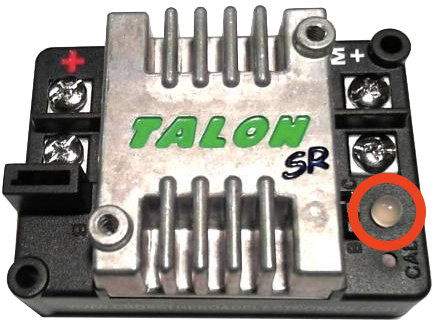
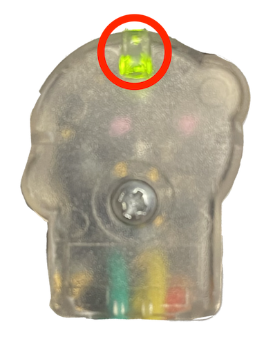

.. include:: <isonum.txt>

# Status Light Quick Reference

Many of the components of the FRC\ |reg| Control System have indicator lights that can be used to quickly diagnose problems with your robot. This guide shows each of the hardware components and describes the meaning of the indicators. Photos and information from Innovation FIRST and Cross the Road Electronics.

A compact and printable `Status Light Quick Reference <https://wpilib.org/s/Status-Light-Reference.pdf>`_ is available.

## Robot Signal Light (RSL)

.. image:: images/status-lights/rsl.svg
  :alt: Robot Signal Light with wiring.
  :width: 400

+----------+----------------------------------------------------------+
| Solid ON | Robot On and Disabled                                    |
+----------+----------------------------------------------------------+
| Blinking | Robot On and Enabled                                     |
+----------+----------------------------------------------------------+
| Off      | Robot Off, roboRIO not powered or RSL not wired properly |
+----------+----------------------------------------------------------+

## roboRIO

.. image:: images/status-lights/roborio-status-lights.svg
  :alt: roboRIO status lights highlighted.
  :width: 400

+------------+----------------+-----------------------------------------------------------------------------------+
| **Power**  | Green          | Power is good                                                                     |
|            +----------------+-----------------------------------------------------------------------------------+
|            | Amber          | Brownout protection tripped, outputs disabled                                     |
|            +----------------+-----------------------------------------------------------------------------------+
|            | Red            | Power fault, check user rails for short circuit                                   |
+------------+----------------+-----------------------------------------------------------------------------------+
| **Status** | On while the controller is booting, then should turn off                                           |
|            +----------------+-----------------------------------------------------------------------------------+
|            | 2 blinks       | Software error, reimage roboRIO                                                   |
|            +----------------+-----------------------------------------------------------------------------------+
|            | 3 blinks       | Safe Mode, restart roboRIO, reimage if not resolved                               |
|            +----------------+-----------------------------------------------------------------------------------+
|            | 4 blinks       | Software crashed twice without rebooting, reboot roboRIO, reimage if not resolved |
|            +----------------+---------------------------+-------------------------------------------------------+
|            | Constant flash or stays solid on           | Unrecoverable error                                   |
+------------+--------------------------------------------+-------------------------------------------------------+
| **Radio**  | Not currently implemented                                                                          |
+------------+----------------+-----------------------------------------------------------------------------------+
| **Comm**   | Off            | No Communication                                                                  |
|            +----------------+-----------------------------------------------------------------------------------+
|            | Red Solid      | Communication with DS, but no user code running                                   |
|            +----------------+-----------------------------------------------------------------------------------+
|            | Red Blinking   | E-stop triggered                                                                  |
|            +----------------+-----------------------------------------------------------------------------------+
|            | Green Solid    | Good communications with DS                                                       |
+------------+----------------+-----------------------------------------------------------------------------------+
| **Mode**   | Off            | Outputs disabled (robot in Disabled, brown-out, etc.)                             |
|            +----------------+-----------------------------------------------------------------------------------+
|            | Orange         | Autonomous Enabled                                                                |
|            +----------------+-----------------------------------------------------------------------------------+
|            | Green          | Teleop Enabled                                                                    |
|            +----------------+-----------------------------------------------------------------------------------+
|            | Red            | Test Enabled                                                                      |
+------------+----------------+-----------------------------------------------------------------------------------+
| **RSL**    | `See above <#robot-signal-light-rsl>`_                                                             |
+------------+----------------------------------------------------------------------------------------------------+

## Vivid-Hosting VH-109 Radio

[VH-109 Status Lights](https://frc-radio.vivid-hosting.net/overview/led-status-indications)

+----------+----------------+------------------------------+
| Power    | Green          | On or Powering up            |
|          +----------------+------------------------------+
|          | Off            | No Power                     |
+----------+----------------+------------------------------+
| System   | Solid Green    | Able to ping the field       |
| Status   +----------------+------------------------------+
|          | Blinking (1Hz) | Unable to ping the field     |
|          +----------------+------------------------------+
|          | Blinking (20Hz)| Firmware being flashed       |
|          +----------------+------------------------------+
|          | Blinking (50Hz)| Performing "first boot"      |
|          +----------------+------------------------------+
|          | Off            | Booting Up                   |
+----------+----------------+------------------------------+
| 2.4 GHz  | Solid Green    | Wifi available               |
|          +----------------+------------------------------+
|          | Blinking (20Hz)| Battery detected,            |
|          | Sys Blinking   | Wireless is disabled         |
+----------+----------------+------------------------------+
| 6 GHz    | Solid Blue     | 6 GHz connection made        |
|          +----------------+------------------------------+
|          | Blinking (20Hz)| Battery detected,            |
|          | Sys Blinking   | Wireless is disabled         |
+----------+----------------+------------------------------+

## Power Distribution Panel

.. image:: images/status-lights/pdp-status-lights.svg
  :alt: The location of the "STAT" and "COMM" lights on the PDP.
  :width: 600

### PDP Status/Comm LEDs

+--------+--------------------------+---------------------------+
| LED    | Strobe                   | Slow                      |
+========+==========================+===========================+
| Green  | No Fault - Robot Enabled | No Fault - Robot Disabled |
+--------+--------------------------+---------------------------+
| Orange | NA                       | Sticky Fault              |
+--------+--------------------------+---------------------------+
| Red    | NA                       | No CAN Comm               |
+--------+--------------------------+---------------------------+

.. tip:: If a PDP LED is showing more than one color, see the PDP LED special states table below. For more information on resolving PDP faults see the PDP User Manual.

.. note:: Note that the No :term:`CAN` Comm fault will occur if the PDP cannot communicate with the roboRIO via CAN Bus.

### PDP Special States

+--------------+------------------------------+
| LED Colors   | Problem                      |
+==============+==============================+
| Red/Orange   | Damaged Hardware             |
+--------------+------------------------------+
| Green/Orange | In Bootloader                |
+--------------+------------------------------+
| No LED       | No Power/ Incorrect Polarity |
+--------------+------------------------------+

## Power Distribution Hub

.. image:: images/status-lights/power-distribution-hub.png
  :alt: REV Power Distribution Hub with Status LED, and Channel LEDs Highlighted
  :width: 400

.. note:: These led patterns only apply to firmware version 21.1.7 and later

## PDH Status LED

+-------------------------+--------------------------------------------------------+
| LED Color               | Status                                                 |
+=========================+========================================================+
| Blue Solid              | Device on but no communication established             |
+-------------------------+--------------------------------------------------------+
| Green Solid             | Main Communication with roboRIO established            |
+-------------------------+--------------------------------------------------------+
| Magenta Blinking        | Keep Alive Timeout                                     |
+-------------------------+--------------------------------------------------------+
| Solid Cyan              | Secondary Heartbeat (Connected to REV Hardware Client) |
+-------------------------+--------------------------------------------------------+
| Orange/Blue Blinking    | Low Battery                                            |
+-------------------------+--------------------------------------------------------+
| Orange/Yellow Blinking  | CAN Fault                                              |
+-------------------------+--------------------------------------------------------+
| Orange/Cyan Blinking    | Hardware Fault                                         |
+-------------------------+--------------------------------------------------------+
| Orange/Red Blinking     | Fail Safe                                              |
+-------------------------+--------------------------------------------------------+
| Orange/Magenta Blinking | Device Over Current                                    |
+-------------------------+--------------------------------------------------------+

### Channel LEDs

+--------------+----------------------------------------------------------------------------------------------------------+
| LED Color    | Status                                                                                                   |
+==============+==========================================================================================================+
| Off          | Channel has voltage and is operating as expected                                                         |
+--------------+----------------------------------------------------------------------------------------------------------+
| Red Solid    | Channel has NO voltage and there is an active fault. Check for tripped or missing circuit breaker / fuse |
+--------------+----------------------------------------------------------------------------------------------------------+
| Red Blinking | Sticky fault on the channel. Check for tripped circuit breaker / fuse.                                   |
+--------------+----------------------------------------------------------------------------------------------------------+

## Voltage Regulator Module

.. image:: images/status-lights/vrm-status-lights.svg
  :alt: Highlights the position of the 12V and 5V status lights.
  :width: 400

The status LEDs on the VRM indicate the state of the two power supplies. If the supply is functioning properly the LED should be lit bright green. If the LED is not lit or is dim, the output may be shorted or drawing too much current.

## Pneumatics Control Module (PCM)

.. image:: images/status-lights/pcm-status-lights.svg
  :alt: Highlights both the "Status" and "Comp" lights in the middle and the individual channel lights on the sides.
  :width: 400

### PCM Status LED

+--------+---------------+-------------------------------+------------------+
| LED    | Strobe        | Slow                          | Long             |
+========+===============+===============================+==================+
| Green  | No Fault      | Sticky Fault                  | NA               |
|        | Robot Enabled |                               |                  |
+--------+---------------+-------------------------------+------------------+
| Orange | NA            | Sticky Fault                  | NA               |
+--------+---------------+-------------------------------+------------------+
| Red    | NA            | No CAN Comm or Solenoid Fault | Compressor Fault |
|        |               | (Blinks Solenoid Index)       |                  |
+--------+---------------+-------------------------------+------------------+

.. tip:: If a PCM LED is showing more than one color, see the PCM LED special states table below. For more information on resolving PCM faults see the PCM User Manual.

.. note:: Note that the No CAN Comm fault will not occur only if the device cannot communicate with any other device, if the PCM and PDP can communicate with each other, but not the roboRIO.

### PCM LED Special States Table

+--------------+-----------------------------+
| LED          | Problems                    |
+==============+=============================+
| Red/Orange   | Damaged Hardware            |
+--------------+-----------------------------+
| Green/Orange | In Bootloader               |
+--------------+-----------------------------+
| No LED       | No Power/Incorrect Polarity |
+--------------+-----------------------------+

### PCM Comp LED

This is the Compressor LED. This LED is green when the compressor output is active (compressor is currently on) and off when the compressor output is not active.

### PCM Solenoid Channel LEDs

These LEDs are lit red if the Solenoid channel is enabled and not lit if it is disabled.

## Pneumatic Hub

.. note:: These led patterns only apply to firmware version 21.1.7 and later

### PH Status LED

+-------------------------+--------------------------------------------------+
| LED Color               | Status                                           |
+=========================+==================================================+
| Blue Solid              | Device on but no communication established       |
+-------------------------+--------------------------------------------------+
| Green Solid             | Main Communication established                   |
+-------------------------+--------------------------------------------------+
| Magenta Blinking        | Keep Alive Timeout                               |
+-------------------------+--------------------------------------------------+
| Solid Cyan              | Secondary Heartbeat (connected to REV HW Client) |
+-------------------------+--------------------------------------------------+
| Orange/Blue Blinking    | Hardware Fault                                   |
+-------------------------+--------------------------------------------------+
| Orange/Yellow Blinking  | CAN Fault                                        |
+-------------------------+--------------------------------------------------+
| Orange/Red Blinking     | Fail Safe                                        |
+-------------------------+--------------------------------------------------+
| Orange/Magenta Blinking | Device Over Current                              |
+-------------------------+--------------------------------------------------+
| Orange/Green Blinking   | Orange/Green Blinking                            |
+-------------------------+--------------------------------------------------+

### Compressor LED

+-------------+----------------+
| LED Color   | Status         |
+=============+================+
| Green Solid | Compressor On  |
+-------------+----------------+
| Black Solid | Compressor Off |
+-------------+----------------+

### Solenoid LEDs

+-------------+--------------+
| LED Color   | Status       |
+=============+==============+
| Green Solid | Solenoid On  |
+-------------+--------------+
| Black Solid | Solenoid Off |
+-------------+--------------+

## Talon SRX & Victor SPX Motor Controllers

These motor controllers use Phoenix 5. For the most up-to-date information, see the `CTRE Phoenix 5 Documentation <https://v5.docs.ctr-electronics.com/en/stable/ch13_MC.html>`__.

### Talon SRX/Victor SPX Status LEDs During Normal Operation

+------------------------------+----------------+--------------------------------------------+
| LEDs                         | Colors         | Device State                               |
+==============================+================+============================================+
| Both                         | Blinking Green | Forward throttle is applied.               |
|                              |                | Blink rate is proportional to Duty Cycle.  |
+------------------------------+----------------+--------------------------------------------+
| Both                         | Blinking Red   | Reverse throttle is applied.               |
|                              |                | Blink rate is proportional to Duty Cycle.  |
+------------------------------+----------------+--------------------------------------------+
| None                         | None           | No power is being applied                  |
+------------------------------+----------------+--------------------------------------------+
| LEDs Alternate               | Off/Orange     | CAN bus detected, robot disabled           |
+------------------------------+----------------+--------------------------------------------+
| LEDs Alternate               | Off/Slow Red   | CAN bus/PWM is not detected                |
+------------------------------+----------------+--------------------------------------------+
| LEDs Alternate               | Off/Fast Red   | Fault Detected                             |
+------------------------------+----------------+--------------------------------------------+
| LEDs Alternate               | Red/Orange     | Damaged Hardware                           |
+------------------------------+----------------+--------------------------------------------+
| LEDs Strobe towards (M-)     | Off/Red        | Forward Limit Switch or Forward Soft Limit |
+------------------------------+----------------+--------------------------------------------+
| LEDs Strobe towards (M+)     | Off/Red        | Reverse Limit Switch or Reverse Soft Limit |
+------------------------------+----------------+--------------------------------------------+
| LED1 Only (closest to M+/V+) | Green/Orange   | In Boot-loader                             |
+------------------------------+----------------+--------------------------------------------+

### Talon SRX/Victor SPX Status LEDs During Calibration

+------------------------+------------------------+
| Status LEDs Blink Code | Device State           |
+========================+========================+
| Flashing Red/Green     | Calibration Mode       |
+------------------------+------------------------+
| Blinking Green         | Successful Calibration |
+------------------------+------------------------+
| Blinking Red           | Failed Calibration     |
+------------------------+------------------------+

### Talon SRX/Victor SPX B/C CAL Blink Codes

+----------------------+--------------+
| B/C CAL Button Color | Device State |
+======================+==============+
| Solid Red            | Brake Mode   |
+----------------------+--------------+
| Off                  | Coast Mode   |
+----------------------+--------------+

## Talon FX Motor Controller

The Talon FX uses Phoenix 6. For the most up-to-date information, see the `CTRE Phoenix 6 Documentation <https://v6.docs.ctr-electronics.com/en/stable/docs/hardware-reference/talonfx/index.html#status-light-reference>`__.

### Talon FX Status LEDs

+------------------------------+-------------------------------------+
| LED State                    | Meaning                             |
+==============================+=====================================+
| LEDs Off                     | No Power                            |
+------------------------------+-------------------------------------+
| Blinking Alternating Red     | No valid CAN/PWM signal             |
+------------------------------+-------------------------------------+
| Blinking Alternating Orange  | CAN detected but no Phoenix running |
+------------------------------+-------------------------------------+
| Blinking Simultaneous Orange | Valid CAN signal, device disabled   |
+------------------------------+-------------------------------------+
| Both Solid Orange            | Enabled with neutral output         |
+------------------------------+-------------------------------------+
| Blinking Simultaneous Red    | Driving in reverse                  |
+------------------------------+-------------------------------------+
| Blinking Simultaneous Green  | Driving forward                     |
+------------------------------+-------------------------------------+
| Offset Alternating Red/Off   | Device limit reached                |
+------------------------------+-------------------------------------+
| Offset Orange/Off            | Thermal cutoff                      |
+------------------------------+-------------------------------------+
| Alternate Red/Green          | Pro-only command while unlicensed   |
+------------------------------+-------------------------------------+
| Alternate Red/Orange         | Damaged Hardware                    |
+------------------------------+-------------------------------------+
| Single LED alternates        | Device in bootloader                |
| Green/Orange                 |                                     |
+------------------------------+-------------------------------------+

### Talon FX B/C CAL Blink Codes

+----------------------+--------------+
| B/C CAL Button Color | Device State |
+======================+==============+
| Solid Red            | Brake Mode   |
+----------------------+--------------+
| Off                  | Coast Mode   |
+----------------------+--------------+

## SPARK-MAX Motor Controller

.. image:: images/status-lights/sparkMAXLight.png
  :alt: Table listing the SPARKMAX blink codes.

## REV Robotics SPARK

.. image:: images/status-lights/sparkLight.png
  :alt: Table of the SPARK blink codes.

## Victor-SP Motor Controller

.. image:: images/status-lights/victorSPLight.png
  :alt: Status LEDs on either side of the center of the Victor-SP.
  :width: 600

Brake/Coast/Cal Button/LED - Red if the controller is in brake mode, off if the controller is in coast mode

### Status

+-----------+----------+------------------------------------------------------------------------+
| Green     | Solid    | Full forward output                                                    |
|           +----------+------------------------------------------------------------------------+
|           | Blinking | Proportional to forward output voltage                                 |
+-----------+----------+------------------------------------------------------------------------+
| Red       | Solid    | Full reverse output                                                    |
|           +----------+------------------------------------------------------------------------+
|           | Blinking | Proportional to forward output voltage                                 |
+-----------+----------+------------------------------------------------------------------------+
| Orange    | Solid    | FRC robot disabled, PWM signal lost, or                                |
|           |          | signal in deadband range (+/- 4% output)                               |
+-----------+----------+------------------------------------------------------------------------+
| Red/Green | Blinking | Ready for calibration. Several green flashes indicates successful      |
|           |          | calibration, and red several times indicates unsuccessful calibration. |
+-----------+----------+------------------------------------------------------------------------+

## Talon Motor Controller

+-----------+----------+------------------------------------------------------------------------+
| Green     | Solid    | Full forward output                                                    |
|           +----------+------------------------------------------------------------------------+
|           | Blinking | Proportional to forward output voltage                                 |
+-----------+----------+------------------------------------------------------------------------+
| Red       | Solid    | Full reverse output                                                    |
|           +----------+------------------------------------------------------------------------+
|           | Blinking | Proportional to reverse output voltage                                 |
+-----------+----------+------------------------------------------------------------------------+
| Orange    | Solid    | No CAN devices are connected                                           |
|           +----------+------------------------------------------------------------------------+
|           | Blinking | Disabled state, PWM signal lost, FRC robot disabled, or                |
|           |          | signal in deadband range (+/- 4% output)                               |
+-----------+----------+------------------------------------------------------------------------+
| Off                  | No input power to Talon                                                |
+-----------+----------+------------------------------------------------------------------------+
| Red/Green | Flashing | Ready for calibration. Several green flashes indicates successful      |
|           |          | calibration, and red several times indicates unsuccessful calibration. |
+-----------+----------+------------------------------------------------------------------------+

## Venom Motor Controller

.. image:: images/status-lights/venom.png
  :alt: The LED blink codes for the Venom.

## REV Robotics Servo Power Module

### Status LEDs

Each channel has a corresponding status LED that will indicate the sensed state of the connected :term:`PWM` signal. The table below describes each state's corresponding LED pattern.

+-----------------------+----------------+
| State                 | Pattern        |
+=======================+================+
| No Signal             | Blinking Amber |
+-----------------------+----------------+
| Left/Reverse Signal   | Solid Red      |
+-----------------------+----------------+
| Center/Neutral Signal | Solid Amber    |
+-----------------------+----------------+
| Right/Forward Signal  | Solid Green    |
+-----------------------+----------------+

- 6V Power LED off, dim, or flickering with power applied = Over-current shutdown

## REV Robotics Servo Hub

[REV Servo Hub Status LED Patterns](https://docs.revrobotics.com/rev-crossover-products/servo/servo-hub/servo-hub-status-led-patterns)

### General Status LED

+-------------------------+----------------------------------------------------------------+
| LED Color               | Status                                                         |
+=========================+================================================================+
| Magenta Blinking        | Powered on but not connected to a controller or                |
|                         | the REV Hardware Client                                        |
+-------------------------+----------------------------------------------------------------+
| Blue Solid              | Connected to REV Hardware Client                               |
+-------------------------+----------------------------------------------------------------+
| Solid Cyan              | Connected to a roboRIO or CAN controller                       |
+-------------------------+----------------------------------------------------------------+
| Green Solid             | Connected to a Control Hub or RS-485 controller                |
+-------------------------+----------------------------------------------------------------+
| Orange/Cyan Blinking    | Battery voltage is lower than 5.5V                             |
+-------------------------+----------------------------------------------------------------+
| Orange/Yellow Blinking  | CAN fault detected                                             |
+-------------------------+----------------------------------------------------------------+
| Orange/Magenta Blinking | Overcurrent fault                                              |
+-------------------------+----------------------------------------------------------------+

## CANCoder Encoder

+---------------------+-----------------+------------------------------------+-----------------------------------------------------------------------+-----------------------------------------------------------------+
| LED Color           | LED Brightness  | CAN Bus detection                  | Magnet Field Strength                                                 | Description                                                     |
+=====================+=================+====================================+=======================================================================+=================================================================+
| Off                 | Off             |                                    |                                                                       | CANCoder is not powered                                         |
+---------------------+-----------------+------------------------------------+-----------------------------------------------------------------------+-----------------------------------------------------------------+
| Yellow/Green        | Bright          |                                    |                                                                       | Device is in boot-loader. See user manual for more information. |
+---------------------+-----------------+------------------------------------+-----------------------------------------------------------------------+-----------------------------------------------------------------+
| Slow Red Blink      | Bright          | CAN bus has been lost              |                                                                       |                                                                 |
+---------------------+-----------------+------------------------------------+-----------------------------------------------------------------------+-----------------------------------------------------------------+
| Rapid Red Blink     | Dim             | CAN bus never detected since boot  | Magnet is out of range (<25mT or >135mT)                              |                                                                 |
+---------------------+                 +                                    +-----------------------------------------------------------------------+-----------------------------------------------------------------+
| Rapid Yellow Blink  |                 |                                    | Magnet in range with slightly reduced accuracy (25-45mT or 75-135mT)  |                                                                 |
+---------------------+                 +                                    +-----------------------------------------------------------------------+-----------------------------------------------------------------+
| Rapid Green Blink   |                 |                                    | Magnet in range (between 45mT - 75mT)                                 |                                                                 |
+---------------------+-----------------+------------------------------------+-----------------------------------------------------------------------+-----------------------------------------------------------------+
| Rapid Red Blink     | Bright          | CAN bus present                    | Magnet is out of range (<25mT or >135mT)                              |                                                                 |
+---------------------+                 +                                    +-----------------------------------------------------------------------+-----------------------------------------------------------------+
| Rapid Yellow Blink  |                 |                                    | Magnet in range with slightly reduced accuracy (25-45mT or 75-135mT)  |                                                                 |
+---------------------+                 +                                    +-----------------------------------------------------------------------+-----------------------------------------------------------------+
| Rapid Green Blink   |                 |                                    | Magnet in range (between 45mT - 75mT)                                 |                                                                 |
+---------------------+-----------------+------------------------------------+-----------------------------------------------------------------------+-----------------------------------------------------------------+

## CANivore

