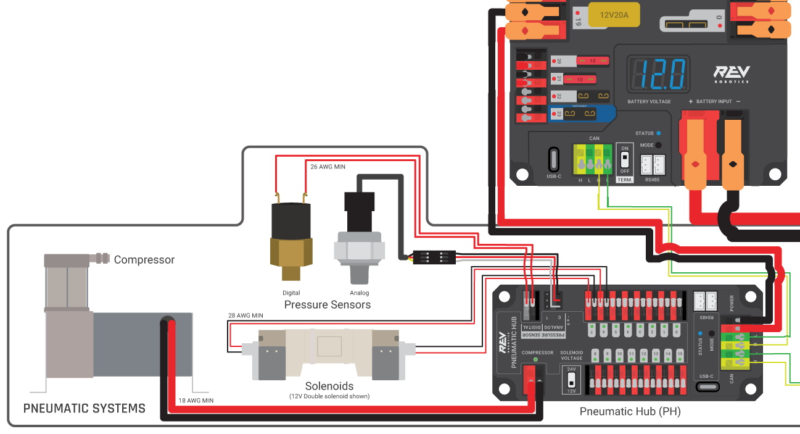

Wiring Pneumatics - REV Pneumatic Hub
=====================================

This page describes wiring pneumatics with the REV Pneumatic Hub (:term:`PH`). For instructions on wiring pneumatics with the CTRE Pneumatic Control Module (:term:`PCM`) see :doc:`this page <wiring-pneumatics-pcm>`.

.. hint:: For pneumatics safety & mechanical requirements, consult this year's Robot Construction rules. For mechanical design guidelines, the FIRST Pneumatics Manual is located [here](https://www.firstinspires.org/sites/default/files/uploads/resource_library/frc/technical-resources/frc_pneumatics_manual.pdf)

.. raw:: html

    

        <iframe src="https://www.youtube-nocookie.com/embed/uQEiNiHT9fs" frameborder="0" allowfullscreen style="position: absolute; top: 0; left: 0; width: 100%; height: 100%;"></iframe>
    

----

Wiring Overview
---------------

A single PH will support most pneumatics applications, providing an output for the compressor, input for a pressure switch, and outputs for up to 16 solenoid channels (12V or 24V selectable). The module is connected to the roboRIO over the :term:`CAN` bus and powered via 12V from the PDP/PDH.

For complicated robot designs requiring more channels or multiple solenoid voltages, additional PHs or PCMs can be added to the control system.

PCM Power and Control Wiring
----------------------------

The first PH on your robot can be wired from the PDP VRM/PCM connectors on the end of the PDP or from a 15A or 20A port on the PDH (20 amp recommended if controlling a compressor). The PH is connected to the roboRIO via CAN and can be placed anywhere in the middle of the CAN chain (or on the end with a custom terminator). For more details on wiring a single PCM, see :ref:`docs/zero-to-robot/step-1/intro-to-frc-robot-wiring:Pneumatics Power (Optional)`

Additional PHs can be wired to a standard WAGO connector on the side of the PDP and protected with a 20A or smaller circuit breaker or to a 15A port on the PDH. Additional PHs should also be placed anywhere in the middle of the CAN chain.

The Compressor
--------------

The compressor can be wired directly to the Compressor connectors on the PH. If additional length is required, make sure to use 18 AWG wire or larger for the extension.

The Pressure Switch
-------------------

The PH has two options for detecting pressure, a digital pressure switch, or an analog pressure switch.

Digital
~~~~~~~

A digital pressure switch should be connected directly to the digital pressure sensor input terminals on the PCM. There is no polarity on the input terminals or on the pressure switch itself, either terminal on the PH can be connected to either terminal on the switch. Ring or spade terminals are recommended for the connection to the switch screws (note that the screws are slightly larger than #6, but can be threaded through a ring terminal with a hole for a #6 screw such as the terminals shown in the image).

Analog
~~~~~~

An analog pressure switch ([REV-11-1107](https://www.revrobotics.com/rev-11-1107/) can be connected directly to the analog pressure sensor port 0 input terminals. Using an analog pressure sensor allows reading the pressure in the pneumatic system through code and setting custom trigger thresholds for turning on and off the compressor.

.. warning:: The Analog Pressure Sensor port is a very tight fit and requires special attention. See [REV Wiring an Analog Pressure Sensor](https://docs.revrobotics.com/ion-control-system/ph/gs/wiring#wiring-an-analog-pressure-sensor) for more tips

Solenoids
---------

Each solenoid channel should be wired directly to a numbered pair of terminals on the PH. A single acting solenoid will use one numbered terminal pair. A double acting solenoid will use two pairs. If your solenoid does not come with color coded wiring, check the datasheet to make sure to wire with the proper polarity.

Solenoid Voltage Switch
------------------------

The PH is capable of powering either 12V or 24V solenoids, but all solenoids connected to a single PH must be the same voltage. Set the voltage switch to the appropriate voltage for solenoids prior to use.
