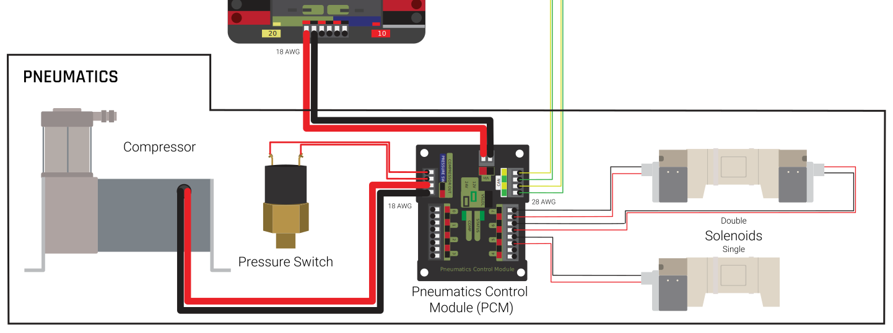
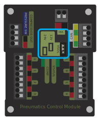

Wiring Pneumatics
=================

.. hint:: For pneumatics safety & mechanical requirements, consult this year's Robot Construction rules. For mechanical design guidelines, the FIRST Pneumatics Manual is located `here <https://www.firstinspires.org/sites/default/files/uploads/resource_library/frc/technical-resources/frc_pneumatics_manual.pdf>`__

Wiring Overview
---------------

A single PCM will support most pneumatics applications, providing an output for the compressor, input for the pressure switch, and outputs for up to 8 solenoid channels (12V or 24V selectable). The module is connected to the roboRIO over the CAN bus and powered via 12V from the PDP.

For complicated robot designs requiring more channels or multiple solenoid voltages, additional PCMs can be added to the control system.

PCM Power and Control Wiring
----------------------------

The first PCM on your robot can be wired from the PDP VRM/PCM connectors on the end of the PDP. The PCM is connected to the roboRIO via CAN and can be placed anywhere in the middle of the CAN chain (or on the end with a custom terminator). For more details on wiring a single PCM, see :ref:`docs/zero-to-robot/step-1/how-to-wire-a-robot:Pneumatics Power (Optional)`

Additional PCMs can be wired to a standard WAGO connector on the side of the PDP and protected with a 20A or smaller circuit breaker. Additional PCMs should also be placed anywhere in the middle of the CAN chain.

The Compressor
---------------

The compressor can be wired directly to the Compressor Out connectors on the PCM. If additional length is required, make sure to use 18 AWG wire or larger for the extension.

The Pressure Switch
----------------------------

The pressure switch should be connected directly to the pressure switch input terminals on the PCM. There is no polarity on the input terminals or on the pressure switch itself, either terminal on the PCM can be connected to either terminal on the switch. Ring or spade terminals are recommended for the connection to the switch screws (note that the screws are slightly larger than #6, but can be threaded through a ring terminal with a hole for a #6 screw such as the terminals shown in the image).

Solenoids
---------

Each solenoid channel should be wired directly to a numbered pair of terminals on the PCM. A single acting solenoid will use one numbered terminal pair. A double acting solenoid will use two pairs. If your solenoid does not come with color coded wiring, check the datasheet to make sure to wire with the proper polarity.

Solenoid Voltage Jumper
------------------------

The PCM is capable of powering either 12V or 24V solenoids, but all solenoids connected to a single PCM must be the same voltage. The PCM ships with the jumper in the 12V position as shown in the image. To use 24V solenoids move the jumper from the left two pins (as shown in the image) to the right two pins. The overlay on the PCM also indicates which position corresponds to which voltage. You may need to use a tool such as a small screwdriver, small pair of pliers, or a pair of tweezers to remove the jumper.
