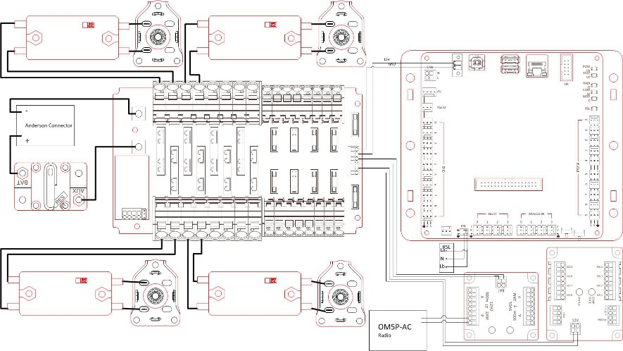
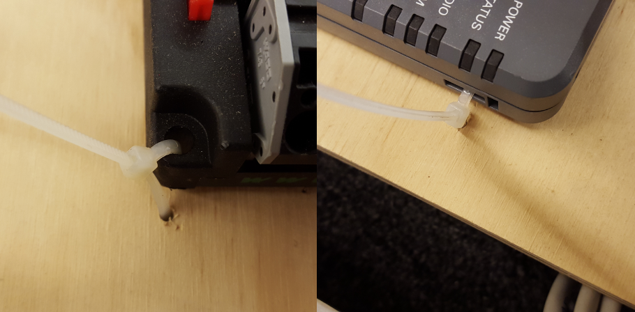
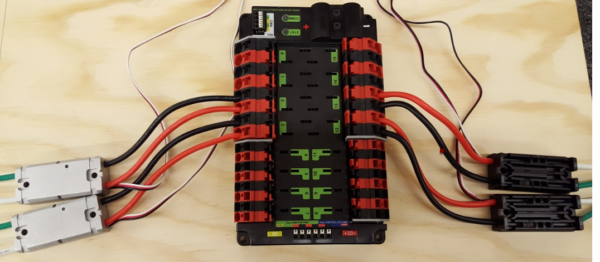
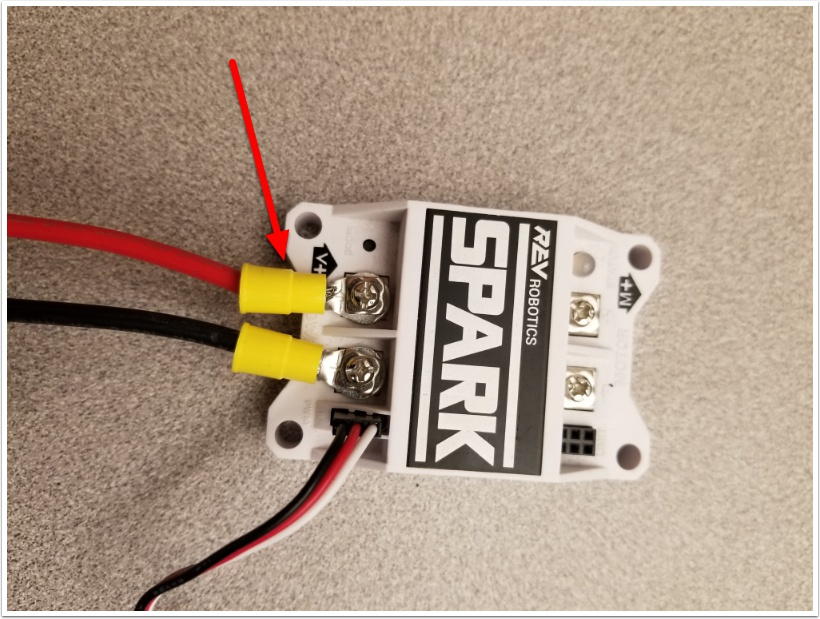
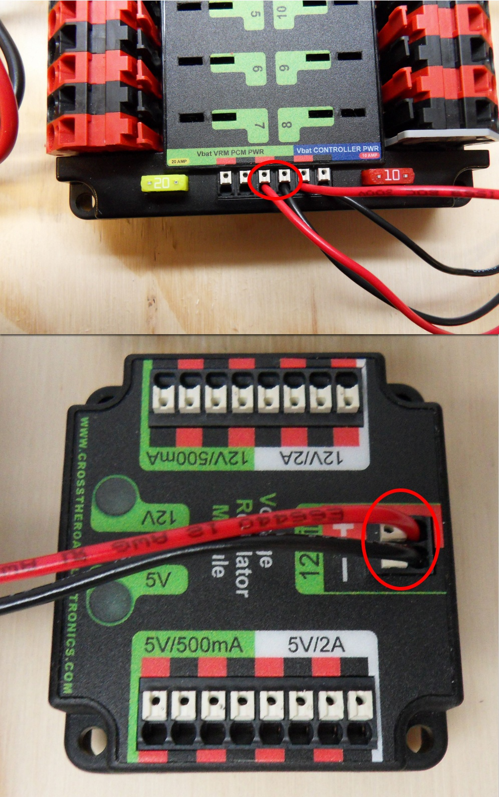
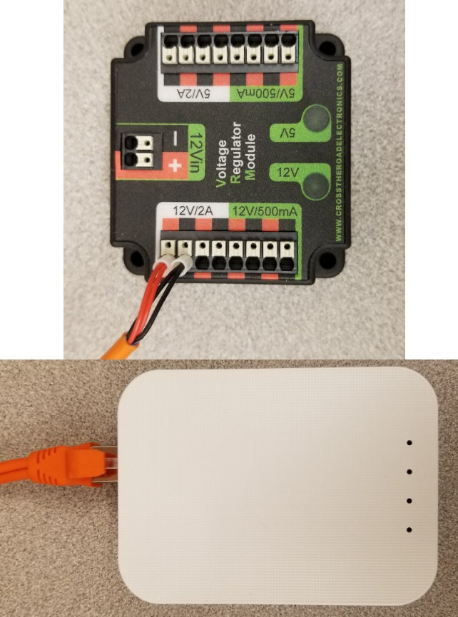
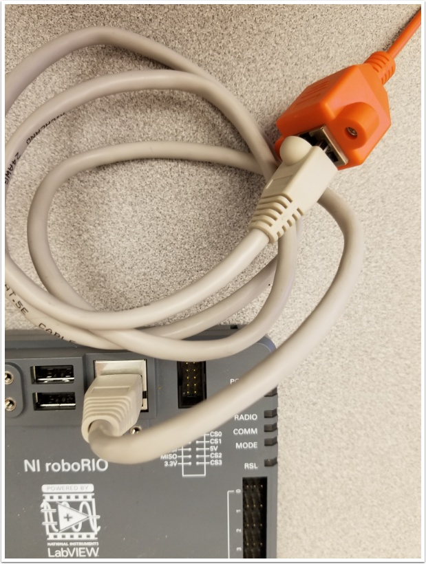
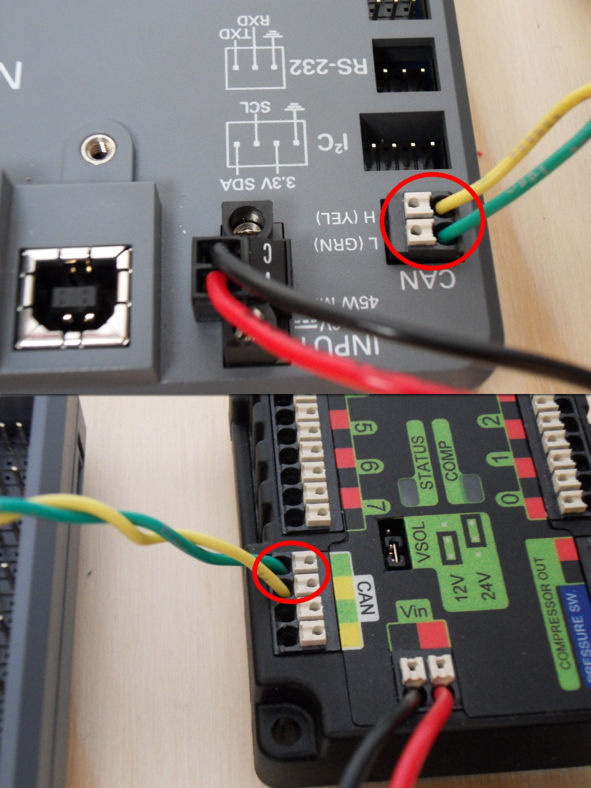
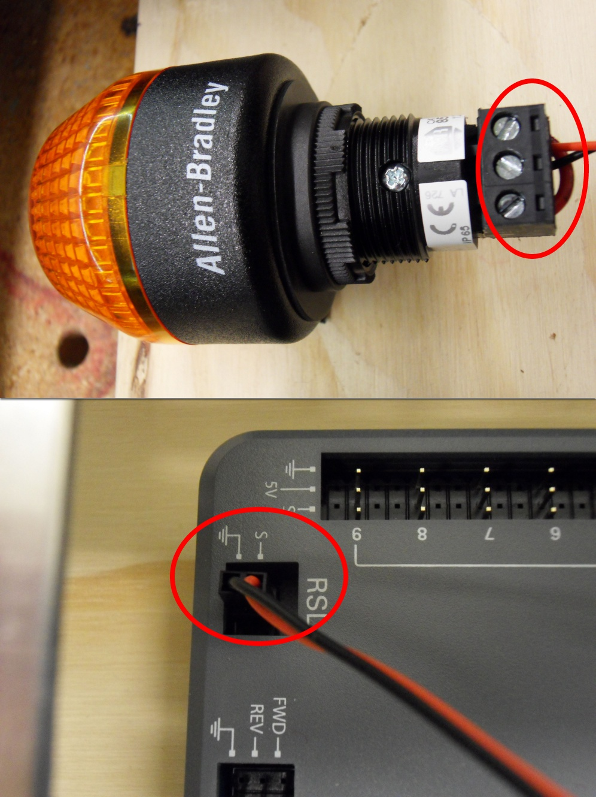

How to wire an FRC Robot
========================

.. note::

   This document details the wiring of a basic electronics board for bench-top testing.

   Some images shown in this section reflect the setup for a Robot Control System using Spark motor controllers. Wiring diagram and layout should be similar for other motor controllers. Where appropriate, a second set of images shows the wiring steps for using PWM controllers with integrated wires.

Gather Materials
-------------------------------

Locate the following control system components and tools

- Kit Materials:
      - Power Distribution Panel (PDP)
      - RoboRIO
      - Pneumatics Control Module (PCM)
      - Voltage Regulator Module (VRM)
      - OpenMesh radio (with power cable and Ethernet cable)
      - Robot Signal Light (RSL)
      - 4x Victor SPX or other speed controllers
      - 2x PWM y-cables
      - 120A Circuit breaker
      - 4x 40A Circuit breaker
      - 6 AWG Red wire
      - 10 AWG Red/Black wire
      - 18 AWG Red/Black wire
      - 22AWG yellow/green twisted CAN cable
      - 16x 10-12 AWG  (yellow) ring terminals
        (8x quick disconnect pairs if using integrated wire controllers)
      - 2x Andersen SB50 battery connectors
      - 6AWG Terminal lugs
      - 12V Battery
      - Red/Black Electrical tape
      - Dual Lock material or fasteners
      - Zip ties
      - 1/4" or 1/2" plywood
- Tools Required:
      - Wago Tool or small flat-head screwdriver
      - Very small flat head screwdriver (eyeglass repair size)
      - Philips head screw driver
      - 5mm Hex key (3/16" may work if metric is unavailable)
      - 1/16" Hex key
      - Wire cutters, strippers, and crimpers
      - 7/16” box end wrench or nut driver

Create the Base for the Control System

For a benchtop test board, cut piece of 1/4” or 1/2" material (wood or
plastic) approximately 24" x 16". For a Robot Quick Build control board
see the supporting documentation for the proper size board for the
chosen chassis configuration. 

Layout the Core Control System Components
---------------------------------------------------

.. image:: images/image1.jpg
   :width: 600

Layout the components on the board. One layout that should work is shown
in the images above.

Fasten Components
-------------------------------

Using the Dual Lock or hardware, fasten all components to the board.
Note that in many FRC games robot-to-robot contact may be substantial
and Dual Lock alone is unlikely to stand up as a fastener for many
electronic components. Teams may wish to use nut and bolt fasteners or
(as shown in the image above) cable ties, with or without Dual Lock to
secure devices to the board. 

Attach Battery Connector to PDP
-------------------------------

.. image:: images/image3.jpg
   :width: 600

Requires: Battery Connector, 6AWG terminal lugs, 1/16" Allen, 5mm Allen,
7/16" Box end

Attach terminal lugs to battery connector:

1. Using a 1/16" Allen wrench, remove the two screws securing the PDP terminal cover.
2. Using a 5mm Allen wrench (3/16" will work if metric is not available), remove the negative (-) bolt and washer from the PDP and fasten the negative terminal of the battery connector.
3. Using a 7/16" box end wrench, remove the nut on the "Batt" side of the main breaker and secure the positive terminal of the battery conenctor

Wire Breaker to PDP
---------------------------------------------------

.. image:: images/image4.jpg
   :width: 600

Requires: 6AWG red wire, 2x 6AWG terminal lugs, 5mm Allen, 7/16" box end

Secure one terminal lug to the end of the 6AWG red wire. Using the 7/16"
box end, remove the nut from the “AUX” side of the 120A main breaker and
place the terminal over the stud. Loosely secure the nut (you may wish
to remove it shortly to cut, strip, and crimp the other end of the
wire). Measure out the length of wire required to reach the positive
terminal of the PDP.

1. Cut, strip, and crimp the terminal to the 2nd end of the red 6AWG wire.
2. Using the 7/16" box end, secure the wire to the "AUX" side of the 120A main breaker.
3. Using the 5mm, secure the other end to the PDP positive terminal.

Insulate PDP connections
---------------------------------------------------

.. image:: images/image5.jpg
   :width: 600

Requires: 1/16" Allen, Electrical tape

1. Using electrical tape, insulate the two connections to the 120A
    breaker. Also insulate any part of the PDP terminals which will
    be exposed when the cover is replaced. One method for insulating
    the main breaker connections is to wrap the stud and nut first,
    then use the tape wrapped around the terminal and wire to secure
    the tape.
2. Using the 1/16" Allen wrench, replace the PDP terminal cover

Wago connectors
---------------------------------------------------

.. raw:: html

    

        <iframe src="//www.youtube.com/embed/L3GJGQ7mJqk" frameborder="0" allowfullscreen style="position: absolute; top: 0; left: 0; width: 100%; height: 100%;"></iframe>
    

The next step will involve using the Wago connectors on the PDP. To use
the Wago connectors, insert a small flat blade screwdriver into the
rectangular hole at a shallow angle then angle the screwdriver upwards
as you continue to press in to actuate the lever, opening the terminal.
Two sizes of Wago connector are found on the PDP:

- Small Wago connector: Accepts 10AWG-24AWG, strip 11-12mm (~7/16")
- Large Wago connector: Accepts 6AWG-12AWG, strip 12-13mm(~1/2")

To maximize pullout force and minimize connection resistance wires
should not be tinned (and ideally not twisted) before inserting into the
Wago connector.

Motor Controller Power
---------------------------------------------------

Requires: Wire Stripper, Small Flat Screwdriver, 10 or 12 AWG wire, 10
or 12 AWG fork/ring terminals (terminal controllers only), wire crimper

For Victor SPX or other wire integrated motor controllers (top image):

- Cut and strip the red and black power input wires wire,
    then insert into one of the 40A (larger) Wago terminal pairs.

For terminal motor controllers (bottom image):

1. Cut red and black wire to appropriate length to reach from one of the 40A (larger) Wago terminal pairs to the input side of the speed controller (with a little extra for the length that will be inserted into the terminals on each end)
2. Strip one end of each of the wires, then insert into the Wago terminals.
3. Strip the other end of each wire, and crimp on a ring or fork terminal
4. Attach the terminal to the speed controller input terminals (red to +, black to -)

Weidmuller Connectors
---------------------------------------------------

.. raw:: html

    

        <iframe src="//www.youtube.com/embed/kCcDw3lDYis" frameborder="0" allowfullscreen style="position: absolute; top: 0; left: 0; width: 100%; height: 100%;"></iframe>
    

The correct strip length is ~5/16" (8mm), not the 5/8" mentioned in the
video.

A number of the CAN and power connectors in the system use a Weidmuller
LSF series wire-to-board connector. There are a few things to keep in
mind when using this connector for best results:

- Wire should be 16AWG to 24AWG (consult rules to
    verify required gauge for power wiring)
- Wire ends should be stripped approximately 5/16"
- To insert or remove the wire, press down on the
    corresponding "button" to open the terminal

After making the connection check to be sure that it is clean and
secure:

- Verify that there are no "whiskers" outside
    the connector that may cause a short circuit
- Tug on the wire to verify that it is seated fully.
    If the wire comes out and is the correct gauge it
    needs to be inserted further and/or stripped back further.

roboRIO Power
---------------------------------------------------

.. image:: images/image8.jpg
   :width: 600

Requires: 10A/20A mini fuses, Wire stripper, very small flat
screwdriver, 18AWG Red and Black

1. Insert the 10A and 20A mini fuses in the PDP in the locations shown on the silk screen (and in the image above)
2. Strip ~5/16" on both the red and black 18AWG wire and connect to the "Vbat Controller PWR" terminals on the PDB
3. Measure the required length to reach the power input on the roboRIO. Take care to leave enough length to route the wires around any other components such as the battery and to allow for any strain relief or cable management.
4. Cut and strip the wire.
5. Using a very small flat screwdriver connect the wires to the power input connector of the roboRIO (red to V, black to C). Also make sure that the power connector is screwed down securely to the roboRIO.

Voltage Regulator Module Power
---------------------------------------------------

Requires: Wire stripper, small flat screwdriver (optional), 18AWG red
and black wire:

1. Strip ~5/16" on the end of the red and black 18AWG wire.
2. Connect the wire to one of the two terminal pairs labeled "Vbat VRM PCM PWR" on the PDP.
3. Measure the length required to reach the "12Vin" terminals on the VRM. Take care to leave enough length to route the wires around any other components such as the battery and to allow for any strain relief or cable management.
4. Cut and strip ~5/16" from the end of the wire.
5. Connect the wire to the VRM 12Vin terminals.

Pneumatics Control Module Power (Optional)
---------------------------------------------------

.. image:: images/image12.jpg
   :width: 600

Requires: Wire stripper, small flat screwdriver (optional), 18AWG red
and black wire

Note: The PCM is an optional component used for controlling pneumatics
on the robot.

1. Strip ~5/16" on the end of the red and black 18AWG wire.
2. Connect the wire to one of the two terminal pairs labeled "Vbat VRM PCM PWR" on the PDP.
3. Measure the length required to reach the "Vin" terminals on the PCM. Take care to leave enough length to route the wires around any other components such as the battery and to allow for any strain relief or cable management.
4. Cut and strip ~5/16" from the end of the wire.
5. Connect the wire to the PCM 12Vin terminals.

Radio Power and Ethernet
---------------------------------------------------

.. warning:: DO NOT connect the Rev passive POE injector cable directly to the roboRIO. The roboRIO MUST connect to the female end of the cable using an additional Ethernet cable as shown in the next step.

Requires: Small flat screwdriver (optional), Rev radio PoE cable

1. Insert the ferrules of the passive PoE injector cable into the corresponding colored terminals on the 12V/2A section of the VRM.
2. Connect the male RJ45 (Ethernet) end of the cable into the Ethernet port on the radio closest to the barrel connector (labeled 18-24v POE)

RoboRIO to Radio Ethernet
---------------------------------------------------

Requires: Ethernet cable

Connect an Ethernet cable from the female RJ45 (Ethernet) port of the
Rev Passive POE cable to the RJ45 (Ethernet) port on the roboRIO.
RoboRIO to PCM CAN RoboRIO to PCM CANZoom: RoboRIO to PCM CAN

Requires: Wire stripper, small flat screwdriver (optional), yellow/green
twisted CAN cable

Note: The PCM is an optional component used for controlling pneumatics
on the robot. If you are not using the PCM, wire the CAN connection
directly from the roboRIO (shown in this step) to the PDP (show in the
next step).

1. Strip ~5/16" off of each of the CAN wires.
2. Insert the wires into the appropriate CAN terminals on the roboRIO (Yellow->YEL, Green->GRN).
3. Measure the length required to reach the CAN terminals of the PCM (either of the two available pairs). Cut and strip ~5/16" off this end of the wires.
4. Insert the wires into the appropriate color coded CAN terminals on the PCM. You may use either of the Yellow/Green terminal pairs on the PCM, there is no defined in or out.

PCM to PDP CAN
---------------------------------------------------

.. image:: images/image16.jpg
   :width: 600

Requires: Wire stripper, small flat screwdriver (optional), yellow/green
twisted CAN cable

Note: The PCM is an optional component used for controlling pneumatics
on the robot. If you are not using the PCM, wire the CAN connection
directly from the roboRIO (shown in the above step) to the PDP (show in
this step).

1. Strip ~5/16" off of each of the CAN wires.
2. Insert the wires into the appropriate CAN terminals on the PCM.
3. Measure the length required to reach the CAN terminals of the PDP (either of the two available pairs). Cut and strip ~5/16" off this end of the wires.
4. Insert the wires into the appropriate color coded CAN terminals on the PDP. You may use either of the Yellow/Green terminal pairs on the PDP, there is no defined in or out.

Note: The PDP ships with the CAN bus terminating resistor jumper in the
“ON” position. It is recommended to leave the jumper in this position
and place any additional CAN nodes between the roboRIO and the PDP
(leaving the PDP as the end of the bus). If you wish to place the PDP in
the middle of the bus (utilizing both pairs of PDP CAN terminals) move
the jumper to the “OFF” position and place your own 120 ohm terminating
resistor at the end of your CAN bus chain. 

PWM Cables
---------------------------------------------------

.. image:: images/image17.jpg
   :width: 600

Requires: 4x PWM cables (if using non-integrated wire controllers), 2x
PWM Y-cable (Optional)

Option 1 (Direct connect):

- Connect the PWM cables from each controller directly to the roboRIO. For Victor SPX's and other PWM/CAN controllers, the green wire (black wire for non-integrated controllers) should be towards the outside of the roboRIO. For controllers without integrated wires, make sure the controller side of the black wire is located according to the markings on the controller. It is recommended to connect the left side to PWM 0 and 1 and the right side to PWM 2 and 3 for the most straightforward programming experience, but any channel will work as long as you note which side goes to which channel and adjust the code accordingly.

Option 2 (Y-cable):

1. Connect 1 PWM Y-cable to the PWM cables for the controllers controlling one side of the robot. The brown wire on the Y-cable should match the green/black wire on the PWM cable.
2. Connect the PWM Y-cables to the PWM ports on the roboRIO. The brown wire should be towards the outside of the roboRIO. It is recommended to connect the left side to PWM 0 and the right side to PWM 1 for the most straightforward programming experience, but any channel will work as long as you note which side goes to which channel and adjust the code accordingly.

Robot Signal Light
---------------------------------------------------

Requires: Wire stripper, 2 pin cable, Robot Signal Light, 18AWG red
wire, very small flat screwdriver

1. Cut one end off of the 2 pin cable and strip both wires
2. Insert the black wire into the center, "N" terminal and tighten the terminal.
3. Strip the 18AWG red wire and insert into the "La" terminal and tighten the terminal.
4. Cut and strip the other end of the 18AWG wire to insert into the "Lb" terminal
5. Insert the red wire from the two pin cable into the "Lb" terminal with the 18AWG red wire and tighten the terminal.
6. Connect the two-pin connector to the RSL port on the roboRIO. The black wire should be closest to the outside of the roboRIO.

You may wish to temporarily secure the RSL to the control board using
zipties or Dual Lock (it is recommended to move the RSL to a more
visible location as the robot is being constructed) Circuit Breakers

Circuit Breakers
---------------------------------------------------

.. image:: images/image19.jpg
   :width: 600

Requires: 4x 40A circuit breakers

Insert 40-amp Circuit Breakers into the positions on the PDP
corresponding with the Wago connectors the Talons are connected to. Note
that, for all breakers, the breaker corresponds with the nearest
positive (red) terminal (see graphic above). All negative terminals on
the board are directly connected internally.

If working on a Robot Quick Build, stop here and insert the board into
the robot chassis before continuing. 

Motor Power
------------------------------------------------------------------------------------------------------

.. image:: images/image20.jpg
   :width: 600

Requires: Wire stripper, wire crimper, phillips head screwdriver, wire
connecting hardware

For each CIM motor:

- Strip the ends of the red and black wires from the CIM

For integrated wire controllers (including Victor SPX):

1. Strip the white and green wires from the controller
2. Connect the motor wires to the controller output wires (it is recommended to connect the red wire to the white M+ output). The images above show examples using quick disconnect terminals.

For Sparks or other non-integrated-wire controllers:

1. Crimp a ring/fork terminal on each of the motor wires.
2. Attach the wires to the output side of the motor controller (red to +, black to -)

STOP
---------------------------------------------------

.. image:: images/image21.png
   :width: 600

.. danger:: STOP!!

.. danger:: Before plugging in the battery, make sure all connections have been made with the proper polarity. Ideally have someone that did not wire the robot check to make sure all connections are correct.

Before plugging in the battery, make sure all connections have been made
with the proper polarity. Ideally have someone that did not wire the
robot check to make sure all connections are correct.

- Start with the battery and verify that the red wire is connected to the positive terminal
- Check that the red wire passes through the main breaker and to the + terminal of the PDP and that the black wire travels directly to the - terminal.
- For each motor controller, verify that the red wire goes from the red PDP terminal to the Talon input labeled with the red + (not the white M+!!!!)
- For each device on the end of the PDP, verify that the red wire connects to the red terminal on the PDP and the red terminal on the component.
- Make sure that the orange Passive PoE cable is plugged directly into the radio NOT THE roboRIO! It must be connected to the roboRIO using an additional Ethernet cable.

It is also recommended to put the robot on blocks so the wheels are off
the ground before proceeding. This will prevent any unexpected movement
from becoming dangerous.

Manage Wires
---------------------------------------------------

.. image:: images/image22.jpg
   :width: 600

Requires: Zip ties

Now may be a good time to add a few zip ties to manage some of the wires
before proceeding. This will help keep the robot wiring neat. Connect
Battery Connect BatteryZoom: Connect Battery

Connect the battery to the robot side of the Andersen connector. Power
on the robot by moving the lever on the top of the 120A main breaker
into the ridge on the top of the housing. If stuff blinks, you
probubly did it right. From here, you should connect to the RoboRIO
and try uploading your code!