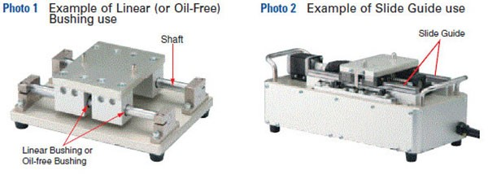
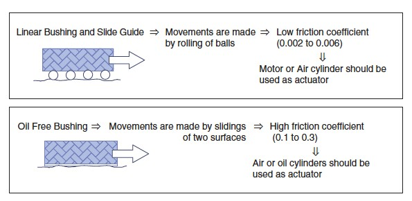
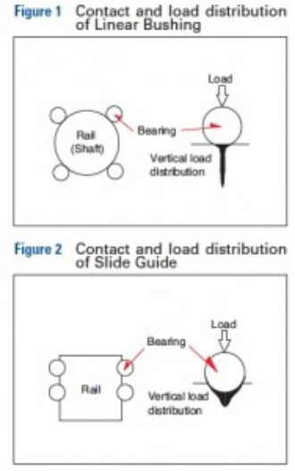
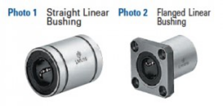
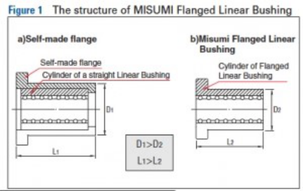
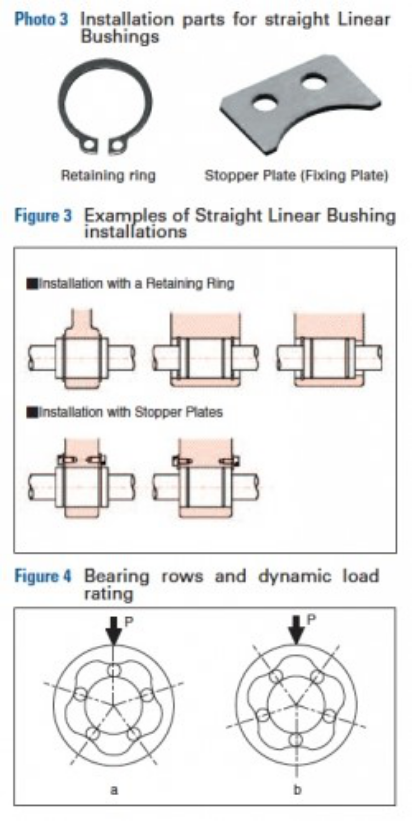

Linear Bushings
===============

Mastering Linear Bushings by: MISUMI USA
----------------------------------------

Linear motion products are the most commonly used motion elements in the automation of transfer, locating, and assembly machinery. Here, three types of linear guides, Linear Bushing, Slide Guide, and Oil Free Bushing will be compared and explained.

Comparison of Linear Motion Products Characteristics
----------------------------------------------------

The characteristics of the three types of `linear motion products <https://us.misumi-ec.com/vona2/mech/M0100000000/?utm_source=FIRST>`_ are shown in the table below.

================== ============= ==================== ================= ======================== ===================
Type               Load Capacity Friction Coefficient Guidance Accuracy Environmental Conditions Ease of Maintenance
================== ============= ==================== ================= ======================== ===================
Linear Bushing     Medium        Low                  Medium to High    Medium                   Medium to High
Linear Slide Guide High          Low                  High              Medium                   Medium to High
Oil Free Bushing   Medium        High                 Medium            High                     High
================== ============= ==================== ================= ======================== ===================

The Characteristics and Structure of Linear Motion
--------------------------------------------------

It is important to first understand the differences in performance based on the load capacity of the component. A machine using `Linear Bushings <https://us.misumi-ec.com/vona2/mech/M0100000000/M0104000000/?utm_source=FIRST>`_ or `Oil Free Bushings <https://us.misumi-ec.com/vona2/mech/M0100000000/M0107000000/?utm_source=FIRST>`_, which moves on a shaft where both-ends are supporting a heavy load, can elastically deform the Shaft. **(See Photo 1)**.

In the case of vertical linear motion mechanisms, the shaft does not need to support the load of the unit, thus load capacity can be ignored. Linear Slide Guides have excellent load capacity because the unit moves on rails assembled on the base plate. **(See Photo 2)**

**`Linear Bushing, Oil free Bushing ⇒ Shaft supported at both ends ⇒ Light to medium load**

**Slide Guide ⇒ Fixed rail on base ⇒ Light to heavy load**

Another important factor to consider is the difference in performance related to the coefficient of friction. In Linear Bushing and Linear Oil Free Bushings utilize two surfaces sliding against each other, which result in higher friction.

**Low friction ⇒ low frictional force ⇒ low turning torque⇒ Rotary motion can be turned into linear motion easily**

**High friction ⇒ high frictional force ⇒ high turning torque or thrust force is required ⇒ Linear Cylinder is recommended**

.. note:: The value of friction coefficient can influence the capacity of an actuator and heat generation during movement. Oil Free Bushings are inappropriate because of heat dissipated by continuous high-speed operation. In the case of using Air Cylinders, speed control of the start / stop is not possible. Mechanisms such as Shock Absorption Dampers need to be set to stop the speed softly. It can shorten the cycle time.

The next factor to consider is that of guide accuracy when the performance depends on the clearance of bearing and rail/shaft. In some instances, shafts are used for the rail with a Linear Bushing. The fit between Shafts and bushing is clearance fit (when g6 tolerance Shaft is used we have normal clearance, when h5 tolerance Shaft is used we have smaller clearance fit). Another application might use a Linear Guide as the profile rail (or track rail) and bearing block (or slide unit). Fit ranges from 0-3µm for Clearance Fit types to -3-0 µm for Preload types. An Oil Free Bushing is used with a Shaft, where the clearance is larger than a Linear Bushing therefore guide precision is lower.

.. note:: Because of the raceway design, steel balls inside linear ball guides can have 2 or 4 contact points. This allows even distribution of complex load. Steel balls inside Linear Bushing have only one (or single) contact point with the Shaft, which results in centered load distribution. (See **Figure 1** and **Figure 2**)

**Linear motion ⇒ Point contact ⇒ Concentrated vertical load distribution ⇒ Not applicable for heavy load**

**Slide guide ⇒ Surface contact ⇒ Distributed vertical load distribution ⇒ Applicable for heavy load**

Finally, consider environmental conditions and ease of maintenance. The performance difference depends on the materials used. Linear Bushings and Linear Slide Guides maintain long term reliability with the use of lubricating grease. Therefore, they are not applicable to be used in an environment that exceeds the environmental specs the grease. Oil Free Bushings provide higher performance because they do not require the use of lubricating grease.

Straight (**Photo 1**) and flanged bushings (**Photo 2**) share a similar structural design. The main advantage of using flanged Linear Bushing lies in its compact design (**Figure 1**) as the integrated structure saves space. The outer cylinder flange allows direct mounting of the bushing and allows flanged bushings to maintain higher load capacity than standard Linear Bushings. A hardened, precision flanged outer cylinder (housing), made out of chrome steel or corrosion resistant steel, is advanced in its quality, and lower in cost compared to “self-made” flanged housing.

Choosing Between a Straight and Flanged Linear Bushing
------------------------------------------------------

The following factors should be considered when making Linear Bushing selections.

- Decide whether force will be applied to the Linear Bushing. Choose a flanged type if the Linear Bushing must bear force.
- Decide how much space is available on the surface to which the Linear Bushing is to be attached. (Refer to part 3)

The Linear Bushing in the component a) receives inertia force from the moving component, therefore the Linear Bushing must be firmly screwed to the housing. As for component b), an Air Cylinder moves the Shaft in the Linear Bushing. The `Retaining Ring <https://us.misumi-ec.com/vona2/mech/M1800000000/M1809000000/?searchFlow=results2category?utm_source=FIRST>`_ fixing the Linear Bushing only receives the frictional force from the Shaft. Therefore, a compact design using a straight type is fine. The same can be said for c).

As shown in Figure 2, depending on the design, Linear Bushings can either move while Shafts are fixed, or be stationary (fixed) while Shafts are in motion.

- X-axis: If the Linear Bushing moves, use the Flanged type bushings.
- Y & Z-axis: For fixed Linear Bushing, use Straight type with Retaining Ring or `Stopper Plate <https://us.misumi-ec.com/vona2/mech/M0300000000/M0311000000/M0311020000/?searchFlow=results2category?utm_source=FIRST>`_.

How to Install Linear Bushings
------------------------------

To fix a Straight Linear Bushing, using Retaining Ring or Stopper Plate (Fixing Plate as shown in photo 3) see

.. note:: Load rating of Linear Bushing varies according to the load position on the circumference. Linear Bushing, usually has 4-6 rows/ball tracks that are set on even angle. When installing, if possible, avoid positioning Linear Bushing so that the ball track is under direct load (Figure 4), otherwise that row will directly bear the load (Figure 4a).

For example, Figure 4 shows a Linear Bushing with 5 rows. The variance of dynamic load rating is as follows:

:math:`right figure \div left figure.`

Therefore, angle load should be installed as in the right picture.

   Static Load Rating

      :math:`Right figure a \div left figure b = 1.46`

   Dynamic Load Rating

      :math:`Right figure a \div left figure b = 1.19`

For further examples of linear bushings, check out these application examples from our application Library called inCAD library.

- `No.000035 Cylinder Linear Motion Mechanism <https://us.misumi-ec.com/us/incadlibrary/detail/000035.html?utm_source=FIRST>`_
- `No.000208 Table Lifter <https://us.misumi-ec.com/us/incadlibrary/detail/000208.html?utm_source=FIRST>`_

If you have any further questions, please contact our engineering support team at `engineering@misumiusa.com <mailto:engineering@misumiusa.com>`_.
