Bosch Seat Motor
================

Specification Sheet
-------------------

:download:`Download Spec Sheet <files/2016-12-21_spec_sheet_-_Bosch_FRC_motor_6_004_.pdf>`

CAD File
--------

:download:`Download CAD File <https://first.wpi.edu/FRC/roborio/Docs/FRC_Bosch_motor_V2_6_004_RA3_194-06.zip>`

Motor Mounting & Shaft Support: Suggested
-----------------------------------------

Motor relies on two solid mounting points:

1. output gear interface and
2. oval mounting hole.

Make sure shaft is fully supported and does not rely on motor as support.  A ¼” bolt fits very well in the mount slot but make sure you use a washer to help distribute the bolt clamping load.

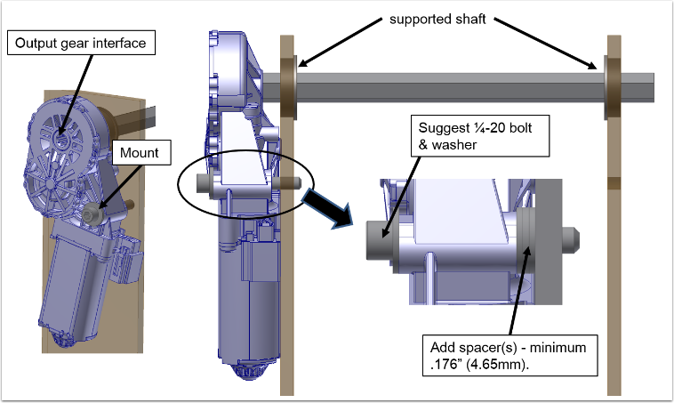

Motor Mounting & Shaft Support: Things to Avoid
-----------------------------------------------

Avoid mounting in any other way such as clamping or bracing the pole housing/gear housing, etc.  Also, minimize multidirectional loading on the motor by fully supporting the shaft so external loads on the motor are primarily in the rotational direction.

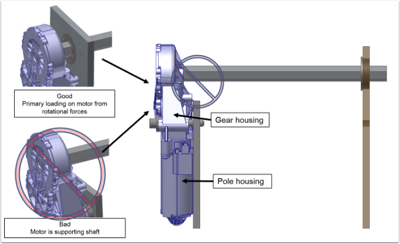

Subtractive Manufacturing Option: Hex Broach
--------------------------------------------

Use a linear broach to cut out a 3/8” hex.  Make sure gear is supported during this operation.  Do not remove gear.  Cover is not meant to be removed and will most likely damage the cover latches which affects motor function and durability.

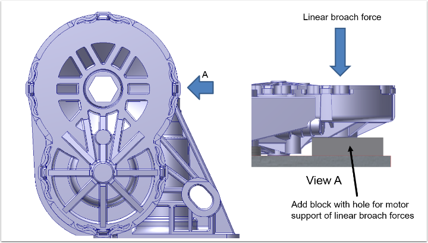

Subtractive Manufacturing Option: Mill Hex Shaft
------------------------------------------------

Mill square profile from ½” or 3/8” hex shaft stock.  Suggest a slight interference fit so there is a solid connection and no gap.  Also best to keep at least 1”  in length for max interface with plastic motor output gear.

.. note:: This solution has been known to fail using an aluminum shaft; suggest either for very low torque applications or utilize a steel shaft.

A similar design will be available for purchased from `AndyMark (am-3723) <https://www.andymark.com/products/0-5-in-hex-adapter-shaft-for-bosch-motor>`_.

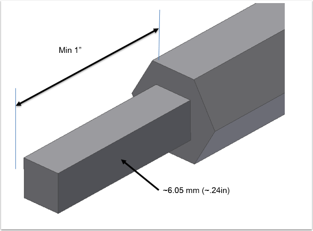

Off-the-Shelf Options for Output Interface
------------------------------------------

Get Creative.  The star output is basically two squares rotated 45°.  Here’s a few suggested starting options that you can find at most home improvement stores.  *Keep in mind these are only suggestions and have not been confirmed yet for durability.*

¼” standard square fittings in a toolbox are a tad too big, but with some grinding could be made to fit.  With a bit of searching you may be able to find a part with a closer fit.

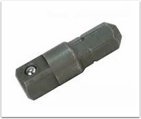

Utilize a ½” socket bit.  It interfaces nicely with ½” hex stock or a 5/16” bolt head/nut.  The hex portion will fit snugly in the star interface but will not support the required max torque. Adding JB weld or other strong epoxy in this gap is an option. *This has not been validated so be sure to leave time to test for durability.*

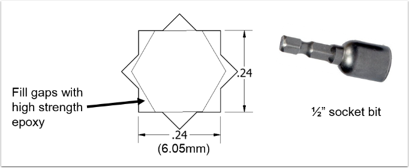

Output Options: 3D Printable Options

- Teams with access to a 3D printer may also consider printing a custom interface to meet their specific needs.
- Depending on the choice of material, however, this interface may not be as strong as some of the previous options.
- For fused-filament printers, additional care is required to ensure that the final product remains strong without sacrificing dimensional accuracy.
- This shaft can be recreated by drawing two overlapping 6mm squares, and extruding the result.

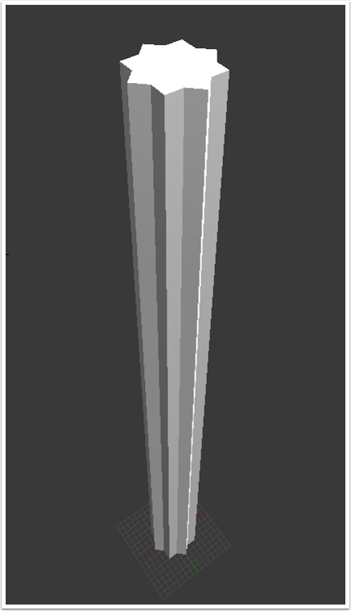

- For printing horizontally, consider removing one of the star teeth; this will allow the spline to lay flat.
- Also consider adding “whiskers” or “mouse ears” where appropriate; these features improve adhesion to the print bed, which helps to minimize warping.
- For printing vertically, remember to use thicker-than-usual print layers; this helps to improve adhesion between layers of the print.
- We recommend printing the spline longer than necessary; any excess length is easy to cut off later.

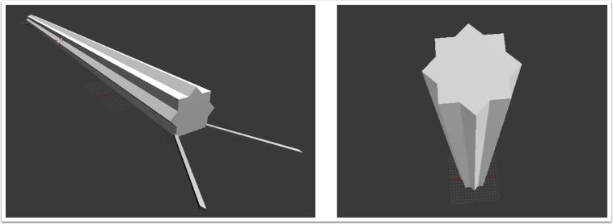

- Once you have a functional spline shaft, it’s easy to convert that 8-pointed spline into a standard FRC drive shaft.
- These adapters may be recreated by scaling up the original spline profile from 6mm squares to 6.05mm (fused-filament printers may require additional clearance).

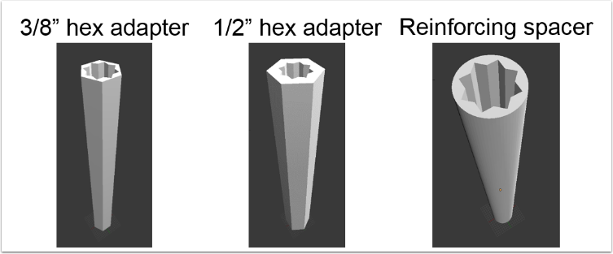

Detail: Gear Housing & Gear Cover Removed
-----------------------------------------

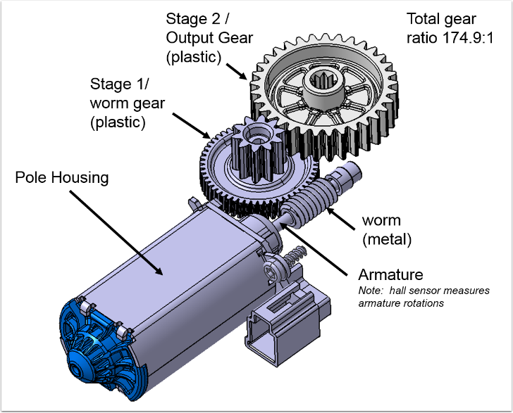

Design Consideration Summary
----------------------------

- Make sure there is a tight fit between motor output gear and the interface to what is being driven.  Slight interference is preferred.
- Motor has a built in thermal switch if it is overloaded for an extended time.  This will reset automatically once internal temperature returns to acceptable limits.
- Avoid multi directional forces on output gear (ie side loading from unsupported shaft).  Gears are very robust if forces are primarily in rotational direction.
- Expect there will be a few degrees or more of inaccuracy in sensing angular position due to free play with motor internal gears, plastic creep, and tolerances in the mechanism you are driving.
- Since this is a slow moving motor it is an option is to use bushings instead of bearings for shaft support of the mechanism that is being driven.

Hall Circuit Interface
----------------------

The basic circuit interface with RoboRio is shown below.

The hall circuit in the motor causes a voltage drop for each armature rotation.  The square wave output and voltage drop is dependent on the voltage input to the circuit.  As wired per the figure above, a typical output is show below.  Due to the voltage not dropping low enough, the signal cannot be read by the DIO on the RoboRio. Motor input 12V free speed gives ~12ms pulse.

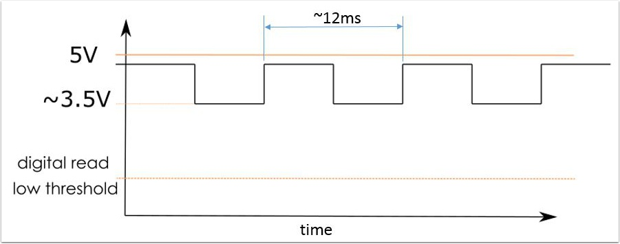

In order to get the step to drop below the digital read threshold, a simple circuit is used (image below includes an adapter for reading DIO) . A kit can be purchased from AndyMark that performs this function (`am-3812 <https://www.andymark.com/products/bosch-seat-motor-dio-kit>`_).

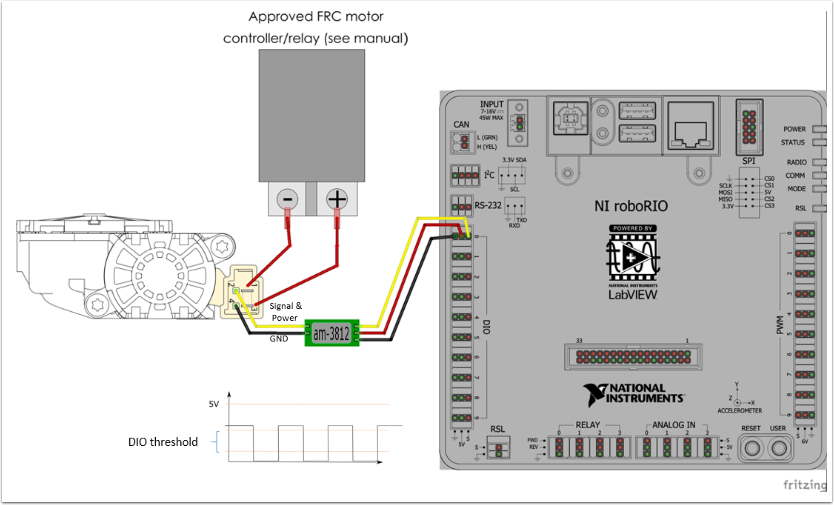

Sample Applications
-------------------

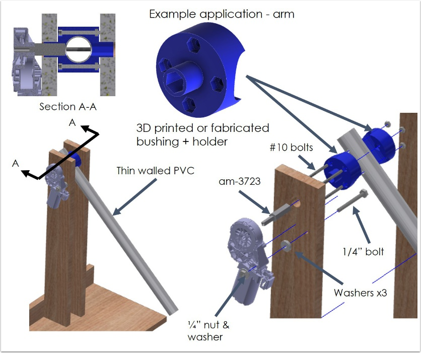

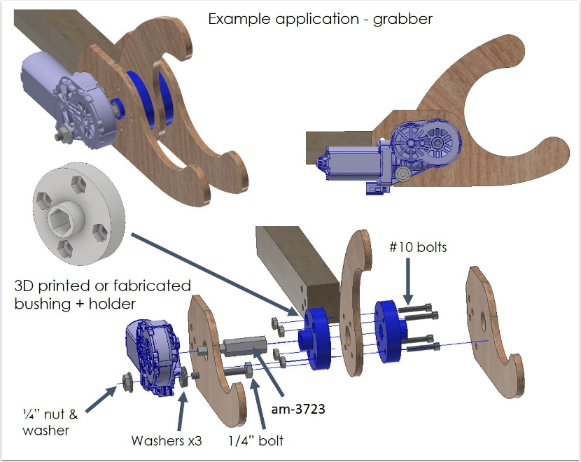
