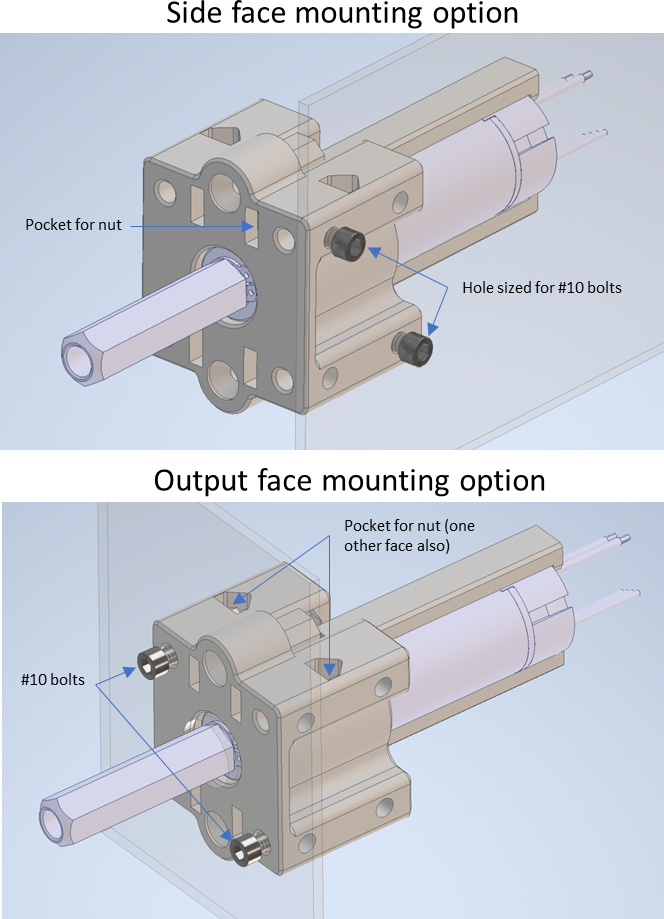

Johnson Electric PLG Motor
==========================

Basic Overview
--------------

.. figure:: images/johnson-electric-plg-motor/JE.jpg

  Figure 1: PLG motor + 1/2" Hex Adapter

This PLG motor (Power Lift Gate) is used in automotive applications to open and close the lift gate in SUV’s etc.   In most applications the motor drives a lead screw that provides translational motion.  An adapter to convert the motor output to a ½” Hex, standard to FRC teams, is provided.  This can also be fabricated but requires precision.  Additional parts will be offered for sale through AndyMark.

Quick reference information:

- Weight (including adapter):  250g (.55 lbs)
- Nominal free speed ~450RPM, Nominal Stall torque ~4.5Nm
- Gear reduction = 2 stage planetary.  Total reduction is 22.2:1.
- Max current 26 Amps
- Dual Hall output available for speed and directional feedback.  See provided drawing.
- There are 44.4 hall pulses per one rotation of the output.
- CAD step model can be downloaded `here <https://first.wpi.edu/FRC/roborio/Docs/2019-12-30_JE-PLG-149_with_adapter_R1.stp>`__
- Motor Drawing can be downloaded `here <https://first.wpi.edu/FRC/roborio/Docs/2020-02-12_JE-PLG-149_R2.pdf>`__
- Drawing of hex interface adapter can be downloaded `here <https://first.wpi.edu/FRC/roborio/Docs/2019-12-20_JE-PLG-ADPTR-1_R1.PDF>`__
- CAD files for 3D printed mount can be downloaded `here <https://first.wpi.edu/FRC/roborio/Docs/2020-01-09_PLG_motor_mount.stp>`__

Utilizing the hall sensors is optional if teams need motor feedback.  It is not required for motor operation.

Performance
-----------

Motor performance can vary from motor to motor.  The limit line represents the range the motor could vary across the population.  It is always best to plan for worst case performance when sizing the motor.

  Figure 2: JE-PLG-149 performance curve

Electrical connection
---------------------

An FRC approved motor controller is required to interface with this motor.  Refer to the latest version of the rules for restrictions and requirements.  Only the black and red wires are needed for motor operation.  The 4 hall wires (Brown, Yellow, Green and Blue) are optional if teams would like motor feedback and are not required for motor operation.

.. figure:: images/johnson-electric-plg-motor/JE4.png

  Figure 3: Wire labeling quick reference.  The 4 hall wires are not required for motor operation.

The following figure represents a minimum hookup configuration for motor operation.  If directional control is not required it is an option to use an FRC approved relay module instead of a motor controller.  It is best to connect M+ and M- as shown in order to assure expected motor direction based on drawing.

  Figure 4: Electrical hookup - See FRC manual

Hall interface
--------------

Two hall sensors are available to provide feedback on direction of rotation. If the signal for the hall sensor 1 rises before hall sensor 2 then direction is Clockwise.

  Figure 5: Reading motor direction from hall output

Speed and location can be obtained from output from either hall sensor.  There will be 44.4 pulses per 1 revolution of the output.  A pullup resistor of 1Kohm is required at each hall output (See RoboRIO hookup diogram)

Motor Mounting Option 1
-----------------------

Minimum Machining – hand tools
^^^^^^^^^^^^^^^^^^^^^^^^^^^^^^

Motor Mounting Option 2
-----------------------

Medium Manufacturing – drill press
^^^^^^^^^^^^^^^^^^^^^^^^^^^^^^^^^^

The detail described in this section is best fabricated with wood, UHMW, or similar plastic material and represents a recommended minimum size.  It is suggested to use a drill press to assure hole precision and to drill the large motor pockets with a 1-1/8” (28mm) Forstner bit.  This bit is available at most hardware stores but is typically not found in Forstner bit kits.  It is a worthwhile purchase as it is also useful for drilling bearing holes in softer materials.

.. figure:: images/johnson-electric-plg-motor/JE8.png

  Forstner bit - 1-1/8" (28mm) is usually not a standard size.

Motor Mounting Option 3
-----------------------

3D Printed
^^^^^^^^^^

A design optimized for 3D printing with the FDM process can be downloaded for those that have this capability.  There are also many online resources for getting 3D printed parts made.  PLA material can be used or other higher strength material if preferred.  The figure below shows best orientation during printing to optimize strength and avoid supports.

  Print parts in this orientation to avoid supports and optimize strength

There are several features on the mount block for motor retention and mounting options.  Pockets are provided to hold nuts allowing the option for shorter bolts.  See figure below.

If the hex adapter is not supported in the direction of the arrow shown, then a retention plate & ½” hex collar can be used to keep the adapter from falling out.  Do not rely on friction to hold it in place.  This may loosen over time.  See figure below.

The motor should be supported with 2 retention brackets.  The end should hook onto the plastic motor cap and #8 wood screws through the motor mount block will tap into the bracket hole to hold in place.  A pocket in the motor retention bracket is provided so the mount holes are not restricted.

There are two orientations that can be used for mounting.  An option is available to use shorter bolts by adding a nut to the pocket.  Minimum of two #10 bolts should be used in a diagonal configuration.   If desired, teams can opt to use all four mounts.

Downloads
---------

 `2020-02-12_JE-PLG-149_R2.PDF <https://first.wpi.edu/FRC/roborio/Docs/2020-02-12_JE-PLG-149_R2.pdf>`__

 `2019-12-20_JE-PLG-ADPTR-1_R1.PDF <https://first.wpi.edu/FRC/roborio/Docs/2019-12-20_JE-PLG-ADPTR-1_R1.PDF>`__

 `2019-12-30_JE-PLG-149_with_adapter_R1.stp <https://first.wpi.edu/FRC/roborio/Docs/2019-12-30_JE-PLG-149_with_adapter_R1.stp>`__

 `2020-01-09_PLG_motor_mount.stp <https://first.wpi.edu/FRC/roborio/Docs/2020-01-09_PLG_motor_mount.stp>`__
