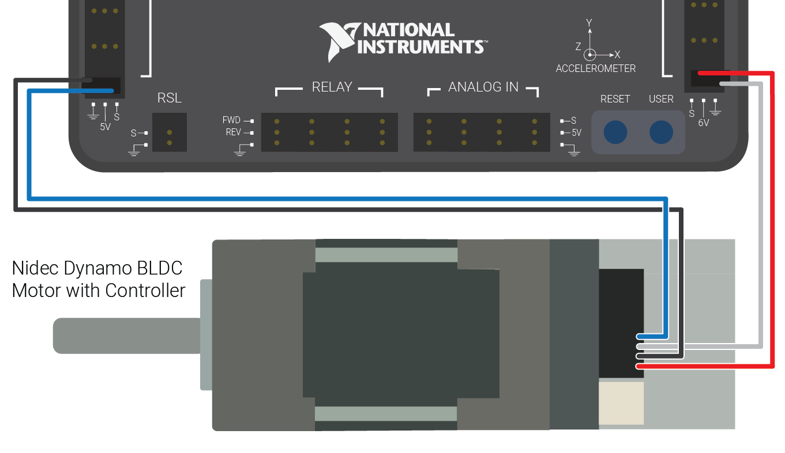

Nidec Dynamo BLDC Motor with Controller
=======================================

.. note:: The Nidec Dynamo BLDC Motor with Controller is a 12V DC brushless motor/controller combo. This article discusses how to connect it to, and control it with, the FRC Control System and links to some additional resources on the Dynamo and brushless technology.

What is a Brushless Motor?
--------------------------

Never heard of brushless motors? No problem! Since its inception, FIRST  Robotics Competition has allowed only brushed motors. However,  brushless motors are widely used in many industries! For more information about the difference between the two, `check out this link <https://www.electronicdesign.com:443/electromechanical/what-s-difference-between-brush-dc-and-brushless-dc-motors>`__.

Nidec Dynamo BLDC Motor Datasheet
---------------------------------

Want more specifics on the currents, torques, and other important details about the Nidec Dynamo BLDC Motor? The Specification Sheet should have what you are looking for.

Want more detail on the pinout of the connectors, connector part numbers, or other info about the controller? Try the Controller Datasheet.

Both documents can be found on the `Downloads tab of the Andymark page for the motor <https://www.andymark.com/products/dynamo-brushless-motor-controller>`__.

Wiring the Dynamo BLDC Motor
----------------------------

Power Wiring
^^^^^^^^^^^^

The Dynamo BLDC Motor comes with a 2 pin harness with red and black wires for powering the device. Plug the connector into the receptacle on the back of the device (it's keyed, so it will only go one way). Connect the other end directly to one of the <30A breaker slots on the PDP, or use quick disconnects or other connectors to extend the wires to reach the PDP location on your robot.

.. note:: While the provided small gauge wires are exempt from the wire gauge rules as "Wires that are recommended by the device manufacturer", any extensions you connect may not be. The wires are sized appropriately for the current the device draws, however you may wish to acquire and use a smaller breaker (in the 6-10A range) in the PDP slot for this device to provide additional protection for the device and wiring.

Signal Wiring
^^^^^^^^^^^^^

The Dynamo BLDC Motor Controller requires two signal connections to the roboRIO:

- The connector with the blue wire should connect to a DIO connector on the roboRIO, with the blue wire corresponding to the (S)ignal pin (towards the inside of the roboRIO).

- The connector with the red wire should connect to a PWM connector on the roboRIO with the red wire corresponding to the (S)ignal pin (towards the inside of the roboRIO).

- The connector that plugs into the Dynamo BLDC Motor Controller is keyed, so no need to worry about plugging it in backwards.

If you need to extend the signal connections of the Dynamo controller, regular PWM extension cables can be used (take care to note which color of the PWM cable connects to which color of the Dynamo cable).

Programming the Dynamo BLDC Motor with Controller
-------------------------------------------------

The library software in each of the three languages has dedicated code for the Dynamo BLDC Motor with Controller that will handle the coordination between the PWM connection (used for Enable) and the DIO connection (used to send a non-servo PWM to control speed and direction). In C++ and Java you will find this in the "NidecBrushless" class. In LabVIEW select "Nidec Brushless" from the dropdown of the MotorControlOpen VI (found in the Actuators->Motors palette).

Application Note: Disconnected DIO Behavior
-------------------------------------------

.. warning:: With the layout of the existing wiring harness, disconnecting the DIO signal will cause the device to run in full reverse whenever the robot is enabled. **Note that disabling the robot will still properly disable the device.** For users that would like to mitigate this issue, two possibilities are provided below (the mitigation in the Application Note: Motor Whine section is a partial mitigation to this issue)

Modifying the Wiring Harness
^^^^^^^^^^^^^^^^^^^^^^^^^^^^

To mitigate the issue of partially uncontrolled operation if the DIO connector were to become disconnected, a minor modification to the wiring harness can be made. By swapping the black and white wires (so the connectors are red/black and blue/white) a disconnection of the DIO connector will instead disable the device. This swap can be made with a small flathead screwdriver or other sharp object as detailed below.

To remove the wire from the connector:

#. Grasp the wire to remove firmly between your fingers and apply gentle pressure, pulling it away from the connector.
#. Using a small flat screwdriver or other sharp object, gently depress the latch through the window in the connector until the pin slides free.
#. Repeat these actions for the white wire from the other connector.

To insert the pin into the connector:

#. Ensure that the wires are not tangled.
#. Locate the latch on the pin and face it towards the window on the connector
#. Slide the pin fully into the connector until the latch engages.
#. Gently attempt to pull the wire back out to ensure it has seated properly.

If the wire does not remain in the connector in step 4:

#. Try inserting the wire again, making sure that it is seated fully into the connector
#. If that does not work, try using a small pair of pliers or jeweler's screwdriver to gently pry the latch slightly further away from the pin body, then re-insert

Application Note: Motor Whine
-----------------------------

The default behavior of the library code when commanded with a neutral (0) signal is to leave the device enabled and send a neutral signal. This causes the device to emit a high pitched whine (and also leaves it susceptible to the "Disconnected DIO issue described above). The code is written in this way because disabling the device has two side-effects:

- The device will coast when it is disabled as opposed to being actively driven to 0 speed
- The tachometer output, if wired (see note below), will be deactivated. If the device is moving due to momentum or external forces, these tach pulses will be missed.

If you wish to disable the device when commanded neutral, a description of how to do so in LabVIEW and C++\Java is provided below.

.. tabs::

  .. tab:: Java

    In C++ and Java, explicitly calling the ``stopMotor()`` method will physically disable the device by turning off the roboRIO PWM signal. The next time ``set()`` is called, the device will be re-enabled. Note that this is different than the behavior of the ``disable()`` method which requires an explicit ``enable()`` call before the device will be re-enabled.

    To integrate this into your code, wherever you would call set(), you can replace it with a call similar to the following:

    .. code-block:: Java

       double value;
        NidecBrushless motor = new NidecBrushless(0,0);

        if(value == 0) {
          motor.disable();
        } else {
          motor.set(value);
        }

  .. tab:: C++

    In C++, explicitly calling the ``stopMotor()`` method will physically disable the device by turning off the roboRIO PWM signal. The next time ``set()`` is called, the device will be re-enabled. Note that this is different than the behavior of the ``disable()`` method which requires an explicit ``enable()`` call before the device will be re-enabled.

    To integrate this into your code, wherever you would call set(), you can replace it with a call similar to the following:

    .. code-block::

       double value;
        NidecBrushless motor = NidecBrushless::NidecBrushless(0,0);

        if(value == 0) {
          motor->disable();
        } else {
          motor->set(value);
        }

      If you want to instead disable when the value is close to zero (a deadband), simply change the comparison from value == 0 to Math.abs(value) < ### where ### is your desired deadband size (a number between 0 and 1)

  .. tab:: LabVIEW

    In LabVIEW, the Motor Disable VI can be used to disable the device. The next time the Set Output VI is called, the device will be automatically re-enabled. The snippet below shows an example of how you might use this to disable the device when the commanded speed is 0. To instead use a deadband, replace the = VI with an Absolute Value and Less Than VI. The False case of the case structure contains a Motor Set Output VI that uses the passed in orange wire to set the motor speed.

    .. image:: images/nidec-dynamo-bldc/labview.png

Application Note: Tachometer output
-----------------------------------
The Nidec BLDC Motor with Controller contains a built-in tachometer that is not wired in the provided wiring harness. This is a 5V level signal suitable for plugging directly into the roboRIO and using with the Counter classes/VIs. You may either use code to assume direction or use the direction pin provided from the device. More information about the pinouts of the signal connector and connector parts that could be used to populate the tachometer and direction pins can be found in the Controller Datasheet located on the `Downloads tab of the Andymark page for the motor <https://www.andymark.com/products/dynamo-brushless-motor-controller>`__.
