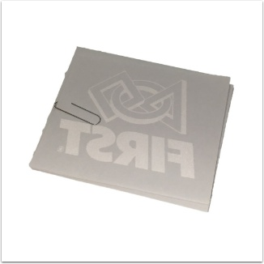

FIRST Bumper Logo
=================

#. Iron setting on high
#. Thin cloth in between transfer backing and iron
#. Apply pressure and iron in a circular motion
#. Check by peeling back. If it comes off cleanly, you're done; if not, keep ironing checking frequently.
