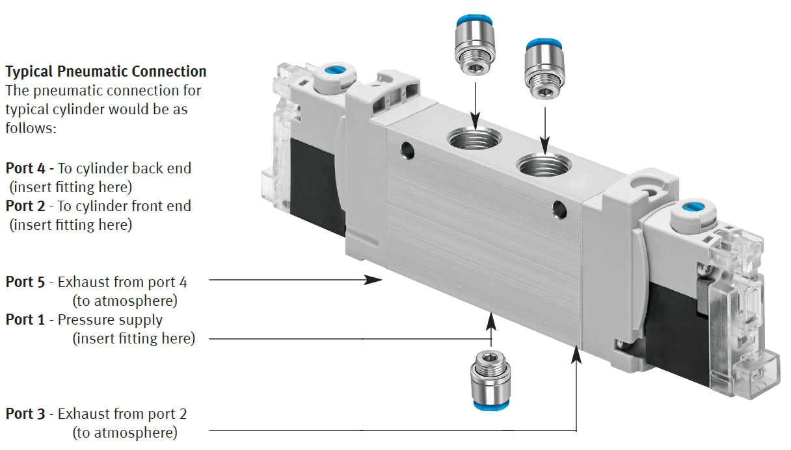

FESTO Solenoid Valve
====================

Basic Valve Data
----------------

The ``VUVG-LK10-B52-T-M7-1H2L-S`` is a 5/2 dual solenoid piloted valve. The valve has M7 ports and is operated with a 24V DC signal. The maximum air flow is 13.4 cfm. The weight of the valve including the fittings and cables is 0.2 lbs.

Electrical Connection
---------------------

Attach one end of each cable to a +24V DC signal and the other to a 0V DC signal.

When the valve is switched on the LED will turn on.

Wiring
------

- Red: +24V DC
- Black: 0V DC

Operation
---------

To extend the cylinder, activate coil 14 for at least 30 mSec. To retract cylinder activate coil 12 for at least 20 mSec. Following the activation time the coil can be deactivated without switching positions. Verify that both coils are not activated simultaneously. A minimum of 25 psi should be supplied to Port 1.

Manual Override
---------------

To operate the valve without electrical current depress the blue button for a temporary time or depress and turn to maintain the activation. The valve will not return to original state unless it receives an electrical signal at the coil or manual override operation.
