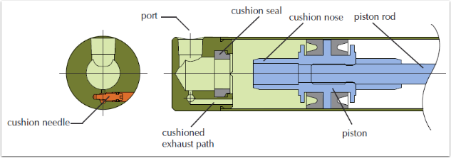
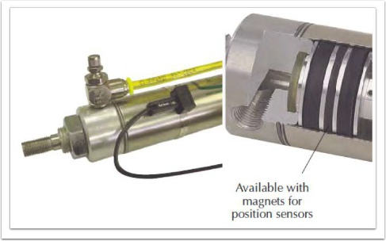
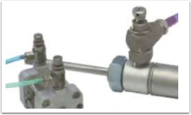
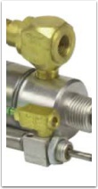
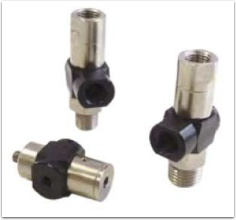

Position & Speed Control Options for Pneumatic Cylinders from Clippard
======================================================================

Pneumatic cylinders' speed and power advantages make this technology a valuable player in many applications.  Where they can fall short is the controllability of position and variable speeds.  Electronic drives and motors have the advantage of better controllability, but usually come with more complexity and a high price.

Here are a few ways to better control the position and speed(s) of your pneumatic actuator.

Cushion Cylinders
-----------------
This option allows the cylinder to slow down at the end of stroke.  It is valuable for reducing vibration and noise common with sudden metal to metal stops.

Magnetic Cylinder Pistons
-------------------------

Magnetic Cylinder pistons offer the ability to detect stroke position with `reed or GMR switches <https://clippard.com/cms/wiki/magnetic-reed-switches-position-location>`__.  Knowing the position of the cylinder can allow the users to switch exhaust flow paths or pressure to vary speed or direction.

Flow Control Valves
-------------------

Flow control and needle valves allow adjustment of the speed of a cylinder.

Quick Exhaust Valves
--------------------

The primary function of a quick exhaust vale is to increase cylinder speed. This also enables the use of smaller directional valves and longer control lines.

Pilot Operated Check Valves
---------------------------

These valves provide control functions with cylinders and with other control circuits.

