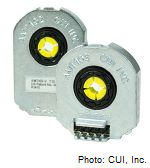

AMT10 Encoder - CUI Inc
=======================

What Is It?
-----------

An encoder is a sensor and an essential part of the motion control feedback loop. The encoder can be used to provide precise position, rotation and speed feedback information for your robot. It can be used to measure the rate and count of rotations, how fast a shaft on your robot is turning (RPM), as well as how far something connected to the rotary shaft has traveled.

Teams have used these encoders in the past on the wheels of the robot to monitor speed, precisely control wheel movement and to count wheel rotations. Additionally, the encoders have been used on lifting mechanisms to control lifting speed as well as measure the lift height.

The AMT10 encoders, donated by CUI Inc utilize capacitive technology to measure rotary motion. Using the DIP switch on the back of the encoder, these encoders can be quickly and easily set to any one of 16 different resolutions, allowing for maximum versatility within your robot design. Additionally, the encoder has an index pulse (Z), occurring once per rotation. This index pulse is ideally suited for determining motor or shaft RPM.

CUI’s AMT10 encoders were made available through FIRST Choice and additional AMT parts/accessories are readily available through Digi-Key Electronics at www.digikey.com.

How are They in the Kit of Parts?
---------------------------------

There were/are a limited number of these encoders available in the FIRST Choice area of the Kit of Parts system.

- AMT103 Base, PN AMT-B1-S
- AMT103 Cable Assembly, 5-pin, 5 x 22AWG, 1 ft., PN CUI-435-- 1FT
- AMT103 Cable Assembly, 5-pin, 5 x 22AWG, 6 ft., PN CUI-3934-- 6FT
- AMT103 Wide Base, PN AMT-B1-W
- Modular Incremental Encoder Kit, AMT10 Series, Axial, PN - AMT103-V

Datasheet
^^^^^^^^^

View technical specifications and drawings for CUI’s AMT10 encoder series `here <https://www.cui.com/product/resource/amt10.pdf>`__.

Installing the Encoder
^^^^^^^^^^^^^^^^^^^^^^

Need help mounting CUI’s AMT encoder? Watch `the video below <https://www.cui.com/resources/resource-library/mounting-the-amt10-modular-encoder-series>`__ with step-by-step instructions that demonstrate the simplicity of mounting the AMT10 series encoder to a DC motor.

.. raw:: html

  <iframe width="709" height="405" src="https://www.youtube.com/embed/zPessFD3b5E" frameborder="0" allow="accelerometer; autoplay; encrypted-media; gyroscope; picture-in-picture" allowfullscreen></iframe>

Improper Mounting
-----------------

Improper mounting is the leading cause of poor performance or incorrect readings with the AMT10 encoder. Please reference the video above and other resources or feel free to contact amtsupport at cui dot com for help with troubleshooting any errors.

FAQs
----

Have questions about CUI’s AMT encoder series? Check to see if `these frequently asked questions <https://www.cui.com/amt-faq>`__ about the product and technology might have your answer.

Suggestions?
------------

If you have any helpful tips or tricks in using this item in FIRST Robotics Competition applications, please send them to frcparts at firstinspires dot org. Thank you!
