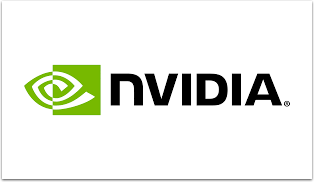
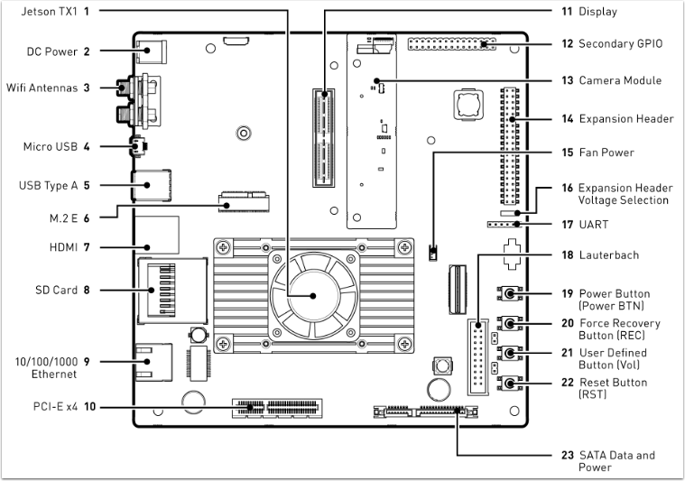

Jetson TX1 Developer Kit
========================

Jetson TX1 Developer Kit Diagram
--------------------------------

Instructional Videos
--------------------

Getting Started
^^^^^^^^^^^^^^^

#. Unbox your Jetson and get setup (see video below).
#.Join our Embedded Developer Program and `download JetPack <https://developer.nvidia.com/embedded/jetpack?ncid=pa-blo-ftrs27-3857>`__ to get the latest software and tools.

Unboxing the NVIDIA Jetson TX1 Developer Kit
^^^^^^^^^^^^^^^^^^^^^^^^^^^^^^^^^^^^^^^^^^^^

Get an inside view of the new NVIDIA Jetson TX1 DevKit. It is the newest member of the Jetson platform., with even more performance and power efficiency than its predecessor, the Jetson TK1.

.. raw:: html

  <iframe width="560" height="315" src="https://www.youtube.com/embed/WFUcGGuWhdk" frameborder="0" allow="accelerometer; autoplay; encrypted-media; gyroscope; picture-in-picture" allowfullscreen></iframe>

Embedded Deep Learning with Jetson
^^^^^^^^^^^^^^^^^^^^^^^^^^^^^^^^^^

Watch this free webinar to get started developing applications with advanced AI and computer vision using NVIDIA's deep learning tools, including TensorRT and DIGITS.

.. raw:: html

  <iframe width="560" height="315" src="https://www.youtube.com/embed/_4tzlXPQWb8" frameborder="0" allow="accelerometer; autoplay; encrypted-media; gyroscope; picture-in-picture" allowfullscreen></iframe>

OpenCV on NVIDIA Jetson: Episode 1: CV Mat Container
^^^^^^^^^^^^^^^^^^^^^^^^^^^^^^^^^^^^^^^^^^^^^^^^^^^^

Learn to work with mat, OpenCV’s primary container. You’ll learn memory allocation for a basic image matrix, then test a CUDA image copy with sample grayscale and color images.

.. raw:: html

  <iframe width="560" height="315" src="https://www.youtube.com/embed/lQfWANnqmps" frameborder="0" allow="accelerometer; autoplay; encrypted-media; gyroscope; picture-in-picture" allowfullscreen></iframe>

Double Your Deep Learning Performance with JetPack 2.3
^^^^^^^^^^^^^^^^^^^^^^^^^^^^^^^^^^^^^^^^^^^^^^^^^^^^^^

Learn how to double your deep learning performance with JetPack 2.3. This all-in-one package bundles and installs all system software, tools, optimized libraries and APIs, along with providing examples so developers can quickly get up and running with their innovative designs. Key features include TensorRT, cuDNN 5.1, CUDA 8 and multimedia API.

.. raw:: html

  <iframe width="560" height="315" src="https://www.youtube.com/embed/RJkOGMC8IrY" frameborder="0" allow="accelerometer; autoplay; encrypted-media; gyroscope; picture-in-picture" allowfullscreen></iframe>

For more video tutorials, visit us `here <https://developer.nvidia.com/embedded/learn/tutorials>`__.

Documentation
-------------

.. note:: Some downloads require `NVIDIA Embedded Developer Program <https://developer.nvidia.com/developer-program>`__  membership. Not a member? Join the Embedded Developer Program for free `here <https://developer.nvidia.com/developer-program>`__.

-  `Jetson TX1 Developer Kit Product Sheet PDF <http://images.nvidia.com/content/tegra/embedded-systems/pdf/JTX1-DevKit-Product-sheet.pdf?ncid=pa-blo-ftrs27-3860>`__
-  `Jetson TX1 Developer Kit 3D CAD Step Model <https://grabcad.com/library/nvidia-jetson-tx1-1>`__
-  `Multimedia Guide <https://developer.download.nvidia.com/embedded/L4T/r24_Release_v2.1/Docs/L4TMultimediaAPIReference.zip?In4TZ3BMtTrBGCEY1IwlTK0vfzZwOkOu7ycBaifS7xHVQ05Us053rq6E79zVTosADlEvIdE76kPai9D8776lwb8aOHVjK4kdpzfu3Z8-RG_s56fyUZq4uBFvChjgbp6C9x3sWUCfKdy_bw5UscMNNF-fNEi6IKqi1fySx-L81A>`__

NVIDIA Jetson Community
-----------------------

Have questions or issues about your Jetson TX1 Developer Kit?

Visit our `Jetson TX1 Developer Forum <https://devtalk.nvidia.com/default/board/164/jetson-tx1/?ncid=pa-blo-ftrs27-3864>`__

#. If you aren’t already a member, `join now <https://devtalk.nvidia.com/>`__. **Be sure to include your FRC team number.**
#. Click on “Create Topic”
#. Make sure to explain that you are from FIRST Robotics. A community member or seasoned NVIDIA person can help with your issues.

GitHub Resource
---------------

Explore code samples, tutorials and more on our `Getting Started with Deep Learning GitHub Repo. <https://github.com/dusty-nv/jetson-inference>`__

More Information
----------------

For more information, visit:

-   NVIDIA Jetson and FIRST Robotics page
-  `Jetson Wiki <https://elinux.org/Jetson_TX1>`__
