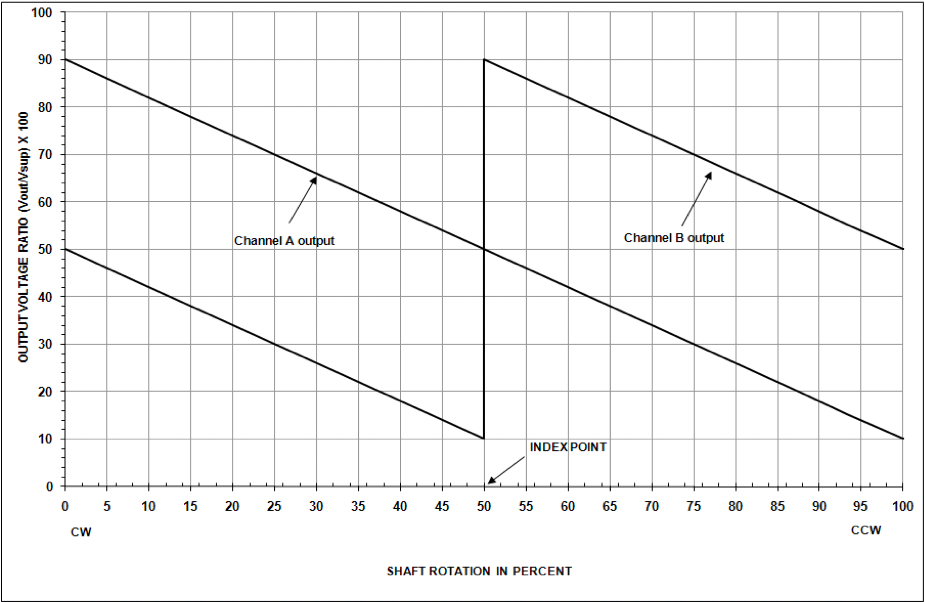

John Deere Encoder (RE321826)
=============================

Application Information
-----------------------
RE321826 is a Hall Effect dual output analog sensor.  It is designed to be used in rugged environments typically encountered on agricultural, construction, and forestry machines. Each channel is independently powered. The output of the two channels are 180 degrees out of phase so when one channel is transitioning from minimum to maximum output the other channel is at the midpoint of its output. Monitoring both channels provides uninterrupted continuous rotational position information.

Electrical Characteristics
--------------------------

- Supply voltage: 5 V +/- 0.25 V
- Supply current: 16 mA per channel maximum
- Reverse voltage protection: 10 V maximum
- The analog voltage output operates between 10% and 90% of the 5V reference.

Connector
---------

Unit contains an embedded AmpSeal 16 6-position Tyco 776434-1 (JD 57M9753) with gold pins Tyco 638078-1 (JD 57M9810) compatible connector that mates with Tyco 776433-1 (JD 57M9750) or Tyco 776531-1 (JD 57M9786) with gold sockets Tyco 776492-1 (JD 57M9806) or Tyco 1924464-1 (JD 57M9808).

+----------+-------------+-------------+
|          | Channel A   | Channel B   |
+==========+=============+=============+
| Ground   | 1           | 4           |
+----------+-------------+-------------+
| Signal   | 2           | 5           |
+----------+-------------+-------------+
| Supply   | 3           | 6           |
+----------+-------------+-------------+

Physical Characteristics
------------------------

The unit is actuated by a 9.5mm (⅜”) diameter shaft with a 2.4mm (3/32”) keyway.  The shaft included in the kit is a proper fit or a shaft can be made using typical ⅜” keyed shaft in steel or aluminum.  The included R86457 bracket can be used as a guide for the shaft.

(dimensions in mm)

.. image:: images/john-deere-encoder/physical-characteristics.png
