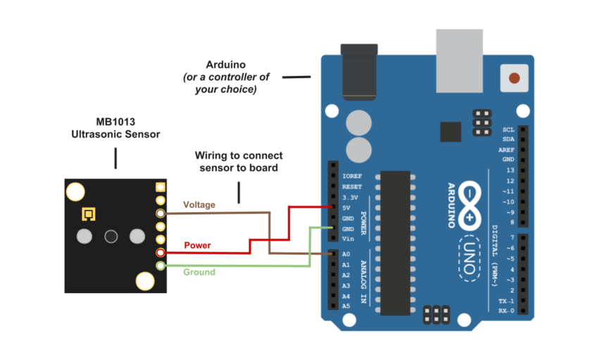

MB1013 HRLV-MaxSonar-EZ Ultrasonic Sensor
=========================================

Below we have a tutorial to help you get started with the `MaxBotix MB1013 ultrasonic sensor <https://www.maxbotix.com/Ultrasonic_Sensors/ultrasonic_sensors-mb1013-htm.htm>`__! This will hopefully give you a basic understanding of how ultrasonic sensors work and will help you set up your ultrasonic sensor to read analog voltage.

Take a look at this sensor’s `data sheet <https://www.maxbotix.com/documents/HRLV-MaxSonar-EZ_Datasheet.pdf>`__ for more information on the sensor’s specs!

How Ultrasonics Work
--------------------

Using sound, the ultrasonic rangefinder measures distance for you. The diagram below shows how the sensor sends and receives the sound waves. It measures the distance using the time it takes for the sound wave to leave, reflect off of a surface or object, and travel back to the sensor.

Using Your Ultrasonic Sensor in your Project
--------------------------------------------

1. Hook Up Controller
^^^^^^^^^^^^^^^^^^^^^
We used an Arduino in this example, but you can use another controller and program of your choice.

Here's an image of how to hook up the sensor to the roboRIO.

2. Install Software
^^^^^^^^^^^^^^^^^^^

To use the sensor with an Arduino, install the `Arduino IDE <https://www.arduino.cc/en/main/software>`__ onto your computer. This is where you type the code you want to compile and send to the Arduino board.

3. Set Up Your Sensor with Controller
^^^^^^^^^^^^^^^^^^^^^^^^^^^^^^^^^^^^^

Plug your Arduino into the USB cable and into your computer. Once you upload Arduino, you can then compile and activate the code.

To use the sensor with a roboRIO, ensure that you have followed all the steps in the :ref:`Creating a Benchtop Test Program <docs/getting-started/running-a-benchtop/index:Getting Started with a Benchtop Robot>` article for your language.

4. Compile and Run Code
^^^^^^^^^^^^^^^^^^^^^^^

The code below will allow you to read distance in centimeters. Compile and run this code to obtain real-time distance measurements to the closest object.

.. note:: The code listed for Arduino is not only for an Arduino and will run on most c++-based micro-controllers.

.. tabs::

  .. tab:: Java (for RoboRIO)

    Adapted from `pblankenbaker on ChiefDelphi <https://www.chiefdelphi.com/t/code-for-ultrasonic-sensor/156062/4>`__.

    .. code-block:: java

      import edu.wpi.first.wpilibj.AnalogInput;

      public class DistanceSensor {
        // A MB1013 distance sensor (pins 3, 6 and 7 from sensor to analog input 0)
        private static final AnalogInput mb1013 = new AnalogInput(0);

        // You will need to determine how to convert voltage to distance
        // (use information from the data sheet, or your own measurements)
        private static final double VOLTS_TO_DIST = 1.0;

        public static double getVoltage() {
          return mb1013.getVoltage();
        }

        public static double getDistance() {
          return getVoltage() * VOLTS_TO_DIST;
        }

        public static void updateDashboard() {
          SmartDashboard.putNumber("Distance (volts)", getVoltage());
          SmartDashboard.putNumber("Distance (real)", getDistance());
        }
      }

  .. tab:: C++

    Example courtesy of `FRC team 5593 <https://github.com/Team5593/mb1013>`__.

    **MB1013_Analog.cpp**

    .. code-block::

      #include "MB1013_Analog.h"

      MB1013_Analog::MB1013_Analog(AnalogInput *input, DigitalOutput *enable):
        input(input),
        enable(enable)
      {
      SetEnabled(false);
      }

      double MB1013_Analog::Get() {
        if (isEnabled == false)
          SetEnabled(true);

        auto value = input->GetVoltage() * 5;

        if (isEnabled == false)
          SetEnabled(false);

        return value;
      }

      inline void MB1013_Analog::SetEnabled(bool state) {
        enable->Set(state);
        isEnabled = state;
      }

    **MB1013_Analog.h**

    .. code-block::

      #pragma once

      #include <AnalogInput.h>
      #include <DigitalOutput.h>

      class MB1013_Analog {
      public:
        MB1013_Analog(AnalogInput *input, DigitalOutput *enable);
        ~MB1013_Analog();

        double Get();

        void SetEnabled(bool state);

      private:
        AnalogInput *input;
        DigitalOutput *enable;

        bool isEnabled = false;
      };

  .. tab:: Arduino

    .. code-block::

      const int anPin = 0;
      long anVolt, cm;

      void setup() {
        Serial.begin(9600);
      }

      void read_sensor(){
        anVolt = analogRead(anPin);
        cm = anVolt/2;
      }

      void print_range(){
         Serial.print(“Range = ”);
         Serial.print(cm);
         Serial.print(” cm “);
         Serial.print('\n');
      }

      void loop() {
         read_sensor();
         print_range();
         delay(100);
      }

How This Helps You
------------------

How can you use this information? Glad you asked! There are quite a few applications in which this becomes very useful.

One, distance to objects data is extremely useful for the autonomous section of the contest. Your robot can actually use the distance when navigating to help avoid objects.

Another use is if you need to perform an action when your robot is a certain distance from an object. You can use the information to make the robot perform better and much more quickly even during the  remote-controlled section of the contest.

Also, as good as LIDAR sensors are, only ultrasonic sensors can reliably detect certain surfaces such as glass. Transparency and color of objects have no effect on if an ultrasonic sensor can see an object. This is especially useful if you don’t know what kind of environment your robot will be operating in.

Need More Help?
---------------

If you find yourself in need of more information about the MaxSonar sensor and your project, we at MaxBotix are more than happy to help you. Please call us at (218) 454-0766 or email our technical support team at ``techsupport at maxbotix dot com``.

