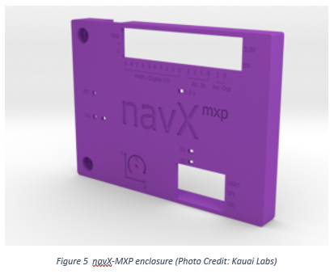

navX-MXP
========

Measuring motion/orientation, improving your autonomous and tele-operated software, and expanding roboRIO I/O
--------------------------------------------------------------------------------------------------------------

The navX-MXP Robotics Navigation Sensor provides an accurate, easy-to-use way to measure motion and 3D orientation of any object (for instance, your robot chassis or a robotic arm).

These capabilities enable you improve your autonomous and teleoperated programs by adding intelligent features including:

- Driving in a straight line
- Rotating automatically to a specific angle
- Field-oriented drive
- Automatic Balancing
- Motion Detection
- Collision Detection
- navX-MXP is both a self-calibrating Inertial Measurement Unit (IMU) and an Attitude/Heading Reference System (AHRS).

navX-MXP is simple to install on a roboRIO, and includes roboRIO I/O expansion features.

Inertial Measurement Unit (IMU)
-------------------------------

navX-MXP is an Inertial Measurement Unit (IMU), and includes 6 sensors which measure inertial motion:  3 accelerometers measuring acceleration (in units of \ `Standard Gravity <https://en.wikipedia.org/wiki/Standard_gravity>`__  [g]) and 3 gyroscopes measuring \ `Rotational Speed <https://en.wikipedia.org/wiki/Rotational_speed>`__  (in units of degrees per second).

IMUs are typically used to measure aircraft orientation, but are also very useful for controlling a robot.  IMUs measure rotation of an object around the Z-axis (known as “Yaw”), the X-axis (known as “Pitch”) and the Y-axis (known as “Roll”).

Pitch and Roll angles are absolute (tied to the earth’s surface); 0 degrees means “flat” with respect to the earth.

However, IMU Yaw angles are relative - not tied to any direction (like North on a Compass).  Therefore, your robot application must decide where 0 degrees is.  Usually, FRC robots treat the “head” of the field (the direction driver’s face) as 0 degrees.

For more information, please visit the `navX-MXP Terminology page. <https://pdocs.kauailabs.com/navx-mxp/guidance/terminology/>`__

Digital Compass and Attitude/Heading Reference System (AHRS)
------------------------------------------------------------

navX-MXP also includes 3 magnetometer sensors, which measure magnetic fields (in units of Tesla).  By measuring the earth’s magnetic field, navX-MXP provides a digital compass  which is a different way of measuring the Z (“Yaw”) axis.

And by intelligently fusing the digital compass with the IMU can create a measurement of absolute 3D orientation.

.. note:: Earth’s magnetic field is actually very weak when compared to the magnetic field generated by a nearby motor; for this reason it can be difficult to get accurate digital compass readings on a FRC robot.  For this reason, using the navX-MXP AHRS is an advanced feature best suited for teams who have the time to learn about `how to calibrate the navX-MXP digital compass <https://pdocs.kauailabs.com/navx-mxp/guidance/magnetometer-calibration/>`__ and also how to deal with magnetic disturbances.

roboRIO Hardware Installation
-----------------------------

The navX-MXP can be easily connected to a National Instruments roboRIO MXP port.  This only takes about 5 seconds and provides a stable, secure base for the onboard sensors that is aligned to the axes of your robot.  Two screws are provided with navX-MXP to secure the circuit board to the roboRIO.  More information may be found on the `navX-MXP roboRIO installation page. <https://pdocs.kauailabs.com/navx-mxp/installation/roborio-installation/>`__

USB (optional, or to connect to your vision co-processor)
---------------------------------------------------------

A secondary configuration possibility is to connect navX-MXP to a roboRIO or another computer via USB  possible because *data from navX-MXP flows simultaneously to the MXP connector and the USB port*.  Some teams have connected the navX-MXP USB port to a co-processor in order to integrate navX-MXP sensor measurements into their vision processing.  To support access to USB-based navX-MXP data from a Linux-based co-processor, a Linux library was developed by Team 900 (Zebracorns) and is available `here <https://pdocs.kauailabs.com/navx-mxp/software/linux-library/>`__.

.. note:: As further described in the navX-MXP `Best Practices <https://pdocs.kauailabs.com/navx-mxp/guidance/best-practices/>`__, a USB cable connected to your roboRIO can also provide a secondary power supply in case of roboRIO brownout.

Enclosure
---------

An enclosure is recommended to protect the navX-MXP circuit board from excessive handling, `“swarf” <https://en.wikipedia.org/wiki/Swarf>`__,`electrostatic discharge (ESD) <https://en.wikipedia.org/wiki/Electrostatic_discharge>`__ and other elements that can potentially damage navX-MXP.

roboRIO Software Installation
-----------------------------

To access navX-MXP from your roboRIO robot application, `install the navX-MXP Libraries for roboRIO. <https://pdocs.kauailabs.com/navx-mxp/software/roborio-libraries/>`__

Using navX-MXP
--------------

Many example programs are available for navX-MXP in C++, Java and LabVIEW.  Visit the `navX-MXP Examples page <https://pdocs.kauailabs.com/navx-mxp/examples/>`__ for a description of each example and details on how to use it with your chosen programming language.

Learning More
-------------

To learn more about how navX-MXP works, you can use  `navXUI <https://pdocs.kauailabs.com/navx-mxp/software/navx-mxp-ui/>`__, which runs on a Windows PC connected via USB to the navX-MXP and demonstrates all of the navX-MXP features.  navXUI also provides a way to save navX-MXP data to a file so you can analyze it.  navXUI can even run simultaneously with your roboRIO robot application.

Best Practices
--------------

If you want to get the most out of your navX-MXP and achieve results similar to those of the top FRC teams, the `navX-MXP Best Practices <https://pdocs.kauailabs.com/navx-mxp/guidance/best-practices/>`__ is just for you.  These guidelines will help you avoid common pitfalls and achieve the highest possible accuracy.

Getting Help
------------

If you have trouble with navX-MXP, please visit the `navX-MXP support page <https://pdocs.kauailabs.com/navx-mxp/support/>`__; you can join the navX-MXP newsgroup or contact technical support for help.
