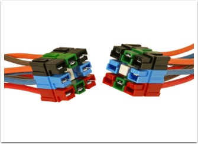
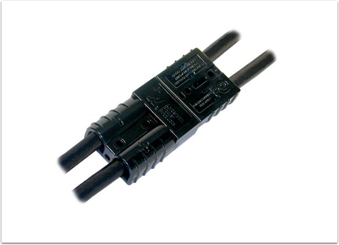

Anderson Power Products Powerpole & SB Connectors
=================================================

PP14 to PP45 (the "small" ones)
-------------------------------

:download:`Specification Sheet (PP14-PP45) <files/app-powerpole-connectors/pp14-pp45-specification-sheet.pdf>`

:download:`Assembly Instructions (Powerpole) <files/app-powerpole-connectors/powerpole-assembly-instructions.pdf>`

SB50 (the "large" ones)
-----------------------

:download:`Specification Sheet (SB50) <files/app-powerpole-connectors/sb50-specification-sheet.pdf>`

:download:`Assembly Instructions (SB) <files/app-powerpole-connectors/sb-assembly-instructions.pdf>`

:download:`Connector Crimping and Soldering <files/app-powerpole-connectors/connector-crimping-soldering.pdf>`
