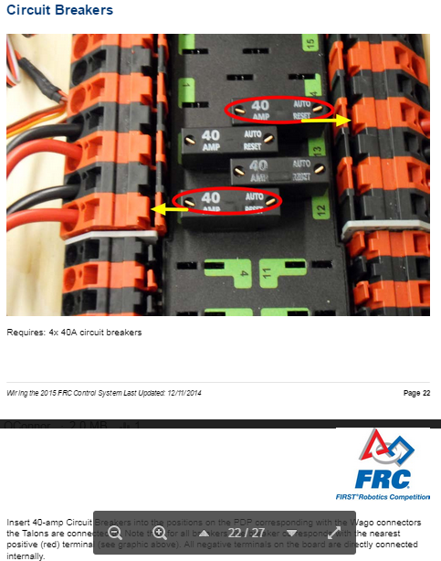
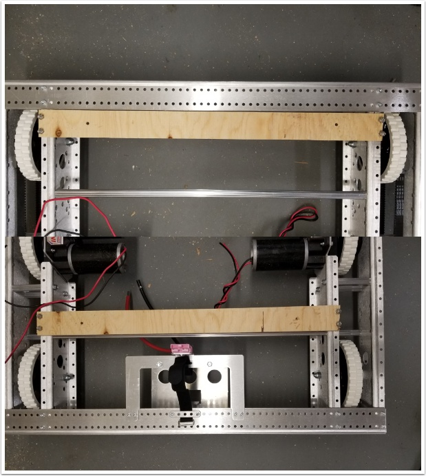
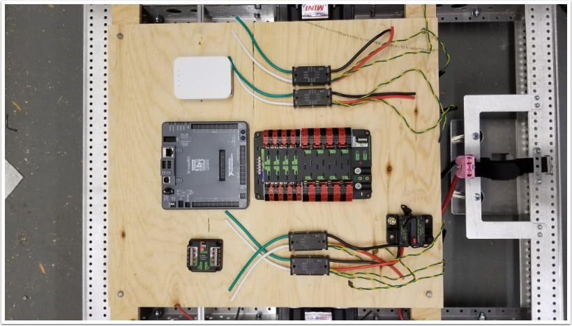
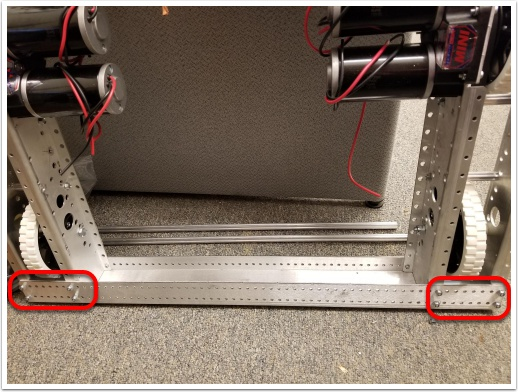
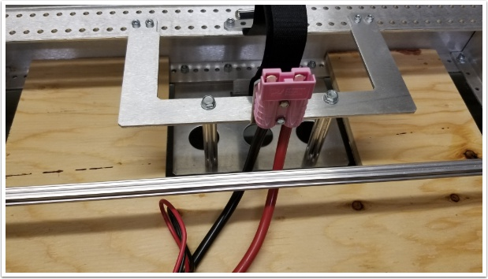
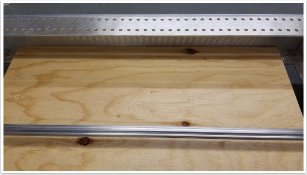
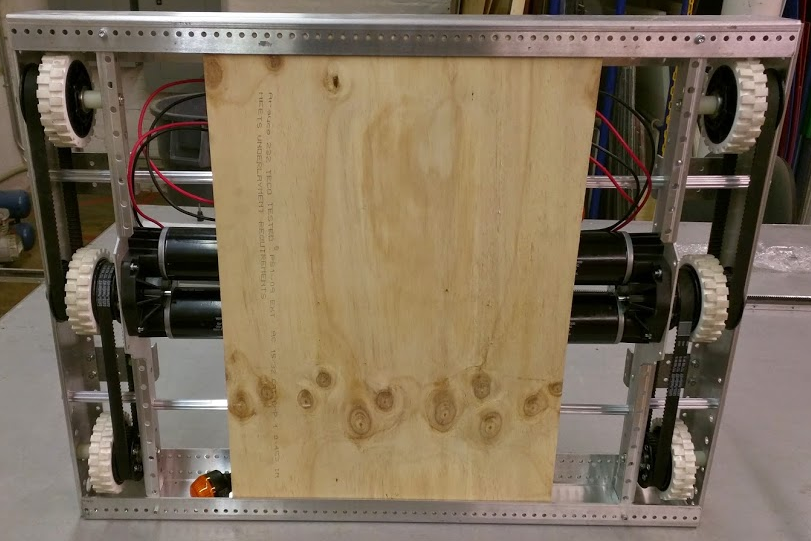
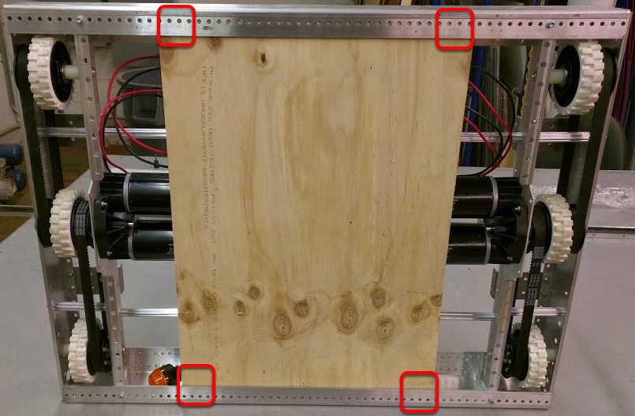
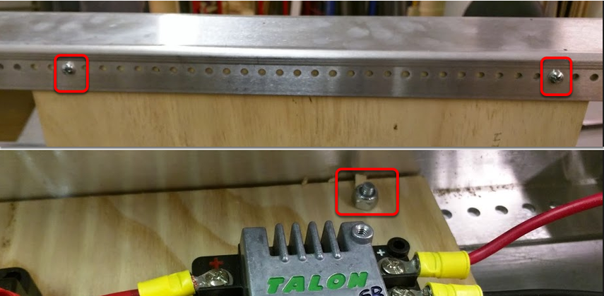

Installing Electrical Board for RQBS
====================================

Electrical Board Options
------------------------

There are two installation options provided for Robot Quick Build electrical boards with 4 sizes provided for each.

- `Option 1`_ - This option uses two thin strips to support a rectangular board above the top of the chassis.
- `Option 2`_ - This option uses a board wit a U-shaped cutout to accommodate the battery box when mounting inside the chassis.

Sizes:

- Testing - This size accommodates the chassis if assembled un-cut. This is the recommended configuration for Kickoff Quick Builds where teams do not yet have enough information about their design to make a decision about robot sizing. **However, this size is not a competition legal robot size.**

- The other 3 options correspond to the cut chassis sizes described in the AM14U documentation.

:download:`Download the Zip file <https://first.wpi.edu/FRC/roborio/Docs/QuickBuildElectricalBoards.zip>` and choose one of the options for your robot.

AM14U preparation
-----------------

Unlike prior years it is recommended to complete the AM14U chassis construction prior to installing the electronics. This is true for either "option".

Electrical board preparation
^^^^^^^^^^^^^^^^^^^^^^^^^^^^

Complete the :ref:`docs/getting-started/getting-started-frc-control-system/how-to-wire-a-robot:How to wire an FRC Robot` assembly instructions up to and including the circuit breakers step.

Option 1
--------

Support Strips
^^^^^^^^^^^^^^

Requires: drill, 3/16" drill bit, (8) 10-32 x 1" pan philips head machine screw, (8) 10-32 nylock nuts, philips head screw driver, wrench

Locate the 2 support strips on the chassis as shown: Flush with the front rail on the front of the robot, 6 holes forward on the back on the robot (the back of the board is approximately centered on the churro tube).

Drill holes in the support boards matching the chassis holes (it's recommended to mark/punch the holes from below, then remove the board to drill) and fasten using 10-32 machine screws.

Main Board
^^^^^^^^^^

Requires: drill, 3/16" drill bit, (4) 10-32 x 2" pan Philips head machine screw, (4) 10-32 nylock nuts, Philips head screw driver, wrench

Locate the main board above the support strips as shown. Near each corner, match drill a hole through both pieces of wood. Secure with 10-32 hardware.

**Continue to** `Electrical Board Wiring`_.

Option 2
--------

Remove chassis front
^^^^^^^^^^^^^^^^^^^^

Remove the front channel from the chassis by removing all fasteners (top and bottom) and sliding the channel away from the remaining chassis pieces.

Board placement
^^^^^^^^^^^^^^^

Insert the board into the chassis so the U-shaped cutout surrounds the battery tray.

Re-attach front rail
^^^^^^^^^^^^^^^^^^^^

Securing the electrical board: Chassis orientation
^^^^^^^^^^^^^^^^^^^^^^^^^^^^^^^^^^^^^^^^^^^^^^^^^^

Flip the drive base so that the bottom of the electrical board is exposed.

Drilling Holes
^^^^^^^^^^^^^^

Requires: drill, 3/16" drill bit

Drill 4 holes in the corners of the electrical board using a 3/16" drill bit and the hole pattern on the end rails as a guide.

Installing fasteners
^^^^^^^^^^^^^^^^^^^^

Insert 4, 10-32 x 1" Philips pan head machine screws from the bottom of the electrical board through both the end rail and the board. Secure them from the top with 4, 10-32 nylock nuts.

Electrical Board Wiring
-----------------------

Complete the remaining steps in the article :ref:`docs/getting-started/getting-started-frc-control-system/how-to-wire-a-robot:How to wire an FRC Robot` (motor power and battery connections)
