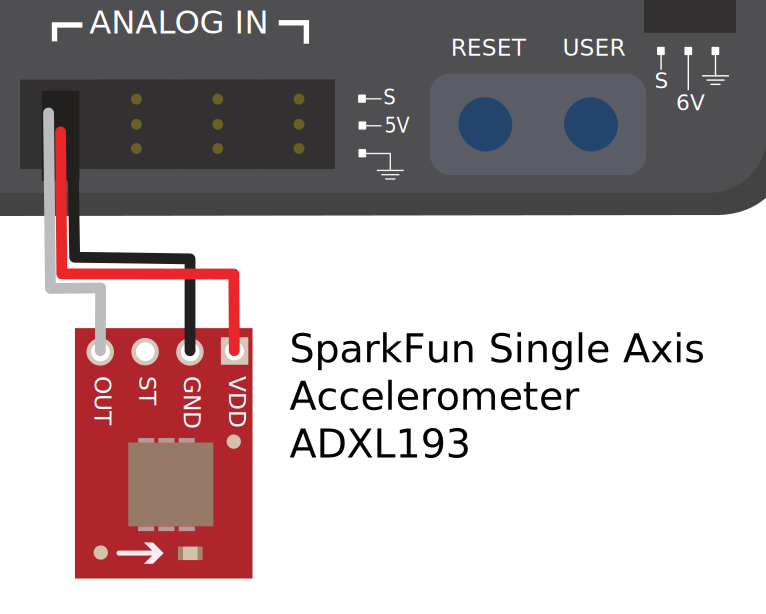
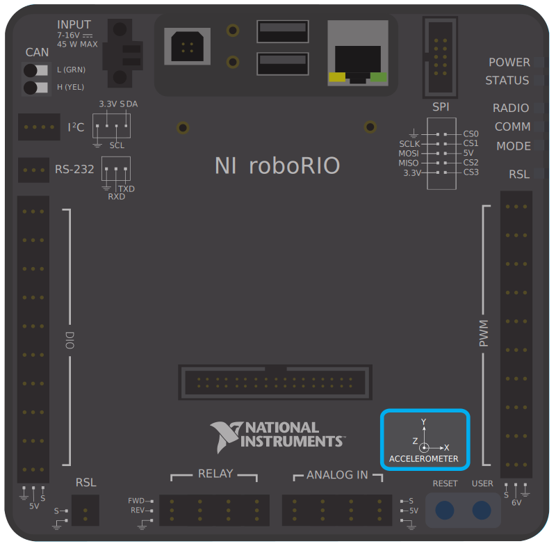

.. include:: <isonum.txt>

Accelerometers - Hardware
==========================

Accelerometers are common sensors used to measure acceleration.

In principle, precise measurements of acceleration can be double-integrated and used to track position (similarly to how the measurement of turn rate from a gyroscope can be integrated to determine heading) - however, in practice, accelerometers that are available within the legal FRC\ |reg| price range are not nearly accurate for this use.  However, accelerometers are still useful for a number of tasks in FRC.

The roboRIO comes with a :ref:`built-in three-axis accelerometer <docs/software/hardware-apis/sensors/accelerometers-software:BuiltInAccelerometer>` that all teams can use, however teams seeking more-precise measurements may purchase and use a peripheral accelerometer, as well.

Types of accelerometers
-----------------------

There are three types of accelerometers commonly-used in FRC: single-axis accelerometers, multi-axis accelerometers, and IMUs.

Single-axis accelerometers
^^^^^^^^^^^^^^^^^^^^^^^^^^

As per their name, single-axis accelerometers measure acceleration along a single axis.  This axis is generally specified on the physical device, and mounting the device in the proper orientation so that the desired axis is measured is highly important.  Single-axis accelerometers generally output an analog voltage corresponding to the measured acceleration, and so connect to the roboRIO's :doc:`analog input <analog-inputs-hardware>` ports.

Multi-axis accelerometers
^^^^^^^^^^^^^^^^^^^^^^^^^

.. image:: images/analog-inputs-hardware/triple-axis-accelerometer-to-roborio.svg
  :alt: The triple axis accelerometer hooked up to three different Analog In channels.

Multi-axis accelerometers measure acceleration along multiple spacial axes.  The roboRIO's built-in accelerometer is a three-axis accelerometer.

Peripheral multi-axis accelerometers may simply output multiple analog voltages (and thus connect to the :ref:`analog input ports <docs/hardware/sensors/analog-inputs-hardware:Connecting a sensor to multiple analog input ports>`, or (more commonly) they may communicate with one of the roboRIO's :doc:`serial buses <serial-buses>`.

roboRIO built-in accelerometer
~~~~~~~~~~~~~~~~~~~~~~~~~~~~~~

The roboRIO has a built-in accelerometer, which does not need any external connections. You can find more details about how to use it in the :ref:`Built-in Accelerometer section <docs/software/hardware-apis/sensors/accelerometers-software:BuiltInAccelerometer>` of the software documentation.

IMUs (Inertial Measurement Units)
^^^^^^^^^^^^^^^^^^^^^^^^^^^^^^^^^

Several popular FRC devices (known as "inertial measurement units," or "IMUs") combine both an accelerometer and a gyroscope.  Popular FRC example include:

  - `Analog Devices ADIS16448 and ADIS 16470 IMUs <https://www.analog.com/en/landing-pages/001/first.html>`__
  - `CTRE Pigeon IMU <https://store.ctr-electronics.com/gadgeteer-pigeon-imu/>`__
  - `Kauai Labs NavX <https://pdocs.kauailabs.com/navx-mxp/>`__
