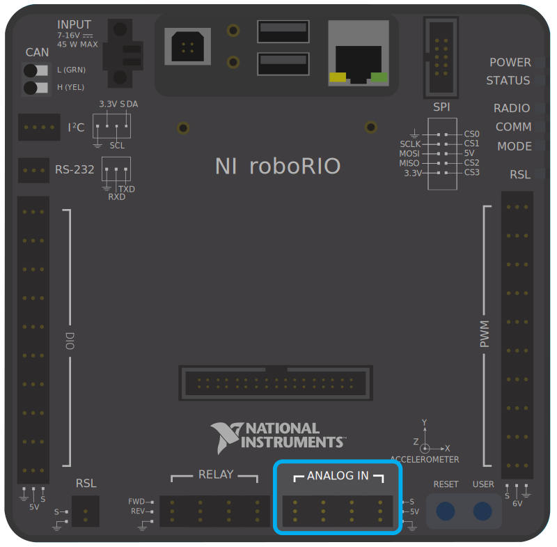
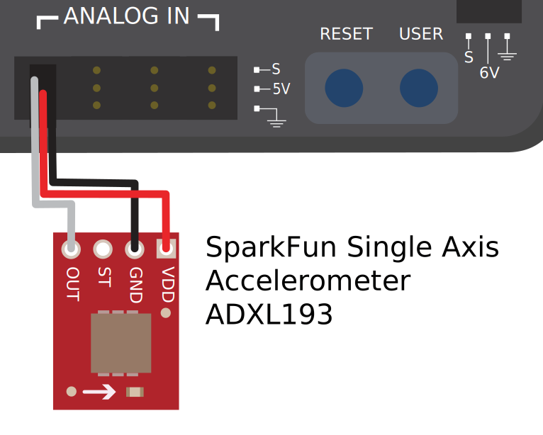
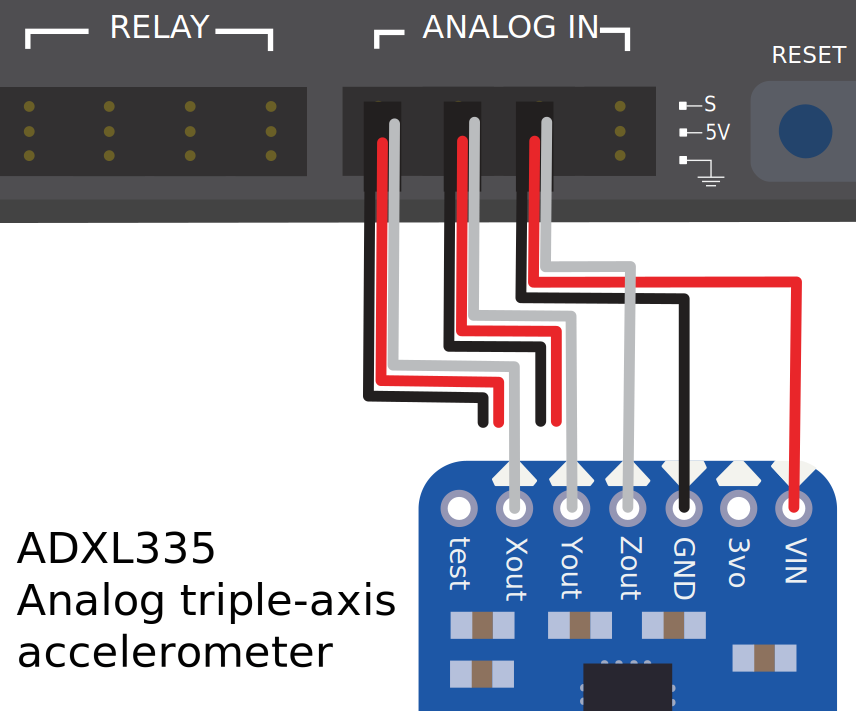

Analog Inputs - Hardware
========================

.. note:: This section covers analog input hardware.  For a software guide to analog inputs, see :ref:`docs/software/hardware-apis/sensors/analog-inputs-software:Analog Inputs - Software`.

An `analog signal <https://en.wikipedia.org/wiki/Analog_signal>`__ is a signal whose value can lie anywhere in a continuous interval.  This lies in stark contrast to a :doc:`digital signal <digital-inputs-hardware>`, which can take only one of several discrete values.  The roboRIO's analog input ports allow the measurement of analog signals with values from 0V to 5V.

In practice, there is no way to measure a "true" analog signal with a digital device such as a computer (like the roboRIO).  Accordingly, the analog inputs are actually measured as a 12-bit digital signal - however, this is quite a high resolution [1]_.

Analog inputs are typically (but not always!) used for sensors whose measurements vary continuously over a range, such as :doc:`ultrasonic rangefinders <ultrasonics-hardware>` and :doc:`potentiometers <analog-potentiometers-hardware>`, as they can communicate by outputting a voltage proportional to their measurements.

Connecting to roboRIO analog input ports
----------------------------------------

.. note:: An additional four analog inputs are available via the "MXP" expansion port.  To use these, a breakout board of some sort that connects to the MXP is needed.

.. warning:: Always consult the technical specifications of the sensor you are using *before* wiring the sensor, to ensure that the correct wire is being connected to each pin.  Failure to do so can result in damage to the sensor or the RIO.

.. warning:: **Never** directly connect the power pin to the ground pin on any port on the roboRIO!  This will trigger protection features on the roboRIO and may result in unexpected behavior.

The roboRIO has 4 built-in analog input ports (numbered 0-3), as seen in the image above.  Each port has three pins - signal ("S"), power ("V"), and ground ("|ground|").  The "power" and "ground" pins are used to power the peripheral sensors that connect to the analog input ports - there is a constant 5V potential difference between the "power" and the "ground" pins [2]_.  The signal pin is the pin on which the signal is actually measured.

Connecting a sensor to a single analog input port
^^^^^^^^^^^^^^^^^^^^^^^^^^^^^^^^^^^^^^^^^^^^^^^^^

.. note:: Some sensors (such as :doc:`potentiometers <analog-potentiometers-hardware>`) may have interchangeable power and ground connections.

Most sensors that connect to analog input ports will have three wires - signal, power, and ground - corresponding precisely to the three pins of the analog input ports. They should be connected accordingly.

Connecting a sensor to multiple analog input ports
^^^^^^^^^^^^^^^^^^^^^^^^^^^^^^^^^^^^^^^^^^^^^^^^^^

Some sensors may need to connect to multiple analog input ports in order to function.  In general, these sensors will only ever require a single power and a single ground pin - only the signal pin of the additional port(s) will be needed. The image below is shows an analog accelerometer that requires three analog input ports, but similar wiring can be used for analog sensors requiring two analog input ports.

.. |ground| unicode:: 0x23DA

Footnotes
---------

.. [1] A 12-bit resolution yields :math:`2^{12}`, or 4096 different values.  For a 5V range, that's an effective resolution of approximately 1.2 mV, or .0012V.  The actual accuracy specification is plus-or-minus 50mV, so the discretization is not the limiting factor in the measurement accuracy.
.. [2] All power pins are actually connected to a single rail, as are all ground pins - there is no need to use the power/ground pins corresponding to a given signal pin.
