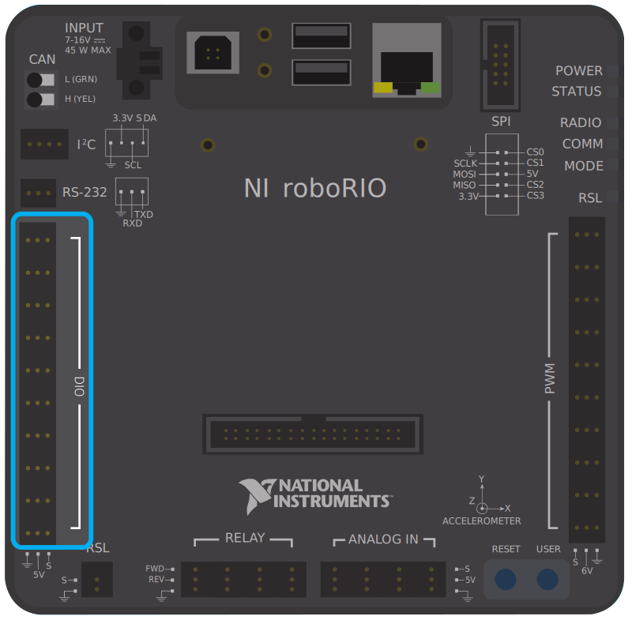

Digital Inputs - Hardware
=========================

.. note:: This section covers digital input hardware.  For a software guide to digital inputs, see :ref:`docs/software/hardware-apis/sensors/digital-inputs-software:Digital Inputs - Software`.

A `digital signal <https://en.wikipedia.org/wiki/Digital_signal>`__ is a signal that can be in one of several discrete states.  In the vast majority of cases, the signal is the voltage in a wire, and there are only two states for a digital signal - high, or low (also denoted 1 and 0, or true and false, respectively).

The roboRIO's built-in digital input-output ports (or "DIO") ports function on 5V, so "high" corresponds to a signal of 5V, and "low" to a signal of 0V [1]_ [2]_.

Connecting to the roboRIO DIO ports
-----------------------------------

.. note:: Additional DIO ports are available through the "MXP" expansion port.  To use these, a breakout board of some sort that connects to the MXP is needed.

.. warning:: Always consult the technical specifications of the sensor you are using *before* wiring the sensor, to ensure that the correct wire is being connected to each pin.  Failure to do so can result in damage to the device.

.. warning:: **Never** directly connect the power pin to the ground pin on any port on the roboRIO!  This will trigger protection features on the roboRIO and may result in unexpected behavior.

The roboRIO has 10 built-in DIO ports (numbered 0-9), as seen in the image above.  Each port has three pins - signal ("S"), power ("V"), and ground ("|ground|").  The "power" and "ground" pins are used to power the peripheral sensors that connect to the DIO ports - there is a constant 5V potential difference between the "power" and the "ground" pins [3]_ - the "power" pin corresponds to the "high" state (5V), and the "ground" to "low" (0V).  The signal pin is the pin on which the signal is actually measured (or, when used as an output, the pin that sends the signal).

All DIO ports have built-in "pull-up" resistors between the power pins and the signal pins - these ensure that when the signal pin is "floating" (i.e. is not connected to any circuit), they consistently remain in a "high" state.

Connecting a simple switch to a DIO port
^^^^^^^^^^^^^^^^^^^^^^^^^^^^^^^^^^^^^^^^

The simplest device that can be connected to a DIO port is a switch (such as a :ref:`limit switch <docs/hardware/sensors/proximity-switches:Mechanical proximity switches ("limit switches")>`).  When a switch is connected correctly to a DIO port, the port will read "high" when the circuit is open, and "low" when the circuit is closed.

A simple switch does not need to be powered, and thus only has two wires.  Switches should be wired between the *signal* and the *ground* pins of the DIO port.  When the switch circuit is open, the signal pin will float, and the pull-up resistor will ensure that it reads "high."  When the switch circuit is closed, it will connect directly to the ground rail, and thus read "low."

.. image:: images/digital-inputs-hardware/limit-switch-to-roborio.svg
   :alt: Connecting a normally open limit switch to a DIO channel of the roboRIO.

Connecting a powered sensor to a DIO port
^^^^^^^^^^^^^^^^^^^^^^^^^^^^^^^^^^^^^^^^^

Many digital sensors (such as most no-contact proximity switches) require power in order to work.  A powered sensor will generally have three wires - signal, power, and ground.  These should be connected to the corresponding pins of the DIO port.

.. image:: images/digital-inputs-hardware/hall-effect-sensor-to-roborio.svg
   :alt: Connecting a Hall Effect sensor to a roboRIO DIO channel.

Connecting a sensor that uses multiple DIO ports
^^^^^^^^^^^^^^^^^^^^^^^^^^^^^^^^^^^^^^^^^^^^^^^^

Some sensors (such as :doc:`quadrature encoders <encoders-hardware>`) may need to connect to multiple DIO ports in order to function.  In general, these sensors will only ever require a single power and a single ground pin - only the signal pin of the additional port(s) will be needed.

.. image:: images/digital-inputs-hardware/e4t-oem-miniature-optical-encoder-to-roborio.svg
   :alt: Connecting a E4T Optical Encoder to two different DIO ports of the roboRIO.

.. |ground| unicode:: 0x23DA

Footnotes
---------

.. [1] More precisely, the signal reads "high" when it rises above 2.0V, and reads "low" when it falls back below 0.8V - behavior between these two thresholds is not guaranteed to be consistent.
.. [2] The roboRIO also offers 3.3V logic via the "MXP" expansion port; however, the use of this is far less common than the 5V.
.. [3] All power pins are actually connected to a single rail, as are all ground pins - there is no need to use the power/ground pins corresponding to a given signal pin.
