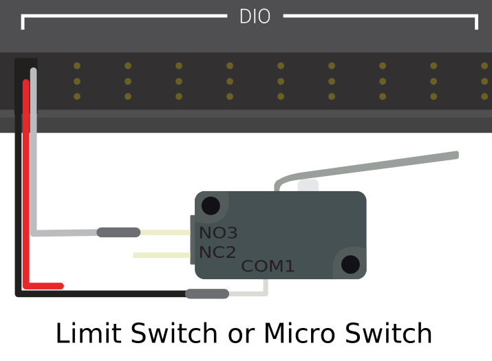
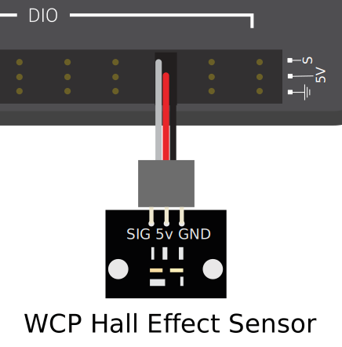

# Digital Inputs - Hardware

.. note:: This section covers digital input hardware.  For a software guide to digital inputs, see :ref:`docs/software/hardware-apis/sensors/digital-inputs-software:Digital Inputs - Software`.

A [digital signal](https://en.wikipedia.org/wiki/Digital_signal) is a signal that can be in one of several discrete states.  In the vast majority of cases, the signal is the voltage in a wire, and there are only two states for a digital signal - high, or low (also denoted 1 and 0, or true and false, respectively).

The Systemcore's built-in Smart Input/Output ports (or "Smart I/O") ports function on 3.3V, so "high" corresponds to a signal of 3.3V, and "low" to a signal of 0V [1]_.

## Connecting to the Systemcore Smart I/O ports

.. warning:: Always consult the technical specifications of the sensor you are using *before* wiring the sensor, to ensure that the correct wire is being connected to each pin.  Failure to do so can result in damage to the device.

.. warning:: **Never** directly connect the power pin to the ground pin on any port on the Systemcore!  This will trigger protection features on the Systemcore and may result in unexpected behavior.

.. image:: images/systemcore/systemcore-smartio.png
   :alt: The Systemcore, with the location of the Smart I/O ports highlighted.

The Systemcore has 6 Smart I/O ports (numbered 0-5), as seen in the image above.  Each port has three pins - signal, power ("3.3V"), and ground ("gnd").  The "power" and "ground" pins are used to power the peripheral sensors that connect to the analog input ports - there is a constant 3.3V potential difference between the "power" and the "ground" pins [2]_.  The signal pin is the pin on which the signal is actually measured.

All Smart I/O ports have built-in "pull-down" resistors between the power pins and the signal pins - these ensure that when the signal pin is "floating" (i.e. is not connected to any circuit), they consistently remain in a "low" state.

.. warning:: The roboRIO had pull-up resistors instead of pull-down resistors, so the behavior of the Smart I/O ports is different from that of the roboRIO's digital input ports.  This means that sensors designed for the roboRIO's digital input ports may have different wiring for the Smart I/O ports.

### Connecting a simple switch to a DIO port

The simplest device that can be connected to a DIO port is a switch (such as a :ref:`limit switch <docs/hardware/sensors/proximity-switches:Mechanical proximity switches ("limit switches")>`).  When a switch is connected correctly to a DIO port, the port will read "low" when the circuit is open, and "high" when the circuit is closed.

A simple switch does not need to be powered, and thus only has two wires.  Switches should be wired between the *signal* and the *power* pins of the DIO port.  When the switch circuit is open, the signal pin will float, and the pull-down resistor will ensure that it reads "low."  When the switch circuit is closed, it will connect directly to the power rail, and thus read "high".

.. todo:: Update above image to use the Systemcore Smart I/O ports and wiring for pull-down resistors.

### Connecting a powered sensor to a DIO port

Many digital sensors (such as most no-contact proximity switches) require power in order to work.  A powered sensor will generally have three wires - signal, power, and ground.  These should be connected to the corresponding pins of the DIO port.

.. todo:: Update above image to use the Systemcore Smart I/O ports.

.. warning:: The roboRIO provided 5V power to the "power" pin of its DIO ports, whereas the Systemcore provides 3.3V.  Sensors designed for the roboRIO's DIO ports may not work correctly when connected to the Systemcore's Smart I/O ports. Please consult with the sensor datasheet to ensure it can run from 3.3V.

### Connecting a sensor that uses multiple DIO ports

Some sensors (such as :doc:`quadrature encoders <encoders-hardware>`) may need to connect to multiple DIO ports in order to function.  In general, these sensors will only ever require a single power and a single ground pin - only the signal pin of the additional port(s) will be needed.

.. image:: images/digital-inputs-hardware/e4t-oem-miniature-optical-encoder-to-roborio.svg
   :alt: Connecting a E4T Optical Encoder to two different DIO ports of the roboRIO.

.. todo:: Update above image to use the Systemcore Smart I/O ports.

## Footnotes

.. [1] More precisely, the signal reads "high" when it rises above 2.0V, and reads "low" when it falls back below 0.8V - behavior between these two thresholds is not guaranteed to be consistent.
.. [2] All power pins are actually connected to a single rail, as are all ground pins - there is no need to use the power/ground pins corresponding to a given signal pin.
